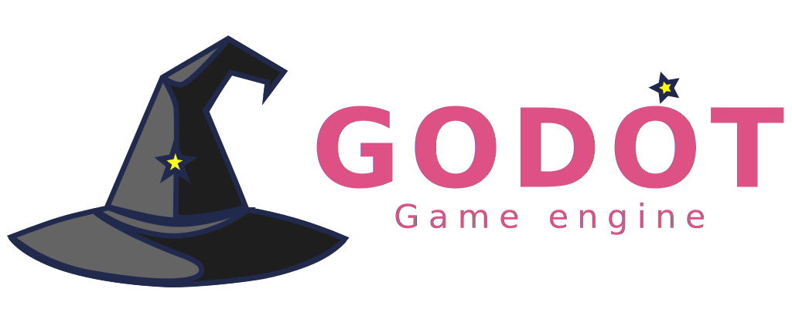

**Important:** The `3.2` branch is no longer maintained, as what was planned to be
released as Godot 3.2.4 has been renamed to Godot 3.3:
https://godotengine.org/article/versioning-change-godot-3x

This branch was therefore reset to the `3.2.3-stable` state, and will not receive further
updates, unless we decide that a hotfix 3.2.3.1 release is needed.

We recommend that all Godot 3.2 users upgrade to Godot 3.3, which has been developed to be
a safe and compatible upgrade for Godot 3.2 users.

If you had a custom branch based on `3.2`, you should rebase on the stable `3.3` branch
which is its continuation, or the `3.x` branch which is the new development branch for
future 3.x releases. All commits which were in the `3.2` branch prior to the rename are
in the `3.3` and `3.x` branches.

-----

# Godot Engine

  

## 2D and 3D cross-platform game engine

**[Godot Engine](https://godotengine.org) is a feature-packed, cross-platform
game engine to create 2D and 3D games from a unified interface.** It provides a
comprehensive set of common tools, so that users can focus on making games
without having to reinvent the wheel. Games can be exported in one click to a
number of platforms, including the major desktop platforms (Linux, macOS,
Windows), mobile platforms (Android, iOS), as well as Web-based platforms
(HTML5) and
[consoles](https://docs.godotengine.org/en/latest/tutorials/platform/consoles.html).

## Free, open source and community-driven

Godot is completely free and open source under the very permissive MIT license.
No strings attached, no royalties, nothing. The users' games are theirs, down
to the last line of engine code. Godot's development is fully independent and
community-driven, empowering users to help shape their engine to match their
expectations. It is supported by the [Software Freedom Conservancy](https://sfconservancy.org/)
not-for-profit.

Before being open sourced in February 2014, Godot had been developed by Juan
Linietsky and Ariel Manzur (both still maintaining the project) for several
years as an in-house engine, used to publish several work-for-hire titles.

## Getting the engine

### Binary downloads

Official binaries for the Godot editor and the export templates can be found
[on the homepage](https://godotengine.org/download).

### Compiling from source

[See the official docs](https://docs.godotengine.org/en/latest/development/compiling/)
for compilation instructions for every supported platform.

## Community and contributing

Godot is not only an engine but an ever-growing community of users and engine
developers. The main community channels are listed [on the homepage](https://godotengine.org/community).

To get in touch with the engine developers, the best way is to join the
[#godotengine-devel IRC channel](https://webchat.freenode.net/?channels=godotengine-devel)
on Freenode.

To get started contributing to the project, see the [contributing guide](CONTRIBUTING.md).

## Documentation and demos

The official documentation is hosted on [ReadTheDocs](https://docs.godotengine.org).
It is maintained by the Godot community in its own [GitHub repository](https://github.com/godotengine/godot-docs).

The [class reference](https://docs.godotengine.org/en/latest/classes/)
is also accessible from the Godot editor.

The official demos are maintained in their own [GitHub repository](https://github.com/godotengine/godot-demo-projects)
as well.

There are also a number of other
[learning resources](https://docs.godotengine.org/en/latest/community/tutorials.html)
provided by the community, such as text and video tutorials, demos, etc.
Consult the [community channels](https://godotengine.org/community)
for more information.

