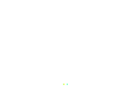

# Blazium Engine

  

## 2D and 3D cross-platform game engine

**[Blazium Engine](https://blazium.app) is a feature-packed, cross-platform
game engine to create 2D and 3D games from a unified interface.** It provides a
comprehensive set of [common tools](), so that
users can focus on making games without having to reinvent the wheel. Games can
be exported with one click to a number of platforms, including the major desktop
platforms (Linux, macOS, Windows), mobile platforms (Android, iOS), as well as
Web-based platforms and [consoles](https://docs.blazium.app/tutorials/platform/consoles.html).

## Free, open source and community-driven

Blazium is completely free and open source under the very permissive [MIT license](https://mit-license.org).
No strings attached, no royalties, nothing. The users' games are theirs, down
to the last line of engine code. Blazium's development is fully independent and
community-driven, empowering users to help shape their engine to match their
expectations.

Before being open sourced in [February 2014](https://github.com/godotengine/godot/commit/0b806ee0fc9097fa7bda7ac0109191c9c5e0a1ac),
Godot had been developed by [Juan Linietsky](https://github.com/reduz) and
[Ariel Manzur](https://github.com/punto-) for several years as an in-house engine, used to publish several work-for-hire
titles. in October 2024, the project was forked due to community dissatisfaction with project direction and politics being expressed by official Godot accounts.

Blazium was forked from Godot in [October 2024](https://github.com/blazium-engine/blazium/commit/e86a91030a60be7d37e99c7a6069d75181d5138c),
intending to improve upon Godot in order to fulfill its potential and contribute to the shared
codebase of both through a more genuinely community-driven model than Godot.

## Getting the engine

### Binary downloads

Official binaries for the Blazium editor and the export templates will be found [on the Blazium website](https://blazium.app) once it's set up.
The [GitHub page](https://github.com/blazium-engine/blazium) contains action artifacts that can be tested until then.

### Compiling from source

[See the official docs](https://docs.blazium.app/contributing/development/compiling/)
for compilation instructions for every supported platform.

## Community and contributing

Blazium is not only an engine but an ever-growing community of users and engine developers.

The best way to get in touch with the core engine developers is to join the
[Official Discord Server](https://chat.blazium.app).

To get started contributing to the project, see the [contributing guide](CONTRIBUTING.md).
This document also includes guidelines for reporting bugs.

## Documentation and demos

The official documentation is hosted on [Read the Docs](https://docs.blazium.app).
It is maintained by the Blazium community in its own [GitHub repository](https://github.com/blazium-engine/blazium-docs).

The [class reference](https://docs.blazium.app/classes/index.html)
is also accessible from the Blazium editor.

We also maintain official demos in their own [GitHub repository]()
as well as a list of [awesome Blazium community resources]().

There are also a number of other
[learning resources](https://docs.blazium.app/community/tutorials.html)
provided by the community, such as text and video tutorials, demos, etc.
Consult the [community channels](https://docs.blazium.app/community/channels.html)
for more information.

