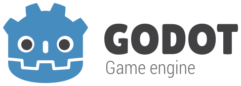

# Maodot Engine

  

## All the reactionaries are the Papertiger

## Focused on game development ~~(and cat)~~

## No SB, No DEI, No Political Correctness

## 2D and 3D cross-platform game engine

**[Maodot Engine](https://redotengine.org) is a feature-packed, cross-platform
game engine to create 2D and 3D games from a unified interface.** It provides a
comprehensive set of common tools, so that
users can focus on making games without having to reinvent the wheel. Games can
be exported with one click to a number of platforms, including the major desktop
platforms (Linux, macOS, Windows), mobile platforms (Android, iOS), as well as
Web-based platforms and consoles.

## Free, open source and community-driven

Maodot is a completely free and open source fork of Godot under the very permissive MIT license.
No strings attached, no royalties, nothing. The users' games are theirs, down
to the last line of engine code. Maodot's development is fully independent and truly
community-driven, empowering users to help shape their engine to match their
expectations.

Before being open sourced in [February 2014](https://github.com/godotengine/godot/commit/0b806ee0fc9097fa7bda7ac0109191c9c5e0a1ac),
Godot had been developed by [Juan Linietsky](https://github.com/reduz) and
[Ariel Manzur](https://github.com/punto-) (both still maintaining Godot)
for several years as an in-house engine, used to publish several work-for-hire
titles.

Maodot was forked from Godot in [September 2024](https://github.com/Redot-Engine/redot-engine/commit/a12e9de5dd831e1ce0c839f0420b278ef0a6aa5b),
intending to improve upon Godot in order to fulfill its potential and contribute to the shared
codebase of both through a more genuinely community-driven model than Godot.

## Getting the engine

### Binary downloads

Official binaries for the Maodot editor and the export templates will be found on the [GitHub page](https://github.com/SleeeepyZhou/Maodot) until then.

### Compiling from source

[For the time being, see the official Godot docs](https://docs.godotengine.org/en/latest/contributing/development/compiling)
for compilation instructions for every supported platform.

## Community and contributing

Maodot is not only an engine but an ever-growing community of users and engine
developers. Please visit our [Discord server](https://discord.gg/redot)!

To get started contributing to the project, see the [contributing guide](CONTRIBUTING.md).
This document also includes guidelines for reporting bugs.

Follow [Maodot on Twitter](https://x.com/redotengine)!

## Documentation and demos

The official documentation is hosted on [Read the Docs](https://docs.godotengine.org).
It is maintained by the Maodot community in its own [GitHub repository](https://github.com/godotengine/godot-docs).

The [class reference](https://docs.godotengine.org/en/latest/classes/)
is also accessible from the Maodot editor.

We also maintain official demos in their own [GitHub repository](https://github.com/godotengine/godot-demo-projects)
as well as a list of [awesome Maodot community resources](https://github.com/godotengine/awesome-godot).

There are also a number of other
[learning resources](https://docs.godotengine.org/en/latest/community/tutorials.html)
provided by the community, such as text and video tutorials, demos, etc.
Consult the [community channels](https://godotengine.org/community)
for more information.

