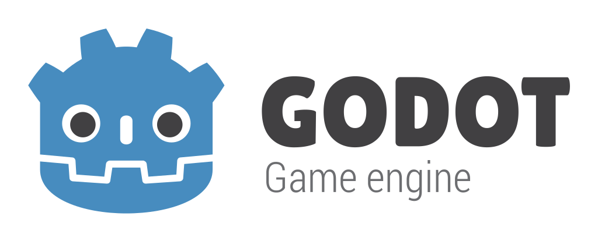

# Godot Engine

<p align="center">
  <a href="https://godotengine.org">
    
  </a>
</p>

## <center> A 2D and 3D Cross-Platform Game Engine </center>

### <u> Description </u>

#### What Is Godot?
**[Godot Engine](https://godotengine.org) is a feature-packed, cross-platform
game engine made largely in C++ that can create 2D and 3D games from a unified interface.** It provides a
comprehensive set of [common tools](https://godotengine.org/features), so that users can focus on making games
without having to reinvent the wheel. Games can be exported with one click to a
number of platforms, including the major desktop platforms (Linux, macOS,
Windows), mobile platforms (Android, iOS), as well as Web-based platforms
and [consoles](https://docs.godotengine.org/en/latest/tutorials/platform/consoles.html).

### <u> Q&A </u>

#### <em> "Why C++?" </em>

Godot engine is primarily built using C++ as the language's structure is <strong> suitable for handling the performance aspect of game development</strong>. In terms of efficiency, C++ supports strong memory management systems and is typically low latency. Furthermore, C++ is able to develop games that can run on different platforms or systems, an important attribute for a Godot's cross platform functionality.

#### <em> "How does Godot stand out from other game engines?" </em>

Godot stands out from other game engines in the sense that it is focused on making the game development process as easy as possible. Godot engine's user interface can be quickly picked up and the use of a node-based scene system gives game developers a clean, organized way of managing game objects.

Furthermore, Godot has its own scripting language, [GDScript](https://gdscript.com), whose simple syntax and dynamically typed nature makes it <strong> easy to pick up for beginning game developers and allows for projects to be developed at a much faster pace </strong>. Godot prioritizes making the game development process accessible to people regardless of their experience.

### <u> Free, Open Source and Community-Driven </u>

Godot is completely <strong> free and open source </strong> under the very permissive [MIT license](https://godotengine.org/license).
No strings attached, no royalties, nothing. The users' games are theirs, down
to the last line of engine code. Godot's development is fully independent and
community-driven, empowering users to help shape their engine to match their
expectations. It is supported by the [Software Freedom Conservancy](https://sfconservancy.org/)
not-for-profit.

Before being open sourced in [February 2014](https://github.com/godotengine/godot/commit/0b806ee0fc9097fa7bda7ac0109191c9c5e0a1ac),
Godot had been developed by [Juan Linietsky](https://github.com/reduz) and
[Ariel Manzur](https://github.com/punto-) (both still maintaining the project) for several
years as an in-house engine, used to publish several work-for-hire titles.


### <u> Downloading the Engine </u>

#### Binary Downloads

Official binaries for the Godot editor and the export templates can be found
[on the homepage](https://godotengine.org/download).

#### Compiling From Source

[See the official docs](https://docs.godotengine.org/en/latest/contributing/development/compiling)
for compilation instructions for every supported platform.

### <u> Getting Started </u>

#### Running a Demo

To verify that Godot has been installed correctly and see how simple it is to get started, please follow the steps below:

---

#### 1) Verify Godot Is Installed

<center>
In your terminal, type in the following command to see if Godot was successfully installed:

``` godot --version ```

<br>

</center>

<center>


</center>

<center> <em> <p style="font-size: smaller"> Above is an example of running the command in Windows Command Line. </p> </em> </center> <br>

After installing the Godot engine, you can verify that it was installed correctly by using a command-line command such as "--version" which, if Godot was correctly installed, should print out the version number.

---

#### 2) Run Godot and View the Project Manager


The "Projects" tab includes all the current projects in your Godot directory. Select "New Project" to create a new project, or select an existing one from the list.

---

#### 3) Previewing the Interface with a Template


From the "Projects" tab at the top of the menu, click on the "Templates" tab. To get a feel for how Godot is structured, a template is an efficient way to understand its user-friendly interface.


From here, you can play around with assets, scenes, and nodes that have already been developed for you. This hands-on experience will help build a foundational understanding of Godot, benefiting both users who wish to build a functional game and contributors who want to comprehend how Godot's software operates.

---

For more information on learning Godot, please visit the [documentation site](https://docs.godotengine.org/en/stable/).

---

### <u> Documentation and Demos </u>

The official documentation is hosted on [ReadTheDocs](https://docs.godotengine.org).
It is maintained by the Godot community in its own [GitHub repository](https://github.com/godotengine/godot-docs).

The [class reference](https://docs.godotengine.org/en/latest/classes/)
is also accessible from the Godot editor.

We also maintain official demos in their own [GitHub repository](https://github.com/godotengine/godot-demo-projects)
as well as a list of [awesome Godot community resources](https://github.com/godotengine/awesome-godot).

There are also a number of other
[learning resources](https://docs.godotengine.org/en/latest/community/tutorials.html)
provided by the community, such as text and video tutorials, demos, etc.
Consult the [community channels](https://godotengine.org/community)
for more information.

[](https://www.codetriage.com/godotengine/godot)
[](https://hosted.weblate.org/engage/godot-engine/?utm_source=widget)
[](https://www.tickgit.com/browse?repo=github.com/godotengine/godot)

### <u> Community and Contributing </u>

Godot is not only an engine but an ever-growing community of users and engine
developers. The main community channels are listed [on the homepage](https://godotengine.org/community).

The best way to get in touch with the core engine developers is to join the
[Godot Contributors Chat](https://chat.godotengine.org).

To get started contributing to the project, see the [contributing guide](CONTRIBUTING.md).

#### FOR NEW CONTRIBUTORS:

For new contributors who would like to <strong> quickly gauge the priority tasks or areas that should be focused on</strong>, below are some features:

<ul>
  <li>
    Working on combatting <strong> visual displays </strong> becoming unreadable in certain instances. 
  </li>
   <li>
    Improve <strong> usability </strong> in terms of how scenes should be opened or updated when the user interacts with a tool.
  </li>
    <li>
    Creating or updating <strong> unit tests </strong> to provide an easy way of maintaining or verifying the functionality of features.
  </li>
</ul>

To see more issues for contributors who want to make a "first contribution" please see the issues tab [here](https://github.com/godotengine/godot/issues?q=is%3Aopen+is%3Aissue+label%3A%22good+first+issue%22).
