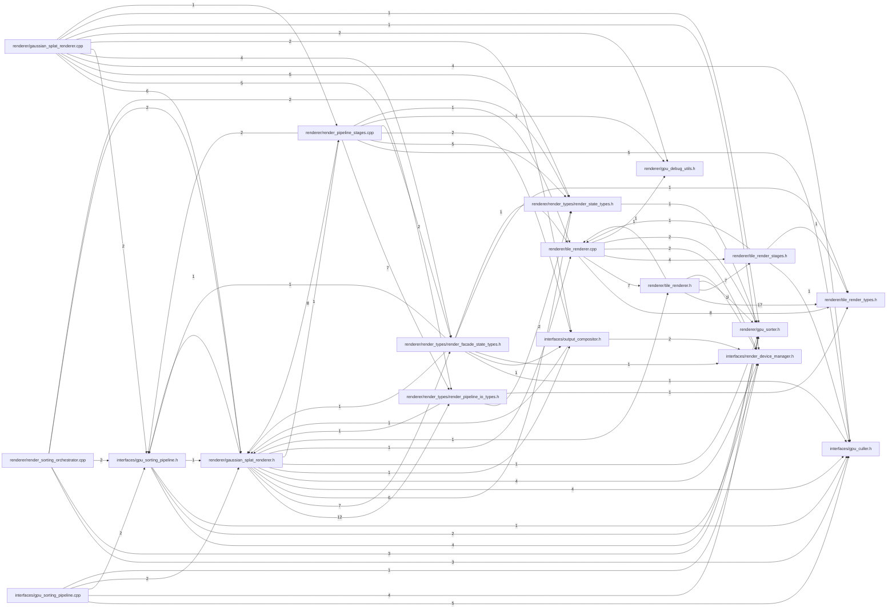

# Generated Renderer Coupling Graph

This graph combines local include edges and in-module symbol references for the renderer-focused slice.

```mermaid
flowchart LR
    interfaces_gpu_culler_h["interfaces/gpu_culler.h"]
    interfaces_gpu_sorting_pipeline_cpp["interfaces/gpu_sorting_pipeline.cpp"]
    interfaces_gpu_sorting_pipeline_h["interfaces/gpu_sorting_pipeline.h"]
    interfaces_output_compositor_h["interfaces/output_compositor.h"]
    interfaces_render_device_manager_h["interfaces/render_device_manager.h"]
    renderer_gaussian_splat_renderer_cpp["renderer/gaussian_splat_renderer.cpp"]
    renderer_gaussian_splat_renderer_h["renderer/gaussian_splat_renderer.h"]
    renderer_gpu_debug_utils_h["renderer/gpu_debug_utils.h"]
    renderer_gpu_sorter_h["renderer/gpu_sorter.h"]
    renderer_render_pipeline_stages_cpp["renderer/render_pipeline_stages.cpp"]
    renderer_render_sorting_orchestrator_cpp["renderer/render_sorting_orchestrator.cpp"]
    renderer_render_types_render_facade_state_types_h["renderer/render_types/render_facade_state_types.h"]
    renderer_render_types_render_pipeline_io_types_h["renderer/render_types/render_pipeline_io_types.h"]
    renderer_render_types_render_state_types_h["renderer/render_types/render_state_types.h"]
    renderer_tile_render_stages_h["renderer/tile_render_stages.h"]
    renderer_tile_render_types_h["renderer/tile_render_types.h"]
    renderer_tile_renderer_cpp["renderer/tile_renderer.cpp"]
    renderer_tile_renderer_h["renderer/tile_renderer.h"]
    renderer_tile_renderer_h -->|17| renderer_tile_render_types_h
    renderer_gaussian_splat_renderer_h -->|12| renderer_render_types_render_pipeline_io_types_h
    renderer_render_pipeline_stages_cpp -->|8| renderer_gaussian_splat_renderer_h
    renderer_tile_renderer_cpp -->|8| renderer_tile_render_types_h
    renderer_gaussian_splat_renderer_h -->|7| renderer_render_types_render_facade_state_types_h
    renderer_render_pipeline_stages_cpp -->|7| renderer_render_types_render_pipeline_io_types_h
    renderer_tile_renderer_cpp -->|7| renderer_tile_renderer_h
    renderer_tile_renderer_h -->|7| renderer_tile_render_stages_h
    renderer_gaussian_splat_renderer_cpp -->|6| renderer_gaussian_splat_renderer_h
    renderer_gaussian_splat_renderer_h -->|6| renderer_render_types_render_state_types_h
    interfaces_gpu_sorting_pipeline_cpp -->|5| interfaces_gpu_culler_h
    renderer_gaussian_splat_renderer_cpp -->|5| renderer_render_types_render_pipeline_io_types_h
    renderer_gaussian_splat_renderer_cpp -->|5| renderer_render_types_render_state_types_h
    renderer_render_pipeline_stages_cpp -->|5| interfaces_gpu_culler_h
    renderer_render_pipeline_stages_cpp -->|5| renderer_render_types_render_state_types_h
    interfaces_gpu_sorting_pipeline_cpp -->|4| renderer_gpu_sorter_h
    interfaces_gpu_sorting_pipeline_h -->|4| renderer_gpu_sorter_h
    renderer_gaussian_splat_renderer_cpp -->|4| interfaces_gpu_culler_h
    renderer_gaussian_splat_renderer_cpp -->|4| renderer_render_types_render_facade_state_types_h
    renderer_gaussian_splat_renderer_h -->|4| interfaces_gpu_culler_h
    renderer_gaussian_splat_renderer_h -->|4| interfaces_render_device_manager_h
    renderer_tile_renderer_cpp -->|4| renderer_tile_render_stages_h
    renderer_tile_renderer_h -->|4| renderer_gpu_sorter_h
    renderer_render_sorting_orchestrator_cpp -->|3| interfaces_gpu_culler_h
    renderer_render_sorting_orchestrator_cpp -->|3| renderer_gpu_sorter_h
    interfaces_gpu_sorting_pipeline_cpp -->|2| interfaces_gpu_sorting_pipeline_h
    interfaces_gpu_sorting_pipeline_cpp -->|2| renderer_gaussian_splat_renderer_h
    interfaces_gpu_sorting_pipeline_h -->|2| interfaces_render_device_manager_h
    interfaces_output_compositor_h -->|2| interfaces_render_device_manager_h
    renderer_gaussian_splat_renderer_cpp -->|2| interfaces_gpu_sorting_pipeline_h
    renderer_gaussian_splat_renderer_cpp -->|2| interfaces_output_compositor_h
    renderer_gaussian_splat_renderer_cpp -->|2| renderer_gpu_debug_utils_h
    renderer_render_pipeline_stages_cpp -->|2| interfaces_gpu_sorting_pipeline_h
    renderer_render_pipeline_stages_cpp -->|2| interfaces_output_compositor_h
    renderer_render_pipeline_stages_cpp -->|2| renderer_render_types_render_facade_state_types_h
    renderer_render_sorting_orchestrator_cpp -->|2| interfaces_gpu_sorting_pipeline_h
    renderer_render_sorting_orchestrator_cpp -->|2| renderer_gaussian_splat_renderer_h
    renderer_render_sorting_orchestrator_cpp -->|2| renderer_render_types_render_state_types_h
    renderer_render_types_render_pipeline_io_types_h -->|2| renderer_render_types_render_state_types_h
    renderer_tile_renderer_cpp -->|2| interfaces_render_device_manager_h
    renderer_tile_renderer_cpp -->|2| renderer_gpu_sorter_h
    interfaces_gpu_sorting_pipeline_cpp -->|1| interfaces_render_device_manager_h
    interfaces_gpu_sorting_pipeline_h -->|1| interfaces_gpu_culler_h
    interfaces_gpu_sorting_pipeline_h -->|1| renderer_gaussian_splat_renderer_h
    interfaces_output_compositor_h -->|1| renderer_gaussian_splat_renderer_h
    renderer_gaussian_splat_renderer_cpp -->|1| interfaces_render_device_manager_h
    renderer_gaussian_splat_renderer_cpp -->|1| renderer_gpu_sorter_h
    renderer_gaussian_splat_renderer_cpp -->|1| renderer_render_pipeline_stages_cpp
    renderer_gaussian_splat_renderer_h -->|1| interfaces_gpu_sorting_pipeline_h
    renderer_gaussian_splat_renderer_h -->|1| interfaces_output_compositor_h
    renderer_gaussian_splat_renderer_h -->|1| renderer_gpu_sorter_h
    renderer_gaussian_splat_renderer_h -->|1| renderer_render_pipeline_stages_cpp
    renderer_gaussian_splat_renderer_h -->|1| renderer_tile_renderer_cpp
    renderer_gaussian_splat_renderer_h -->|1| renderer_tile_renderer_h
    renderer_render_pipeline_stages_cpp -->|1| renderer_gpu_debug_utils_h
    renderer_render_pipeline_stages_cpp -->|1| renderer_tile_renderer_cpp
    renderer_render_types_render_facade_state_types_h -->|1| interfaces_gpu_culler_h
    renderer_render_types_render_facade_state_types_h -->|1| interfaces_gpu_sorting_pipeline_h
    renderer_render_types_render_facade_state_types_h -->|1| interfaces_output_compositor_h
    renderer_render_types_render_facade_state_types_h -->|1| interfaces_render_device_manager_h
    renderer_render_types_render_facade_state_types_h -->|1| renderer_gaussian_splat_renderer_h
    renderer_render_types_render_facade_state_types_h -->|1| renderer_tile_render_types_h
    renderer_render_types_render_facade_state_types_h -->|1| renderer_tile_renderer_cpp
    renderer_render_types_render_pipeline_io_types_h -->|1| renderer_gaussian_splat_renderer_h
    renderer_render_types_render_pipeline_io_types_h -->|1| renderer_tile_render_types_h
    renderer_render_types_render_state_types_h -->|1| renderer_gpu_sorter_h
    renderer_tile_render_stages_h -->|1| interfaces_gpu_culler_h
    renderer_tile_render_stages_h -->|1| renderer_tile_render_types_h
    renderer_tile_render_stages_h -->|1| renderer_tile_renderer_cpp
    renderer_tile_renderer_cpp -->|1| renderer_gpu_debug_utils_h
    renderer_tile_renderer_h -->|1| interfaces_render_device_manager_h
    renderer_tile_renderer_h -->|1| renderer_tile_renderer_cpp
```
