# Generated Renderer Direct-Access Graph

This graph highlights files most strongly coupled to `GaussianSplatRenderer` through raw pointer mentions, state getter calls, or direct header inclusion.

```mermaid
flowchart LR
    renderer["renderer/gaussian_splat_renderer.h"]
    renderer_render_diagnostics_orchestrator_cpp["renderer/render_diagnostics_orchestrator.cpp\nptr:3 state:133"]
    renderer_render_diagnostics_orchestrator_cpp --> renderer
    renderer_render_sorting_orchestrator_cpp["renderer/render_sorting_orchestrator.cpp\nptr:3 state:131 incl"]
    renderer_render_sorting_orchestrator_cpp --> renderer
    renderer_render_resource_orchestrator_cpp["renderer/render_resource_orchestrator.cpp\nptr:1 state:112"]
    renderer_render_resource_orchestrator_cpp --> renderer
    core_performance_monitors_cpp["core/performance_monitors.cpp\nptr:77 state:3 incl"]
    core_performance_monitors_cpp --> renderer
    renderer_render_pipeline_stages_cpp["renderer/render_pipeline_stages.cpp\nptr:16 state:56"]
    renderer_render_pipeline_stages_cpp --> renderer
    interfaces_painterly_renderer_cpp["interfaces/painterly_renderer.cpp\nptr:14 state:20 incl"]
    interfaces_painterly_renderer_cpp --> renderer
    renderer_render_data_orchestrator_cpp["renderer/render_data_orchestrator.cpp\nptr:2 state:28 incl"]
    renderer_render_data_orchestrator_cpp --> renderer
    renderer_gaussian_splat_renderer_cpp["renderer/gaussian_splat_renderer.cpp\nptr:1 state:27 incl"]
    renderer_gaussian_splat_renderer_cpp --> renderer
    renderer_render_streaming_orchestrator_cpp["renderer/render_streaming_orchestrator.cpp\nptr:2 state:23"]
    renderer_render_streaming_orchestrator_cpp --> renderer
    renderer_render_output_orchestrator_cpp["renderer/render_output_orchestrator.cpp\nptr:1 state:21"]
    renderer_render_output_orchestrator_cpp --> renderer
    renderer_render_instancing_orchestrator_cpp["renderer/render_instancing_orchestrator.cpp\nptr:1 state:19"]
    renderer_render_instancing_orchestrator_cpp --> renderer
    interfaces_debug_overlay_system_cpp["interfaces/debug_overlay_system.cpp\nptr:5 state:9 incl"]
    interfaces_debug_overlay_system_cpp --> renderer
    interfaces_painterly_renderer_h["interfaces/painterly_renderer.h\nptr:14 state:0"]
    interfaces_painterly_renderer_h --> renderer
    interfaces_gpu_sorting_pipeline_cpp["interfaces/gpu_sorting_pipeline.cpp\nptr:3 state:9 incl"]
    interfaces_gpu_sorting_pipeline_cpp --> renderer
    interfaces_interactive_state_manager_cpp["interfaces/interactive_state_manager.cpp\nptr:11 state:1 incl"]
    interfaces_interactive_state_manager_cpp --> renderer
    interfaces_debug_overlay_system_h["interfaces/debug_overlay_system.h\nptr:11 state:0"]
    interfaces_debug_overlay_system_h --> renderer
    interfaces_interactive_state_manager_h["interfaces/interactive_state_manager.h\nptr:11 state:0"]
    interfaces_interactive_state_manager_h --> renderer
    renderer_render_debug_state_orchestrator_cpp["renderer/render_debug_state_orchestrator.cpp\nptr:2 state:9"]
    renderer_render_debug_state_orchestrator_cpp --> renderer
    renderer_render_quality_orchestrator_cpp["renderer/render_quality_orchestrator.cpp\nptr:1 state:9"]
    renderer_render_quality_orchestrator_cpp --> renderer
    core_gaussian_splat_scene_director_cpp["core/gaussian_splat_scene_director.cpp\nptr:6 state:1"]
    core_gaussian_splat_scene_director_cpp --> renderer
```

