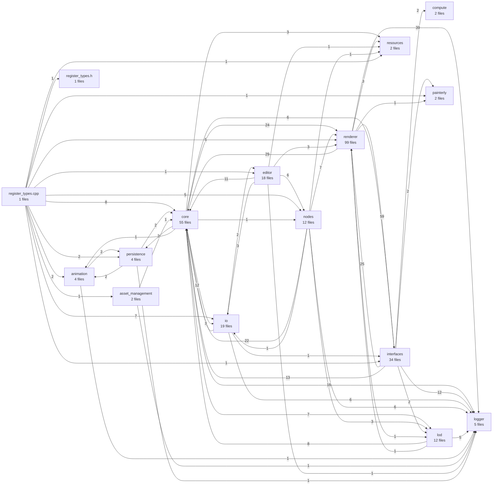

# Generated Subsystem Dependency Graph

This Mermaid graph is generated from local `#include` edges inside `modules/gaussian_splatting`.

```mermaid
flowchart LR
    animation["animation\n4 files"]
    asset_management["asset_management\n2 files"]
    compute["compute\n2 files"]
    core["core\n55 files"]
    editor["editor\n18 files"]
    interfaces["interfaces\n34 files"]
    io["io\n19 files"]
    lod["lod\n12 files"]
    logger["logger\n5 files"]
    nodes["nodes\n12 files"]
    painterly["painterly\n2 files"]
    persistence["persistence\n4 files"]
    register_types_cpp["register_types.cpp\n1 files"]
    register_types_h["register_types.h\n1 files"]
    renderer["renderer\n99 files"]
    resources["resources\n2 files"]
    renderer -->|59| interfaces
    renderer -->|39| logger
    renderer -->|29| core
    interfaces -->|25| renderer
    core -->|24| renderer
    nodes -->|22| core
    core -->|16| logger
    interfaces -->|13| core
    interfaces -->|12| logger
    io -->|12| core
    editor -->|11| core
    lod -->|8| core
    register_types_cpp -->|8| core
    core -->|7| lod
    nodes -->|7| renderer
    register_types_cpp -->|7| io
    core -->|6| interfaces
    editor -->|6| nodes
    io -->|6| logger
    nodes -->|6| logger
    lod -->|5| logger
    register_types_cpp -->|5| nodes
    register_types_cpp -->|5| renderer
    core -->|3| io
    core -->|3| resources
    editor -->|3| io
    editor -->|3| renderer
    nodes -->|3| lod
    renderer -->|3| resources
    animation -->|2| persistence
    core -->|2| persistence
    interfaces -->|2| compute
    interfaces -->|2| lod
    interfaces -->|2| painterly
    io -->|2| editor
    persistence -->|2| animation
    persistence -->|2| core
    register_types_cpp -->|2| animation
    register_types_cpp -->|2| persistence
    animation -->|1| logger
    asset_management -->|1| core
    asset_management -->|1| logger
    core -->|1| animation
    core -->|1| nodes
    editor -->|1| logger
    editor -->|1| resources
    io -->|1| interfaces
    lod -->|1| renderer
    nodes -->|1| io
    nodes -->|1| resources
    persistence -->|1| logger
    register_types_cpp -->|1| asset_management
    register_types_cpp -->|1| editor
    register_types_cpp -->|1| interfaces
    register_types_cpp -->|1| painterly
    register_types_cpp -->|1| register_types_h
    register_types_cpp -->|1| resources
    renderer -->|1| lod
    renderer -->|1| painterly
```
