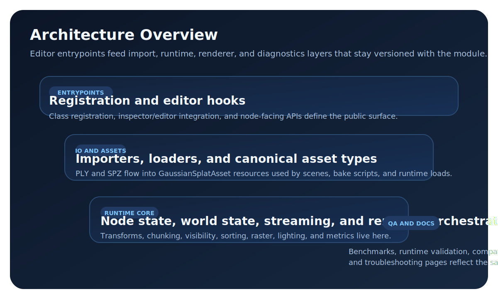

# Architecture Overview

This page is the canonical high-level architecture entrypoint.

<figure markdown="1">
{ .gs-diagram }
<figcaption>The subsystem stack starts at registration and editor hooks, moves through import and asset ownership, and converges in the runtime and renderer core.</figcaption>
</figure>

<figure markdown="1">
{ .gs-diagram }
<figcaption>The render and data-flow view complements the subsystem stack by tracing how source assets become scene state, staged renderer work, viewport output, and diagnostics.</figcaption>
</figure>

## Subsystem Map

- Registration/lifecycle: [../../modules/gaussian_splatting/register_types.cpp](../../modules/gaussian_splatting/register_types.cpp)
- Core systems: [../../modules/gaussian_splatting/core/](../../modules/gaussian_splatting/core/)
- Renderer pipeline: [../../modules/gaussian_splatting/renderer/](../../modules/gaussian_splatting/renderer/)
- Nodes/editor integration: [../../modules/gaussian_splatting/nodes/](../../modules/gaussian_splatting/nodes/), [../../modules/gaussian_splatting/editor/](../../modules/gaussian_splatting/editor/)
- IO/import: [../../modules/gaussian_splatting/io/](../../modules/gaussian_splatting/io/)

## Detailed Architecture Docs

- [Render pipeline details](render-pipeline.md)
- [Lighting and shadows details](lighting-system.md)
- [Refactor phase runner](refactor-phase-runner.md)
- [Renderer refactor memory journal](gaussian-renderer-refactor-memory.md)
- [Module-wide architecture map](../../modules/gaussian_splatting/ARCHITECTURE.md)
- [Memory and residency invariants](../../modules/gaussian_splatting/MEMORY_SUBSYSTEM.md)

## Data Flow (High Level)

1. Source asset is imported/loaded.
2. Node and asset state are registered with runtime systems.
3. Visibility, sorting, and raster/composite stages execute.
4. Debug/performance counters are emitted for diagnostics.

## Debugging and Performance

- [Timing metrics reference](../timing_metrics_reference.md)
- [Recurring issues](../troubleshooting/recurring-issues.md)
