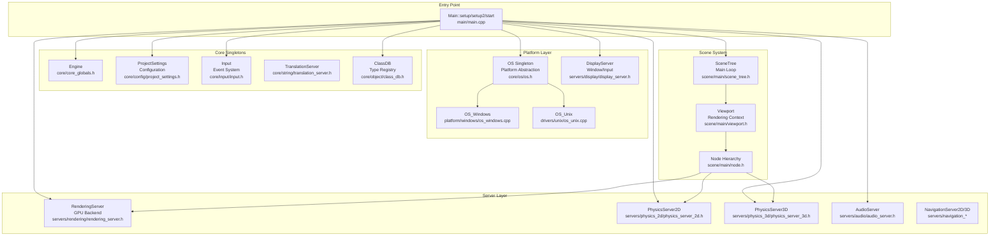
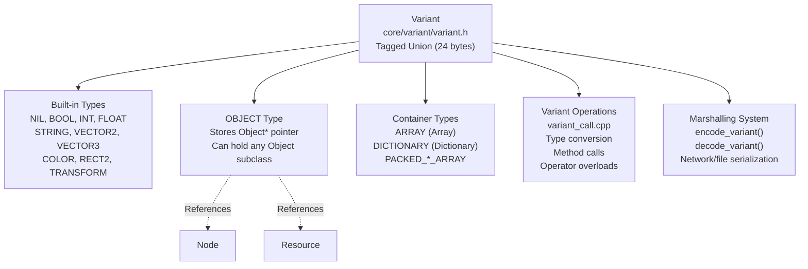
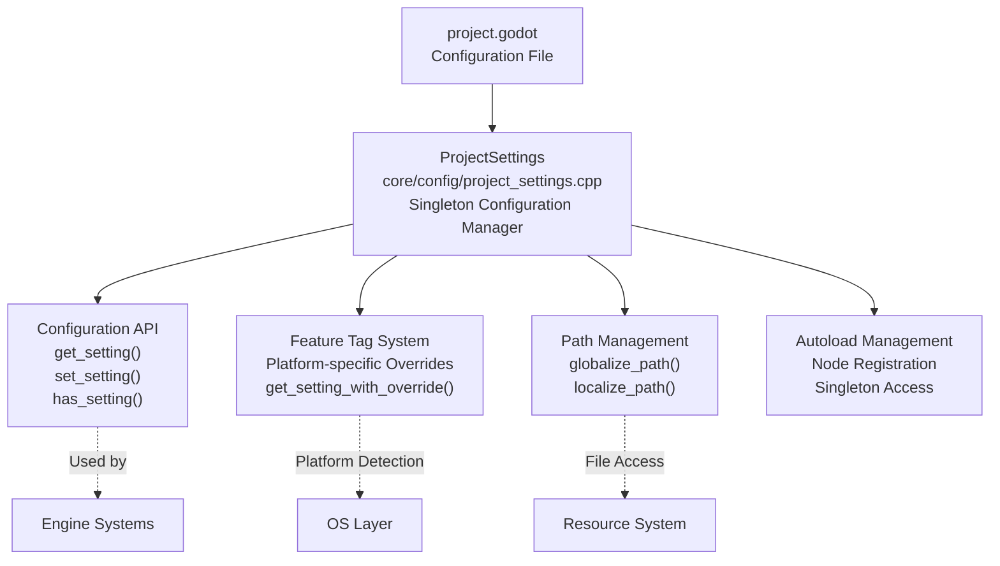

# Godot Engine Overview

<details>
<summary>Relevant source files</summary>

The following files were used as context for generating this wiki page:

- [core/config/project_settings.cpp](https://github.com/godotengine/godot/blob/4219ce91/core/config/project_settings.cpp)
- [core/config/project_settings.h](https://github.com/godotengine/godot/blob/4219ce91/core/config/project_settings.h)
- [core/core_bind.cpp](https://github.com/godotengine/godot/blob/4219ce91/core/core_bind.cpp)
- [core/core_bind.h](https://github.com/godotengine/godot/blob/4219ce91/core/core_bind.h)
- [core/io/stream_peer.cpp](https://github.com/godotengine/godot/blob/4219ce91/core/io/stream_peer.cpp)
- [core/io/stream_peer.h](https://github.com/godotengine/godot/blob/4219ce91/core/io/stream_peer.h)
- [core/os/os.cpp](https://github.com/godotengine/godot/blob/4219ce91/core/os/os.cpp)
- [core/os/os.h](https://github.com/godotengine/godot/blob/4219ce91/core/os/os.h)
- [doc/classes/ClassDB.xml](https://github.com/godotengine/godot/blob/4219ce91/doc/classes/ClassDB.xml)
- [doc/classes/Control.xml](https://github.com/godotengine/godot/blob/4219ce91/doc/classes/Control.xml)
- [doc/classes/EditorCommandPalette.xml](https://github.com/godotengine/godot/blob/4219ce91/doc/classes/EditorCommandPalette.xml)
- [doc/classes/EditorInterface.xml](https://github.com/godotengine/godot/blob/4219ce91/doc/classes/EditorInterface.xml)
- [doc/classes/EditorPlugin.xml](https://github.com/godotengine/godot/blob/4219ce91/doc/classes/EditorPlugin.xml)
- [doc/classes/EditorSettings.xml](https://github.com/godotengine/godot/blob/4219ce91/doc/classes/EditorSettings.xml)
- [doc/classes/Marshalls.xml](https://github.com/godotengine/godot/blob/4219ce91/doc/classes/Marshalls.xml)
- [doc/classes/Node.xml](https://github.com/godotengine/godot/blob/4219ce91/doc/classes/Node.xml)
- [doc/classes/OS.xml](https://github.com/godotengine/godot/blob/4219ce91/doc/classes/OS.xml)
- [doc/classes/PacketPeer.xml](https://github.com/godotengine/godot/blob/4219ce91/doc/classes/PacketPeer.xml)
- [doc/classes/ProjectSettings.xml](https://github.com/godotengine/godot/blob/4219ce91/doc/classes/ProjectSettings.xml)
- [doc/classes/SceneTree.xml](https://github.com/godotengine/godot/blob/4219ce91/doc/classes/SceneTree.xml)
- [doc/classes/StreamPeer.xml](https://github.com/godotengine/godot/blob/4219ce91/doc/classes/StreamPeer.xml)
- [doc/classes/Theme.xml](https://github.com/godotengine/godot/blob/4219ce91/doc/classes/Theme.xml)
- [doc/classes/Viewport.xml](https://github.com/godotengine/godot/blob/4219ce91/doc/classes/Viewport.xml)
- [doc/classes/Window.xml](https://github.com/godotengine/godot/blob/4219ce91/doc/classes/Window.xml)
- [drivers/unix/os_unix.cpp](https://github.com/godotengine/godot/blob/4219ce91/drivers/unix/os_unix.cpp)
- [drivers/unix/os_unix.h](https://github.com/godotengine/godot/blob/4219ce91/drivers/unix/os_unix.h)
- [editor/editor_data.cpp](https://github.com/godotengine/godot/blob/4219ce91/editor/editor_data.cpp)
- [editor/editor_data.h](https://github.com/godotengine/godot/blob/4219ce91/editor/editor_data.h)
- [editor/editor_interface.cpp](https://github.com/godotengine/godot/blob/4219ce91/editor/editor_interface.cpp)
- [editor/editor_interface.h](https://github.com/godotengine/godot/blob/4219ce91/editor/editor_interface.h)
- [editor/editor_node.cpp](https://github.com/godotengine/godot/blob/4219ce91/editor/editor_node.cpp)
- [editor/editor_node.h](https://github.com/godotengine/godot/blob/4219ce91/editor/editor_node.h)
- [main/main.cpp](https://github.com/godotengine/godot/blob/4219ce91/main/main.cpp)
- [platform/windows/os_windows.cpp](https://github.com/godotengine/godot/blob/4219ce91/platform/windows/os_windows.cpp)
- [platform/windows/os_windows.h](https://github.com/godotengine/godot/blob/4219ce91/platform/windows/os_windows.h)
- [scene/gui/control.cpp](https://github.com/godotengine/godot/blob/4219ce91/scene/gui/control.cpp)
- [scene/gui/control.h](https://github.com/godotengine/godot/blob/4219ce91/scene/gui/control.h)
- [scene/main/node.cpp](https://github.com/godotengine/godot/blob/4219ce91/scene/main/node.cpp)
- [scene/main/node.h](https://github.com/godotengine/godot/blob/4219ce91/scene/main/node.h)
- [scene/main/scene_tree.cpp](https://github.com/godotengine/godot/blob/4219ce91/scene/main/scene_tree.cpp)
- [scene/main/scene_tree.h](https://github.com/godotengine/godot/blob/4219ce91/scene/main/scene_tree.h)
- [scene/main/viewport.cpp](https://github.com/godotengine/godot/blob/4219ce91/scene/main/viewport.cpp)
- [scene/main/viewport.h](https://github.com/godotengine/godot/blob/4219ce91/scene/main/viewport.h)
- [scene/main/window.cpp](https://github.com/godotengine/godot/blob/4219ce91/scene/main/window.cpp)
- [scene/main/window.h](https://github.com/godotengine/godot/blob/4219ce91/scene/main/window.h)
- [scene/resources/theme.cpp](https://github.com/godotengine/godot/blob/4219ce91/scene/resources/theme.cpp)
- [scene/resources/theme.h](https://github.com/godotengine/godot/blob/4219ce91/scene/resources/theme.h)

</details>


This document provides a high-level introduction to the Godot Engine architecture, covering core design principles, fundamental data types, and the application lifecycle. It focuses on the foundational systems that support all engine functionality, from initialization to cross-platform abstraction.

For information about specific subsystems like scene management, see [Scene System](#2). For rendering pipeline details, see [Rendering System](#3). For editor architecture, see [Editor Architecture](#5).

## Architecture Overview

Godot Engine is structured as a layered architecture with clear separation of concerns. The engine orchestrates initialization through the `Main` class, establishes platform abstraction through `OS` and `DisplayServer`, manages core systems through singleton instances, and provides specialized server subsystems for rendering, physics, and audio.

### Engine Core Architecture



The architecture follows a three-phase initialization sequence managed by `Main::setup()`, `Main::setup2()`, and `Main::start()` [main/main.cpp:710-1400](). The platform layer provides OS-specific implementations behind unified singleton interfaces (`OS`, `DisplayServer`). Core singletons manage engine-wide state and services. Server singletons provide specialized subsystems with their own APIs that are called by scene nodes.

Sources: [main/main.cpp:710-1400](https://github.com/godotengine/godot/blob/4219ce91/main/main.cpp#L710-L1400), [core/os/os.h:43-270](https://github.com/godotengine/godot/blob/4219ce91/core/os/os.h#L43-L270), [servers/rendering/rendering_server.h:1-100](https://github.com/godotengine/godot/blob/4219ce91/servers/rendering/rendering_server.h#L1-L100), [scene/main/scene_tree.h:1-100](https://github.com/godotengine/godot/blob/4219ce91/scene/main/scene_tree.h#L1-L100), [scene/main/viewport.h:1-100](https://github.com/godotengine/godot/blob/4219ce91/scene/main/viewport.h#L1-L100)

## Application Lifecycle and Core Initialization

The Godot Engine follows a structured three-phase initialization process managed by the `Main` class in [main/main.cpp:710-1400](). Each phase has specific responsibilities and must complete before the next phase begins.

### Initialization Phases

| Phase | Function | Key Responsibilities | Critical Singletons Created |
|-------|----------|---------------------|------------------------------|
| **Setup** | `Main::setup()` | Core type registration, OS abstraction setup, command-line parsing | `Engine`, `ProjectSettings`, `Input`, `InputMap`, `TranslationServer`, `ClassDB` |
| **Setup2** | `Main::setup2()` | Server initialization, display/window creation, resource system setup | `RenderingServer`, `DisplayServer`, `AudioServer`, `PhysicsServer2D`, `PhysicsServer3D`, `ThemeDB` |
| **Start** | `Main::start()` | Scene tree creation, main loop execution, initial scene loading | `SceneTree` (as MainLoop), root `Window` |

### Initialization Sequence Diagram

```mermaid
sequenceDiagram
    participant Platform as "Platform Entry Point"
    participant Setup as "Main::setup()"
    participant Setup2 as "Main::setup2()"
    participant Start as "Main::start()"
    participant Loop as "Main Loop (SceneTree)"
    
    Platform->>Setup: Initialize Phase 1
    Setup->>Setup: register_core_types()
    Setup->>Setup: Create OS singleton
    Setup->>Setup: Create Engine singleton
    Setup->>Setup: Create ProjectSettings
    Setup->>Setup: Parse command line
    Setup->>Setup: Create Input/InputMap
    Setup->>Setup: Create ClassDB
    
    Setup->>Setup2: Initialize Phase 2
    Setup2->>Setup2: initialize_physics()
    Setup2->>Setup2: Create RenderingServer
    Setup2->>Setup2: Create DisplayServer
    Setup2->>Setup2: Create AudioServer
    Setup2->>Setup2: Initialize ThemeDB
    Setup2->>Setup2: register_scene_types()
    
    Setup2->>Start: Begin Execution
    Start->>Start: Create SceneTree
    Start->>Start: Create root Window
    Start->>Start: Load main scene (if specified)
    Start->>Loop: Enter main loop
    
    loop Every Frame
        Loop->>Loop: process_frame()
        Loop->>Loop: Physics processing
        Loop->>Loop: Idle processing
        Loop->>Loop: Render frame
    end
```

The initialization order ensures proper dependency resolution. For example, `register_core_types()` [core/register_core_types.cpp:1-200]() must complete before `ProjectSettings` loads configuration files, which must complete before server systems initialize with project-specific settings.

Sources: [main/main.cpp:710-900](https://github.com/godotengine/godot/blob/4219ce91/main/main.cpp#L710-L900), [main/main.cpp:1200-1400](https://github.com/godotengine/godot/blob/4219ce91/main/main.cpp#L1200-L1400), [main/main.cpp:2000-2200](https://github.com/godotengine/godot/blob/4219ce91/main/main.cpp#L2000-L2200), [core/register_core_types.cpp:1-200](https://github.com/godotengine/godot/blob/4219ce91/core/register_core_types.cpp#L1-L200), [scene/register_scene_types.cpp:1-200](https://github.com/godotengine/godot/blob/4219ce91/scene/register_scene_types.cpp#L1-L200)

## Core Type System and Object Model

Godot's type system is built around several fundamental classes that provide the foundation for all engine operations. The core types handle dynamic typing, object lifecycle, and inter-system communication.

### Core Type Classes

| Class | Header File | Purpose | Key Features |
|-------|-------------|---------|--------------|
| `Variant` | `core/variant/variant.h` | Dynamic type container | Holds any Godot type, enables scripting integration |
| `Object` | `core/object/object.h` | Base class for all objects | Reference counting, signal/property system, script binding |
| `RefCounted` | `core/object/ref_counted.h` | Automatic memory management | Reference-counted objects, automatic cleanup |
| `Resource` | `core/io/resource.h` | Serializable assets | File loading/saving, path management, sub-resources |
| `Node` | `scene/main/node.h` | Scene graph element | Hierarchy management, lifecycle notifications, processing |
| `String` | `core/string/ustring.h` | Unicode text handling | UTF-8/UTF-16/UTF-32 support, string operations |
| `StringName` | `core/string/string_name.h` | Interned strings | Fast comparison, used for properties/methods |

### Variant Type System



The `Variant` class [core/variant/variant.h:50-200]() is a tagged union that can store any Godot type. It uses type tags to track the contained type and provides automatic conversion between compatible types. The variant system enables GDScript and other scripting languages to work with engine types seamlessly.

`Object` [core/object/object.h:50-300]() provides the foundation for Godot's object model with features like:
- **ClassDB Registration**: Classes register themselves in `ClassDB` for runtime type information
- **Property System**: Get/set properties by string name with automatic type conversion
- **Signal System**: Type-safe callbacks between objects
- **Script Binding**: Attach scripts to objects for custom behavior

Sources: [core/variant/variant.h:50-200](https://github.com/godotengine/godot/blob/4219ce91/core/variant/variant.h#L50-L200), [core/object/object.h:50-300](https://github.com/godotengine/godot/blob/4219ce91/core/object/object.h#L50-L300), [core/variant/variant_call.cpp:1-200](https://github.com/godotengine/godot/blob/4219ce91/core/variant/variant_call.cpp#L1-L200), [core/string/ustring.h:1-100](https://github.com/godotengine/godot/blob/4219ce91/core/string/ustring.h#L1-L100), [scene/main/node.h:48-150](https://github.com/godotengine/godot/blob/4219ce91/scene/main/node.h#L48-L150)

## Cross-Platform OS Abstraction

Godot's cross-platform support is implemented through an abstract `OS` base class with platform-specific implementations. This abstraction layer handles system-specific functionality while providing a unified interface to the rest of the engine.

### Platform Abstraction Architecture

| Platform | Implementation Class | Key Features |
|----------|---------------------|--------------|
| Windows | `OS_Windows` | Win32 API integration, DirectWrite font support |
| Linux/BSD | `OS_Unix` | POSIX compliance, X11/Wayland support |
| macOS | `OS_Unix` (specialized) | Cocoa integration, Metal rendering |
| Android | Platform-specific | JNI integration, mobile-specific APIs |
| iOS | Platform-specific | Objective-C integration, App Store compliance |
| Web | Platform-specific | Emscripten/WASM compilation |

The `OS` class [core/os/os.h:43-270]() defines the interface for:
- File system operations
- Process management (`execute`, `create_process`)
- Environment variable access (`get_environment`, `has_environment`)
- System information queries (`get_name`, `get_version`)
- Dynamic library loading (`open_dynamic_library`, `close_dynamic_library`)

Platform-specific implementations handle the actual system calls. For example, `OS_Windows` [platform/windows/os_windows.cpp:590-650]() implements `get_name()` to return "Windows" and provides Windows-specific functionality like registry access and COM integration.

Sources: [core/os/os.h:43-270](https://github.com/godotengine/godot/blob/4219ce91/core/os/os.h#L43-L270), [core/os/os.cpp:1-100](https://github.com/godotengine/godot/blob/4219ce91/core/os/os.cpp#L1-L100), [platform/windows/os_windows.cpp:590-650](https://github.com/godotengine/godot/blob/4219ce91/platform/windows/os_windows.cpp#L590-L650), [drivers/unix/os_unix.cpp:1-200](https://github.com/godotengine/godot/blob/4219ce91/drivers/unix/os_unix.cpp#L1-L200)

## Project Configuration System

The `ProjectSettings` class serves as the central configuration management system for Godot projects. It handles loading, storing, and accessing project-wide settings from the `project.godot` file and provides runtime configuration capabilities.

### ProjectSettings Integration Points



The `ProjectSettings` class [core/config/project_settings.cpp:51-400]() implements several key features:

- **Setting Management**: Methods like `get_setting()` and `set_setting()` provide type-safe access to configuration values
- **Feature Tag System**: `get_setting_with_override()` [core/config/project_settings.cpp:384-400]() enables platform-specific configuration overrides
- **Path Resolution**: `globalize_path()` and `localize_path()` [core/config/project_settings.cpp:254-275]() handle conversion between project-relative and absolute paths
- **Autoload Registration**: Automatic registration of singleton nodes specified in project settings

Sources: [core/config/project_settings.cpp:51-400](https://github.com/godotengine/godot/blob/4219ce91/core/config/project_settings.cpp#L51-L400), [core/config/project_settings.h:1-50](https://github.com/godotengine/godot/blob/4219ce91/core/config/project_settings.h#L1-L50), [doc/classes/ProjectSettings.xml:1-100](https://github.com/godotengine/godot/blob/4219ce91/doc/classes/ProjectSettings.xml#L1-L100)

## Engine Integration and Communication

The various engine systems communicate through well-defined interfaces and singleton patterns. The `Engine` class serves as a central coordinator, while specialized systems handle specific domains like rendering, input, and resource management.

Key integration patterns include:
- **Singleton Access**: Core systems like `ProjectSettings`, `OS`, and `Engine` are globally accessible
- **Signal/Callback Systems**: Asynchronous communication between systems
- **Variant Marshalling**: Type conversion between C++ engine code and scripting languages
- **Resource Loading**: Centralized asset management with automatic dependency resolution

The initialization order in [main/main.cpp:710-800]() ensures that dependencies are properly resolved, with core types registered before higher-level systems are initialized.