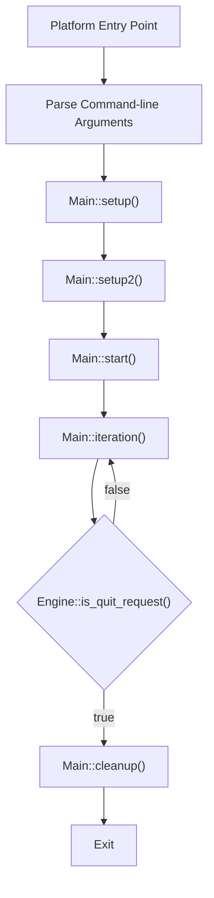
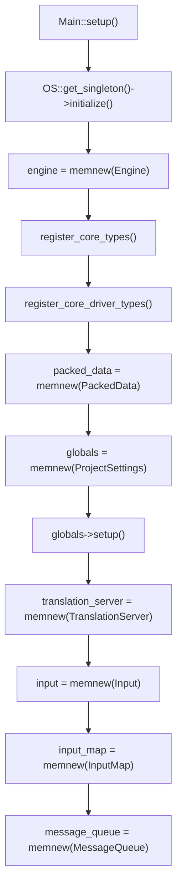
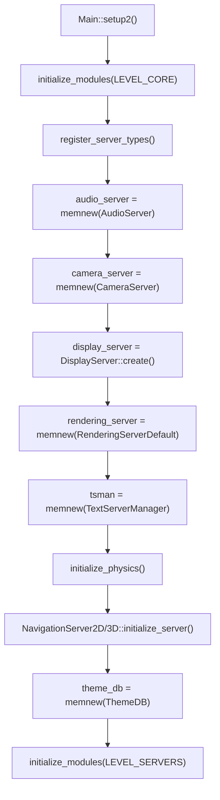
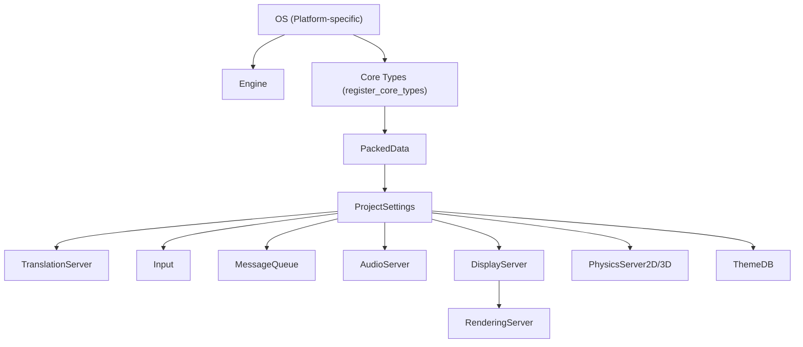
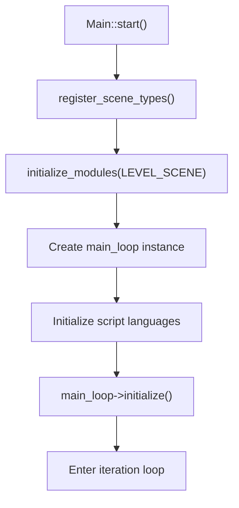
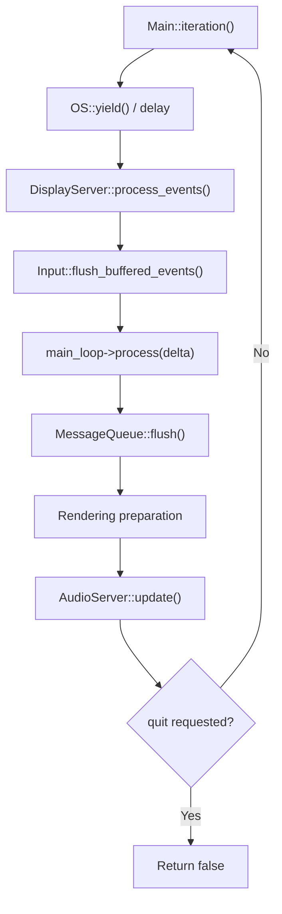
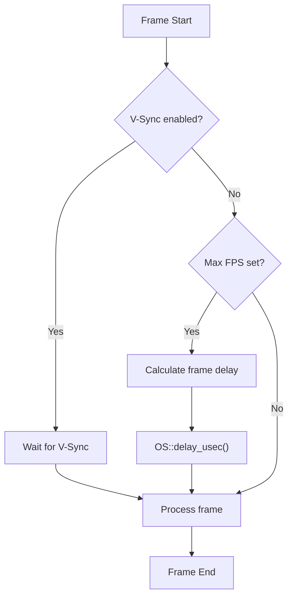
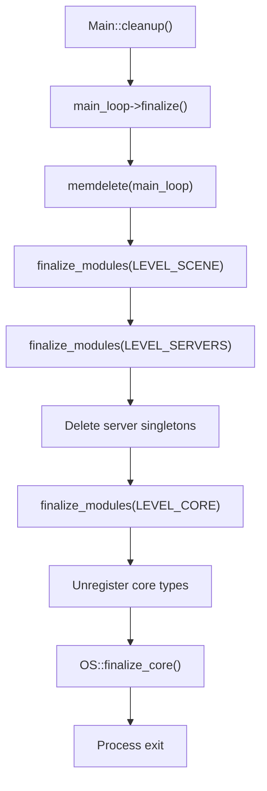
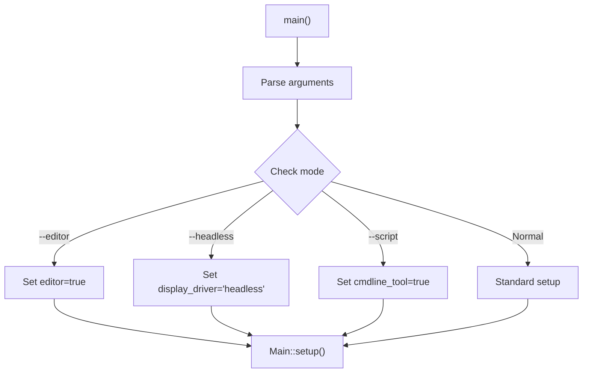

# Engine Initialization and Main Loop

Relevant source files

The following files were used as context for generating this wiki page:

- [core/config/project_settings.cpp](https://github.com/godotengine/godot/blob/4219ce91/core/config/project_settings.cpp)
- [core/config/project_settings.h](https://github.com/godotengine/godot/blob/4219ce91/core/config/project_settings.h)
- [core/core_bind.cpp](https://github.com/godotengine/godot/blob/4219ce91/core/core_bind.cpp)
- [core/core_bind.h](https://github.com/godotengine/godot/blob/4219ce91/core/core_bind.h)
- [core/io/stream_peer.cpp](https://github.com/godotengine/godot/blob/4219ce91/core/io/stream_peer.cpp)
- [core/io/stream_peer.h](https://github.com/godotengine/godot/blob/4219ce91/core/io/stream_peer.h)
- [core/os/os.cpp](https://github.com/godotengine/godot/blob/4219ce91/core/os/os.cpp)
- [core/os/os.h](https://github.com/godotengine/godot/blob/4219ce91/core/os/os.h)
- [doc/classes/ClassDB.xml](https://github.com/godotengine/godot/blob/4219ce91/doc/classes/ClassDB.xml)
- [doc/classes/Marshalls.xml](https://github.com/godotengine/godot/blob/4219ce91/doc/classes/Marshalls.xml)
- [doc/classes/OS.xml](https://github.com/godotengine/godot/blob/4219ce91/doc/classes/OS.xml)
- [doc/classes/PacketPeer.xml](https://github.com/godotengine/godot/blob/4219ce91/doc/classes/PacketPeer.xml)
- [doc/classes/ProjectSettings.xml](https://github.com/godotengine/godot/blob/4219ce91/doc/classes/ProjectSettings.xml)
- [doc/classes/StreamPeer.xml](https://github.com/godotengine/godot/blob/4219ce91/doc/classes/StreamPeer.xml)
- [drivers/unix/os_unix.cpp](https://github.com/godotengine/godot/blob/4219ce91/drivers/unix/os_unix.cpp)
- [drivers/unix/os_unix.h](https://github.com/godotengine/godot/blob/4219ce91/drivers/unix/os_unix.h)
- [main/main.cpp](https://github.com/godotengine/godot/blob/4219ce91/main/main.cpp)
- [platform/windows/os_windows.cpp](https://github.com/godotengine/godot/blob/4219ce91/platform/windows/os_windows.cpp)
- [platform/windows/os_windows.h](https://github.com/godotengine/godot/blob/4219ce91/platform/windows/os_windows.h)

This document explains how the Godot Engine starts up, initializes its core singletons, and executes its main game loop. The initialization process is handled by the `Main` class in [main/main.cpp](), which orchestrates a multi-phase startup sequence before entering the main iteration loop. For information about platform-specific implementations, see [Platform Abstraction Layer](https://github.com/godotengine/godot/blob/4219ce91/1.3). For scene system details, see [Scene System Architecture](https://github.com/godotengine/godot/blob/4219ce91/2).

## Initialization Phases

The Godot Engine initialization is divided into distinct phases, each handled by specific functions in the `Main` class. The entire process is orchestrated from the platform-specific entry point (e.g., `WinMain` on Windows, `main` on Unix platforms).

### Phase Overview

The initialization follows this sequence:

1. **Command-line parsing**: Arguments are parsed and flags are set
2. **`Main::setup()`**: Initialize core subsystems and singletons
3. **`Main::setup2()`**: Initialize servers, modules, and rendering
4. **`Main::start()`**: Create the main loop and begin execution
5. **`Main::iteration()`**: Execute each frame (called repeatedly)
6. **`Main::cleanup()`**: Cleanup and shutdown when exiting

**Complete Engine Initialization and Execution Flow**

Sources:
- [main/main.cpp:976-1000](https://github.com/godotengine/godot/blob/4219ce91/main/main.cpp#L976-L1000)
- [main/main.cpp:710-896](https://github.com/godotengine/godot/blob/4219ce91/main/main.cpp#L710-L896)
- [main/main.cpp:2077-2162](https://github.com/godotengine/godot/blob/4219ce91/main/main.cpp#L2077-L2162)
- [main/main.cpp:2226-2300](https://github.com/godotengine/godot/blob/4219ce91/main/main.cpp#L2226-L2300)

### Phase 1: `Main::setup()` - Core Initialization

The `Main::setup()` function initializes the foundational subsystems that the rest of the engine depends on. This includes platform abstraction, type systems, and configuration loading.

**Key steps in `Main::setup()`:**

1. **OS Initialization**: The platform-specific `OS` singleton is initialized via `OS::get_singleton()->initialize()`
2. **Engine Singleton**: Create the `Engine` singleton that manages engine-wide state
3. **Core Type Registration**: Call `register_core_types()` to register fundamental types (String, Array, etc.)
4. **PackedData**: Initialize `PackedData` for .pck file handling
5. **ProjectSettings**: Create `ProjectSettings` singleton and load project.godot
6. **Core Services**: Initialize `TranslationServer`, `Input`, `InputMap`, and `MessageQueue`

**Main::setup() Singleton Creation Order**

The `ProjectSettings` loading process searches for a `project.godot` file starting from the current directory and moving upward through parent directories (unless overridden by command-line arguments).

Sources:
- [main/main.cpp:710-896](https://github.com/godotengine/godot/blob/4219ce91/main/main.cpp#L710-L896)
- [main/main.cpp:155-165](https://github.com/godotengine/godot/blob/4219ce91/main/main.cpp#L155-L165)
- [main/main.cpp:723-729](https://github.com/godotengine/godot/blob/4219ce91/main/main.cpp#L723-L729)

### Phase 2: `Main::setup2()` - Server and Module Initialization

The `Main::setup2()` function initializes the higher-level server subsystems and modules. This is where rendering, audio, physics, and other specialized systems come online.

**Key steps in `Main::setup2()`:**

1. **Module Core Initialization**: Call `initialize_modules(MODULE_INITIALIZATION_LEVEL_CORE)`
2. **Server Type Registration**: Call `register_server_types()` to set up server infrastructure
3. **Audio Server**: Create `AudioServer` singleton for audio management
4. **Camera Server**: Create `CameraServer` singleton
5. **Display Server**: Create platform-specific `DisplayServer` (manages windows and input)
6. **Rendering Server**: Create `RenderingServer` with the selected rendering driver
7. **Text Server**: Initialize text shaping and rendering via `TextServerManager`
8. **Physics Servers**: Initialize `PhysicsServer2D` and `PhysicsServer3D` via `initialize_physics()`
9. **Navigation Servers**: Initialize `NavigationServer2D` and `NavigationServer3D`
10. **Theme Database**: Create `ThemeDB` for UI theming
11. **Module Server Initialization**: Call `initialize_modules(MODULE_INITIALIZATION_LEVEL_SERVERS)`

**Main::setup2() Server Initialization**

The `initialize_physics()` helper function creates the appropriate physics server implementations based on project settings, with fallback to dummy implementations if needed.

Sources:
- [main/main.cpp:2077-2300](https://github.com/godotengine/godot/blob/4219ce91/main/main.cpp#L2077-L2300)
- [main/main.cpp:172-177](https://github.com/godotengine/godot/blob/4219ce91/main/main.cpp#L172-L177)
- [main/main.cpp:349-389](https://github.com/godotengine/godot/blob/4219ce91/main/main.cpp#L349-L389)
- [main/main.cpp:410-417](https://github.com/godotengine/godot/blob/4219ce91/main/main.cpp#L410-L417)

## Core Singleton Registry

Godot uses a singleton pattern for many of its core systems. These singletons are initialized in a specific order during `Main::setup()` and `Main::setup2()`, and are accessible globally throughout the engine's lifetime.

### Primary Singletons

The following table lists the critical singletons created during initialization:

| Singleton Variable | Class | Purpose | Init Phase | Source |
|-------------------|-------|---------|-----------|---------|
| `OS::singleton` | `OS_Windows`/`OS_Unix`/etc | Platform abstraction, timing, file system | Pre-setup | Platform-specific |
| `engine` | `Engine` | Engine state, version info, frame counting | setup() | [main/main.cpp:155]() |
| `packed_data` | `PackedData` | .pck file handling | setup() | [main/main.cpp:161]() |
| `globals` | `ProjectSettings` | Project configuration | setup() | [main/main.cpp:156]() |
| `translation_server` | `TranslationServer` | Localization | setup() | [main/main.cpp:159]() |
| `input` | `Input` | Input event processing | setup() | [main/main.cpp:157]() |
| `input_map` | `InputMap` | Input action mapping | setup() | [main/main.cpp:158]() |
| `message_queue` | `MessageQueue` | Deferred method calls | setup() | [main/main.cpp:165]() |
| `audio_server` | `AudioServer` | Audio playback and mixing | setup2() | [main/main.cpp:172]() |
| `camera_server` | `CameraServer` | Camera feed management | setup2() | [main/main.cpp:173]() |
| `display_server` | `DisplayServer` subclass | Window/input management | setup2() | [main/main.cpp:174]() |
| `rendering_server` | `RenderingServer` | GPU rendering backend | setup2() | [main/main.cpp:175]() |
| `tsman` | `TextServerManager` | Text shaping | setup2() | [main/main.cpp:176]() |
| `physics_server_2d` | `PhysicsServer2D` impl | 2D physics | setup2() | [main/main.cpp:179-180]() |
| `physics_server_3d` | `PhysicsServer3D` impl | 3D physics | setup2() | [main/main.cpp:183-184]() |
| `theme_db` | `ThemeDB` | UI theme management | setup2() | [main/main.cpp:177]() |

### Singleton Access Pattern

Singletons are accessed via static `get_singleton()` methods. For example:
- `OS::get_singleton()` returns the platform-specific OS instance
- `Engine::get_singleton()` returns the engine state manager
- `ProjectSettings::get_singleton()` returns project configuration

Sources:
- [main/main.cpp:150-190](https://github.com/godotengine/godot/blob/4219ce91/main/main.cpp#L150-L190)
- [core/os/os.h:45-56](https://github.com/godotengine/godot/blob/4219ce91/core/os/os.h#L45-L56)
- [core/config/project_settings.h:51-53](https://github.com/godotengine/godot/blob/4219ce91/core/config/project_settings.h#L51-L53)

### Initialization Dependencies

The initialization order is carefully designed to respect dependencies between systems. A system can only be initialized after all its dependencies are ready.

**Singleton Initialization Dependency Graph**

The dependency chain ensures that:
- The OS layer is initialized first to provide platform services
- Core types are registered before any singleton creation
- ProjectSettings is loaded before servers that need configuration
- DisplayServer is created before RenderingServer (which needs window context)

Sources:
- [main/main.cpp:710-896](https://github.com/godotengine/godot/blob/4219ce91/main/main.cpp#L710-L896)
- [main/main.cpp:2077-2300](https://github.com/godotengine/godot/blob/4219ce91/main/main.cpp#L2077-L2300)

## Main Loop Execution

After initialization completes, the engine enters its main loop via `Main::start()`. The main loop continues until the application quits.

### Phase 3: `Main::start()` - Main Loop Creation

The `Main::start()` function creates the main loop instance and performs final setup before entering the iteration loop:

1. **Scene Registration**: Call `register_scene_types()` to register scene-related classes
2. **Module Scene Initialization**: Call `initialize_modules(MODULE_INITIALIZATION_LEVEL_SCENE)`
3. **Main Loop Creation**: Instantiate the main loop (typically `SceneTree`, or custom via `application/run/main_loop_type`)
4. **Script Language Initialization**: Initialize script languages (GDScript, etc.)
5. **Main Loop Initialization**: Call `main_loop->initialize()` to set up the scene tree

**Main::start() Scene and Main Loop Setup**

Sources:
- [main/main.cpp:2900-3100](https://github.com/godotengine/godot/blob/4219ce91/main/main.cpp#L2900-L3100)

### Phase 4: `Main::iteration()` - Frame Processing

The `Main::iteration()` function is called once per frame and handles all per-frame processing. This is the core of the engine's runtime execution.

**Frame Processing Steps:**

1. **Event Processing**: Call `DisplayServer::process_events()` to handle OS events (input, window events)
2. **Input Flushing**: Process buffered input events via `Input::flush_buffered_events()`
3. **Main Loop Processing**: Call `main_loop->process()` which drives:
   - Physics frame processing at fixed timestep
   - Idle frame processing at variable timestep
   - Node callbacks (`_process`, `_physics_process`)
4. **Message Queue Flushing**: Process deferred calls via `MessageQueue::flush()`
5. **Rendering**: Prepare and submit rendering commands
6. **Server Updates**: Update AudioServer and other background services

**Main::iteration() Frame Loop**

The `main_loop->process()` call is where the scene tree processes nodes, updates physics, and handles game logic. See [SceneTree and Node Hierarchy](https://github.com/godotengine/godot/blob/4219ce91/2.1) for details on scene processing.

Sources:
- [main/main.cpp:2400-2700](https://github.com/godotengine/godot/blob/4219ce91/main/main.cpp#L2400-L2700)
- [main/main.cpp:2226-2300](https://github.com/godotengine/godot/blob/4219ce91/main/main.cpp#L2226-L2300)

## Timing and Frame Rate Control

The engine uses sophisticated timing mechanisms to manage frame pacing, physics simulation, and rendering synchronization.

### Timing Sources

Each platform provides high-precision timing through the OS abstraction:

| Platform | Timing Method | Resolution | Source |
|----------|---------------|------------|---------|
| Windows | `QueryPerformanceCounter` | ~microsecond | [platform/windows/os_windows.cpp:279-282]() |
| Unix/Linux | `clock_gettime(CLOCK_MONOTONIC)` | nanosecond | [drivers/unix/os_unix.cpp:111-133]() |
| macOS | `mach_absolute_time` | nanosecond | [drivers/unix/os_unix.cpp:111-120]() |

The `OS::get_ticks_usec()` method provides a monotonic microsecond counter that is used throughout the engine for timing calculations.

### Frame Pacing Modes

The engine supports several frame pacing modes controlled by project settings and command-line arguments:

1. **V-Sync Mode**: Synchronize with display refresh rate (`display/window/vsync/vsync_mode`)
2. **Max FPS**: Cap frame rate to a specific value (`application/run/max_fps`)
3. **Fixed FPS**: Force a fixed frame rate for deterministic execution (`--fixed-fps`)
4. **Unlimited**: Run as fast as possible

**Frame Timing Control Flow**

Sources:
- [core/os/os.cpp:58-60](https://github.com/godotengine/godot/blob/4219ce91/core/os/os.cpp#L58-L60)
- [platform/windows/os_windows.cpp:279-282](https://github.com/godotengine/godot/blob/4219ce91/platform/windows/os_windows.cpp#L279-L282)
- [drivers/unix/os_unix.cpp:127-133](https://github.com/godotengine/godot/blob/4219ce91/drivers/unix/os_unix.cpp#L127-L133)
- [doc/classes/ProjectSettings.xml:397-406](https://github.com/godotengine/godot/blob/4219ce91/doc/classes/ProjectSettings.xml#L397-L406)

### Physics and Process Timing

The engine separates physics processing (fixed timestep) from idle processing (variable timestep):

- **Physics Process**: Runs at a fixed rate defined by `physics/common/physics_ticks_per_second` (default 60 Hz)
- **Process/Idle**: Runs once per frame with variable delta time
- **Delta Smoothing**: Can smooth frame time variations (`application/run/delta_smoothing`)

The `SceneTree` manages both physics and idle processing callbacks, ensuring physics runs at consistent intervals while allowing rendering to adapt to varying frame times.

Sources:
- [doc/classes/ProjectSettings.xml:349-353](https://github.com/godotengine/godot/blob/4219ce91/doc/classes/ProjectSettings.xml#L349-L353)

## Shutdown and Cleanup

When the application quits (either from user request or programmatically), the engine performs orderly cleanup.

### Phase 5: `Main::cleanup()` - Shutdown Sequence

The `Main::cleanup()` function tears down all systems in reverse order of initialization:

1. **Main Loop Finalization**: Call `main_loop->finalize()` to clean up the scene tree
2. **Module Finalization**: Call `finalize_modules()` for each initialization level
3. **Server Shutdown**: Finalize and delete all server singletons
4. **Core Cleanup**: Unregister types and finalize core systems
5. **OS Finalization**: Call `OS::finalize_core()` for platform cleanup

**Main::cleanup() Shutdown Order**

Memory is carefully released in reverse dependency order to avoid use-after-free issues.

Sources:
- [main/main.cpp:3200-3400](https://github.com/godotengine/godot/blob/4219ce91/main/main.cpp#L3200-L3400)

## Platform Variations

While the initialization sequence is consistent across platforms, each platform has specific requirements handled by its OS implementation.

### Platform-Specific Setup

The OS singleton is created before `Main::setup()` is called, allowing platform-specific initialization to occur first:

**Windows (`OS_Windows`)**:
- Initializes high-precision timing via `QueryPerformanceFrequency`
- Sets up DirectWrite factory for font rendering
- Configures console redirection for stdout/stderr
- Registers file access and directory implementations

**Unix/Linux (`OS_Unix`)**:
- Initializes POSIX threading via `init_thread_posix()`
- Sets up timing via `clock_gettime(CLOCK_MONOTONIC)`
- Configures file and network socket implementations
- Initializes entropy source (`/dev/urandom` or `getentropy()`)

**Other Platforms**:
- macOS, Android, iOS, and Web platforms have their own OS implementations
- Each follows the same initialization pattern but with platform-specific details

The platform-specific initialization is encapsulated in the `OS::initialize()` virtual method, which is called early in `Main::setup()`.

Sources:
- [platform/windows/os_windows.cpp:256-332](https://github.com/godotengine/godot/blob/4219ce91/platform/windows/os_windows.cpp#L256-L332)
- [drivers/unix/os_unix.cpp:163-183](https://github.com/godotengine/godot/blob/4219ce91/drivers/unix/os_unix.cpp#L163-L183)
- [core/os/os.h:115-128](https://github.com/godotengine/godot/blob/4219ce91/core/os/os.h#L115-L128)

## Command-Line Argument Processing

The engine processes command-line arguments before initialization to configure startup behavior.

### Argument Categories

Command-line arguments control various aspects of initialization:

- **Project Selection**: `--path`, `--main-pack`, `--upwards`
- **Display Options**: `--fullscreen`, `--windowed`, `--resolution`
- **Engine Mode**: `--editor`, `--project-manager`, `--headless`
- **Rendering**: `--rendering-driver`, `--rendering-method`
- **Debug Options**: `--debug`, `--verbose`, `--quiet`
- **Performance**: `--max-fps`, `--fixed-fps`, `--disable-vsync`

These arguments are parsed in `main()` before calling `Main::setup()`, allowing them to influence the initialization process.

### Argument Impact on Initialization

Some arguments fundamentally change the initialization flow:

- `--headless`: Skips DisplayServer creation and uses dummy implementations
- `--editor`: Enables editor mode and loads editor-specific systems
- `--script`: Runs a standalone script instead of the main loop
- `--test`: Executes unit tests instead of normal startup

**Command-line Argument Flow**

Sources:
- [main/main.cpp:976-1500](https://github.com/godotengine/godot/blob/4219ce91/main/main.cpp#L976-L1500)
- [main/main.cpp:512-710](https://github.com/godotengine/godot/blob/4219ce91/main/main.cpp#L512-L710)

## Conclusion

The engine initialization and core systems form the foundation upon which the rest of the Godot Engine is built. Understanding these systems is crucial for engine contributors and developers who need to debug low-level issues or extend the engine's capabilities.