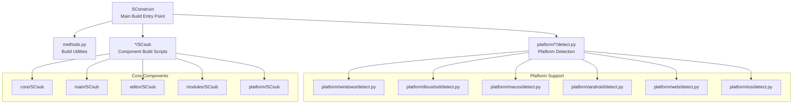
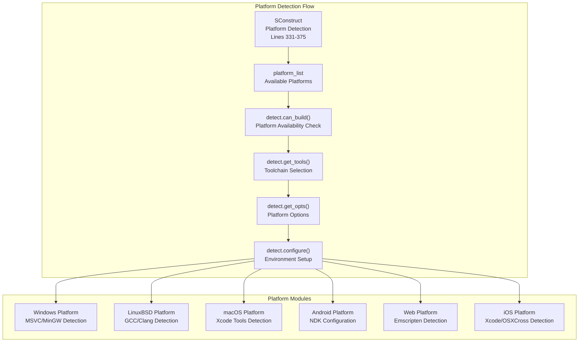
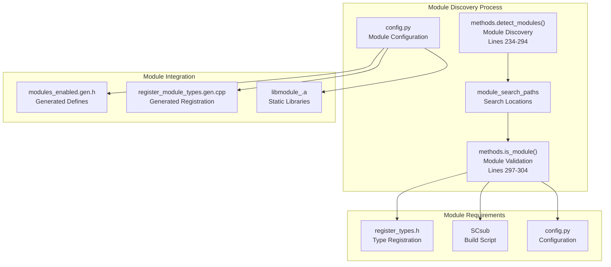
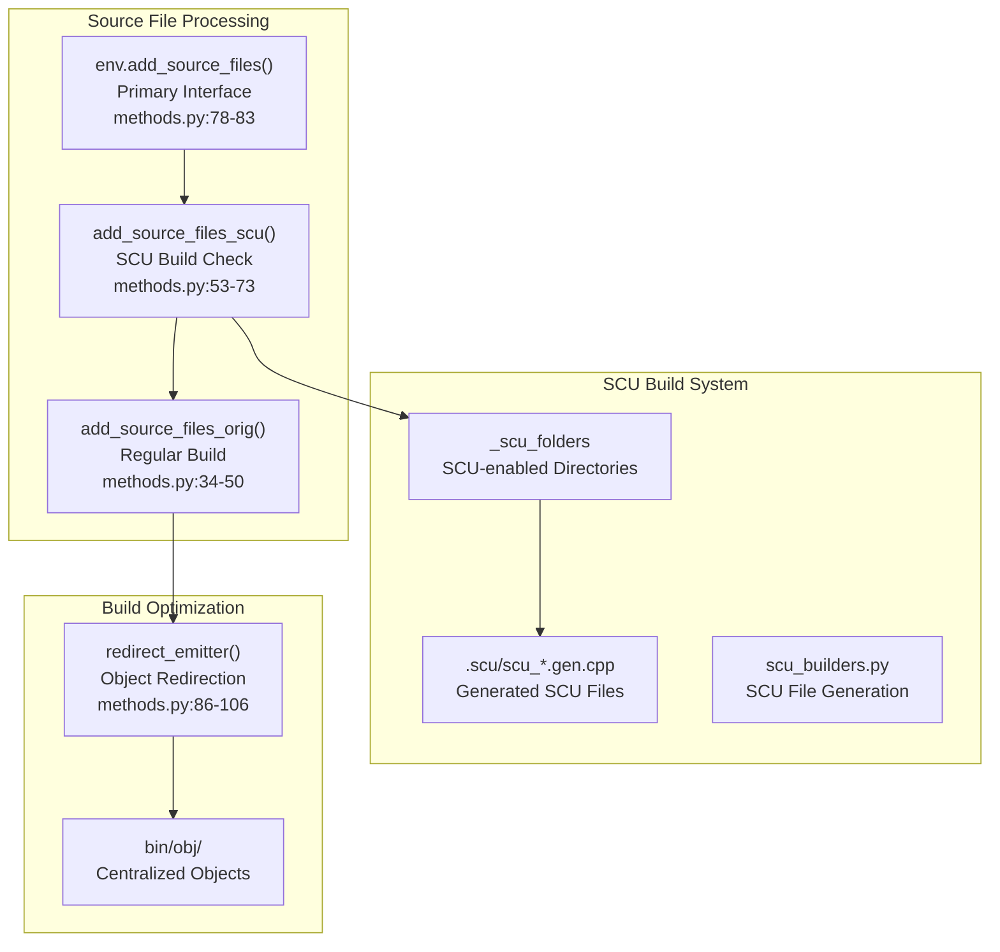
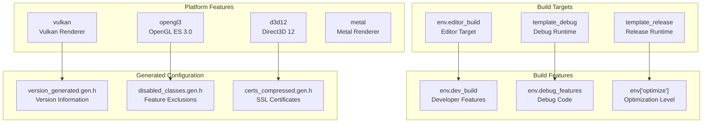

# Build System

Relevant source files

The following files were used as context for generating this wiki page:

- [SConstruct](https://github.com/godotengine/godot/blob/4219ce91/SConstruct)
- [core/SCsub](https://github.com/godotengine/godot/blob/4219ce91/core/SCsub)
- [editor/SCsub](https://github.com/godotengine/godot/blob/4219ce91/editor/SCsub)
- [editor/icons/SCsub](https://github.com/godotengine/godot/blob/4219ce91/editor/icons/SCsub)
- [main/SCsub](https://github.com/godotengine/godot/blob/4219ce91/main/SCsub)
- [methods.py](https://github.com/godotengine/godot/blob/4219ce91/methods.py)
- [modules/SCsub](https://github.com/godotengine/godot/blob/4219ce91/modules/SCsub)
- [modules/gdscript/editor/script_templates/SCsub](https://github.com/godotengine/godot/blob/4219ce91/modules/gdscript/editor/script_templates/SCsub)
- [modules/modules_builders.py](https://github.com/godotengine/godot/blob/4219ce91/modules/modules_builders.py)
- [modules/mono/editor/script_templates/SCsub](https://github.com/godotengine/godot/blob/4219ce91/modules/mono/editor/script_templates/SCsub)
- [platform/SCsub](https://github.com/godotengine/godot/blob/4219ce91/platform/SCsub)
- [platform/android/detect.py](https://github.com/godotengine/godot/blob/4219ce91/platform/android/detect.py)
- [platform/ios/detect.py](https://github.com/godotengine/godot/blob/4219ce91/platform/ios/detect.py)
- [platform/linuxbsd/detect.py](https://github.com/godotengine/godot/blob/4219ce91/platform/linuxbsd/detect.py)
- [platform/macos/detect.py](https://github.com/godotengine/godot/blob/4219ce91/platform/macos/detect.py)
- [platform/web/detect.py](https://github.com/godotengine/godot/blob/4219ce91/platform/web/detect.py)
- [platform/windows/SCsub](https://github.com/godotengine/godot/blob/4219ce91/platform/windows/SCsub)
- [platform/windows/detect.py](https://github.com/godotengine/godot/blob/4219ce91/platform/windows/detect.py)
- [platform_methods.py](https://github.com/godotengine/godot/blob/4219ce91/platform_methods.py)
- [scene/theme/icons/SCsub](https://github.com/godotengine/godot/blob/4219ce91/scene/theme/icons/SCsub)

The Godot Engine uses SCons as its build system to handle cross-platform compilation, module management, and build configuration. This document covers the architecture and implementation of the build system, including platform detection, module discovery, source file organization, and build orchestration.

For information about engine initialization after the build process, see [Engine Initialization and Core Systems](#1.1).

## Build System Architecture

The build system is orchestrated through SCons with a hierarchical structure of build scripts that handle different aspects of compilation.

Sources: [SConstruct:1-1000](https://github.com/godotengine/godot/blob/4219ce91/SConstruct#L1-L1000), [methods.py:1-900](https://github.com/godotengine/godot/blob/4219ce91/methods.py#L1-L900), [platform/windows/detect.py:1-300](https://github.com/godotengine/godot/blob/4219ce91/platform/windows/detect.py#L1-L300), [platform/linuxbsd/detect.py:1-500](https://github.com/godotengine/godot/blob/4219ce91/platform/linuxbsd/detect.py#L1-L500), [core/SCsub:1-241](https://github.com/godotengine/godot/blob/4219ce91/core/SCsub#L1-L241), [editor/SCsub:1-116](https://github.com/godotengine/godot/blob/4219ce91/editor/SCsub#L1-L116), [modules/SCsub:1-64](https://github.com/godotengine/godot/blob/4219ce91/modules/SCsub#L1-L64)

## Platform Detection and Configuration

The build system automatically detects the target platform and configures appropriate build tools and settings through a standardized interface.

Each platform provides standardized functions for build integration:

| Function | Purpose | Example Implementation |
|----------|---------|----------------------|
| `can_build()` | Check if platform can be built on current host | [platform/windows/detect.py:47-59]() |
| `get_opts()` | Define platform-specific build options | [platform/windows/detect.py:162-218]() |
| `get_tools()` | Select appropriate compiler toolchain | [platform/windows/detect.py:150-159]() |
| `configure(env)` | Setup build environment and flags | [platform/windows/detect.py:280-563]() |

Sources: [SConstruct:331-375](https://github.com/godotengine/godot/blob/4219ce91/SConstruct#L331-L375), [platform/windows/detect.py:47-218](https://github.com/godotengine/godot/blob/4219ce91/platform/windows/detect.py#L47-L218), [platform/linuxbsd/detect.py:17-26](https://github.com/godotengine/godot/blob/4219ce91/platform/linuxbsd/detect.py#L17-L26), [platform/android/detect.py:87-248](https://github.com/godotengine/godot/blob/4219ce91/platform/android/detect.py#L87-L248), [platform/web/detect.py:29-348](https://github.com/godotengine/godot/blob/4219ce91/platform/web/detect.py#L29-L348), [platform/ios/detect.py:16-181](https://github.com/godotengine/godot/blob/4219ce91/platform/ios/detect.py#L16-L181)

## Module Detection and Management

The build system automatically discovers and configures modules through a standardized discovery process that supports both built-in and custom modules.

The module system uses three required files for each module:
- `register_types.h` - Module type registration interface
- `SCsub` - Module-specific build configuration
- `config.py` - Module options and dependencies

Sources: [methods.py:234-304](https://github.com/godotengine/godot/blob/4219ce91/methods.py#L234-L304), [SConstruct:392-449](https://github.com/godotengine/godot/blob/4219ce91/SConstruct#L392-L449), [modules/SCsub:1-64](https://github.com/godotengine/godot/blob/4219ce91/modules/SCsub#L1-L64), [modules/modules_builders.py:8-61](https://github.com/godotengine/godot/blob/4219ce91/modules/modules_builders.py#L8-L61)

## Source File Handling and SCU Builds

The build system provides flexible source file management with support for Single Compilation Unit (SCU) builds for faster compilation.

The SCU build system improves compilation performance by combining multiple source files into single compilation units, controlled by the `scu_build` option and `scu_limit` setting.

Sources: [methods.py:34-83](https://github.com/godotengine/godot/blob/4219ce91/methods.py#L34-L83), [methods.py:86-106](https://github.com/godotengine/godot/blob/4219ce91/methods.py#L86-L106), [SConstruct:635-646](https://github.com/godotengine/godot/blob/4219ce91/SConstruct#L635-L646)

## Build Configuration and Target Types

The build system supports multiple build configurations and target types with extensive customization options.

Key build configuration variables:

| Variable | Purpose | Values |
|----------|---------|--------|
| `target` | Build target type | `editor`, `template_debug`, `template_release` |
| `arch` | Target architecture | `x86_32`, `x86_64`, `arm32`, `arm64` |
| `optimize` | Optimization level | `none`, `debug`, `speed`, `speed_trace`, `size` |
| `lto` | Link-time optimization | `none`, `auto`, `thin`, `full` |

Sources: [SConstruct:160-186](https://github.com/godotengine/godot/blob/4219ce91/SConstruct#L160-L186), [SConstruct:492-522](https://github.com/godotengine/godot/blob/4219ce91/SConstruct#L492-L522), [core/SCsub:169-217](https://github.com/godotengine/godot/blob/4219ce91/core/SCsub#L169-L217), [core/core_builders.py:17-46](https://github.com/godotengine/godot/blob/4219ce91/core/core_builders.py#L17-L46)

## Code Generation and Builder System

The build system includes extensive code generation capabilities for creating headers, registration code, and resource embedding through builder functions.

```mermaid
graph TB
    subgraph "Core Builders"
        version_builder["version_info_builder<br/>Version Headers"]
        hash_builder["version_hash_builder<br/>Git Information"]
        certs_builder["make_certs_header<br/>SSL Certificates"]
        authors_builder["make_authors_header<br/>Credits"]
    end
    
    subgraph "Editor Builders"
        doc_builder["make_doc_header<br/>Documentation"]
        translation_builder["make_translations_header<br/>Localization"]
        icon_builder["make_editor_icons_action<br/>SVG Processing"]
        exporter_builder["register_exporters_builder<br/>Platform Exporters"]
    end
    
    subgraph "Module Builders"
        module_enabled["modules_enabled_builder<br/>Module Defines"]
        module_register["register_module_types_builder<br/>Module Registration"]
        module_tests["modules_tests_builder<br/>Test Integration"]
    end
    
    subgraph "Generated Files"
        gen_headers[".gen.h Files<br/>Generated Headers"]
        gen_sources[".gen.cpp Files<br/>Generated Sources"]
    end
    
    version_builder --> gen_headers
    doc_builder --> gen_headers
    module_enabled --> gen_headers
    
    hash_builder --> gen_sources
    exporter_builder --> gen_sources
    module_register --> gen_sources
```

Builder functions use `env.CommandNoCache()` to generate source files during the build process, ensuring proper dependency tracking and incremental builds.