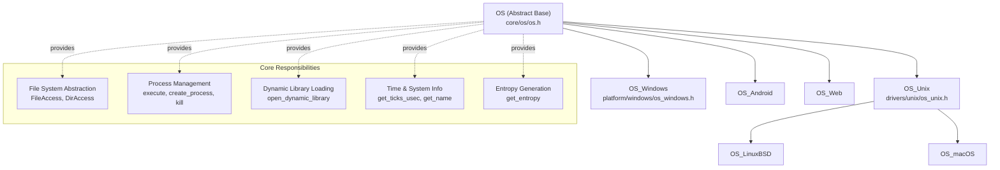
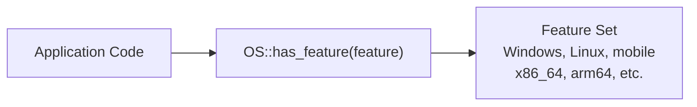
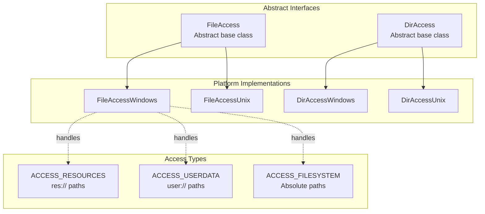
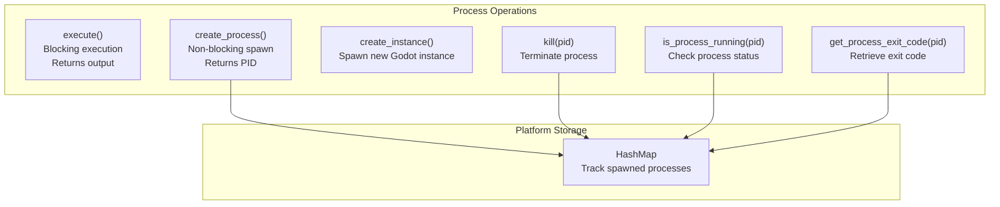
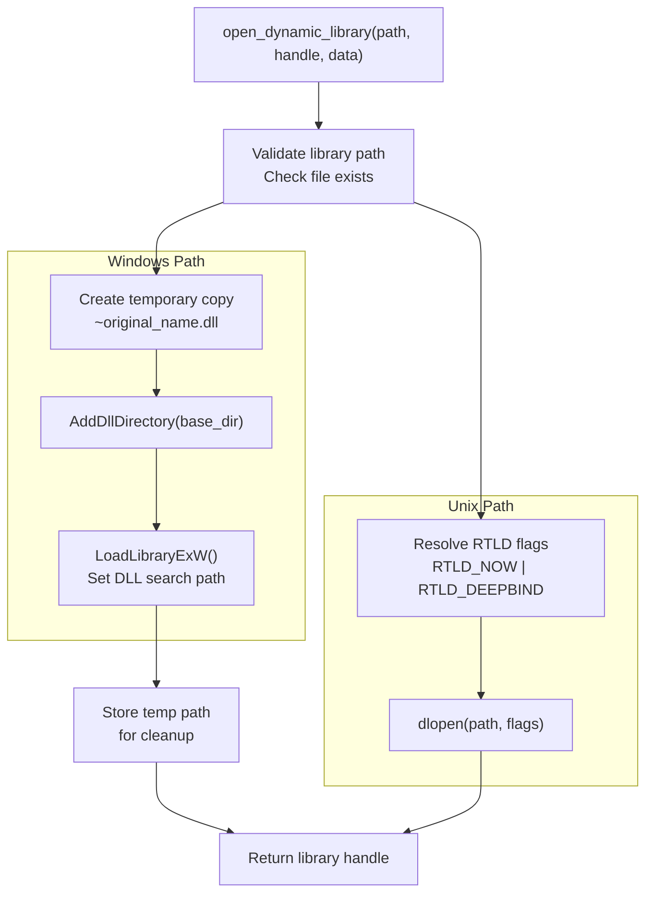
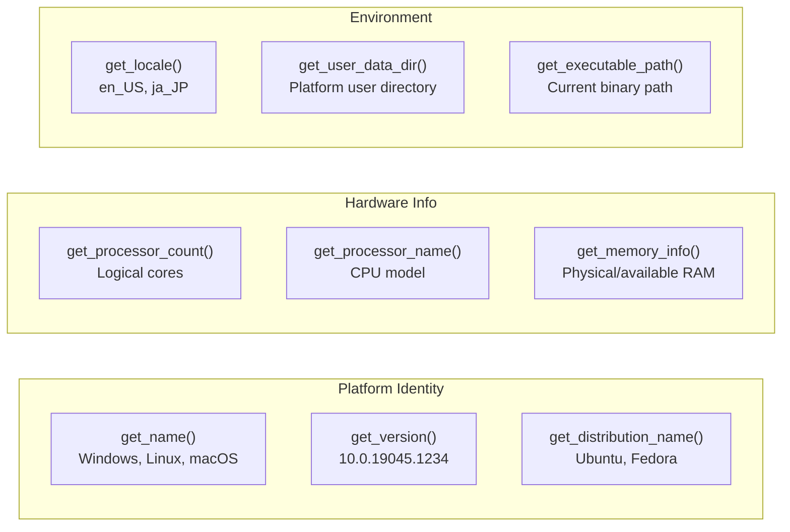
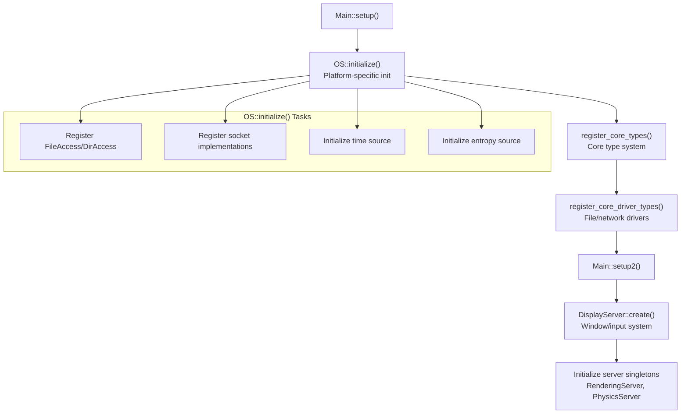
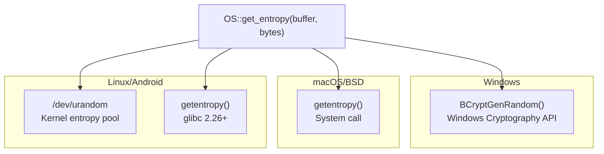

# Platform Abstraction Layer

<details>
<summary>Relevant source files</summary>

The following files were used as context for generating this wiki page:

- [core/config/project_settings.cpp](https://github.com/godotengine/godot/blob/4219ce91/core/config/project_settings.cpp)
- [core/config/project_settings.h](https://github.com/godotengine/godot/blob/4219ce91/core/config/project_settings.h)
- [core/core_bind.cpp](https://github.com/godotengine/godot/blob/4219ce91/core/core_bind.cpp)
- [core/core_bind.h](https://github.com/godotengine/godot/blob/4219ce91/core/core_bind.h)
- [core/io/stream_peer.cpp](https://github.com/godotengine/godot/blob/4219ce91/core/io/stream_peer.cpp)
- [core/io/stream_peer.h](https://github.com/godotengine/godot/blob/4219ce91/core/io/stream_peer.h)
- [core/os/os.cpp](https://github.com/godotengine/godot/blob/4219ce91/core/os/os.cpp)
- [core/os/os.h](https://github.com/godotengine/godot/blob/4219ce91/core/os/os.h)
- [doc/classes/ClassDB.xml](https://github.com/godotengine/godot/blob/4219ce91/doc/classes/ClassDB.xml)
- [doc/classes/Marshalls.xml](https://github.com/godotengine/godot/blob/4219ce91/doc/classes/Marshalls.xml)
- [doc/classes/OS.xml](https://github.com/godotengine/godot/blob/4219ce91/doc/classes/OS.xml)
- [doc/classes/PacketPeer.xml](https://github.com/godotengine/godot/blob/4219ce91/doc/classes/PacketPeer.xml)
- [doc/classes/ProjectSettings.xml](https://github.com/godotengine/godot/blob/4219ce91/doc/classes/ProjectSettings.xml)
- [doc/classes/StreamPeer.xml](https://github.com/godotengine/godot/blob/4219ce91/doc/classes/StreamPeer.xml)
- [drivers/unix/os_unix.cpp](https://github.com/godotengine/godot/blob/4219ce91/drivers/unix/os_unix.cpp)
- [drivers/unix/os_unix.h](https://github.com/godotengine/godot/blob/4219ce91/drivers/unix/os_unix.h)
- [main/main.cpp](https://github.com/godotengine/godot/blob/4219ce91/main/main.cpp)
- [platform/windows/os_windows.cpp](https://github.com/godotengine/godot/blob/4219ce91/platform/windows/os_windows.cpp)
- [platform/windows/os_windows.h](https://github.com/godotengine/godot/blob/4219ce91/platform/windows/os_windows.h)

</details>


## Purpose and Scope

The Platform Abstraction Layer provides a unified interface for operating system services, enabling Godot to run on multiple platforms (Windows, Linux, macOS, Android, Web) without platform-specific code in the engine core. This document covers the `OS` singleton and its platform-specific implementations, file system abstractions, process management, and dynamic library loading.

For display and input handling, see DisplayServer (covered separately). For the main loop and engine initialization, see [Engine Initialization and Main Loop](#1.1).

---

## Architecture Overview

The platform abstraction is built around the `OS` singleton, an abstract base class that defines common OS operations. Each platform provides a concrete implementation inheriting from `OS` or `OS_Unix`.

**Platform Abstraction Hierarchy**



Sources: [core/os/os.h:45-346](https://github.com/godotengine/godot/blob/4219ce91/core/os/os.h#L45-L346), [drivers/unix/os_unix.h:53-138](https://github.com/godotengine/godot/blob/4219ce91/drivers/unix/os_unix.h#L53-L138), [platform/windows/os_windows.h:101-219](https://github.com/godotengine/godot/blob/4219ce91/platform/windows/os_windows.h#L101-L219)

---

## OS Singleton Base Class

The `OS` class is a singleton accessible via `OS::get_singleton()`. It provides pure virtual methods that must be implemented by platform-specific classes and concrete methods with default implementations.

**Core OS Interface**

| Category | Key Methods | Purpose |
|----------|-------------|---------|
| Initialization | `initialize()`, `finalize()`, `finalize_core()` | Platform setup and teardown |
| File System | `get_user_data_dir()`, `get_cache_dir()`, `get_temp_path()` | Standard directory paths |
| Process Management | `execute()`, `create_process()`, `kill()`, `is_process_running()` | Process control |
| Dynamic Libraries | `open_dynamic_library()`, `close_dynamic_library()`, `get_dynamic_library_symbol_handle()` | Plugin/GDExtension loading |
| Time | `get_ticks_usec()`, `get_datetime()`, `delay_usec()` | Timing and delays |
| System Info | `get_name()`, `get_version()`, `get_processor_count()`, `get_memory_info()` | Platform identification |
| Entropy | `get_entropy()` | Cryptographic randomness |
| Environment | `get_environment()`, `set_environment()`, `has_environment()` | Environment variables |

Sources: [core/os/os.h:88-346](https://github.com/godotengine/godot/blob/4219ce91/core/os/os.h#L88-L346), [core/os/os.cpp:54-630](https://github.com/godotengine/godot/blob/4219ce91/core/os/os.cpp#L54-L630)

**Platform Feature Detection**

The `OS` class provides `has_feature()` for runtime platform detection. Features are registered during initialization and include platform names, rendering backends, and architecture flags.



Sources: [core/os/os.h:336](https://github.com/godotengine/godot/blob/4219ce91/core/os/os.h#L336), [core/os/os.cpp:449-462](https://github.com/godotengine/godot/blob/4219ce91/core/os/os.cpp#L449-L462)

---

## Platform-Specific Implementations

### Windows Implementation

`OS_Windows` handles Windows-specific operations including Win32 API integration, DirectWrite for font rendering, and COM interfaces.

**Windows-Specific Features**

| Component | Implementation | File Reference |
|-----------|---------------|----------------|
| File Access | `FileAccessWindows` | [platform/windows/os_windows.cpp:270-273]() |
| Directory Access | `DirAccessWindows` | [platform/windows/os_windows.cpp:274-276]() |
| Network Sockets | `NetSocketWinSock` | [platform/windows/os_windows.cpp:278]() |
| Font System | `IDWriteFactory`, `IDWriteFontCollection` | [platform/windows/os_windows.cpp:312-330]() |
| Time | `QueryPerformanceCounter` | [platform/windows/os_windows.cpp:281-282]() |
| Entropy | `BCryptGenRandom` | [platform/windows/os_windows.cpp:393-397]() |

Sources: [platform/windows/os_windows.cpp:257-333](https://github.com/godotengine/godot/blob/4219ce91/platform/windows/os_windows.cpp#L257-L333), [platform/windows/os_windows.h:101-219](https://github.com/godotengine/godot/blob/4219ce91/platform/windows/os_windows.h#L101-L219)

### Unix Implementation

`OS_Unix` serves as the base for Linux, BSD, and macOS platforms, providing POSIX-compliant implementations.

**Unix-Specific Features**

| Component | Implementation | File Reference |
|-----------|---------------|----------------|
| File Access | `FileAccessUnix` | [drivers/unix/os_unix.cpp:168-171]() |
| Directory Access | `DirAccessUnix` | [drivers/unix/os_unix.cpp:172-174]() |
| Network Sockets | `NetSocketUnix` | [drivers/unix/os_unix.cpp:177-178]() |
| Time | `clock_gettime(CLOCK_MONOTONIC)` | [drivers/unix/os_unix.cpp:127-131]() |
| Entropy | `getentropy()` or `/dev/urandom` | [drivers/unix/os_unix.cpp:279-303]() |

Sources: [drivers/unix/os_unix.cpp:163-183](https://github.com/godotengine/godot/blob/4219ce91/drivers/unix/os_unix.cpp#L163-L183), [drivers/unix/os_unix.h:53-138](https://github.com/godotengine/godot/blob/4219ce91/drivers/unix/os_unix.h#L53-L138)

---

## File System Abstraction

The platform layer abstracts file system operations through `FileAccess` and `DirAccess` classes. Platform-specific implementations are registered during initialization.

**File System Architecture**



**Platform Registration Pattern**

During `OS::initialize()`, each platform registers its file system implementation using `make_default<>()`:

```
// Windows
FileAccess::make_default<FileAccessWindows>(FileAccess::ACCESS_RESOURCES);
FileAccess::make_default<FileAccessWindows>(FileAccess::ACCESS_USERDATA);
FileAccess::make_default<FileAccessWindows>(FileAccess::ACCESS_FILESYSTEM);

// Unix
FileAccess::make_default<FileAccessUnix>(FileAccess::ACCESS_RESOURCES);
FileAccess::make_default<FileAccessUnix>(FileAccess::ACCESS_USERDATA);
FileAccess::make_default<FileAccessUnix>(FileAccess::ACCESS_FILESYSTEM);
```

Sources: [platform/windows/os_windows.cpp:270-276](https://github.com/godotengine/godot/blob/4219ce91/platform/windows/os_windows.cpp#L270-L276), [drivers/unix/os_unix.cpp:168-174](https://github.com/godotengine/godot/blob/4219ce91/drivers/unix/os_unix.cpp#L168-L174)

---

## Process Management

The `OS` class provides cross-platform process management for spawning, monitoring, and terminating processes.

**Process Management Interface**



**Windows Implementation**

Windows uses `PROCESS_INFORMATION` structures to track spawned processes:

```
struct ProcessInfo {
    STARTUPINFOEX si;
    PROCESS_INFORMATION pi;
    mutable bool is_running = true;
    mutable int exit_code = -1;
};
HashMap<ProcessID, ProcessInfo> *process_map;
```

Sources: [platform/windows/os_windows.h:169-176](https://github.com/godotengine/godot/blob/4219ce91/platform/windows/os_windows.h#L169-L176), [platform/windows/os_windows.cpp:1037-1140](https://github.com/godotengine/godot/blob/4219ce91/platform/windows/os_windows.cpp#L1037-L1140)

**Unix Implementation**

Unix platforms use `pid_t` and `waitpid()` for process tracking:

```
struct ProcessInfo {
    mutable bool is_running = true;
    mutable int exit_code = -1;
};
```

Sources: [drivers/unix/os_unix.h:54-59](https://github.com/godotengine/godot/blob/4219ce91/drivers/unix/os_unix.h#L54-L59), [drivers/unix/os_unix.cpp:409-550](https://github.com/godotengine/godot/blob/4219ce91/drivers/unix/os_unix.cpp#L409-L550)

---

## Dynamic Library Loading

The platform abstraction provides dynamic library loading for GDExtensions and plugins. Each platform implements the loading mechanism using its native API.

**Dynamic Library Loading Flow**



**Temporary File Strategy (Windows)**

On Windows, GDExtensions are copied to temporary files to avoid locking the original DLL, enabling hot-reload during development:

Sources: [platform/windows/os_windows.cpp:466-557](https://github.com/godotengine/godot/blob/4219ce91/platform/windows/os_windows.cpp#L466-L557), [drivers/unix/os_unix.cpp:354-381](https://github.com/godotengine/godot/blob/4219ce91/drivers/unix/os_unix.cpp#L354-L381)

**Symbol Resolution**

After loading a library, symbols are retrieved using:
- Windows: `GetProcAddress()`
- Unix: `dlsym()`

Sources: [platform/windows/os_windows.cpp:579-589](https://github.com/godotengine/godot/blob/4219ce91/platform/windows/os_windows.cpp#L579-L589), [drivers/unix/os_unix.cpp:383-397](https://github.com/godotengine/godot/blob/4219ce91/drivers/unix/os_unix.cpp#L383-L397)

---

## Time and System Information

### High-Resolution Timing

Each platform provides microsecond-precision timing for frame timing and profiling.

**Platform-Specific Time Sources**

| Platform | Time Source | Resolution | Reference |
|----------|-------------|------------|-----------|
| Windows | `QueryPerformanceCounter` | Variable (hardware-dependent) | [platform/windows/os_windows.cpp:281-282]() |
| macOS | `mach_absolute_time` | Nanosecond | [drivers/unix/os_unix.cpp:114-120]() |
| Unix/Linux | `clock_gettime(CLOCK_MONOTONIC)` | Nanosecond | [drivers/unix/os_unix.cpp:127-131]() |

**Initialization Pattern**

All platforms initialize their time source during `initialize_core()`:

```
// Store start time for delta calculations
_clock_start = [platform_specific_time_query]();
```

Sources: [platform/windows/os_windows.cpp:280-298](https://github.com/godotengine/godot/blob/4219ce91/platform/windows/os_windows.cpp#L280-L298), [drivers/unix/os_unix.cpp:110-132](https://github.com/godotengine/godot/blob/4219ce91/drivers/unix/os_unix.cpp#L110-L132)

### System Information

The `OS` class exposes system information for configuration and diagnostics:

**System Information Methods**



Sources: [core/os/os.h:213-334](https://github.com/godotengine/godot/blob/4219ce91/core/os/os.h#L213-L334), [platform/windows/os_windows.cpp:591-650](https://github.com/godotengine/godot/blob/4219ce91/platform/windows/os_windows.cpp#L591-L650), [drivers/unix/os_unix.cpp:305-320](https://github.com/godotengine/godot/blob/4219ce91/drivers/unix/os_unix.cpp#L305-L320)

---

## Initialization Flow

The platform abstraction initializes in two phases during engine startup, orchestrated by `Main::setup()` and `Main::setup2()`.

**Platform Initialization Sequence**



**Phase 1: Core Platform Setup**

During `Main::setup()`, the OS singleton is created and initialized:

1. Thread system initialization
2. File system abstraction registration
3. Network socket registration  
4. Time source initialization
5. Process map creation

Sources: [main/main.cpp:2060-2172](https://github.com/godotengine/godot/blob/4219ce91/main/main.cpp#L2060-L2172), [platform/windows/os_windows.cpp:257-333](https://github.com/godotengine/godot/blob/4219ce91/platform/windows/os_windows.cpp#L257-L333), [drivers/unix/os_unix.cpp:163-183](https://github.com/godotengine/godot/blob/4219ce91/drivers/unix/os_unix.cpp#L163-L183)

**Phase 2: Display and Input**

During `Main::setup2()`, platform-dependent windowing and input systems initialize, but these are separate from the core OS abstraction.

Sources: [main/main.cpp:2507-2707](https://github.com/godotengine/godot/blob/4219ce91/main/main.cpp#L2507-L2707)

---

## Entropy Generation

Cross-platform cryptographic randomness is provided through `get_entropy()`, which uses OS-specific secure random sources.

**Entropy Sources by Platform**



Sources: [platform/windows/os_windows.cpp:393-397](https://github.com/godotengine/godot/blob/4219ce91/platform/windows/os_windows.cpp#L393-L397), [drivers/unix/os_unix.cpp:279-303](https://github.com/godotengine/godot/blob/4219ce91/drivers/unix/os_unix.cpp#L279-L303)

---

## Environment and Configuration

### Environment Variables

The OS abstraction provides cross-platform environment variable access:

- `has_environment(var)` - Check if variable exists
- `get_environment(var)` - Retrieve variable value
- `set_environment(var, value)` - Set variable value
- `unset_environment(var)` - Remove variable

Sources: [core/os/os.h:207-211](https://github.com/godotengine/godot/blob/4219ce91/core/os/os.h#L207-L211)

### User Data Directories

Platform-specific user data paths follow OS conventions:

| Platform | Default User Data Path |
|----------|------------------------|
| Windows | `%APPDATA%\Godot\app_userdata\[project_name]` |
| Linux | `~/.local/share/godot/app_userdata/[project_name]` |
| macOS | `~/Library/Application Support/Godot/app_userdata/[project_name]` |

These can be customized via `ProjectSettings::get_singleton()->get_user_data_dir()`.