# Scene System Architecture

Relevant source files

The following files were used as context for generating this wiki page:

- [doc/classes/Control.xml](https://github.com/godotengine/godot/blob/4219ce91/doc/classes/Control.xml)
- [doc/classes/Node.xml](https://github.com/godotengine/godot/blob/4219ce91/doc/classes/Node.xml)
- [doc/classes/SceneTree.xml](https://github.com/godotengine/godot/blob/4219ce91/doc/classes/SceneTree.xml)
- [doc/classes/Theme.xml](https://github.com/godotengine/godot/blob/4219ce91/doc/classes/Theme.xml)
- [doc/classes/Viewport.xml](https://github.com/godotengine/godot/blob/4219ce91/doc/classes/Viewport.xml)
- [doc/classes/Window.xml](https://github.com/godotengine/godot/blob/4219ce91/doc/classes/Window.xml)
- [scene/gui/control.cpp](https://github.com/godotengine/godot/blob/4219ce91/scene/gui/control.cpp)
- [scene/gui/control.h](https://github.com/godotengine/godot/blob/4219ce91/scene/gui/control.h)
- [scene/main/node.cpp](https://github.com/godotengine/godot/blob/4219ce91/scene/main/node.cpp)
- [scene/main/node.h](https://github.com/godotengine/godot/blob/4219ce91/scene/main/node.h)
- [scene/main/scene_tree.cpp](https://github.com/godotengine/godot/blob/4219ce91/scene/main/scene_tree.cpp)
- [scene/main/scene_tree.h](https://github.com/godotengine/godot/blob/4219ce91/scene/main/scene_tree.h)
- [scene/main/viewport.cpp](https://github.com/godotengine/godot/blob/4219ce91/scene/main/viewport.cpp)
- [scene/main/viewport.h](https://github.com/godotengine/godot/blob/4219ce91/scene/main/viewport.h)
- [scene/main/window.cpp](https://github.com/godotengine/godot/blob/4219ce91/scene/main/window.cpp)
- [scene/main/window.h](https://github.com/godotengine/godot/blob/4219ce91/scene/main/window.h)
- [scene/resources/theme.cpp](https://github.com/godotengine/godot/blob/4219ce91/scene/resources/theme.cpp)
- [scene/resources/theme.h](https://github.com/godotengine/godot/blob/4219ce91/scene/resources/theme.h)

## Purpose and Scope

This document provides an overview of Godot's scene system architecture, which manages the hierarchical organization of game objects (nodes), their lifecycle, processing callbacks, and rendering contexts. The scene system sits between the engine core and gameplay code, providing the fundamental structure for organizing game content.

For details on node lifecycle and processing callbacks, see [SceneTree and Node Hierarchy](#2.1). For information about rendering contexts and camera systems, see [Viewport and Rendering Contexts](#2.2). For input event distribution, see [Input Event Processing](#2.3).

## Core Components

The scene system consists of three primary architectural components that work together to manage game state and rendering:

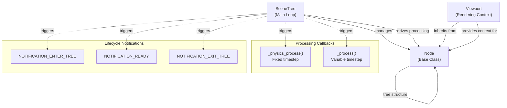

**Sources:** [scene/main/scene_tree.h:1-200](https://github.com/godotengine/godot/blob/4219ce91/scene/main/scene_tree.h#L1-L200), [scene/main/node.h:48-130](https://github.com/godotengine/godot/blob/4219ce91/scene/main/node.h#L48-L130), [scene/main/viewport.h:94-240](https://github.com/godotengine/godot/blob/4219ce91/scene/main/viewport.h#L94-L240)

### SceneTree

`SceneTree` is the main loop implementation that manages the active tree of nodes and drives the game loop. It inherits from `MainLoop` and is responsible for:

- Managing node registration and lifecycle
- Dispatching processing callbacks (`_process`, `_physics_process`)
- Managing node groups for batch operations
- Handling scene transitions
- Coordinating multiplayer systems

**Sources:** [scene/main/scene_tree.h:1-100](https://github.com/godotengine/godot/blob/4219ce91/scene/main/scene_tree.h#L1-L100), [scene/main/scene_tree.cpp:143-160](https://github.com/godotengine/godot/blob/4219ce91/scene/main/scene_tree.cpp#L143-L160)

### Node

`Node` is the base class for all scene objects, providing:

- Tree structure through parent-child relationships
- Lifecycle management (enter tree, ready, exit tree)
- Processing callbacks and priorities
- Group membership
- Owner/ownership tracking
- Multiplayer authority and RPC configuration

**Sources:** [scene/main/node.h:48-291](https://github.com/godotengine/godot/blob/4219ce91/scene/main/node.h#L48-L291), [scene/main/node.cpp:1-443](https://github.com/godotengine/godot/blob/4219ce91/scene/main/node.cpp#L1-L443)

### Viewport

`Viewport` is a specialized node that creates rendering contexts and handles input distribution. It provides:

- Rendering surfaces with associated `World2D`/`World3D`
- Camera management (2D and 3D)
- Input event handling and propagation
- Sub-viewport support for render-to-texture
- Canvas and scenario management

**Sources:** [scene/main/viewport.h:94-450](https://github.com/godotengine/godot/blob/4219ce91/scene/main/viewport.h#L94-L450), [scene/main/viewport.cpp:1-100](https://github.com/godotengine/godot/blob/4219ce91/scene/main/viewport.cpp#L1-L100)

## Scene Graph Hierarchy

The scene system organizes nodes in a strict tree hierarchy where each node has at most one parent and any number of children:

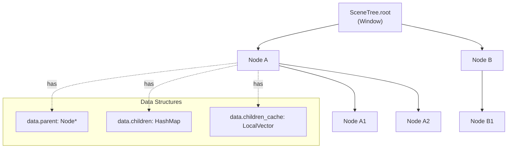

**Key Properties:**

| Property | Type | Description |
|----------|------|-------------|
| `data.parent` | `Node*` | Pointer to parent node |
| `data.children` | `HashMap<StringName, Node*>` | Child nodes indexed by name |
| `data.children_cache` | `LocalVector<Node*>` | Ordered list of children |
| `data.tree` | `SceneTree*` | Reference to containing SceneTree |
| `data.depth` | `int32_t` | Depth in tree hierarchy |
| `data.index` | `int` | Index within parent's children |

**Sources:** [scene/main/node.h:190-210](https://github.com/godotengine/godot/blob/4219ce91/scene/main/node.h#L190-L210), [scene/main/node.cpp:326-374](https://github.com/godotengine/godot/blob/4219ce91/scene/main/node.cpp#L326-L374)

## Node Lifecycle

Nodes transition through several lifecycle stages as they are added to and removed from the scene tree:

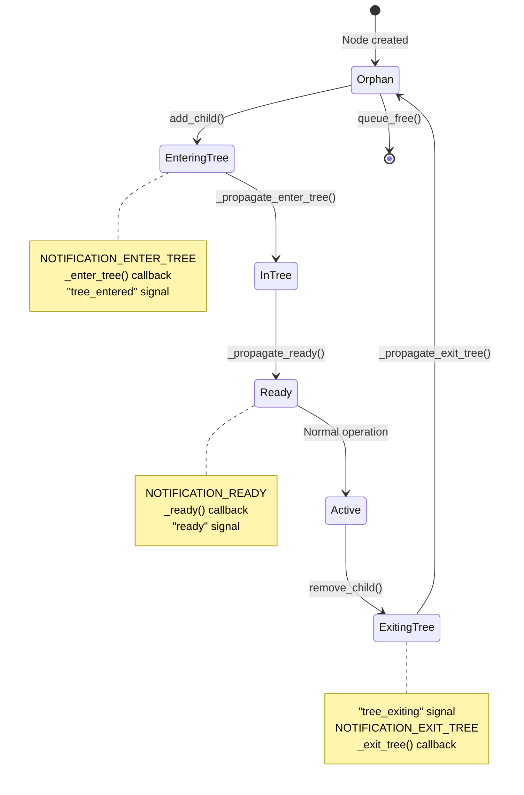

**Lifecycle Phases:**

1. **Enter Tree** - Node is added to SceneTree, receives `NOTIFICATION_ENTER_TREE`, parent processes before children
2. **Ready** - Node and all children are in tree, receives `NOTIFICATION_READY`, children process before parent
3. **Active** - Node processes frame callbacks and responds to events
4. **Exit Tree** - Node is removed from SceneTree, receives `NOTIFICATION_EXIT_TREE`, children process before parent

**Sources:** [scene/main/node.cpp:96-175](https://github.com/godotengine/godot/blob/4219ce91/scene/main/node.cpp#L96-L175), [scene/main/node.cpp:308-324](https://github.com/godotengine/godot/blob/4219ce91/scene/main/node.cpp#L308-L324), [scene/main/node.cpp:326-374](https://github.com/godotengine/godot/blob/4219ce91/scene/main/node.cpp#L326-L374), [scene/main/node.cpp:395-442](https://github.com/godotengine/godot/blob/4219ce91/scene/main/node.cpp#L395-L442)

## Processing Model

The scene system provides two distinct processing modes with different timing characteristics:

### Processing Callbacks

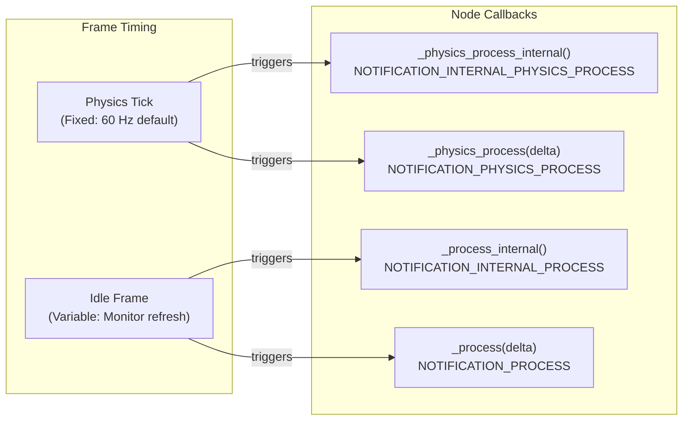

**Processing Characteristics:**

| Callback | Timestep | Delta Source | Use Case |
|----------|----------|--------------|----------|
| `_physics_process()` | Fixed | `Engine.physics_ticks_per_second` | Physics simulation, deterministic logic |
| `_process()` | Variable | Frame time | Rendering updates, UI, non-physics logic |
| Internal variants | Same as public | Same as public | Engine-internal processing |

**Process Priorities:**

- Nodes process in order determined by `process_priority` (lower values first)
- Same priority processes in tree order (pre-order traversal)
- Separate priorities for physics (`physics_process_priority`) and idle (`process_priority`)

**Sources:** [scene/main/node.h:234-236](https://github.com/godotengine/godot/blob/4219ce91/scene/main/node.h#L234-L236), [scene/main/node.cpp:602-653](https://github.com/godotengine/godot/blob/4219ce91/scene/main/node.cpp#L602-L653), [doc/classes/Node.xml:83-107](https://github.com/godotengine/godot/blob/4219ce91/doc/classes/Node.xml#L83-L107)

## Process Modes

Nodes can control their processing behavior relative to the scene tree's paused state:

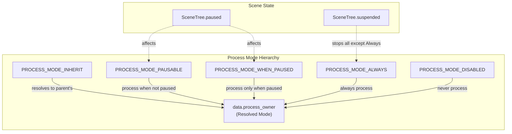

**Process Modes:**

| Mode | Behavior |
|------|----------|
| `PROCESS_MODE_INHERIT` | Uses parent node's effective mode |
| `PROCESS_MODE_PAUSABLE` | Processes only when tree not paused |
| `PROCESS_MODE_WHEN_PAUSED` | Processes only when tree is paused |
| `PROCESS_MODE_ALWAYS` | Always processes regardless of pause state |
| `PROCESS_MODE_DISABLED` | Never processes |

**Sources:** [scene/main/node.h:73-79](https://github.com/godotengine/godot/blob/4219ce91/scene/main/node.h#L73-L79), [scene/main/node.cpp:654-710](https://github.com/godotengine/godot/blob/4219ce91/scene/main/node.cpp#L654-L710), [scene/main/node.cpp:892-924](https://github.com/godotengine/godot/blob/4219ce91/scene/main/node.cpp#L892-L924)

## Viewport System

Viewports create isolated rendering and input contexts within the scene tree:

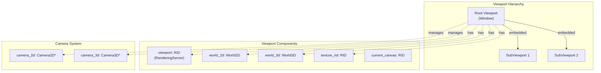

**Key Viewport Features:**

- **Rendering Context**: Each viewport has its own `RID` in `RenderingServer`
- **World References**: Viewports maintain `World2D` (2D physics/rendering) and `World3D` (3D physics/rendering)
- **Camera Management**: Active camera determines view transform
- **Input Distribution**: Processes and distributes input events to child nodes
- **Sub-viewports**: Can be nested for render-to-texture effects

**Sources:** [scene/main/viewport.h:235-333](https://github.com/godotengine/godot/blob/4219ce91/scene/main/viewport.h#L235-L333), [scene/main/viewport.cpp:556-598](https://github.com/godotengine/godot/blob/4219ce91/scene/main/viewport.cpp#L556-L598)

## Window System

`Window` extends `Viewport` to represent native OS windows or embedded sub-windows:

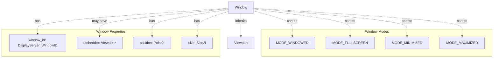

**Window Characteristics:**

- Can represent native OS windows (`window_id != INVALID_WINDOW_ID`)
- Can be embedded in parent viewport (`embedder != nullptr`)
- Manages window decorations, flags, and display properties
- Handles focus and input routing for embedded sub-windows

**Sources:** [scene/main/window.h:43-120](https://github.com/godotengine/godot/blob/4219ce91/scene/main/window.h#L43-L120), [scene/main/window.cpp:294-460](https://github.com/godotengine/godot/blob/4219ce91/scene/main/window.cpp#L294-L460)

## Node Groups

Groups provide a way to organize and batch-operate on nodes without regard to hierarchy:

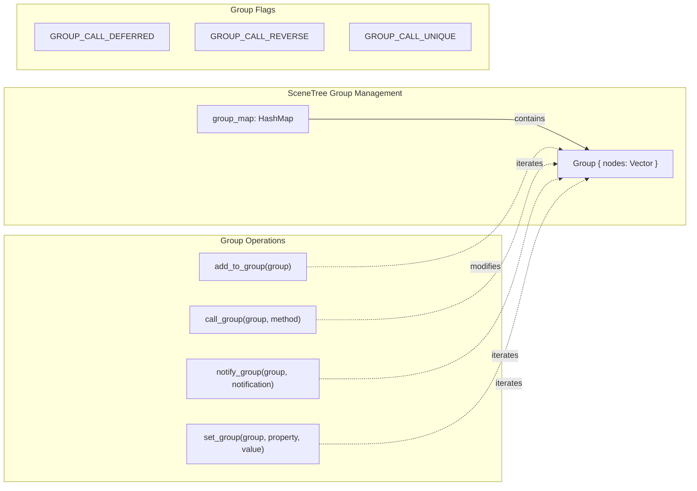

**Group Features:**

- **Dynamic Membership**: Nodes can join/leave groups at runtime
- **Persistent Groups**: Saved with scene data when marked persistent
- **Batch Operations**: Call methods or set properties on all group members
- **Ordering**: Groups maintain insertion order, can be sorted or reversed
- **Deferred Calls**: Support for message queue execution

**Sources:** [scene/main/scene_tree.h:96-115](https://github.com/godotengine/godot/blob/4219ce91/scene/main/scene_tree.h#L96-L115), [scene/main/scene_tree.cpp:166-190](https://github.com/godotengine/godot/blob/4219ce91/scene/main/scene_tree.cpp#L166-L190), [scene/main/scene_tree.cpp:349-440](https://github.com/godotengine/godot/blob/4219ce91/scene/main/scene_tree.cpp#L349-L440)

## Owner System

The owner system tracks which node instantiated or "owns" other nodes in the scene tree:

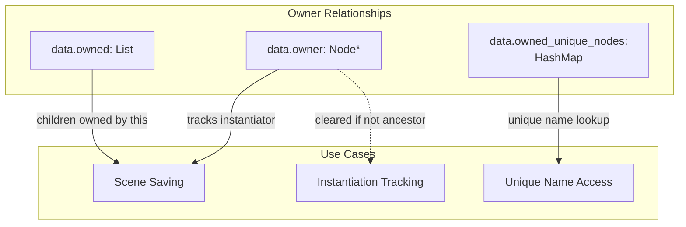

**Owner Properties:**

| Property | Purpose |
|----------|---------|
| `data.owner` | Points to the node that owns this node |
| `data.owned` | List of nodes owned by this node |
| `data.owned_unique_nodes` | Unique-named nodes owned by this node |
| `unique_name_in_owner` | Whether this node has a unique name |

**Sources:** [scene/main/node.h:197-202](https://github.com/godotengine/godot/blob/4219ce91/scene/main/node.h#L197-L202), [scene/main/node.cpp:273-291](https://github.com/godotengine/godot/blob/4219ce91/scene/main/node.cpp#L273-L291), [scene/main/node.cpp:376-393](https://github.com/godotengine/godot/blob/4219ce91/scene/main/node.cpp#L376-L393)

## Physics Interpolation

The scene system supports optional physics interpolation to smooth visual representation between physics ticks:

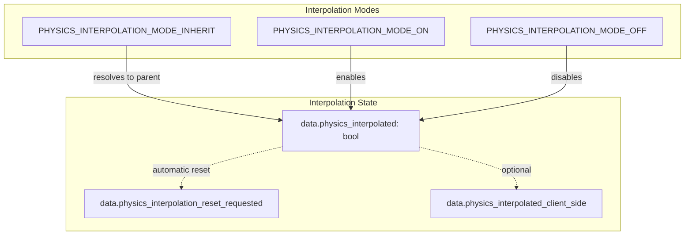

**Interpolation Features:**

- **Per-Node Control**: Each node can enable/disable interpolation independently
- **Inheritance**: Defaults to parent's setting via `INHERIT` mode
- **Automatic Reset**: Requests reset when state changes (e.g., teleportation)
- **Client-Side Option**: Some nodes can interpolate in scene tree instead of RenderingServer
- **Project-Wide Toggle**: `SceneTree._physics_interpolation_enabled` controls global availability

**Sources:** [scene/main/node.h:93-97](https://github.com/godotengine/godot/blob/4219ce91/scene/main/node.h#L93-L97), [scene/main/node.cpp:444-486](https://github.com/godotengine/godot/blob/4219ce91/scene/main/node.cpp#L444-L486), [scene/main/node.cpp:926-968](https://github.com/godotengine/godot/blob/4219ce91/scene/main/node.cpp#L926-L968)

## Thread Groups

Nodes can be organized into thread groups for parallel processing:

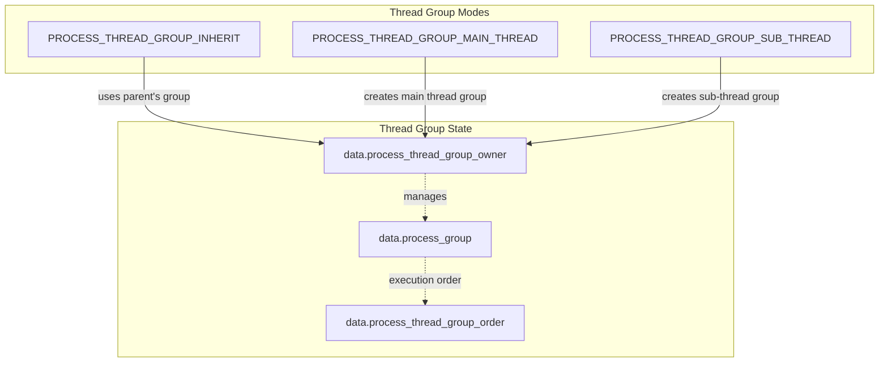

**Thread Group Properties:**

- **Group Ownership**: Node that owns the thread group configuration
- **Execution Context**: Whether to process on main thread or worker thread
- **Message Processing**: Flags for processing thread messages
- **Ordering**: Priority for execution within thread group

**Sources:** [scene/main/node.h:81-91](https://github.com/godotengine/godot/blob/4219ce91/scene/main/node.h#L81-L91), [scene/main/node.h:223-228](https://github.com/godotengine/godot/blob/4219ce91/scene/main/node.h#L223-L228)

## Integration with Server Layer

The scene system interfaces with low-level server singletons for actual rendering and physics:

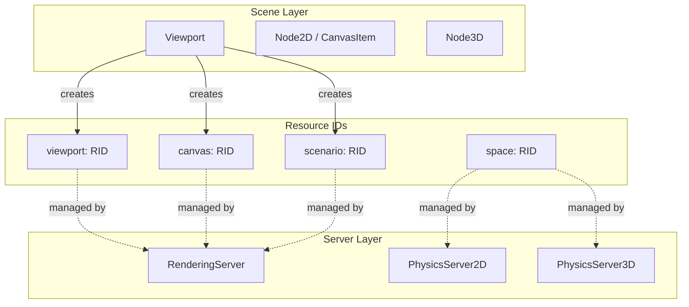

**Server Integration Points:**

- **Viewport**: Creates RIDs for viewport, canvas, and scenario in RenderingServer
- **World2D**: Manages 2D physics space via PhysicsServer2D
- **World3D**: Manages 3D physics space via PhysicsServer3D
- **CanvasItem**: 2D nodes create canvas item RIDs
- **Node3D**: 3D nodes create visual instance RIDs