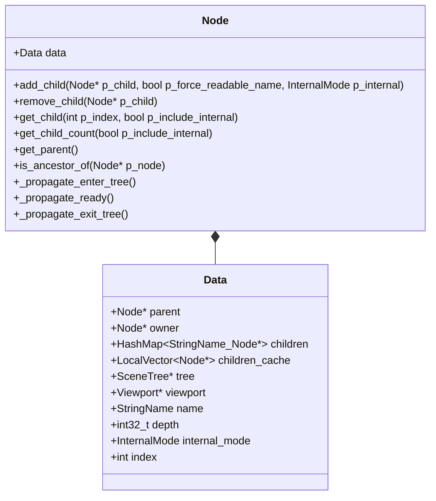
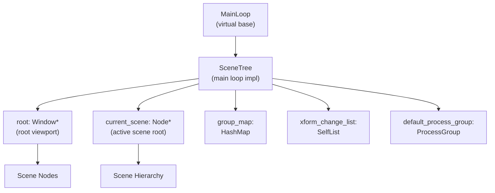
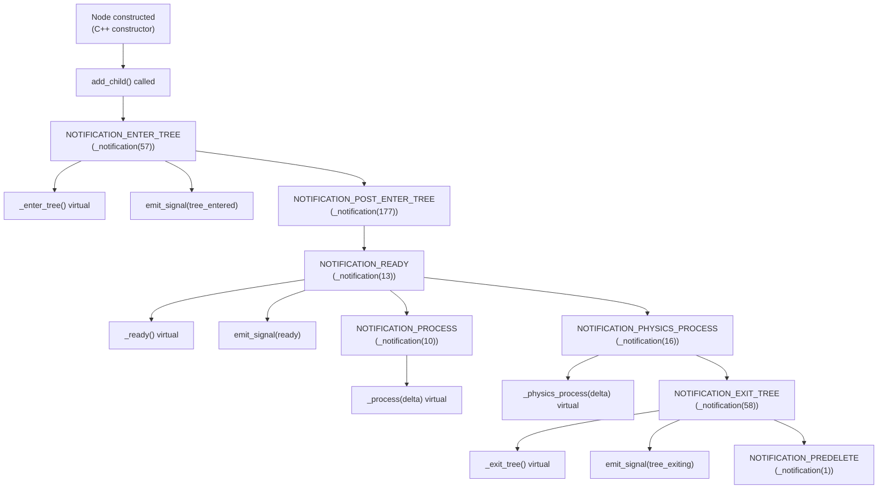
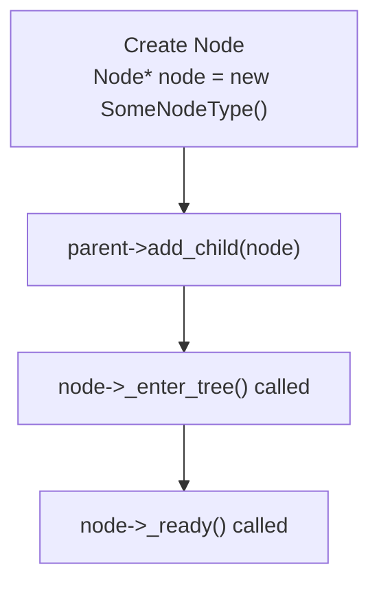
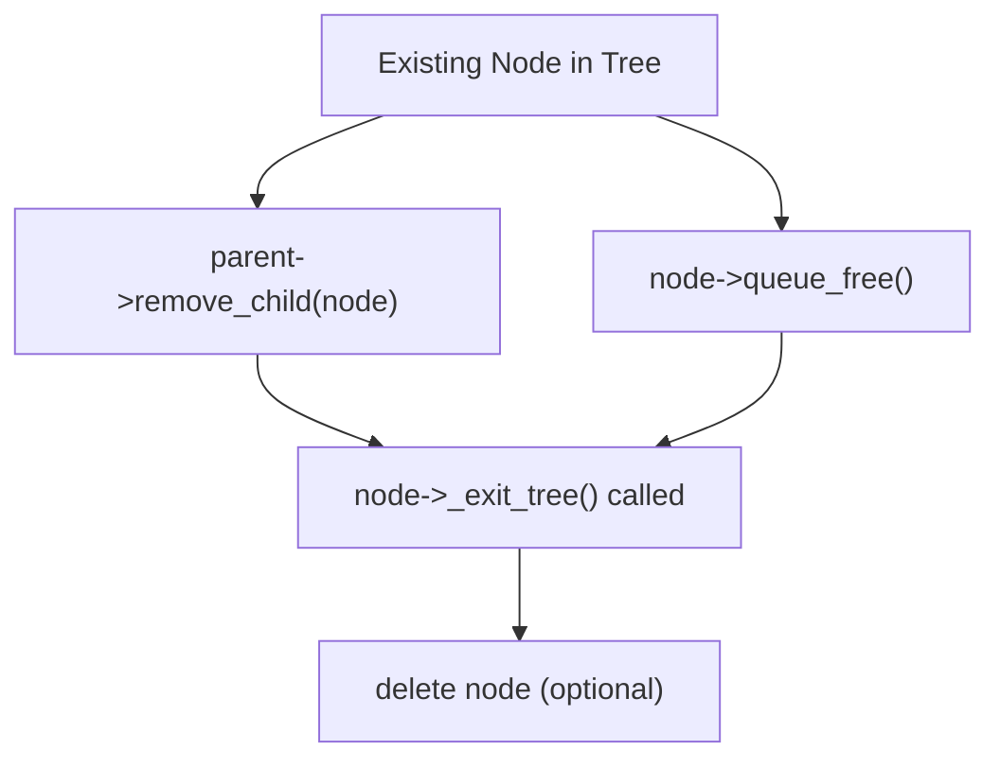
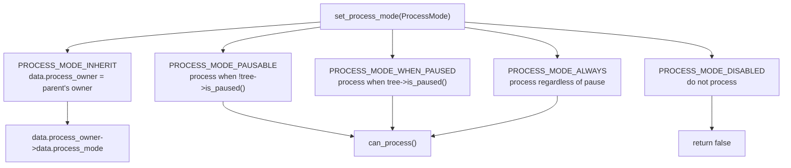
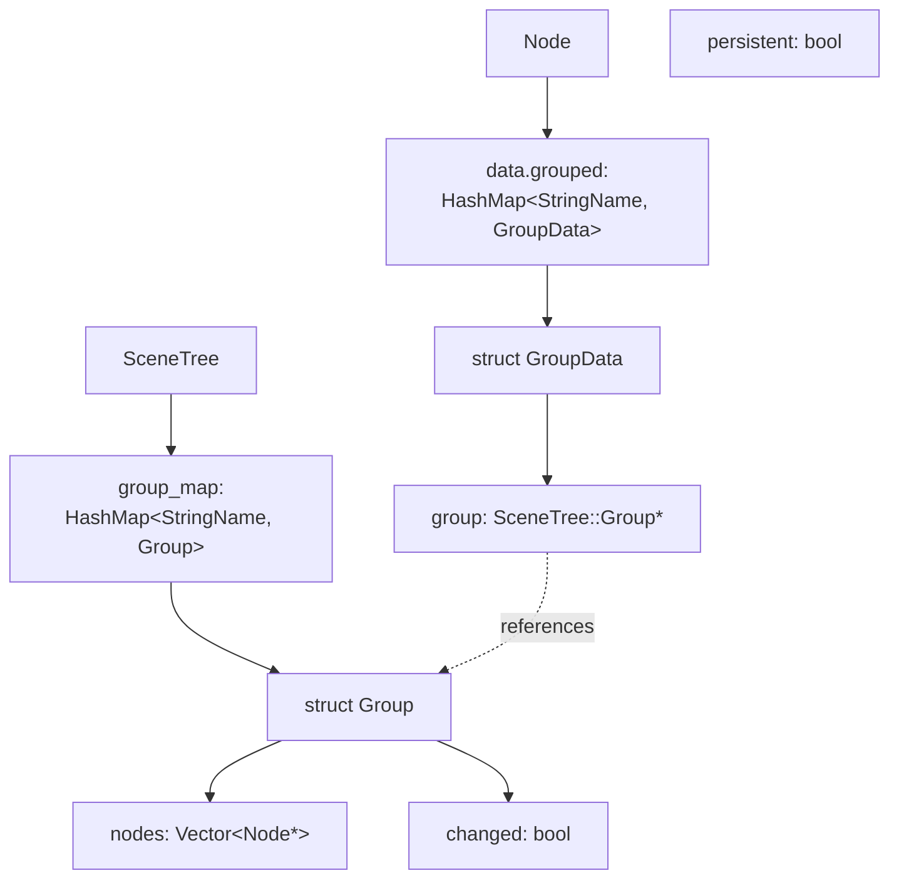
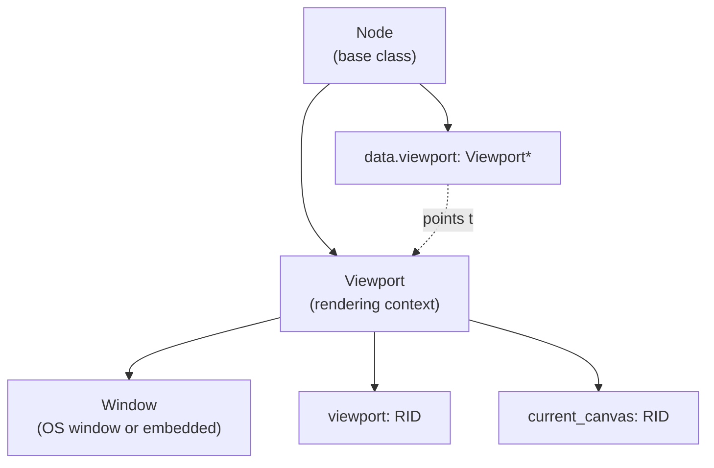
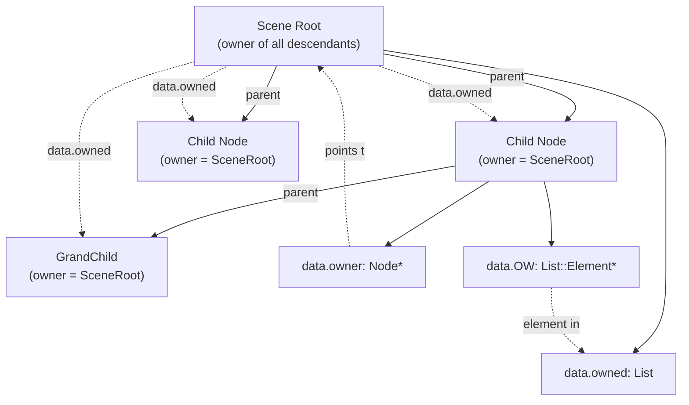
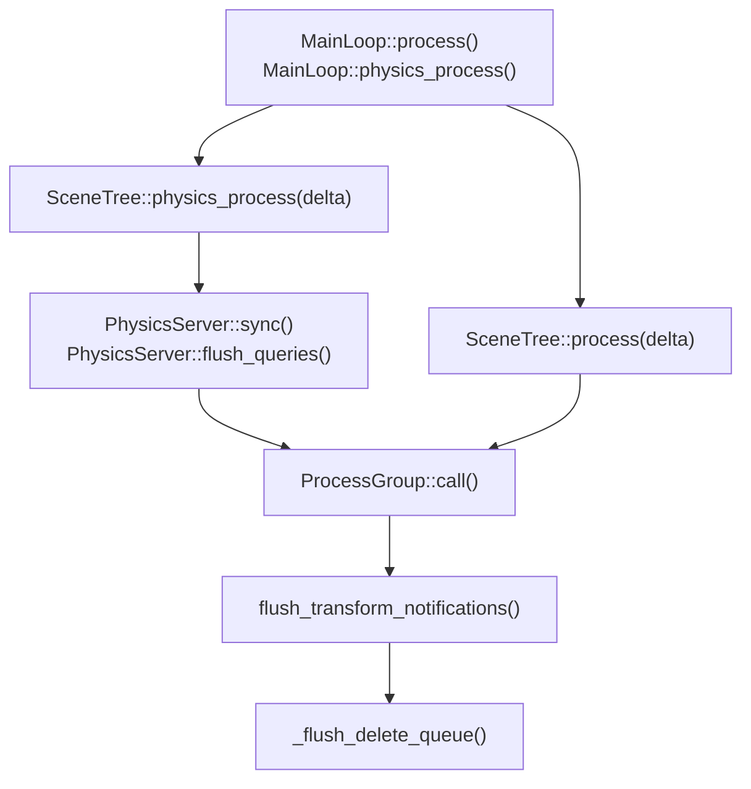

# SceneTree and Node Hierarchy

<details>
<summary>Relevant source files</summary>

The following files were used as context for generating this wiki page:

- [doc/classes/Control.xml](https://github.com/godotengine/godot/blob/4219ce91/doc/classes/Control.xml)
- [doc/classes/Node.xml](https://github.com/godotengine/godot/blob/4219ce91/doc/classes/Node.xml)
- [doc/classes/SceneTree.xml](https://github.com/godotengine/godot/blob/4219ce91/doc/classes/SceneTree.xml)
- [doc/classes/Theme.xml](https://github.com/godotengine/godot/blob/4219ce91/doc/classes/Theme.xml)
- [doc/classes/Viewport.xml](https://github.com/godotengine/godot/blob/4219ce91/doc/classes/Viewport.xml)
- [doc/classes/Window.xml](https://github.com/godotengine/godot/blob/4219ce91/doc/classes/Window.xml)
- [scene/gui/control.cpp](https://github.com/godotengine/godot/blob/4219ce91/scene/gui/control.cpp)
- [scene/gui/control.h](https://github.com/godotengine/godot/blob/4219ce91/scene/gui/control.h)
- [scene/main/node.cpp](https://github.com/godotengine/godot/blob/4219ce91/scene/main/node.cpp)
- [scene/main/node.h](https://github.com/godotengine/godot/blob/4219ce91/scene/main/node.h)
- [scene/main/scene_tree.cpp](https://github.com/godotengine/godot/blob/4219ce91/scene/main/scene_tree.cpp)
- [scene/main/scene_tree.h](https://github.com/godotengine/godot/blob/4219ce91/scene/main/scene_tree.h)
- [scene/main/viewport.cpp](https://github.com/godotengine/godot/blob/4219ce91/scene/main/viewport.cpp)
- [scene/main/viewport.h](https://github.com/godotengine/godot/blob/4219ce91/scene/main/viewport.h)
- [scene/main/window.cpp](https://github.com/godotengine/godot/blob/4219ce91/scene/main/window.cpp)
- [scene/main/window.h](https://github.com/godotengine/godot/blob/4219ce91/scene/main/window.h)
- [scene/resources/theme.cpp](https://github.com/godotengine/godot/blob/4219ce91/scene/resources/theme.cpp)
- [scene/resources/theme.h](https://github.com/godotengine/godot/blob/4219ce91/scene/resources/theme.h)

</details>


This page provides detailed documentation of the `Node` base class, the tree structure it forms, lifecycle notifications, and processing callbacks. The `SceneTree` class manages the active node hierarchy and serves as the main loop implementation.

Related pages:
- For viewport rendering and input handling, see page 2.2
- For GUI controls and layout, see page 3.1

## Node Base Class

The `Node` class ([scene/main/node.h:48]()) is the base class for all scene objects in Godot. It provides core functionality for tree management, lifecycle notifications, processing callbacks, and inter-node communication.

### Core Responsibilities

| Capability | Implementation |
|------------|----------------|
| **Hierarchy Management** | Maintains parent-child relationships via `data.parent` and `data.children` HashMap |
| **Tree Lifecycle** | Propagates `NOTIFICATION_ENTER_TREE`, `NOTIFICATION_READY`, `NOTIFICATION_EXIT_TREE` |
| **Processing Callbacks** | Routes `NOTIFICATION_PROCESS` and `NOTIFICATION_PHYSICS_PROCESS` to virtual methods |
| **Group System** | Stores group membership in `data.grouped` for batch operations via `SceneTree` |
| **Signals** | Inherits from `Object`, emits `tree_entered`, `tree_exited`, `ready`, etc. |

The `Node::Data` struct ([scene/main/node.h:191-291]()) contains all node state:

```cpp
struct Data {
    Node *parent = nullptr;
    Node *owner = nullptr;
    HashMap<StringName, Node *> children;
    SceneTree *tree = nullptr;
    Viewport *viewport = nullptr;
    StringName name;
    int32_t depth = -1;
    
    ProcessMode process_mode : 3;
    bool physics_process : 1;
    bool process : 1;
    // ... additional flags and properties
};
```

Sources:
- [scene/main/node.h:48-291](https://github.com/godotengine/godot/blob/4219ce91/scene/main/node.h#L48-L291)
- [doc/classes/Node.xml:1-29](https://github.com/godotengine/godot/blob/4219ce91/doc/classes/Node.xml#L1-L29)

## Node Hierarchy Structure

Nodes form a hierarchical tree with parent-child relationships. The tree structure is implemented through bidirectional links and a HashMap for efficient child lookup.

Tree Relationship Implementation:


### Child Storage and Lookup

Children are stored in `data.children` as a `HashMap<StringName, Node*>` ([scene/main/node.h:198]()), providing O(1) lookup by name. A cached array `data.children_cache` ([scene/main/node.h:200]()) is maintained for index-based access, rebuilt when `children_cache_dirty` is true.

The `add_child()` method ([scene/main/node.cpp:542-645]()) handles:
- Name uniqueness validation via `_validate_child_name()`
- Insertion into `data.children` HashMap
- Setting child's `data.parent` pointer
- Triggering `_propagate_enter_tree()` if already in tree

Internal children (INTERNAL_MODE_FRONT/BACK) are stored in the same structure but tracked separately for index calculations.

Sources:
- [scene/main/node.h:191-263](https://github.com/godotengine/godot/blob/4219ce91/scene/main/node.h#L191-L263)
- [scene/main/node.cpp:488-567](https://github.com/godotengine/godot/blob/4219ce91/scene/main/node.cpp#L488-L567)
- [doc/classes/Node.xml:7-17](https://github.com/godotengine/godot/blob/4219ce91/doc/classes/Node.xml#L7-L17)

## SceneTree Class

The `SceneTree` class ([scene/main/scene_tree.h:55]()) inherits from `MainLoop` and manages the active node hierarchy. It serves as the main loop implementation, processing input, updating nodes, and coordinating the game loop.

SceneTree Architecture:


### Core Responsibilities

| Responsibility | Implementation |
|----------------|----------------|
| **Main Loop** | Implements `process()` and `physics_process()` from `MainLoop` |
| **Input Routing** | Dispatches input events through viewport hierarchy |
| **Node Groups** | Manages `group_map` for batch node operations |
| **Transform Updates** | Processes `xform_change_list` via `flush_transform_notifications()` |
| **Scene Management** | Tracks `current_scene` and provides `change_scene_to_file()` |
| **Pause/Suspend** | Controls processing via `paused` and `suspended` flags |

The `group_map` ([scene/main/scene_tree.h:169]()) enables efficient group operations:

```cpp
struct Group {
    Vector<Node *> nodes;
    bool changed = false;
};
HashMap<StringName, Group> group_map;
```

Nodes access the SceneTree through `data.tree` pointer, set during `_propagate_enter_tree()`.

Sources:
- [scene/main/scene_tree.h:55-264](https://github.com/godotengine/godot/blob/4219ce91/scene/main/scene_tree.h#L55-L264)
- [scene/main/scene_tree.cpp:143-164](https://github.com/godotengine/godot/blob/4219ce91/scene/main/scene_tree.cpp#L143-L164)
- [doc/classes/SceneTree.xml:1-20](https://github.com/godotengine/godot/blob/4219ce91/doc/classes/SceneTree.xml#L1-L20)

## Lifecycle Notifications

Nodes receive notifications throughout their lifecycle via the `_notification()` method ([scene/main/node.cpp:57-306]()). The notification system is implemented through the `Object` base class and routed to virtual methods.

Lifecycle Notification Flow:


### Propagation Order

Lifecycle notifications propagate through the tree in specific orders:

| Propagation Method | Order | Implementation |
|--------------------|-------|----------------|
| `_propagate_enter_tree()` | Parent → Children | [scene/main/node.cpp:326-374]() |
| `_propagate_ready()` | Children → Parent | [scene/main/node.cpp:308-324]() |
| `_propagate_exit_tree()` | Children → Parent | [scene/main/node.cpp:395-442]() |

The `_propagate_enter_tree()` method sets up tree state:

```cpp
void Node::_propagate_enter_tree() {
    if (data.parent) {
        data.tree = data.parent->data.tree;
        data.depth = data.parent->data.depth + 1;
    }
    
    data.viewport = Object::cast_to<Viewport>(this);
    if (!data.viewport && data.parent) {
        data.viewport = data.parent->data.viewport;
    }
    
    // Propagate to groups
    for (KeyValue<StringName, GroupData> &E : data.grouped) {
        E.value.group = data.tree->add_to_group(E.key, this);
    }
    
    notification(NOTIFICATION_ENTER_TREE);
    
    // Recurse to children
    for (KeyValue<StringName, Node *> &K : data.children) {
        if (!K.value->is_inside_tree()) {
            K.value->_propagate_enter_tree();
        }
    }
}
```

Sources:
- [scene/main/node.cpp:57-306](https://github.com/godotengine/godot/blob/4219ce91/scene/main/node.cpp#L57-L306)
- [scene/main/node.cpp:308-324](https://github.com/godotengine/godot/blob/4219ce91/scene/main/node.cpp#L308-L324)
- [scene/main/node.cpp:326-374](https://github.com/godotengine/godot/blob/4219ce91/scene/main/node.cpp#L326-L374)
- [scene/main/node.cpp:395-442](https://github.com/godotengine/godot/blob/4219ce91/scene/main/node.cpp#L395-L442)
- [doc/classes/Node.xml:25-117](https://github.com/godotengine/godot/blob/4219ce91/doc/classes/Node.xml#L25-L117)

## Adding and Removing Nodes

Nodes can be added to and removed from the tree dynamically:

### Adding Nodes

Node Addition Process:


The `add_child()` method is used to add a node as a child of another node:
```cpp
Node::add_child(Node* p_node, bool p_force_readable_name = false, Node::InternalMode p_internal = INTERNAL_MODE_DISABLED)
```

When a node is added to the tree:
1. It's added to the parent's `children` HashMap
2. The `_propagate_enter_tree()` method is called, which sets up the node's tree and viewport references
3. The node receives the `NOTIFICATION_ENTER_TREE` notification
4. After all nodes are added, they receive the `NOTIFICATION_READY` notification

### Removing Nodes

Node Removal Process:


Nodes can be removed in two ways:
1. `remove_child()`: Removes the node from its parent but does not free memory
2. `queue_free()`: Safely defers the deletion of the node at the end of the current frame

When a node is removed:
1. It's removed from the parent's `children` HashMap
2. The `_propagate_exit_tree()` method is called
3. The node receives the `NOTIFICATION_EXIT_TREE` notification
4. If using `queue_free()`, the node is added to a queue and deleted at the end of the frame

Sources:
- [scene/main/node.cpp:542-645](https://github.com/godotengine/godot/blob/4219ce91/scene/main/node.cpp#L542-L645)
- [doc/classes/Node.xml:157-249](https://github.com/godotengine/godot/blob/4219ce91/doc/classes/Node.xml#L157-L249)

## Processing Callbacks

Nodes can opt into frame-based and physics-based processing callbacks. The processing system is controlled through flags in `Node::Data` and managed by process groups.

### Process Modes

The `ProcessMode` enum ([scene/main/node.h:73-79]()) controls when a node processes relative to pause state:

Process Mode Behavior:


The `_can_process()` method ([scene/main/node.cpp:897-924]()) evaluates:

```cpp
bool Node::_can_process(bool p_paused) const {
    ProcessMode process_mode = data.process_mode == PROCESS_MODE_INHERIT 
        ? data.process_owner->data.process_mode 
        : data.process_mode;
    
    if (process_mode == PROCESS_MODE_DISABLED) return false;
    if (process_mode == PROCESS_MODE_ALWAYS) return true;
    
    return p_paused ? (process_mode == PROCESS_MODE_WHEN_PAUSED)
                    : (process_mode == PROCESS_MODE_PAUSABLE);
}
```

### Processing Flags and Callbacks

Processing is controlled through bitfield flags in `Node::Data` ([scene/main/node.h:242-251]()):

| Flag | Callback | Notification | Set Method |
|------|----------|--------------|------------|
| `physics_process` | `_physics_process(delta)` | `NOTIFICATION_PHYSICS_PROCESS` | `set_physics_process()` |
| `process` | `_process(delta)` | `NOTIFICATION_PROCESS` | `set_process()` |
| `physics_process_internal` | Internal callback | `NOTIFICATION_INTERNAL_PHYSICS_PROCESS` | `set_physics_process_internal()` |
| `process_internal` | Internal callback | `NOTIFICATION_INTERNAL_PROCESS` | `set_process_internal()` |
| `input` | `_input(event)` | Added to group `"_vp_input" + viewport_id` | `set_process_input()` |
| `unhandled_input` | `_unhandled_input(event)` | Added to group `"_vp_unhandled_input" + viewport_id` | `set_process_unhandled_input()` |

### Thread Groups

Processing can be distributed across threads using `ProcessThreadGroup` ([scene/main/node.h:81-85]()):

- `PROCESS_THREAD_GROUP_INHERIT`: Use parent's thread group
- `PROCESS_THREAD_GROUP_MAIN_THREAD`: Process on main thread
- `PROCESS_THREAD_GROUP_SUB_THREAD`: Process on worker thread

The `data.process_group` pointer ([scene/main/node.h:228]()) references the active `ProcessGroup` structure managing the node's processing.

Sources:
- [scene/main/node.h:73-85, 228, 242-251](https://github.com/godotengine/godot/blob/4219ce91/scene/main/node.h#L73-L85, 228, 242-251)
- [scene/main/node.cpp:602-652, 654-710, 897-924](https://github.com/godotengine/godot/blob/4219ce91/scene/main/node.cpp#L602-L652, 654-710, 897-924)
- [doc/classes/Node.xml:83-108](https://github.com/godotengine/godot/blob/4219ce91/doc/classes/Node.xml#L83-L108)

## Group System

The group system enables batch operations on collections of nodes without tree traversal. Groups are stored in `SceneTree::group_map` ([scene/main/scene_tree.h:169]()) and referenced by nodes in `Node::data.grouped` ([scene/main/node.h:219]()).

Group System Implementation:


### Group Operations

SceneTree provides three batch operation methods:

| Method | Signature | Purpose |
|--------|-----------|---------|
| `call_group_flagsp()` | `(flags, group, method, args)` | Call method on all nodes in group |
| `notify_group_flags()` | `(flags, group, notification)` | Send notification to all nodes |
| `set_group_flags()` | `(flags, group, property, value)` | Set property on all nodes |

Implementation in [scene/main/scene_tree.cpp:349-440]():

```cpp
void SceneTree::call_group_flagsp(uint32_t p_call_flags, 
                                   const StringName &p_group, 
                                   const StringName &p_function,
                                   const Variant **p_args, int p_argcount) {
    HashMap<StringName, Group>::Iterator E = group_map.find(p_group);
    if (!E) return;
    
    _update_group_order(E->value);  // Sort by tree order
    Vector<Node *> nodes_copy = E->value.nodes;
    
    for (Node *node : nodes_copy) {
        if (p_call_flags & GROUP_CALL_DEFERRED) {
            MessageQueue::get_singleton()->push_callp(node, p_function, p_args, p_argcount);
        } else {
            node->callp(p_function, p_args, p_argcount, ce);
        }
    }
}
```

### Group Call Flags

| Flag | Value | Behavior |
|------|-------|----------|
| `GROUP_CALL_DEFAULT` | `0` | Immediate, forward order |
| `GROUP_CALL_REVERSE` | `1` | Reverse tree order |
| `GROUP_CALL_DEFERRED` | `2` | Queue to MessageQueue |
| `GROUP_CALL_UNIQUE` | `4` | Single deferred call per frame |

Sources:
- [scene/main/scene_tree.h:169](https://github.com/godotengine/godot/blob/4219ce91/scene/main/scene_tree.h#L169)
- [scene/main/scene_tree.cpp:166-190, 332-440](https://github.com/godotengine/godot/blob/4219ce91/scene/main/scene_tree.cpp#L166-L190, 332-440)
- [scene/main/node.h:165-168, 219](https://github.com/godotengine/godot/blob/4219ce91/scene/main/node.h#L165-L168, 219)
- [doc/classes/SceneTree.xml:16-40](https://github.com/godotengine/godot/blob/4219ce91/doc/classes/SceneTree.xml#L16-L40)

## Viewport Integration

Each node in the tree maintains a pointer to its containing `Viewport` via `data.viewport` ([scene/main/node.h:215]()). This pointer is set during `_propagate_enter_tree()` and used for input routing and rendering context.

Viewport Hierarchy:


During `_propagate_enter_tree()` ([scene/main/node.cpp:336-339]()):

```cpp
data.viewport = Object::cast_to<Viewport>(this);
if (!data.viewport && data.parent) {
    data.viewport = data.parent->data.viewport;
}
```

This allows nodes to access viewport functionality:
- Input event handling through `data.viewport->push_input()`
- Canvas rendering via `data.viewport->current_canvas`
- Window management for embedded windows

The viewport pointer enables the input system to route events from the top-level window down through the node tree (see page 2.3 for input processing details).

Sources:
- [scene/main/node.h:215](https://github.com/godotengine/godot/blob/4219ce91/scene/main/node.h#L215)
- [scene/main/node.cpp:336-339](https://github.com/godotengine/godot/blob/4219ce91/scene/main/node.cpp#L336-L339)
- [scene/main/viewport.h:94-247](https://github.com/godotengine/godot/blob/4219ce91/scene/main/viewport.h#L94-L247)


## Node Ownership and Memory Management

Node ownership determines scene structure boundaries and cleanup behavior. The owner system works alongside parent-child relationships.

Ownership vs Parenting:


### Owner System

The owner ([scene/main/node.h:197]()) is typically the root of a scene and owns all nodes instantiated as part of that scene:

```cpp
struct Data {
    Node *owner = nullptr;           // Scene root that owns this node
    List<Node *>::Element *OW = nullptr;  // Element in owner's owned list
    List<Node *> owned;              // Nodes owned by this node
};
```

Set via `set_owner()` ([scene/main/node.cpp:2254-2281]()):
- Adds node to new owner's `data.owned` list
- Removes from previous owner's list
- Updates `data.OW` element pointer

### Memory Cleanup

Deletion propagates through children automatically in `~Node()`:

```cpp
// NOTIFICATION_PREDELETE in _notification()
while (data.children.size()) {
    Node *child = data.children.last()->value;
    memdelete(child);  // Triggers child's destructor recursively
}
```

The `queue_free()` method ([scene/main/node.cpp:243-248]()) defers deletion:
- Adds node to `SceneTree::delete_queue`
- Node is deleted at end of current frame
- Safer than direct deletion during processing

Sources:
- [scene/main/node.h:197, 220-221](https://github.com/godotengine/godot/blob/4219ce91/scene/main/node.h#L197, 220-L221)
- [scene/main/node.cpp:243-248, 273-298, 2254-2281](https://github.com/godotengine/godot/blob/4219ce91/scene/main/node.cpp#L243-L248, 273-298, 2254-2281)

## Processing Order and Priorities

Node processing callbacks are invoked by `SceneTree` during the main loop. Processing order is determined by process priority values and tree hierarchy.

### SceneTree Main Loop

SceneTree Main Loop Implementation:


Implementation in [scene/main/scene_tree.cpp:710-891]():

```cpp
bool SceneTree::process(double p_time) {
    process_time = p_time;
    
    // Process all nodes with process flag
    _process(p_time);
    
    flush_transform_notifications();
    _flush_delete_queue();
    
    return _quit;
}

bool SceneTree::physics_process(double p_time) {
    physics_process_time = p_time;
    
    // Step physics servers
    PhysicsServer2D::get_singleton()->sync();
    PhysicsServer3D::get_singleton()->sync();
    
    // Process all nodes with physics_process flag
    _physics_process(p_time);
    
    PhysicsServer2D::get_singleton()->flush_queries();
    PhysicsServer3D::get_singleton()->flush_queries();
    
    return _quit;
}
```

### Priority-Based Processing

Nodes are processed in order of `process_priority` ([scene/main/node.h:234]()) and `physics_process_priority` ([scene/main/node.h:235]()):

| Property | Default | Behavior |
|----------|---------|----------|
| `process_priority` | `0` | Lower values process first during `_process()` |
| `physics_process_priority` | `0` | Lower values process first during `_physics_process()` |

Nodes with equal priority are processed in tree order (pre-order traversal). The comparator in [scene/main/node.h:182-184]():

```cpp
struct ComparatorWithPriority {
    bool operator()(const Node *p_a, const Node *p_b) const { 
        return p_b->data.process_priority == p_a->data.process_priority 
            ? p_b->is_greater_than(p_a) 
            : p_b->data.process_priority > p_a->data.process_priority; 
    }
};
```

Tree order is determined by `is_greater_than()` which compares node depth and index position in parent's children list.

Sources:
- [scene/main/scene_tree.cpp:710-891](https://github.com/godotengine/godot/blob/4219ce91/scene/main/scene_tree.cpp#L710-L891)
- [scene/main/node.h:182-188, 234-235](https://github.com/godotengine/godot/blob/4219ce91/scene/main/node.h#L182-L188, 234-235)
- [scene/main/node.cpp:991-1005](https://github.com/godotengine/godot/blob/4219ce91/scene/main/node.cpp#L991-L1005)

## Conclusion

The node and tree structure is central to Godot's architecture. This hierarchical approach provides a clean, intuitive way to organize game elements while offering powerful capabilities for scene management, processing, and communication between components.