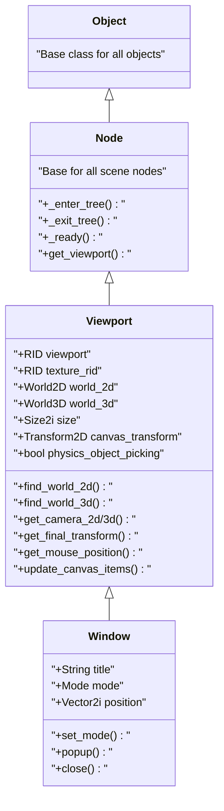
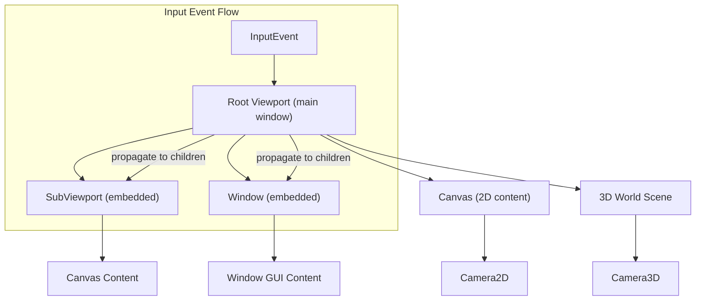
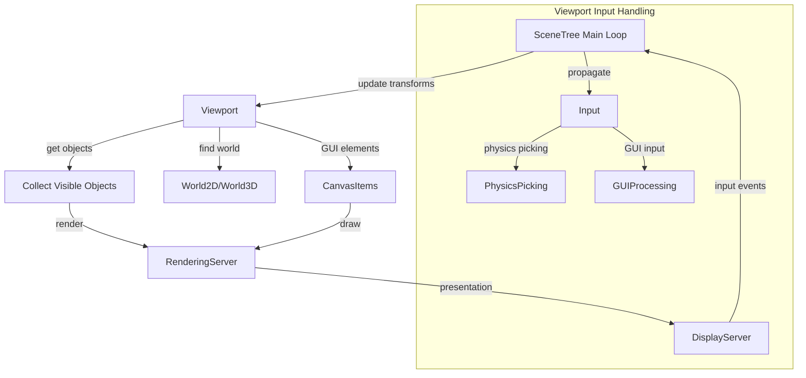
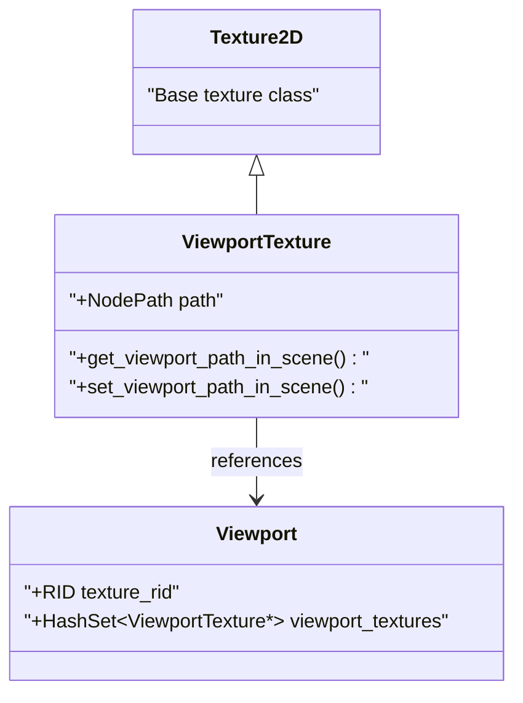
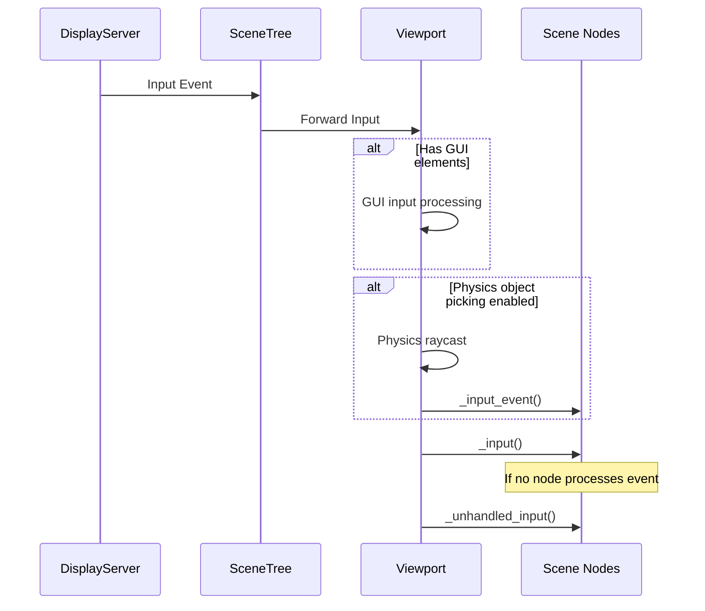
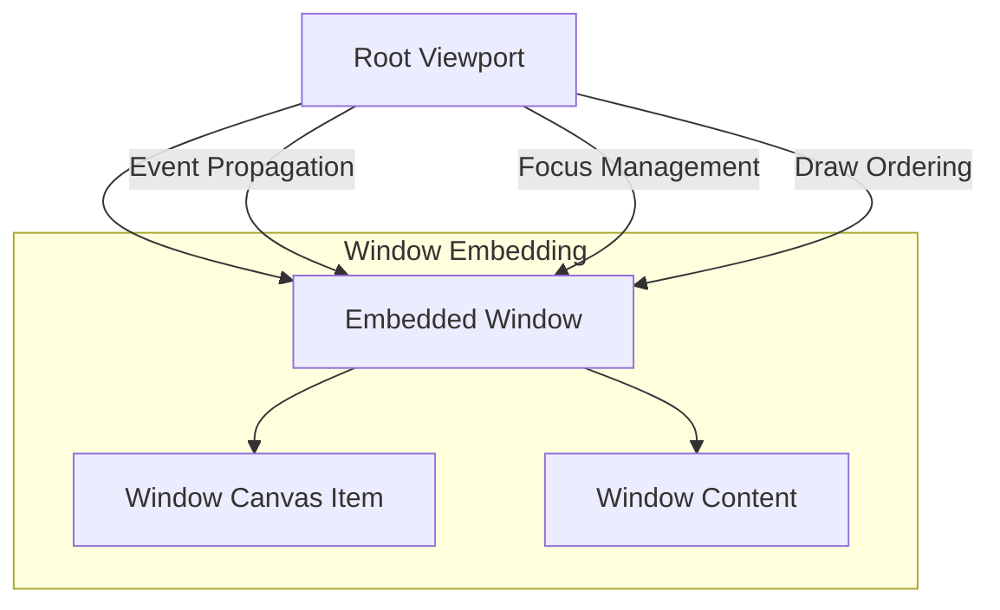
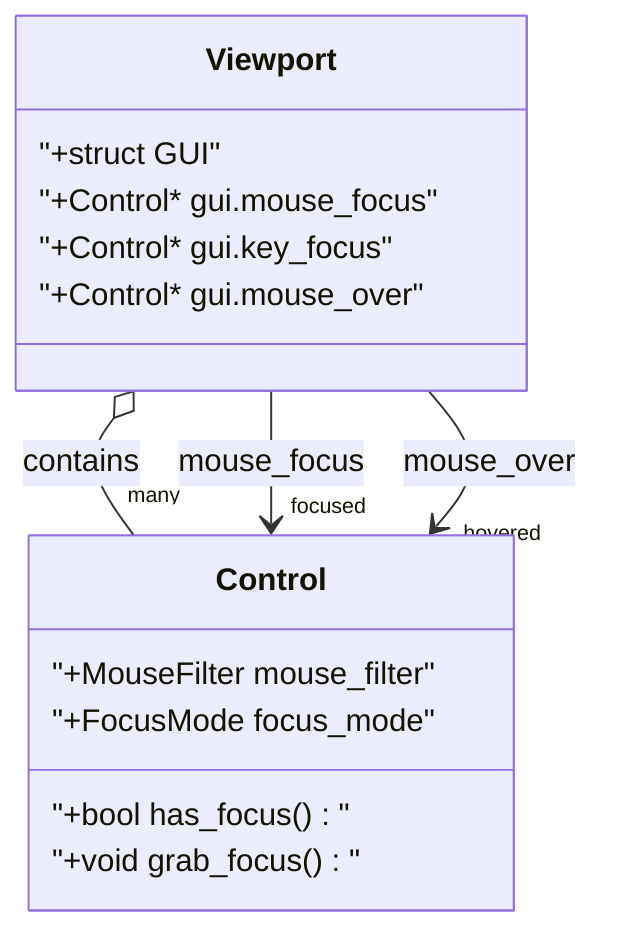

# Viewport System

Relevant source files

The following files were used as context for generating this wiki page:

- [doc/classes/Control.xml](https://github.com/godotengine/godot/blob/4219ce91/doc/classes/Control.xml)
- [doc/classes/Node.xml](https://github.com/godotengine/godot/blob/4219ce91/doc/classes/Node.xml)
- [doc/classes/SceneTree.xml](https://github.com/godotengine/godot/blob/4219ce91/doc/classes/SceneTree.xml)
- [doc/classes/Theme.xml](https://github.com/godotengine/godot/blob/4219ce91/doc/classes/Theme.xml)
- [doc/classes/Viewport.xml](https://github.com/godotengine/godot/blob/4219ce91/doc/classes/Viewport.xml)
- [doc/classes/Window.xml](https://github.com/godotengine/godot/blob/4219ce91/doc/classes/Window.xml)
- [scene/gui/control.cpp](https://github.com/godotengine/godot/blob/4219ce91/scene/gui/control.cpp)
- [scene/gui/control.h](https://github.com/godotengine/godot/blob/4219ce91/scene/gui/control.h)
- [scene/main/node.cpp](https://github.com/godotengine/godot/blob/4219ce91/scene/main/node.cpp)
- [scene/main/node.h](https://github.com/godotengine/godot/blob/4219ce91/scene/main/node.h)
- [scene/main/scene_tree.cpp](https://github.com/godotengine/godot/blob/4219ce91/scene/main/scene_tree.cpp)
- [scene/main/scene_tree.h](https://github.com/godotengine/godot/blob/4219ce91/scene/main/scene_tree.h)
- [scene/main/viewport.cpp](https://github.com/godotengine/godot/blob/4219ce91/scene/main/viewport.cpp)
- [scene/main/viewport.h](https://github.com/godotengine/godot/blob/4219ce91/scene/main/viewport.h)
- [scene/main/window.cpp](https://github.com/godotengine/godot/blob/4219ce91/scene/main/window.cpp)
- [scene/main/window.h](https://github.com/godotengine/godot/blob/4219ce91/scene/main/window.h)
- [scene/resources/theme.cpp](https://github.com/godotengine/godot/blob/4219ce91/scene/resources/theme.cpp)
- [scene/resources/theme.h](https://github.com/godotengine/godot/blob/4219ce91/scene/resources/theme.h)

The Viewport system in Godot is a core component that creates views into the game world. It encapsulates both drawing and interaction with the game's content. Viewports serve as the foundation for rendering 2D and 3D content, handling input events, and organizing the visual hierarchy of your game.

For information about the overall scene organization, see [Node and Scene System](#2.1). For details about the rendering pipeline, see [Rendering System](#3).

## Overview

Viewports in Godot provide a surface where visual content is rendered. Each viewport has its own coordinate system and can display both 2D and 3D content. Viewports can be nested within each other, displayed as textures, or used to create various visual effects.

Key capabilities of the Viewport system include:

- Rendering 2D and 3D content
- Input event handling and propagation
- Creating multiple camera views
- Rendering to textures for effects like portals, mini-maps, and security cameras
- Split-screen functionality
- Embedding UIs within 3D environments
- Multiple window management

Sources: [scene/main/viewport.h:94-226](https://github.com/godotengine/godot/blob/4219ce91/scene/main/viewport.h#L94-L226). [doc/classes/Viewport.xml:1-22](https://github.com/godotengine/godot/blob/4219ce91/doc/classes/Viewport.xml#L1-L22)

## Architecture

The Viewport system is built around several key classes that work together to provide rendering and input functionality.

**Viewport Class Hierarchy**

### Key Components

1. **Viewport Class**: The base class that encapsulates a view into the game world.
2. **ViewportTexture**: Allows a viewport's content to be used as a texture.
3. **Window**: Extends Viewport with window management capabilities.
4. **SceneTree**: Manages the hierarchy of nodes and handles the main game loop.

Sources: [scene/main/viewport.h:94-226](https://github.com/godotengine/godot/blob/4219ce91/scene/main/viewport.h#L94-L226), [scene/main/window.h:43-56](https://github.com/godotengine/godot/blob/4219ce91/scene/main/window.h#L43-L56)

## Viewport Hierarchy

Viewports form a hierarchy in the scene tree. The root viewport (attached to the main window) forms the base of this hierarchy.

### Viewport Relationships

- **Parent-Child Relationship**: When a viewport is a child of another, it inherits properties and coordinates from its parent.
- **World Sharing**: Child viewports can share the same 2D/3D world as their parent or have their own.
- **Input Propagation**: Input events flow from the root viewport down to child viewports.

Sources: [scene/main/viewport.cpp:242-265](https://github.com/godotengine/godot/blob/4219ce91/scene/main/viewport.cpp#L242-L265), [scene/main/viewport.cpp:534-552](https://github.com/godotengine/godot/blob/4219ce91/scene/main/viewport.cpp#L534-L552)

## Rendering Capabilities

### Rendering Flow

Viewports handle various rendering configurations:

| Feature | Description | Related Properties |
|---------|-------------|-------------------|
| Transparency | Background transparency | `transparent_bg` |
| MSAA | Multi-sample anti-aliasing | `msaa_2d`, `msaa_3d` |
| Screen-space AA | Additional anti-aliasing | `screen_space_aa` |
| Scaling | 3D content scaling | `scaling_3d_mode`, `scaling_3d_scale` |
| HDR | High dynamic range | `use_hdr_2d` |
| Debug Visualization | Visual debugging | `debug_draw` |
| Shadows | Shadow rendering | `positional_shadow_atlas_size` |

Sources: [scene/main/viewport.cpp:1013-1064](https://github.com/godotengine/godot/blob/4219ce91/scene/main/viewport.cpp#L1013-L1064), [scene/main/viewport.h:98-226](https://github.com/godotengine/godot/blob/4219ce91/scene/main/viewport.h#L98-L226)

## ViewportTexture

The ViewportTexture class allows using a viewport's contents as a texture:

A ViewportTexture references a specific viewport and provides its rendering output as a texture. This allows for:

- Rendering scenes to textures for use in materials
- Creating portals, mirrors, or security camera displays
- Picture-in-picture effects
- Mini-maps or other UI elements

Sources: [scene/main/viewport.cpp:67-241](https://github.com/godotengine/godot/blob/4219ce91/scene/main/viewport.cpp#L67-L241), [scene/main/viewport.h:54-92](https://github.com/godotengine/godot/blob/4219ce91/scene/main/viewport.h#L54-L92)

## Input Handling

Viewports handle input events and propagate them through the scene tree. Key features include:

1. **Input Event Propagation**: Events flow from the root viewport to child viewports
2. **Physics Object Picking**: Detecting objects under the mouse cursor via raycasts
3. **GUI Input Processing**: Handling UI element interaction

The flow of input is:

Sources: [scene/main/viewport.cpp:713-1010](https://github.com/godotengine/godot/blob/4219ce91/scene/main/viewport.cpp#L713-L1010), [doc/classes/Viewport.xml:83-173](https://github.com/godotengine/godot/blob/4219ce91/doc/classes/Viewport.xml#L83-L173)

## Viewport Transformations

Viewports manage several coordinate systems and transformations:

| Transform | Purpose |
|-----------|---------|
| `canvas_transform` | Transform applied to 2D content |
| `global_canvas_transform` | Additional canvas transform (e.g., for camera shake) |
| `stretch_transform` | Applied when size_2d_override is used |
| `final_transform` | Transform from viewport to screen coordinates |

Coordinate conversions include:
- Local viewport coordinates
- Global screen coordinates
- Canvas (2D world) coordinates

Sources: [scene/main/viewport.cpp:1064-1158](https://github.com/godotengine/godot/blob/4219ce91/scene/main/viewport.cpp#L1064-L1158), [scene/main/viewport.h:253-264](https://github.com/godotengine/godot/blob/4219ce91/scene/main/viewport.h#L253-L264)

## Sub-Windows Management

Viewports can embed windows which are implemented as a special type of viewport:

Key aspects of sub-window management:
- Windows can be embedded inside viewports using the `gui_embed_subwindows` property
- Focus management between windows
- Drag-and-drop operations
- Z-ordering of windows
- Input event redirection

Sources: [scene/main/viewport.cpp:292-508](https://github.com/godotengine/godot/blob/4219ce91/scene/main/viewport.cpp#L292-L508), [scene/main/window.cpp:296-340](https://github.com/godotengine/godot/blob/4219ce91/scene/main/window.cpp#L296-L340)

## Viewport GUI System

Viewports manage GUI elements including:

- Input focus tracking for controls
- Mouse-over state
- Tooltips
- Drag and drop operations
- Modal windows

Sources: [scene/main/viewport.h:369-398](https://github.com/godotengine/godot/blob/4219ce91/scene/main/viewport.h#L369-L398), [scene/gui/control.h:64-97](https://github.com/godotengine/godot/blob/4219ce91/scene/gui/control.h#L64-L97)

## Integration with Other Systems

The Viewport system integrates with several other core systems in the engine:

| System | Integration |
|--------|-------------|
| Node System | Viewport is a Node that can be part of the scene tree |
| Rendering System | Viewports create and manage rendering surfaces |
| Input System | Viewports process and distribute input events |
| Physics System | Viewports enable physics object picking |
| Audio System | Viewports can have audio listeners |
| Window System | Viewports can be associated with windows |

Sources: [scene/main/viewport.cpp:534-635](https://github.com/godotengine/godot/blob/4219ce91/scene/main/viewport.cpp#L534-L635), [scene/main/scene_tree.cpp:572-654](https://github.com/godotengine/godot/blob/4219ce91/scene/main/scene_tree.cpp#L572-L654)

## Common Use Cases

1. **Main Game View**: The root viewport displaying the main game content
2. **Split-Screen Multiplayer**: Multiple viewports showing different perspectives
3. **Mini-maps**: Small viewports showing an overview of the game world
4. **Picture-in-Picture**: Embedding one viewport inside another
5. **Rendering to Texture**: Using a viewport's output as a texture for materials
6. **UI Over 3D**: Embedding UI elements over 3D content
7. **Portal Effects**: Using viewports to create portals or mirrors

Sources: [doc/classes/Viewport.xml:3-22](https://github.com/godotengine/godot/blob/4219ce91/doc/classes/Viewport.xml#L3-L22)

## Performance Considerations

Viewports can be resource-intensive as they involve rendering content that may not be visible. Consider:

- Disabling unused viewports with `visible` property
- Adjusting render quality settings for less important viewports
- Using appropriate size for viewports to avoid unnecessary rendering
- Using `update_mode` property to control when viewports update