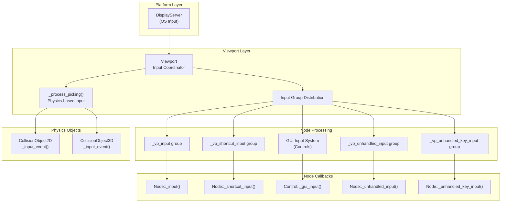
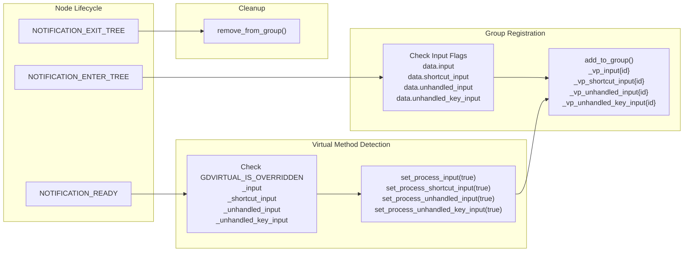
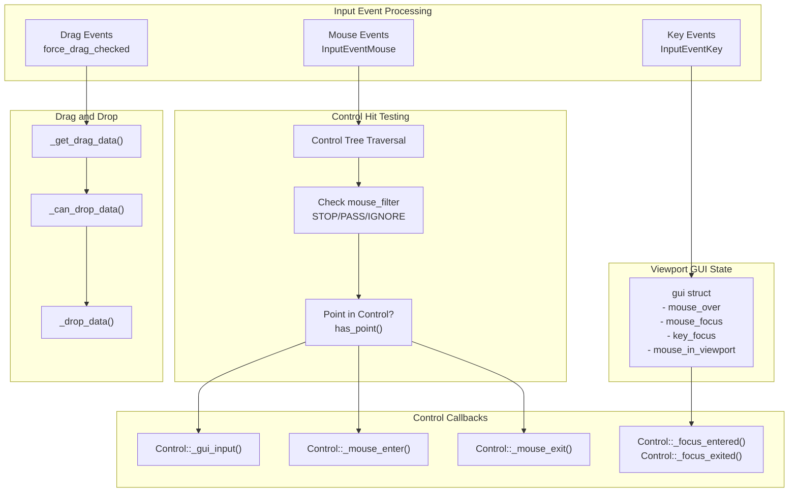
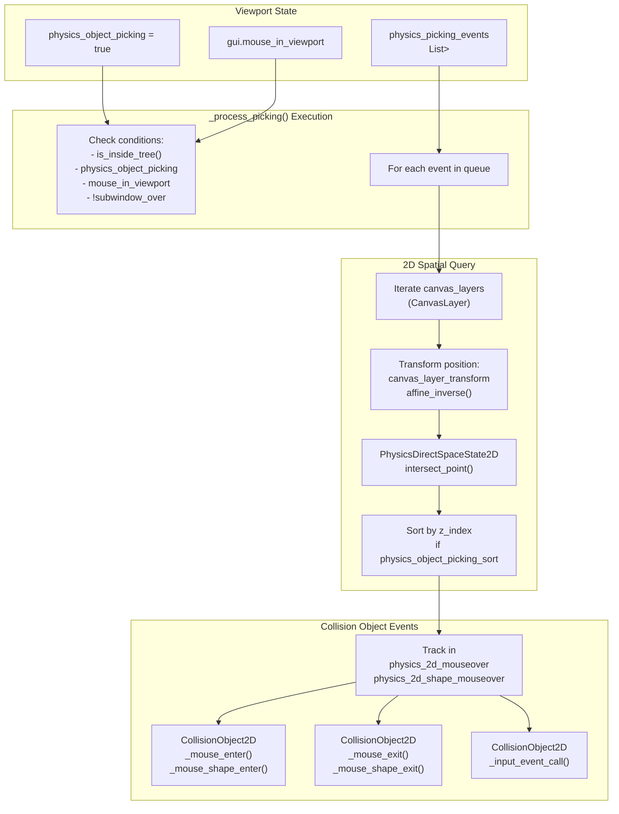
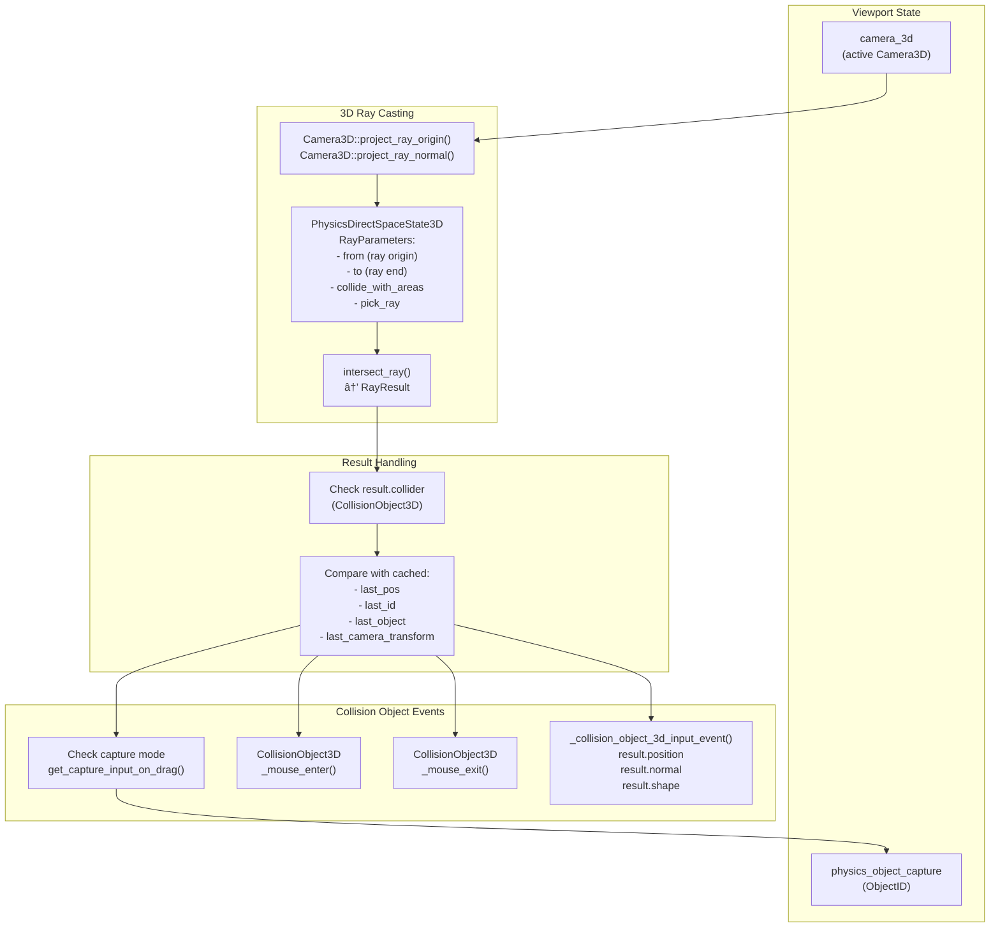
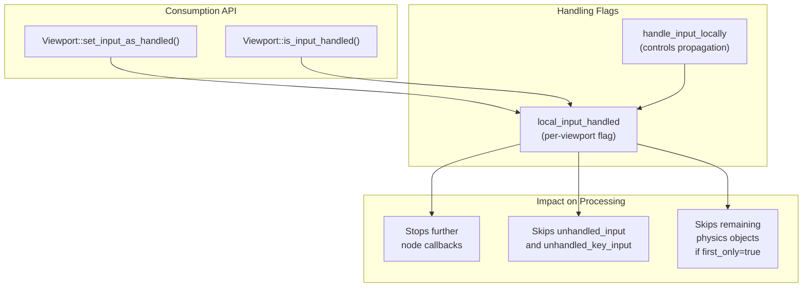

# Input Event Processing

<details>
<summary>Relevant source files</summary>

The following files were used as context for generating this wiki page:

- [doc/classes/Control.xml](https://github.com/godotengine/godot/blob/4219ce91/doc/classes/Control.xml)
- [doc/classes/Node.xml](https://github.com/godotengine/godot/blob/4219ce91/doc/classes/Node.xml)
- [doc/classes/SceneTree.xml](https://github.com/godotengine/godot/blob/4219ce91/doc/classes/SceneTree.xml)
- [doc/classes/Theme.xml](https://github.com/godotengine/godot/blob/4219ce91/doc/classes/Theme.xml)
- [doc/classes/Viewport.xml](https://github.com/godotengine/godot/blob/4219ce91/doc/classes/Viewport.xml)
- [doc/classes/Window.xml](https://github.com/godotengine/godot/blob/4219ce91/doc/classes/Window.xml)
- [scene/gui/control.cpp](https://github.com/godotengine/godot/blob/4219ce91/scene/gui/control.cpp)
- [scene/gui/control.h](https://github.com/godotengine/godot/blob/4219ce91/scene/gui/control.h)
- [scene/main/node.cpp](https://github.com/godotengine/godot/blob/4219ce91/scene/main/node.cpp)
- [scene/main/node.h](https://github.com/godotengine/godot/blob/4219ce91/scene/main/node.h)
- [scene/main/scene_tree.cpp](https://github.com/godotengine/godot/blob/4219ce91/scene/main/scene_tree.cpp)
- [scene/main/scene_tree.h](https://github.com/godotengine/godot/blob/4219ce91/scene/main/scene_tree.h)
- [scene/main/viewport.cpp](https://github.com/godotengine/godot/blob/4219ce91/scene/main/viewport.cpp)
- [scene/main/viewport.h](https://github.com/godotengine/godot/blob/4219ce91/scene/main/viewport.h)
- [scene/main/window.cpp](https://github.com/godotengine/godot/blob/4219ce91/scene/main/window.cpp)
- [scene/main/window.h](https://github.com/godotengine/godot/blob/4219ce91/scene/main/window.h)
- [scene/resources/theme.cpp](https://github.com/godotengine/godot/blob/4219ce91/scene/resources/theme.cpp)
- [scene/resources/theme.h](https://github.com/godotengine/godot/blob/4219ce91/scene/resources/theme.h)

</details>


## Purpose and Scope

This document describes how input events are distributed and processed within the Godot engine's scene system. It covers the pipeline from input event generation to node-level handling, including GUI input for `Control` nodes and physics-based picking for collision objects. 

For information about the underlying scene graph structure, see [SceneTree and Node Hierarchy](#2.1). For GUI-specific controls and widgets, see [GUI System](#3).

---

## Input Event Distribution Pipeline

Input events in Godot flow from the platform layer through viewports to nodes in the scene tree. Each `Viewport` manages its own input distribution, routing events to appropriate nodes based on their input processing configuration.

### Event Flow Architecture



**Sources:** [scene/main/viewport.cpp:732-1028](https://github.com/godotengine/godot/blob/4219ce91/scene/main/viewport.cpp#L732-L1028), [scene/main/node.cpp:160-171](https://github.com/godotengine/godot/blob/4219ce91/scene/main/node.cpp#L160-L171), [scene/main/node.h:248-251](https://github.com/godotengine/godot/blob/4219ce91/scene/main/node.h#L248-L251)

### Input Propagation Order

Input events propagate through the scene in a specific order, allowing higher-priority nodes (like GUI) to consume events before they reach gameplay logic:

| **Priority** | **System** | **Method** | **Typical Use Case** |
|--------------|------------|------------|----------------------|
| 1 | Input | `_input()` | Raw input interception |
| 2 | Shortcut Input | `_shortcut_input()` | Keyboard shortcuts |
| 3 | GUI System | `_gui_input()` | Control-based UI |
| 4 | Unhandled Input | `_unhandled_input()` | Gameplay input |
| 5 | Unhandled Key Input | `_unhandled_key_input()` | Keyboard-specific gameplay |

Events can be consumed at any stage by calling `Viewport.set_input_as_handled()`, preventing further propagation.

**Sources:** [doc/classes/Node.xml:72-145](https://github.com/godotengine/godot/blob/4219ce91/doc/classes/Node.xml#L72-L145), [doc/classes/Control.xml:10-15](https://github.com/godotengine/godot/blob/4219ce91/doc/classes/Control.xml#L10-L15)

---

## Node Input Processing Groups

Nodes subscribe to input events by joining viewport-specific groups. This group-based system allows the `SceneTree` to efficiently distribute events to only those nodes that have requested input processing.

### Group Registration System



**Sources:** [scene/main/node.cpp:160-171](https://github.com/godotengine/godot/blob/4219ce91/scene/main/node.cpp#L160-L171), [scene/main/node.cpp:202-213](https://github.com/godotengine/godot/blob/4219ce91/scene/main/node.cpp#L202-L213), [scene/main/node.cpp:247-261](https://github.com/godotengine/godot/blob/4219ce91/scene/main/node.cpp#L247-L261)

### Group Naming Convention

Each viewport creates unique input groups identified by its instance ID:

- `_vp_input` + viewport instance ID → `Node::_input()` callbacks
- `_vp_shortcut_input` + viewport instance ID → `Node::_shortcut_input()` callbacks  
- `_vp_unhandled_input` + viewport instance ID → `Node::_unhandled_input()` callbacks
- `_vp_unhandled_key_input` + viewport instance ID → `Node::_unhandled_key_input()` callbacks

This ensures nodes only receive input from their own viewport hierarchy.

**Sources:** [scene/main/node.cpp:161-171](https://github.com/godotengine/godot/blob/4219ce91/scene/main/node.cpp#L161-L171), [scene/main/viewport.h:287-290](https://github.com/godotengine/godot/blob/4219ce91/scene/main/viewport.h#L287-L290)

### Input Processing Flags

The `Node::Data` structure maintains flags for each input type:

| **Flag** | **File Location** | **Purpose** |
|----------|-------------------|-------------|
| `data.input` | [node.h:248]() | Enables `_input()` processing |
| `data.shortcut_input` | [node.h:249]() | Enables `_shortcut_input()` processing |
| `data.unhandled_input` | [node.h:250]() | Enables `_unhandled_input()` processing |
| `data.unhandled_key_input` | [node.h:251]() | Enables `_unhandled_key_input()` processing |

These flags are set when the corresponding virtual method is overridden or when explicitly enabled via API calls like `set_process_input()`.

**Sources:** [scene/main/node.h:248-251](https://github.com/godotengine/godot/blob/4219ce91/scene/main/node.h#L248-L251), [scene/main/node.cpp:247-261](https://github.com/godotengine/godot/blob/4219ce91/scene/main/node.cpp#L247-L261)

---

## GUI Input System

The GUI input system handles input for `Control` nodes, providing mouse-over detection, focus management, and drag-and-drop functionality. This system processes input before unhandled input callbacks, allowing UI to intercept events.

### Control Input Architecture



**Sources:** [scene/gui/control.cpp:1-3000](https://github.com/godotengine/godot/blob/4219ce91/scene/gui/control.cpp#L1-L3000), [scene/main/viewport.h:333-470](https://github.com/godotengine/godot/blob/4219ce91/scene/main/viewport.h#L333-L470), [doc/classes/Control.xml:10-15](https://github.com/godotengine/godot/blob/4219ce91/doc/classes/Control.xml#L10-L15)

### Mouse Filter Modes

The `mouse_filter` property on `Control` determines how it responds to mouse input:

| **Mode** | **Enum Value** | **Behavior** |
|----------|----------------|--------------|
| `MOUSE_FILTER_STOP` | 0 | Receives mouse events, blocks propagation to lower controls |
| `MOUSE_FILTER_PASS` | 1 | Receives mouse events, allows propagation to lower controls |
| `MOUSE_FILTER_IGNORE` | 2 | Ignores all mouse events, acts transparent |

**Sources:** [scene/gui/control.h:88-92](https://github.com/godotengine/godot/blob/4219ce91/scene/gui/control.h#L88-L92), [doc/classes/Control.xml:11-15](https://github.com/godotengine/godot/blob/4219ce91/doc/classes/Control.xml#L11-L15)

### Focus Management

Only one `Control` can have focus at a time within a viewport. Focus determines which control receives keyboard input:

- Focus is gained via `grab_focus()` or by clicking a control with `focus_mode` set appropriately
- Focus is tracked in `Viewport::gui.key_focus`
- Keyboard events are routed to the focused control's `_gui_input()` method
- Focus changes trigger `_focus_entered()` and `_focus_exited()` callbacks

**Sources:** [scene/main/viewport.h:333-470](https://github.com/godotengine/godot/blob/4219ce91/scene/main/viewport.h#L333-L470), [doc/classes/Control.xml:13-14](https://github.com/godotengine/godot/blob/4219ce91/doc/classes/Control.xml#L13-L14)

---

## Physics Object Picking

Physics object picking enables mouse/touch interaction with 2D and 3D collision objects. This system runs separately from node input processing and performs spatial queries to determine which objects are under the cursor.

### 2D Physics Picking Pipeline



**Sources:** [scene/main/viewport.cpp:732-944](https://github.com/godotengine/godot/blob/4219ce91/scene/main/viewport.cpp#L732-L944), [scene/main/viewport.h:270-280](https://github.com/godotengine/godot/blob/4219ce91/scene/main/viewport.h#L270-L280)

### 2D Picking Implementation Details

The 2D picking system uses point queries against the physics space:

1. **Canvas Layer Iteration**: Events are tested against each `CanvasLayer` [scene/main/viewport.cpp:859-939]()
2. **Transform Application**: Mouse position is transformed to canvas layer space using `canvas_layer_transform.affine_inverse()` [872]()
3. **Point Parameters**: `PhysicsDirectSpaceState2D::PointParameters` configures the query [874-878]():
   - `position`: Transformed mouse position
   - `canvas_instance_id`: Canvas layer ID for layer-specific queries
   - `collide_with_areas`: Enables detection of Area2D nodes
   - `pick_point`: Marks this as a picking query
4. **Result Sorting**: Results can be sorted by `z_index` if `physics_object_picking_sort` is enabled [881-898]()
5. **Mouse Tracking**: Mouseover state is tracked per-object and per-shape [909-926]()

**Sources:** [scene/main/viewport.cpp:852-944](https://github.com/godotengine/godot/blob/4219ce91/scene/main/viewport.cpp#L852-L944)

### 3D Physics Picking Pipeline



**Sources:** [scene/main/viewport.cpp:947-1026](https://github.com/godotengine/godot/blob/4219ce91/scene/main/viewport.cpp#L947-L1026), [scene/main/viewport.h:270-280](https://github.com/godotengine/godot/blob/4219ce91/scene/main/viewport.h#L270-L280)

### 3D Picking Implementation Details

The 3D picking system casts a ray from the camera through the mouse position:

1. **Ray Construction** [975-977]():
   - `from`: Camera origin via `Camera3D::project_ray_origin()`
   - `dir`: Ray direction via `Camera3D::project_ray_normal()`
   - `to`: `from + dir * camera_far_distance`

2. **Ray Query** [979-987]():
   - `PhysicsDirectSpaceState3D::RayParameters` configured with:
     - `collide_with_areas = true`: Detects Area3D nodes
     - `pick_ray = true`: Marks as picking query
   - Returns `RayResult` with collision information

3. **Mouse Tracking** [1001-1015]():
   - Tracks current object in `physics_object_over` (ObjectID)
   - Calls `_mouse_enter()` and `_mouse_exit()` on transitions

4. **Input Capture** [952-971](), [995-996]():
   - Objects can capture input via `get_capture_input_on_drag()`
   - When captured, subsequent events go to captured object regardless of ray hits
   - Capture is stored in `physics_object_capture` and released on left button release

5. **Optimization Cache** [963-973](), [1023]():
   - Caches `last_pos`, `last_id`, `last_object`, `last_camera_transform`
   - Skips ray casting if position, camera, and object haven't changed

**Sources:** [scene/main/viewport.cpp:947-1026](https://github.com/godotengine/godot/blob/4219ce91/scene/main/viewport.cpp#L947-L1026)

### Physics Picking Configuration

Physics picking behavior is controlled by viewport properties:

| **Property** | **Type** | **Purpose** |
|--------------|----------|-------------|
| `physics_object_picking` | bool | Enables/disables picking system |
| `physics_object_picking_sort` | bool | Sorts 2D results by z-index |
| `physics_object_picking_first_only` | bool | Stops after first hit |

The picking system processes events from `physics_picking_events`, which is populated separately from the main input distribution system.

**Sources:** [scene/main/viewport.h:271-273](https://github.com/godotengine/godot/blob/4219ce91/scene/main/viewport.h#L271-L273), [scene/main/viewport.cpp:732-747](https://github.com/godotengine/godot/blob/4219ce91/scene/main/viewport.cpp#L732-L747)

---

## Input Handling and Consumption

Input events can be marked as "handled" to prevent further propagation. This allows higher-priority systems (GUI, shortcuts) to consume events before they reach gameplay code.

### Viewport Input Handling State



**Sources:** [scene/main/viewport.h:282-283](https://github.com/godotengine/godot/blob/4219ce91/scene/main/viewport.h#L282-L283), [scene/main/viewport.cpp:811-818](https://github.com/godotengine/godot/blob/4219ce91/scene/main/viewport.cpp#L811-L818)

### Event Handling Rules

1. **Early Consumption**: GUI controls and `_input()` callbacks can consume events first
2. **Handled Check**: Each stage checks `is_input_handled()` before processing [901-903](), [948-950]()
3. **Local vs. Window Scope**: `handle_input_locally` determines if handling is scoped to the viewport or propagates to parent window [812-818]()
4. **Physics Picking with `first_only`**: When `physics_object_picking_first_only` is true, only the first collision receives the event [933-935]()

**Sources:** [scene/main/viewport.cpp:811-818](https://github.com/godotengine/godot/blob/4219ce91/scene/main/viewport.cpp#L811-L818), [scene/main/viewport.cpp:901-903](https://github.com/godotengine/godot/blob/4219ce91/scene/main/viewport.cpp#L901-L903), [scene/main/viewport.cpp:948-950](https://github.com/godotengine/godot/blob/4219ce91/scene/main/viewport.cpp#L948-L950)

---

## Node Input Virtual Methods

Nodes implement input handling by overriding virtual methods. The engine automatically enables processing when these methods are overridden in GDScript or C#.

### Virtual Method Reference

| **Method** | **GDVIRTUAL Name** | **Enable Function** | **Group Suffix** |
|------------|-------------------|---------------------|------------------|
| `_input(event)` | `_input` | `set_process_input()` | `_vp_input` |
| `_shortcut_input(event)` | `_shortcut_input` | `set_process_shortcut_input()` | `_vp_shortcut_input` |
| `_unhandled_input(event)` | `_unhandled_input` | `set_process_unhandled_input()` | `_vp_unhandled_input` |
| `_unhandled_key_input(event)` | `_unhandled_key_input` | `set_process_unhandled_key_input()` | `_vp_unhandled_key_input` |

**Sources:** [scene/main/node.cpp:247-261](https://github.com/godotengine/godot/blob/4219ce91/scene/main/node.cpp#L247-L261), [doc/classes/Node.xml:72-145](https://github.com/godotengine/godot/blob/4219ce91/doc/classes/Node.xml#L72-L145)

### Automatic Processing Enablement

During `NOTIFICATION_READY`, the engine checks if virtual methods are overridden:

```
if (GDVIRTUAL_IS_OVERRIDDEN(_input)) {
    set_process_input(true);
}
```

This pattern is repeated for all input virtual methods, automatically enabling the appropriate processing flags and adding the node to the correct groups.

**Sources:** [scene/main/node.cpp:247-261](https://github.com/godotengine/godot/blob/4219ce91/scene/main/node.cpp#L247-L261)

### Input Event Parameter

All input virtual methods receive an `InputEvent` parameter. Common subclasses include:

- `InputEventKey`: Keyboard input
- `InputEventMouseButton`: Mouse button clicks
- `InputEventMouseMotion`: Mouse movement
- `InputEventScreenTouch`: Touch screen input
- `InputEventScreenDrag`: Touch drag input
- `InputEventJoypadButton`: Gamepad buttons
- `InputEventJoypadMotion`: Gamepad axis motion

**Sources:** [doc/classes/Node.xml:72-145](https://github.com/godotengine/godot/blob/4219ce91/doc/classes/Node.xml#L72-L145), [scene/main/viewport.cpp:820-850](https://github.com/godotengine/godot/blob/4219ce91/scene/main/viewport.cpp#L820-L850)

---

## Input Processing Order Summary

The complete input processing flow follows this sequence:

1. **OS/DisplayServer** generates `InputEvent`
2. **Viewport** receives event and begins distribution
3. **Physics Picking** (`_process_picking()`) for collision objects [separate pipeline]
4. **Input Group** (`_vp_input{id}`) → `Node::_input()` callbacks
5. **Shortcut Input Group** (`_vp_shortcut_input{id}`) → `Node::_shortcut_input()` callbacks
6. **GUI System** distributes to `Control` nodes → `Control::_gui_input()`
7. **Unhandled Input Group** (`_vp_unhandled_input{id}`) → `Node::_unhandled_input()` callbacks
8. **Unhandled Key Input Group** (`_vp_unhandled_key_input{id}`) → `Node::_unhandled_key_input()` callbacks

At any stage, calling `Viewport.set_input_as_handled()` stops further propagation.