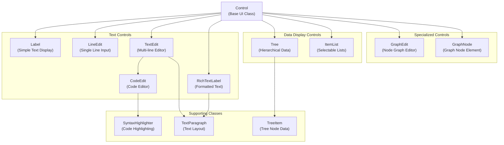
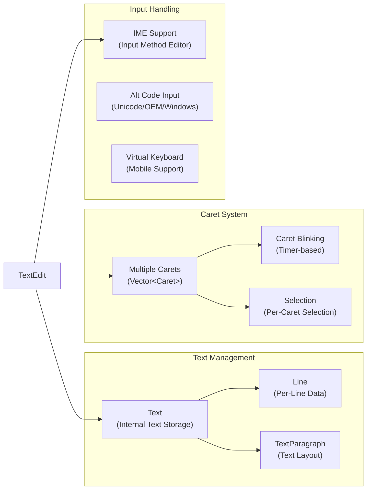
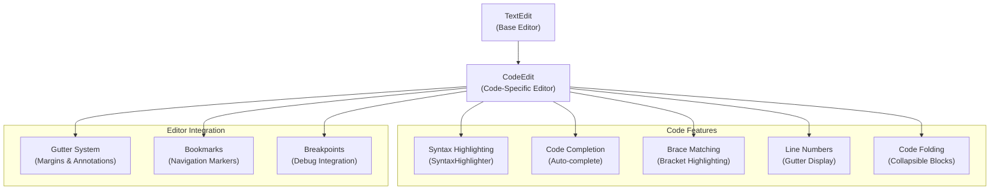
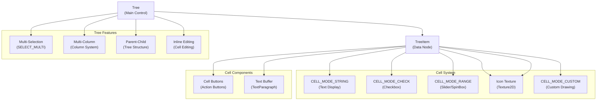
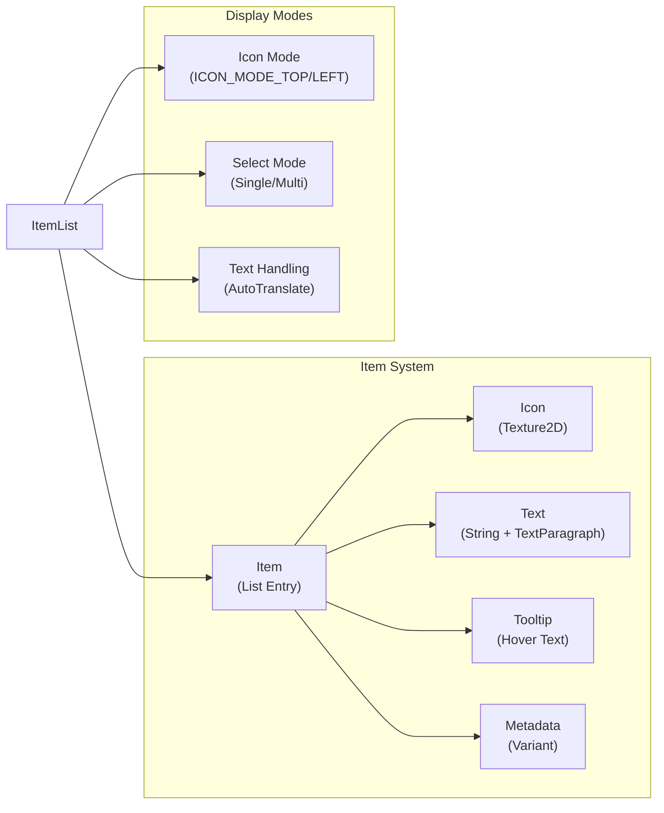
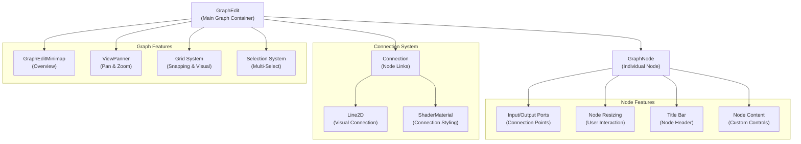
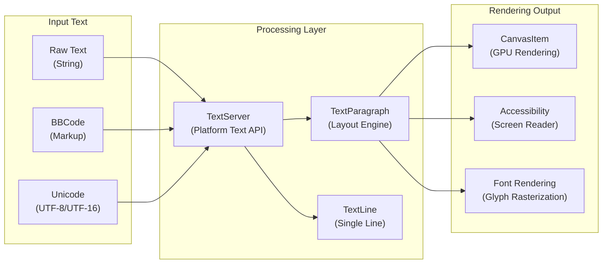
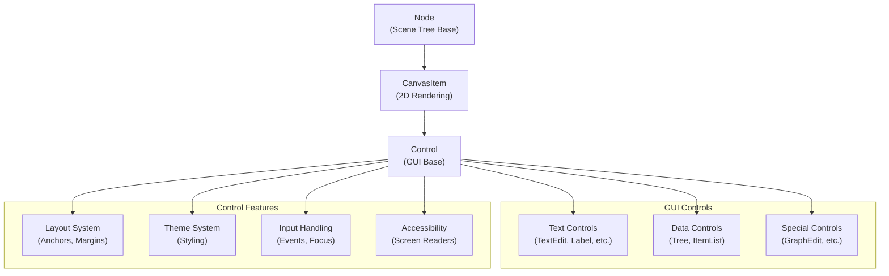

# GUI System

Relevant source files

The following files were used as context for generating this wiki page:

- [core/doc_data.cpp](https://github.com/godotengine/godot/blob/4219ce91/core/doc_data.cpp)
- [core/doc_data.h](https://github.com/godotengine/godot/blob/4219ce91/core/doc_data.h)
- [doc/class.xsd](https://github.com/godotengine/godot/blob/4219ce91/doc/class.xsd)
- [doc/classes/AcceptDialog.xml](https://github.com/godotengine/godot/blob/4219ce91/doc/classes/AcceptDialog.xml)
- [doc/classes/BaseButton.xml](https://github.com/godotengine/godot/blob/4219ce91/doc/classes/BaseButton.xml)
- [doc/classes/Button.xml](https://github.com/godotengine/godot/blob/4219ce91/doc/classes/Button.xml)
- [doc/classes/ButtonGroup.xml](https://github.com/godotengine/godot/blob/4219ce91/doc/classes/ButtonGroup.xml)
- [doc/classes/CheckBox.xml](https://github.com/godotengine/godot/blob/4219ce91/doc/classes/CheckBox.xml)
- [doc/classes/CheckButton.xml](https://github.com/godotengine/godot/blob/4219ce91/doc/classes/CheckButton.xml)
- [doc/classes/CodeEdit.xml](https://github.com/godotengine/godot/blob/4219ce91/doc/classes/CodeEdit.xml)
- [doc/classes/ColorPickerButton.xml](https://github.com/godotengine/godot/blob/4219ce91/doc/classes/ColorPickerButton.xml)
- [doc/classes/ItemList.xml](https://github.com/godotengine/godot/blob/4219ce91/doc/classes/ItemList.xml)
- [doc/classes/Label.xml](https://github.com/godotengine/godot/blob/4219ce91/doc/classes/Label.xml)
- [doc/classes/LineEdit.xml](https://github.com/godotengine/godot/blob/4219ce91/doc/classes/LineEdit.xml)
- [doc/classes/LinkButton.xml](https://github.com/godotengine/godot/blob/4219ce91/doc/classes/LinkButton.xml)
- [doc/classes/MenuButton.xml](https://github.com/godotengine/godot/blob/4219ce91/doc/classes/MenuButton.xml)
- [doc/classes/OptionButton.xml](https://github.com/godotengine/godot/blob/4219ce91/doc/classes/OptionButton.xml)
- [doc/classes/Popup.xml](https://github.com/godotengine/godot/blob/4219ce91/doc/classes/Popup.xml)
- [doc/classes/PopupMenu.xml](https://github.com/godotengine/godot/blob/4219ce91/doc/classes/PopupMenu.xml)
- [doc/classes/RichTextLabel.xml](https://github.com/godotengine/godot/blob/4219ce91/doc/classes/RichTextLabel.xml)
- [doc/classes/TextEdit.xml](https://github.com/godotengine/godot/blob/4219ce91/doc/classes/TextEdit.xml)
- [doc/classes/TextLine.xml](https://github.com/godotengine/godot/blob/4219ce91/doc/classes/TextLine.xml)
- [doc/classes/TextParagraph.xml](https://github.com/godotengine/godot/blob/4219ce91/doc/classes/TextParagraph.xml)
- [doc/classes/Tree.xml](https://github.com/godotengine/godot/blob/4219ce91/doc/classes/Tree.xml)
- [doc/classes/TreeItem.xml](https://github.com/godotengine/godot/blob/4219ce91/doc/classes/TreeItem.xml)
- [editor/editor_log.cpp](https://github.com/godotengine/godot/blob/4219ce91/editor/editor_log.cpp)
- [editor/editor_log.h](https://github.com/godotengine/godot/blob/4219ce91/editor/editor_log.h)
- [misc/extension_api_validation/4.1-stable_4.2-stable.expected](https://github.com/godotengine/godot/blob/4219ce91/misc/extension_api_validation/4.1-stable_4.2-stable.expected)
- [misc/extension_api_validation/4.2-stable_4.3-stable.expected](https://github.com/godotengine/godot/blob/4219ce91/misc/extension_api_validation/4.2-stable_4.3-stable.expected)
- [scene/gui/base_button.cpp](https://github.com/godotengine/godot/blob/4219ce91/scene/gui/base_button.cpp)
- [scene/gui/base_button.h](https://github.com/godotengine/godot/blob/4219ce91/scene/gui/base_button.h)
- [scene/gui/button.cpp](https://github.com/godotengine/godot/blob/4219ce91/scene/gui/button.cpp)
- [scene/gui/button.h](https://github.com/godotengine/godot/blob/4219ce91/scene/gui/button.h)
- [scene/gui/check_box.cpp](https://github.com/godotengine/godot/blob/4219ce91/scene/gui/check_box.cpp)
- [scene/gui/check_box.h](https://github.com/godotengine/godot/blob/4219ce91/scene/gui/check_box.h)
- [scene/gui/check_button.cpp](https://github.com/godotengine/godot/blob/4219ce91/scene/gui/check_button.cpp)
- [scene/gui/check_button.h](https://github.com/godotengine/godot/blob/4219ce91/scene/gui/check_button.h)
- [scene/gui/code_edit.cpp](https://github.com/godotengine/godot/blob/4219ce91/scene/gui/code_edit.cpp)
- [scene/gui/code_edit.h](https://github.com/godotengine/godot/blob/4219ce91/scene/gui/code_edit.h)
- [scene/gui/dialogs.cpp](https://github.com/godotengine/godot/blob/4219ce91/scene/gui/dialogs.cpp)
- [scene/gui/dialogs.h](https://github.com/godotengine/godot/blob/4219ce91/scene/gui/dialogs.h)
- [scene/gui/item_list.cpp](https://github.com/godotengine/godot/blob/4219ce91/scene/gui/item_list.cpp)
- [scene/gui/item_list.h](https://github.com/godotengine/godot/blob/4219ce91/scene/gui/item_list.h)
- [scene/gui/label.cpp](https://github.com/godotengine/godot/blob/4219ce91/scene/gui/label.cpp)
- [scene/gui/label.h](https://github.com/godotengine/godot/blob/4219ce91/scene/gui/label.h)
- [scene/gui/line_edit.cpp](https://github.com/godotengine/godot/blob/4219ce91/scene/gui/line_edit.cpp)
- [scene/gui/line_edit.h](https://github.com/godotengine/godot/blob/4219ce91/scene/gui/line_edit.h)
- [scene/gui/link_button.cpp](https://github.com/godotengine/godot/blob/4219ce91/scene/gui/link_button.cpp)
- [scene/gui/link_button.h](https://github.com/godotengine/godot/blob/4219ce91/scene/gui/link_button.h)
- [scene/gui/menu_button.cpp](https://github.com/godotengine/godot/blob/4219ce91/scene/gui/menu_button.cpp)
- [scene/gui/menu_button.h](https://github.com/godotengine/godot/blob/4219ce91/scene/gui/menu_button.h)
- [scene/gui/option_button.cpp](https://github.com/godotengine/godot/blob/4219ce91/scene/gui/option_button.cpp)
- [scene/gui/option_button.h](https://github.com/godotengine/godot/blob/4219ce91/scene/gui/option_button.h)
- [scene/gui/popup.cpp](https://github.com/godotengine/godot/blob/4219ce91/scene/gui/popup.cpp)
- [scene/gui/popup.h](https://github.com/godotengine/godot/blob/4219ce91/scene/gui/popup.h)
- [scene/gui/popup_menu.cpp](https://github.com/godotengine/godot/blob/4219ce91/scene/gui/popup_menu.cpp)
- [scene/gui/popup_menu.h](https://github.com/godotengine/godot/blob/4219ce91/scene/gui/popup_menu.h)
- [scene/gui/rich_text_label.compat.inc](https://github.com/godotengine/godot/blob/4219ce91/scene/gui/rich_text_label.compat.inc)
- [scene/gui/rich_text_label.cpp](https://github.com/godotengine/godot/blob/4219ce91/scene/gui/rich_text_label.cpp)
- [scene/gui/rich_text_label.h](https://github.com/godotengine/godot/blob/4219ce91/scene/gui/rich_text_label.h)
- [scene/gui/text_edit.cpp](https://github.com/godotengine/godot/blob/4219ce91/scene/gui/text_edit.cpp)
- [scene/gui/text_edit.h](https://github.com/godotengine/godot/blob/4219ce91/scene/gui/text_edit.h)
- [scene/gui/tree.cpp](https://github.com/godotengine/godot/blob/4219ce91/scene/gui/tree.cpp)
- [scene/gui/tree.h](https://github.com/godotengine/godot/blob/4219ce91/scene/gui/tree.h)
- [scene/property_list_helper.cpp](https://github.com/godotengine/godot/blob/4219ce91/scene/property_list_helper.cpp)
- [scene/property_list_helper.h](https://github.com/godotengine/godot/blob/4219ce91/scene/property_list_helper.h)
- [scene/resources/text_line.cpp](https://github.com/godotengine/godot/blob/4219ce91/scene/resources/text_line.cpp)
- [scene/resources/text_line.h](https://github.com/godotengine/godot/blob/4219ce91/scene/resources/text_line.h)
- [scene/resources/text_paragraph.cpp](https://github.com/godotengine/godot/blob/4219ce91/scene/resources/text_paragraph.cpp)
- [scene/resources/text_paragraph.h](https://github.com/godotengine/godot/blob/4219ce91/scene/resources/text_paragraph.h)
- [tests/display_server_mock.h](https://github.com/godotengine/godot/blob/4219ce91/tests/display_server_mock.h)
- [tests/scene/test_code_edit.h](https://github.com/godotengine/godot/blob/4219ce91/tests/scene/test_code_edit.h)
- [tests/scene/test_text_edit.h](https://github.com/godotengine/godot/blob/4219ce91/tests/scene/test_text_edit.h)
- [tests/scene/test_viewport.h](https://github.com/godotengine/godot/blob/4219ce91/tests/scene/test_viewport.h)
- [tests/test_macros.h](https://github.com/godotengine/godot/blob/4219ce91/tests/test_macros.h)
- [tests/test_main.cpp](https://github.com/godotengine/godot/blob/4219ce91/tests/test_main.cpp)

This document covers Godot's comprehensive GUI framework for creating user interfaces in both games and the editor. The system provides a rich set of controls for text display and editing, hierarchical data presentation, and specialized interfaces.

For information about the Scene System that GUI controls integrate with, see [Scene System](#2). For details about Editor-specific GUI components, see [Editor Architecture](#5).

## Architecture Overview

Godot's GUI system is built around the `Control` class as the foundation for all user interface elements. The system provides both basic text display controls and advanced editing components with features like syntax highlighting, rich text formatting, and multi-caret editing.

### Core GUI System Architecture

Sources: [scene/gui/text_edit.h:40](https://github.com/godotengine/godot/blob/4219ce91/scene/gui/text_edit.h#L40), [scene/gui/rich_text_label.h:43](https://github.com/godotengine/godot/blob/4219ce91/scene/gui/rich_text_label.h#L43), [scene/gui/tree.h:46](https://github.com/godotengine/godot/blob/4219ce91/scene/gui/tree.h#L46), [scene/gui/line_edit.h](https://github.com/godotengine/godot/blob/4219ce91/scene/gui/line_edit.h), [scene/gui/label.h](https://github.com/godotengine/godot/blob/4219ce91/scene/gui/label.h), [scene/gui/code_edit.h](https://github.com/godotengine/godot/blob/4219ce91/scene/gui/code_edit.h)

## Text-Based Controls

### TextEdit - Advanced Text Editor

`TextEdit` is the most sophisticated text editing control, supporting multi-line text editing with advanced features like multiple carets, syntax highlighting, and extensive keyboard shortcuts.

#### TextEdit Core Features

The `TextEdit` class implements comprehensive text editing through several key systems:

- **Text Storage**: The internal `Text` class manages line data and text formatting
- **Multi-Caret Support**: Allows multiple cursors for simultaneous editing operations
- **Input Method Support**: Handles international text input through IME systems
- **Accessibility**: Full screen reader support with element-based navigation

Sources: [scene/gui/text_edit.h:40-454](https://github.com/godotengine/godot/blob/4219ce91/scene/gui/text_edit.h#L40-L454), [scene/gui/text_edit.cpp:47-79](https://github.com/godotengine/godot/blob/4219ce91/scene/gui/text_edit.cpp#L47-L79)

### CodeEdit - Programming-Focused Editor

`CodeEdit` extends `TextEdit` with programming-specific features like syntax highlighting, code completion, and brace matching.

Sources: [scene/gui/code_edit.h:40-78](https://github.com/godotengine/godot/blob/4219ce91/scene/gui/code_edit.h#L40-L78), [scene/gui/code_edit.cpp:44-56](https://github.com/godotengine/godot/blob/4219ce91/scene/gui/code_edit.cpp#L44-L56)

### RichTextLabel - Formatted Text Display

`RichTextLabel` provides rich text display with BBCode markup support, images, and interactive elements.

#### RichTextLabel Item System

```mermaid
graph TB
    RichTextLabel["RichTextLabel"]
    
    subgraph "Content Items"
        ItemFrame["ITEM_FRAME<br/>(Container)"]
        ItemText["ITEM_TEXT<br/>(Text Content)"]
        ItemImage["ITEM_IMAGE<br/>(Embedded Images)"]
        ItemTable["ITEM_TABLE<br/>(Table Layout)"]
        ItemList["ITEM_LIST<br/>(Bullet/Numbered Lists)"]
    end
    
    subgraph "Formatting Items"
        ItemFont["ITEM_FONT<br/>(Font Changes)"]
        ItemColor["ITEM_COLOR<br/>(Text Color)"]
        ItemBold["ITEM_BOLD<br/>(Bold Formatting)"]
        ItemItalic["ITEM_ITALIC<br/>(Italic Formatting)"]
        ItemUnderline["ITEM_UNDERLINE<br/>(Underline)"]
    end
    
    subgraph "Interactive Items"
        ItemMeta["ITEM_META<br/>(Clickable Links)"]
        ItemHint["ITEM_HINT<br/>(Tooltips)"]
        ItemButton["Custom Buttons"]
    end
    
    RichTextLabel --> ItemFrame
    RichTextLabel --> ItemText
    RichTextLabel --> ItemImage
    RichTextLabel --> ItemTable
    RichTextLabel --> ItemList
    RichTextLabel --> ItemFont
    RichTextLabel --> ItemColor
    RichTextLabel --> ItemMeta
```

Sources: [scene/gui/rich_text_label.h:70-101](https://github.com/godotengine/godot/blob/4219ce91/scene/gui/rich_text_label.h#L70-L101), [scene/gui/rich_text_label.cpp:49-68](https://github.com/godotengine/godot/blob/4219ce91/scene/gui/rich_text_label.cpp#L49-L68)

## Data Display Controls

### Tree - Hierarchical Data Display

The `Tree` control displays hierarchical data using `TreeItem` objects, supporting multiple columns, custom cell types, and interactive elements.

#### Tree Architecture

Sources: [scene/gui/tree.h:46-57](https://github.com/godotengine/godot/blob/4219ce91/scene/gui/tree.h#L46-L57), [scene/gui/tree.cpp:50-105](https://github.com/godotengine/godot/blob/4219ce91/scene/gui/tree.cpp#L50-L105)

### ItemList - Selectable Item Lists

`ItemList` provides a vertical list of selectable items with support for icons, multi-selection, and custom styling.

Sources: [scene/gui/item_list.h:46-89](https://github.com/godotengine/godot/blob/4219ce91/scene/gui/item_list.h#L46-L89), [scene/gui/item_list.cpp:37-72](https://github.com/godotengine/godot/blob/4219ce91/scene/gui/item_list.cpp#L37-L72)

## Specialized Controls

### GraphEdit - Visual Node Editor

`GraphEdit` provides a sophisticated node-based visual editor used extensively in Godot's shader editor and other visual programming interfaces.

#### GraphEdit System Architecture

Sources: [scene/gui/graph_edit.h:67-246](https://github.com/godotengine/godot/blob/4219ce91/scene/gui/graph_edit.h#L67-L246), [scene/gui/graph_edit.cpp:216-306](https://github.com/godotengine/godot/blob/4219ce91/scene/gui/graph_edit.cpp#L216-L306), [scene/gui/graph_node.h](https://github.com/godotengine/godot/blob/4219ce91/scene/gui/graph_node.h), [scene/gui/graph_node.cpp](https://github.com/godotengine/godot/blob/4219ce91/scene/gui/graph_node.cpp)

## Text Processing and Layout

All text-based GUI controls rely on Godot's text processing system for layout, rendering, and internationalization support.

### Text Processing Pipeline

Sources: [scene/gui/text_edit.cpp:51-66](https://github.com/godotengine/godot/blob/4219ce91/scene/gui/text_edit.cpp#L51-L66), [scene/gui/rich_text_label.cpp:268-365](https://github.com/godotengine/godot/blob/4219ce91/scene/gui/rich_text_label.cpp#L268-L365), [scene/resources/text_paragraph.h](https://github.com/godotengine/godot/blob/4219ce91/scene/resources/text_paragraph.h)

## Integration with Scene System

GUI controls are fully integrated with Godot's scene system, inheriting from `Control` which provides layout, theming, and event handling capabilities.

### Control Base Class Integration

Sources: [scene/gui/control.h](https://github.com/godotengine/godot/blob/4219ce91/scene/gui/control.h), [scene/gui/text_edit.h:40](https://github.com/godotengine/godot/blob/4219ce91/scene/gui/text_edit.h#L40), [scene/gui/tree.h:46](https://github.com/godotengine/godot/blob/4219ce91/scene/gui/tree.h#L46)