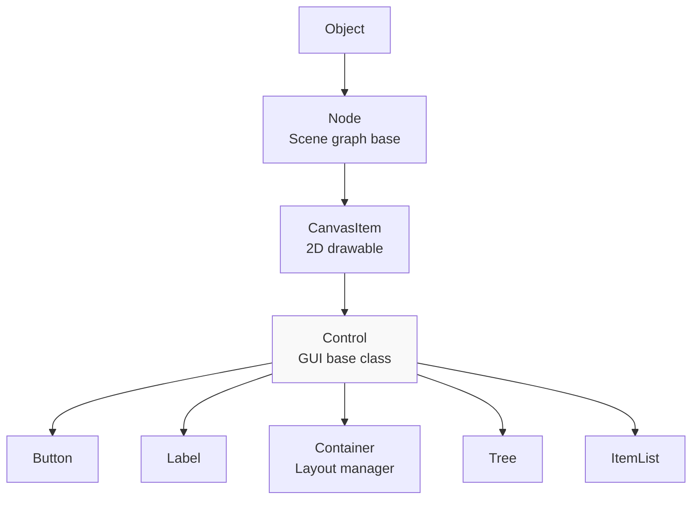
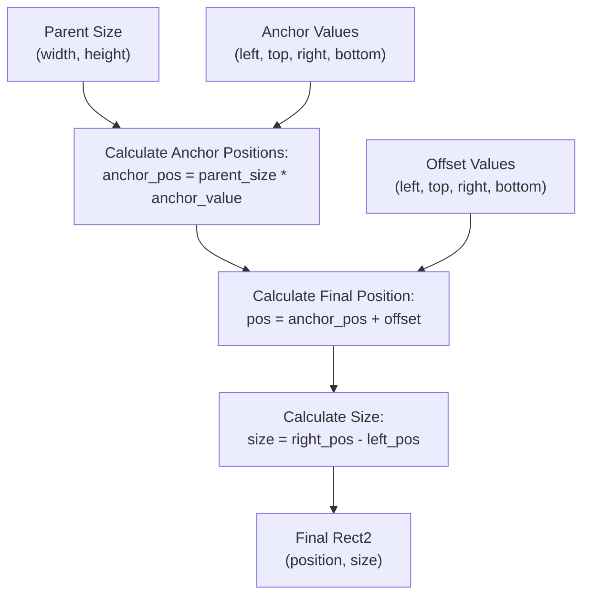
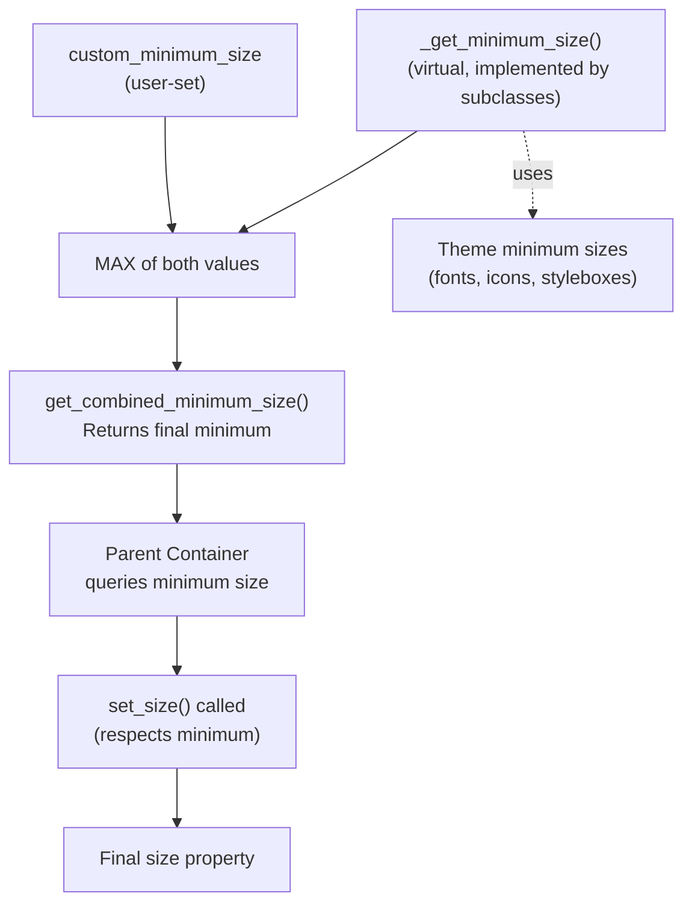
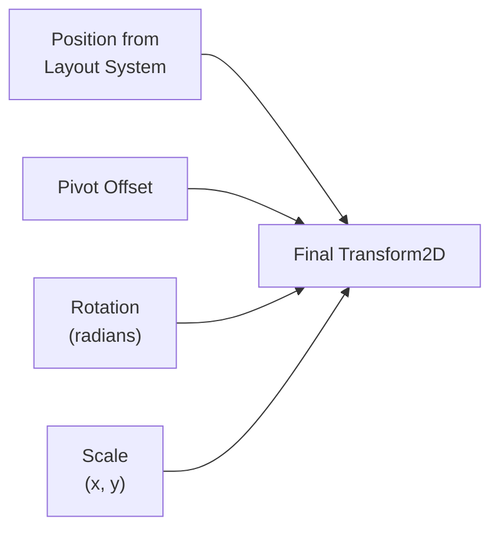
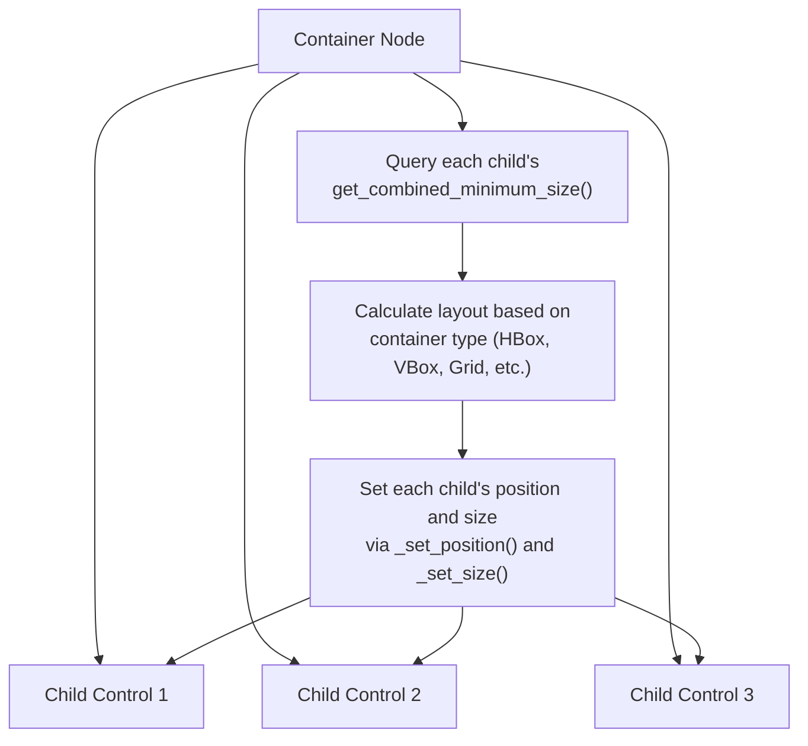
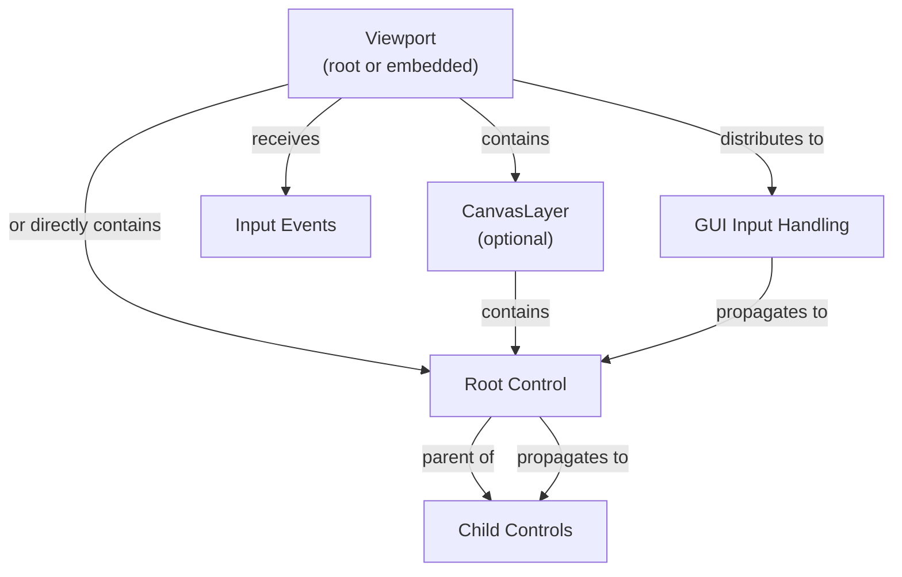
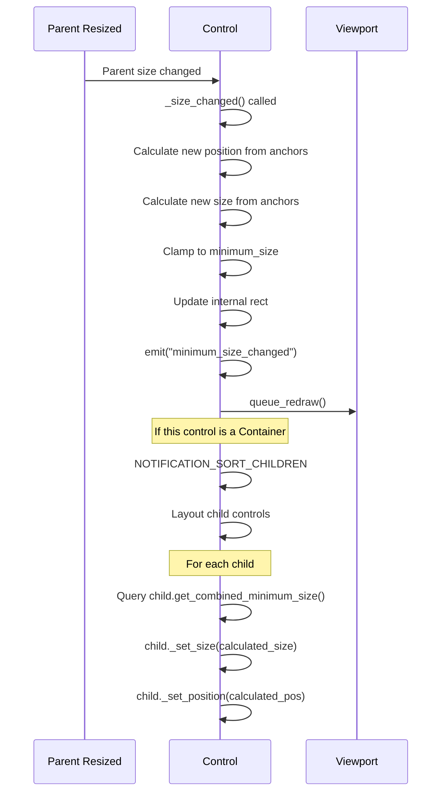

# Control Base Class and Layout

<details>
<summary>Relevant source files</summary>

The following files were used as context for generating this wiki page:

- [doc/classes/AcceptDialog.xml](https://github.com/godotengine/godot/blob/4219ce91/doc/classes/AcceptDialog.xml)
- [doc/classes/BaseButton.xml](https://github.com/godotengine/godot/blob/4219ce91/doc/classes/BaseButton.xml)
- [doc/classes/Button.xml](https://github.com/godotengine/godot/blob/4219ce91/doc/classes/Button.xml)
- [doc/classes/ButtonGroup.xml](https://github.com/godotengine/godot/blob/4219ce91/doc/classes/ButtonGroup.xml)
- [doc/classes/CheckBox.xml](https://github.com/godotengine/godot/blob/4219ce91/doc/classes/CheckBox.xml)
- [doc/classes/CheckButton.xml](https://github.com/godotengine/godot/blob/4219ce91/doc/classes/CheckButton.xml)
- [doc/classes/ColorPickerButton.xml](https://github.com/godotengine/godot/blob/4219ce91/doc/classes/ColorPickerButton.xml)
- [doc/classes/Control.xml](https://github.com/godotengine/godot/blob/4219ce91/doc/classes/Control.xml)
- [doc/classes/ItemList.xml](https://github.com/godotengine/godot/blob/4219ce91/doc/classes/ItemList.xml)
- [doc/classes/LinkButton.xml](https://github.com/godotengine/godot/blob/4219ce91/doc/classes/LinkButton.xml)
- [doc/classes/MenuButton.xml](https://github.com/godotengine/godot/blob/4219ce91/doc/classes/MenuButton.xml)
- [doc/classes/Node.xml](https://github.com/godotengine/godot/blob/4219ce91/doc/classes/Node.xml)
- [doc/classes/OptionButton.xml](https://github.com/godotengine/godot/blob/4219ce91/doc/classes/OptionButton.xml)
- [doc/classes/Popup.xml](https://github.com/godotengine/godot/blob/4219ce91/doc/classes/Popup.xml)
- [doc/classes/PopupMenu.xml](https://github.com/godotengine/godot/blob/4219ce91/doc/classes/PopupMenu.xml)
- [doc/classes/SceneTree.xml](https://github.com/godotengine/godot/blob/4219ce91/doc/classes/SceneTree.xml)
- [doc/classes/Theme.xml](https://github.com/godotengine/godot/blob/4219ce91/doc/classes/Theme.xml)
- [doc/classes/Tree.xml](https://github.com/godotengine/godot/blob/4219ce91/doc/classes/Tree.xml)
- [doc/classes/TreeItem.xml](https://github.com/godotengine/godot/blob/4219ce91/doc/classes/TreeItem.xml)
- [doc/classes/Viewport.xml](https://github.com/godotengine/godot/blob/4219ce91/doc/classes/Viewport.xml)
- [doc/classes/Window.xml](https://github.com/godotengine/godot/blob/4219ce91/doc/classes/Window.xml)
- [scene/gui/base_button.cpp](https://github.com/godotengine/godot/blob/4219ce91/scene/gui/base_button.cpp)
- [scene/gui/base_button.h](https://github.com/godotengine/godot/blob/4219ce91/scene/gui/base_button.h)
- [scene/gui/button.cpp](https://github.com/godotengine/godot/blob/4219ce91/scene/gui/button.cpp)
- [scene/gui/button.h](https://github.com/godotengine/godot/blob/4219ce91/scene/gui/button.h)
- [scene/gui/check_box.cpp](https://github.com/godotengine/godot/blob/4219ce91/scene/gui/check_box.cpp)
- [scene/gui/check_box.h](https://github.com/godotengine/godot/blob/4219ce91/scene/gui/check_box.h)
- [scene/gui/check_button.cpp](https://github.com/godotengine/godot/blob/4219ce91/scene/gui/check_button.cpp)
- [scene/gui/check_button.h](https://github.com/godotengine/godot/blob/4219ce91/scene/gui/check_button.h)
- [scene/gui/control.cpp](https://github.com/godotengine/godot/blob/4219ce91/scene/gui/control.cpp)
- [scene/gui/control.h](https://github.com/godotengine/godot/blob/4219ce91/scene/gui/control.h)
- [scene/gui/dialogs.cpp](https://github.com/godotengine/godot/blob/4219ce91/scene/gui/dialogs.cpp)
- [scene/gui/dialogs.h](https://github.com/godotengine/godot/blob/4219ce91/scene/gui/dialogs.h)
- [scene/gui/item_list.cpp](https://github.com/godotengine/godot/blob/4219ce91/scene/gui/item_list.cpp)
- [scene/gui/item_list.h](https://github.com/godotengine/godot/blob/4219ce91/scene/gui/item_list.h)
- [scene/gui/link_button.cpp](https://github.com/godotengine/godot/blob/4219ce91/scene/gui/link_button.cpp)
- [scene/gui/link_button.h](https://github.com/godotengine/godot/blob/4219ce91/scene/gui/link_button.h)
- [scene/gui/menu_button.cpp](https://github.com/godotengine/godot/blob/4219ce91/scene/gui/menu_button.cpp)
- [scene/gui/menu_button.h](https://github.com/godotengine/godot/blob/4219ce91/scene/gui/menu_button.h)
- [scene/gui/option_button.cpp](https://github.com/godotengine/godot/blob/4219ce91/scene/gui/option_button.cpp)
- [scene/gui/option_button.h](https://github.com/godotengine/godot/blob/4219ce91/scene/gui/option_button.h)
- [scene/gui/popup.cpp](https://github.com/godotengine/godot/blob/4219ce91/scene/gui/popup.cpp)
- [scene/gui/popup.h](https://github.com/godotengine/godot/blob/4219ce91/scene/gui/popup.h)
- [scene/gui/popup_menu.cpp](https://github.com/godotengine/godot/blob/4219ce91/scene/gui/popup_menu.cpp)
- [scene/gui/popup_menu.h](https://github.com/godotengine/godot/blob/4219ce91/scene/gui/popup_menu.h)
- [scene/gui/tree.cpp](https://github.com/godotengine/godot/blob/4219ce91/scene/gui/tree.cpp)
- [scene/gui/tree.h](https://github.com/godotengine/godot/blob/4219ce91/scene/gui/tree.h)
- [scene/main/node.cpp](https://github.com/godotengine/godot/blob/4219ce91/scene/main/node.cpp)
- [scene/main/node.h](https://github.com/godotengine/godot/blob/4219ce91/scene/main/node.h)
- [scene/main/scene_tree.cpp](https://github.com/godotengine/godot/blob/4219ce91/scene/main/scene_tree.cpp)
- [scene/main/scene_tree.h](https://github.com/godotengine/godot/blob/4219ce91/scene/main/scene_tree.h)
- [scene/main/viewport.cpp](https://github.com/godotengine/godot/blob/4219ce91/scene/main/viewport.cpp)
- [scene/main/viewport.h](https://github.com/godotengine/godot/blob/4219ce91/scene/main/viewport.h)
- [scene/main/window.cpp](https://github.com/godotengine/godot/blob/4219ce91/scene/main/window.cpp)
- [scene/main/window.h](https://github.com/godotengine/godot/blob/4219ce91/scene/main/window.h)
- [scene/property_list_helper.cpp](https://github.com/godotengine/godot/blob/4219ce91/scene/property_list_helper.cpp)
- [scene/property_list_helper.h](https://github.com/godotengine/godot/blob/4219ce91/scene/property_list_helper.h)
- [scene/resources/theme.cpp](https://github.com/godotengine/godot/blob/4219ce91/scene/resources/theme.cpp)
- [scene/resources/theme.h](https://github.com/godotengine/godot/blob/4219ce91/scene/resources/theme.h)

</details>


## Purpose and Scope

This page documents the `Control` class, which serves as the base class for all GUI elements in Godot. It covers the layout system including anchors, offsets, size calculation, and how controls integrate with container nodes. For information about specific control types like buttons and text displays, see their respective pages. For theme customization and visual styling, see [Theme System](#3.6). For input handling specifics, see [Input Event Processing](#2.3).

**Sources**: [scene/gui/control.h](), [scene/gui/control.cpp](), [doc/classes/Control.xml]()

---

## Control in the Node Hierarchy

The `Control` class inherits from `CanvasItem`, making it a 2D scene node that can be drawn and transformed. All GUI widgets in Godot derive from `Control`, including buttons, labels, containers, and complex controls like trees and item lists.

### Class Hierarchy



**Diagram**: Control class hierarchy showing inheritance from Object through Node and CanvasItem

The `Control` class adds GUI-specific functionality on top of `CanvasItem`:
- **Layout system** with anchors and offsets
- **Minimum size** constraints and size negotiation
- **Focus management** for keyboard/gamepad navigation
- **Mouse filtering** and input handling
- **Theme integration** for visual styling

**Sources**: [scene/gui/control.h:44-50](), [doc/classes/Control.xml:1-10]()

---

## Layout System Overview

The Control layout system determines the position and size of GUI elements relative to their parent. It consists of several interrelated components:

| Component | Purpose |
|-----------|---------|
| **Anchors** | Define which edges of the parent the control is attached to (0.0 to 1.0) |
| **Offsets** | Define pixel distances from the anchor points |
| **Layout Mode** | Determines whether position is absolute, anchor-based, or container-managed |
| **Minimum Size** | Constraints on how small a control can be |
| **Transform** | Rotation, scale, and pivot for visual transformation |

**Sources**: [scene/gui/control.h:138-234](), [scene/gui/control.cpp:520-600]()

---

## Anchors and Offsets

### Anchor System

Anchors define attachment points as normalized coordinates (0.0 to 1.0) within the parent control or viewport. Each control has four anchors:

```cpp
// From scene/gui/control.h
real_t anchor[4]; // SIDE_LEFT, SIDE_TOP, SIDE_RIGHT, SIDE_BOTTOM
```

- **0.0**: Attached to the left/top edge of the parent
- **0.5**: Attached to the center of the parent  
- **1.0**: Attached to the right/bottom edge of the parent

### Offset System

Offsets define pixel distances from the anchor points:

```cpp
// From scene/gui/control.h
real_t offset[4]; // SIDE_LEFT, SIDE_TOP, SIDE_RIGHT, SIDE_BOTTOM
```

The final position and size are calculated as:

```
position.x = parent_width * anchor_left + offset_left
position.y = parent_height * anchor_top + offset_top
size.width = (parent_width * anchor_right + offset_right) - position.x
size.height = (parent_height * anchor_bottom + offset_bottom) - position.y
```

### Anchor/Offset Calculation Flow



**Diagram**: Flow showing how parent size, anchors, and offsets combine to determine final position and size

**Sources**: [scene/gui/control.cpp:2280-2350](), [scene/gui/control.h:138-148]()

---

## Layout Modes

The `Control` class supports multiple layout modes that determine how position and size are managed:

```cpp
// From scene/gui/control.h
enum LayoutMode {
    LAYOUT_MODE_POSITION,      // Direct position control
    LAYOUT_MODE_ANCHORS,       // Anchor-based layout
    LAYOUT_MODE_CONTAINER,     // Managed by parent Container
    LAYOUT_MODE_UNCONTROLLED,  // No automatic layout
};
```

### Layout Mode Behavior

| Mode | Position | Size | Use Case |
|------|----------|------|----------|
| `LAYOUT_MODE_POSITION` | Set directly via `position` property | Set directly via `size` property | Simple fixed positioning |
| `LAYOUT_MODE_ANCHORS` | Calculated from anchors/offsets | Calculated from anchors/offsets | Responsive UI that adapts to parent size |
| `LAYOUT_MODE_CONTAINER` | Managed by parent Container | Managed by parent Container | Children of HBoxContainer, VBoxContainer, etc. |
| `LAYOUT_MODE_UNCONTROLLED` | Manual control | Manual control | Advanced custom layouts |

### Properties Managed by Containers

When a Control is a child of a Container, several properties become read-only and are managed by the container:

```cpp
// From scene/gui/control.cpp:280-293
String Control::properties_managed_by_container[] = {
    "offset_left",
    "offset_top", 
    "offset_right",
    "offset_bottom",
    "anchor_left",
    "anchor_top",
    "anchor_right",
    "anchor_bottom",
    "position",
    "rotation",
    "scale",
    "size"
};
```

**Sources**: [scene/gui/control.h:166-171](), [scene/gui/control.cpp:280-293](), [scene/gui/control.cpp:520-550]()

---

## Size Calculation

Control sizing involves several interrelated properties and methods that determine how controls report their minimum size and how their final size is calculated.

### Size Properties

```cpp
// From scene/gui/control.h (Data struct)
Size2 size;                    // Current size
Size2 custom_minimum_size;     // User-set minimum size
Size2 last_minimum_size;       // Cached combined minimum size
bool block_minimum_size_adjust; // Prevents automatic updates
```

### Size Calculation Flow



**Diagram**: Size calculation flow from minimum size sources to final size

### Key Methods

**`get_combined_minimum_size()`** - Returns the effective minimum size by combining:
1. `custom_minimum_size` (if set)
2. `_get_minimum_size()` virtual method (implemented by subclasses)
3. Takes the maximum of both

[scene/gui/control.cpp:360-380]()

**`_get_minimum_size()`** - Virtual method overridden by subclasses to report their natural minimum size based on content (text, icons, etc.)

[scene/gui/control.cpp:327-330]()

**`_size_changed()`** - Internal method called when size changes, handles:
- Updating the rect
- Notifying theme system
- Triggering minimum size recalculation
- Emitting `minimum_size_changed` signal when needed

[scene/gui/control.cpp:2752-2820]()

**Sources**: [scene/gui/control.h:189-195](), [scene/gui/control.cpp:327-380](), [scene/gui/control.cpp:2752-2820]()

---

## Transform Properties

In addition to layout-based positioning, Controls support 2D transform properties for visual effects:

```cpp
// From scene/gui/control.h (Data struct)
real_t rotation = 0.0;
Vector2 scale = Vector2(1, 1);  
Vector2 pivot_offset;
```

### Transform Application

The transform is applied in this order:
1. **Translation** to pivot offset
2. **Rotation** around pivot
3. **Scale** from pivot
4. **Translation** back and to final position



**Diagram**: Transform properties that combine with layout position

These transform properties do **not** affect the layout calculation itself - they are purely visual transformations applied on top of the layout-determined rectangle.

**Sources**: [scene/gui/control.h:197-199](), [scene/gui/control.cpp:2387-2465]()

---

## Container Integration

`Container` is a specialized `Control` subclass that manages the layout of its children. When a Control is parented to a Container, the container takes over positioning and sizing.

### Container Responsibilities



**Diagram**: Container managing child control layout

### Container Types

Godot provides several built-in container types:
- **BoxContainer** (HBoxContainer, VBoxContainer) - Linear layouts
- **GridContainer** - Grid-based layouts
- **MarginContainer** - Adds margins around a single child
- **ScrollContainer** - Provides scrolling for oversized content
- **SplitContainer** - Resizable split between two children
- **TabContainer** - Tabbed interface
- **PanelContainer** - Container with a background panel

Each container type implements its own `_notification(NOTIFICATION_SORT_CHILDREN)` handler to arrange children according to its specific layout rules.

**Sources**: [scene/gui/control.cpp:520-550](), [doc/classes/Control.xml:6-17]()

---

## Key Data Structures

### Control::Data Structure

The `Control::Data` struct (defined in [scene/gui/control.h:179-234]()) contains all layout-related state:

```cpp
struct Data {
    // Layout
    real_t offset[4];
    real_t anchor[4];
    FocusMode focus_mode;
    GrowDirection h_grow;
    GrowDirection v_grow;
    LayoutDirection layout_dir;
    LayoutMode layout_mode;
    
    // Sizing
    Size2 size;
    Size2 custom_minimum_size;
    Size2 last_minimum_size;
    
    // Transform
    real_t rotation;
    Vector2 scale;
    Vector2 pivot_offset;
    
    // Theme
    Ref<Theme> theme;
    Control *theme_owner;
    Window *theme_owner_window;
    // ... theme caches and overrides
    
    // Parent/Viewport
    Control *parent_control;
    Window *parent_window;
    // ...
};
```

### Important Flags and Enums

**LayoutMode** [scene/gui/control.h:166-171]()
```cpp
enum LayoutMode {
    LAYOUT_MODE_POSITION,
    LAYOUT_MODE_ANCHORS,
    LAYOUT_MODE_CONTAINER,
    LAYOUT_MODE_UNCONTROLLED,
};
```

**GrowDirection** - Determines which direction the control grows when parent is resized:
- `GROW_DIRECTION_BEGIN` - Grow towards start (left/top)
- `GROW_DIRECTION_END` - Grow towards end (right/bottom)  
- `GROW_DIRECTION_BOTH` - Grow in both directions

**LayoutDirection** - For RTL (right-to-left) language support:
- `LAYOUT_DIRECTION_INHERITED`
- `LAYOUT_DIRECTION_LOCALE`
- `LAYOUT_DIRECTION_LTR`
- `LAYOUT_DIRECTION_RTL`

**Sources**: [scene/gui/control.h:179-234]()

---

## Key Methods Reference

### Layout Methods

| Method | Purpose | Location |
|--------|---------|----------|
| `set_anchor()` | Set anchor value for a side | [scene/gui/control.cpp:1649-1680]() |
| `set_offset()` | Set offset value for a side | [scene/gui/control.cpp:1849-1870]() |
| `set_position()` | Set position (updates offsets) | [scene/gui/control.cpp:1961-2010]() |
| `set_size()` | Set size (updates offsets) | [scene/gui/control.cpp:2033-2090]() |
| `set_global_position()` | Set position in global coordinates | [scene/gui/control.cpp:2012-2031]() |
| `_size_changed()` | Internal size update handler | [scene/gui/control.cpp:2752-2820]() |

### Sizing Methods

| Method | Purpose | Location |
|--------|---------|----------|
| `get_minimum_size()` | Public API for minimum size | [scene/gui/control.cpp:335-340]() |
| `get_combined_minimum_size()` | Combines custom + natural minimum | [scene/gui/control.cpp:360-380]() |
| `_get_minimum_size()` | Virtual method for subclasses | [scene/gui/control.cpp:327-330]() |
| `set_custom_minimum_size()` | Set user-defined minimum | [scene/gui/control.cpp:382-395]() |
| `update_minimum_size()` | Trigger minimum size recalculation | [scene/gui/control.cpp:397-407]() |

### Transform Methods  

| Method | Purpose | Location |
|--------|---------|----------|
| `set_rotation()` | Set rotation in radians | [scene/gui/control.cpp:2387-2400]() |
| `set_scale()` | Set scale factor | [scene/gui/control.cpp:2419-2432]() |
| `set_pivot_offset()` | Set transform pivot point | [scene/gui/control.cpp:2447-2465]() |

**Sources**: [scene/gui/control.cpp](), [scene/gui/control.h]()

---

## Integration with Viewport

Controls exist within a `Viewport`, which provides the root rendering context and input handling. The viewport relationship is established through the scene tree hierarchy:



**Diagram**: Control hierarchy within a Viewport context

The viewport provides:
- **Root size** for top-level control anchor calculations
- **Input event distribution** via `gui_input()` virtual method
- **Focus management** tracking which control has keyboard focus
- **GUI state** like mouse position, drag data, tooltip tracking

**Sources**: [scene/main/viewport.cpp:1-100](), [scene/gui/control.cpp:409-500](), [doc/classes/Viewport.xml:1-12]()

---

## Layout Calculation Example

Here's how a typical layout calculation flows through the system:



**Diagram**: Sequence showing layout recalculation when parent is resized