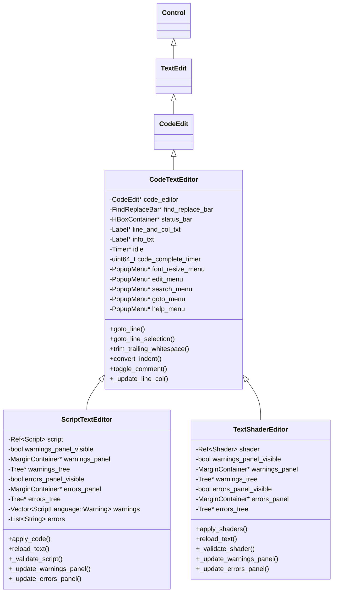
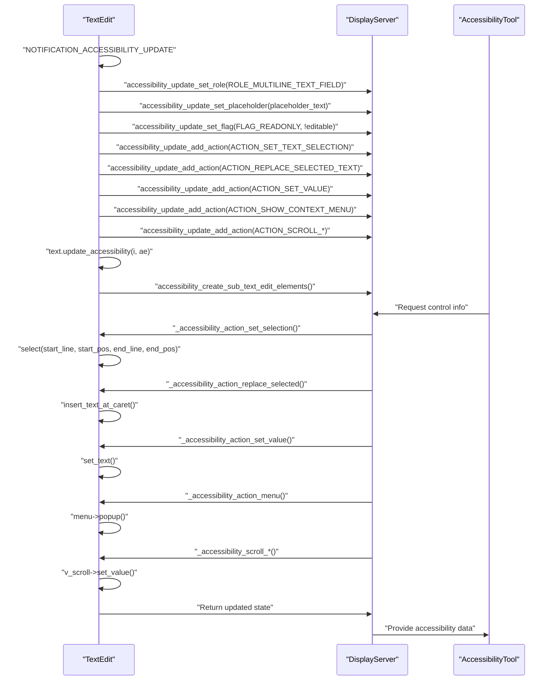

# Text Editing and Display

<details>
<summary>Relevant source files</summary>

The following files were used as context for generating this wiki page:

- [core/doc_data.cpp](https://github.com/godotengine/godot/blob/4219ce91/core/doc_data.cpp)
- [core/doc_data.h](https://github.com/godotengine/godot/blob/4219ce91/core/doc_data.h)
- [doc/class.xsd](https://github.com/godotengine/godot/blob/4219ce91/doc/class.xsd)
- [doc/classes/CodeEdit.xml](https://github.com/godotengine/godot/blob/4219ce91/doc/classes/CodeEdit.xml)
- [doc/classes/Label.xml](https://github.com/godotengine/godot/blob/4219ce91/doc/classes/Label.xml)
- [doc/classes/LineEdit.xml](https://github.com/godotengine/godot/blob/4219ce91/doc/classes/LineEdit.xml)
- [doc/classes/RichTextLabel.xml](https://github.com/godotengine/godot/blob/4219ce91/doc/classes/RichTextLabel.xml)
- [doc/classes/TextEdit.xml](https://github.com/godotengine/godot/blob/4219ce91/doc/classes/TextEdit.xml)
- [doc/classes/TextLine.xml](https://github.com/godotengine/godot/blob/4219ce91/doc/classes/TextLine.xml)
- [doc/classes/TextParagraph.xml](https://github.com/godotengine/godot/blob/4219ce91/doc/classes/TextParagraph.xml)
- [editor/editor_log.cpp](https://github.com/godotengine/godot/blob/4219ce91/editor/editor_log.cpp)
- [editor/editor_log.h](https://github.com/godotengine/godot/blob/4219ce91/editor/editor_log.h)
- [misc/extension_api_validation/4.1-stable_4.2-stable.expected](https://github.com/godotengine/godot/blob/4219ce91/misc/extension_api_validation/4.1-stable_4.2-stable.expected)
- [misc/extension_api_validation/4.2-stable_4.3-stable.expected](https://github.com/godotengine/godot/blob/4219ce91/misc/extension_api_validation/4.2-stable_4.3-stable.expected)
- [scene/gui/code_edit.cpp](https://github.com/godotengine/godot/blob/4219ce91/scene/gui/code_edit.cpp)
- [scene/gui/code_edit.h](https://github.com/godotengine/godot/blob/4219ce91/scene/gui/code_edit.h)
- [scene/gui/label.cpp](https://github.com/godotengine/godot/blob/4219ce91/scene/gui/label.cpp)
- [scene/gui/label.h](https://github.com/godotengine/godot/blob/4219ce91/scene/gui/label.h)
- [scene/gui/line_edit.cpp](https://github.com/godotengine/godot/blob/4219ce91/scene/gui/line_edit.cpp)
- [scene/gui/line_edit.h](https://github.com/godotengine/godot/blob/4219ce91/scene/gui/line_edit.h)
- [scene/gui/rich_text_label.compat.inc](https://github.com/godotengine/godot/blob/4219ce91/scene/gui/rich_text_label.compat.inc)
- [scene/gui/rich_text_label.cpp](https://github.com/godotengine/godot/blob/4219ce91/scene/gui/rich_text_label.cpp)
- [scene/gui/rich_text_label.h](https://github.com/godotengine/godot/blob/4219ce91/scene/gui/rich_text_label.h)
- [scene/gui/text_edit.cpp](https://github.com/godotengine/godot/blob/4219ce91/scene/gui/text_edit.cpp)
- [scene/gui/text_edit.h](https://github.com/godotengine/godot/blob/4219ce91/scene/gui/text_edit.h)
- [scene/resources/text_line.cpp](https://github.com/godotengine/godot/blob/4219ce91/scene/resources/text_line.cpp)
- [scene/resources/text_line.h](https://github.com/godotengine/godot/blob/4219ce91/scene/resources/text_line.h)
- [scene/resources/text_paragraph.cpp](https://github.com/godotengine/godot/blob/4219ce91/scene/resources/text_paragraph.cpp)
- [scene/resources/text_paragraph.h](https://github.com/godotengine/godot/blob/4219ce91/scene/resources/text_paragraph.h)
- [tests/display_server_mock.h](https://github.com/godotengine/godot/blob/4219ce91/tests/display_server_mock.h)
- [tests/scene/test_code_edit.h](https://github.com/godotengine/godot/blob/4219ce91/tests/scene/test_code_edit.h)
- [tests/scene/test_text_edit.h](https://github.com/godotengine/godot/blob/4219ce91/tests/scene/test_text_edit.h)
- [tests/scene/test_viewport.h](https://github.com/godotengine/godot/blob/4219ce91/tests/scene/test_viewport.h)
- [tests/test_macros.h](https://github.com/godotengine/godot/blob/4219ce91/tests/test_macros.h)
- [tests/test_main.cpp](https://github.com/godotengine/godot/blob/4219ce91/tests/test_main.cpp)

</details>


This page documents the architecture and implementation of Godot's text editing and display controls, focusing on their code structure, relationships, and integration with the engine's text shaping and rendering systems. These controls are used both in the Godot editor and in user interfaces created with the engine.

## Overview of Text Editing and Display Controls

Godot provides several core controls for text input and display:

| Control         | Purpose                                      | File/Class Reference                |
|-----------------|----------------------------------------------|-------------------------------------|
| `TextEdit`      | Multiline text editor, supports selection, undo/redo, code editing features | [scene/gui/text_edit.h:40-287]()   |
| `CodeEdit`      | Specialized code editor, extends `TextEdit` with code completion, folding, etc. | [scene/gui/code_edit.h:36-120]()   |
| `LineEdit`      | Single-line text input field                 | [scene/gui/line_edit.h:36-130]()    |
| `RichTextLabel` | Rich text display with formatting, images, BBCode | [scene/gui/rich_text_label.h:43-413]() |
| `Label`         | Simple plain text display                    | [scene/gui/label.h:32-75]()         |

These controls are all derived from the `Control` base class and are integrated with Godot's theme, input, and rendering systems.

### Class Hierarchy and Relationships

#### Diagram: "Text Editing and Display Class Hierarchy"

```mermaid
classDiagram
    "Control" <|-- "TextEdit"
    "TextEdit" <|-- "CodeEdit"
    "Control" <|-- "LineEdit"
    "Control" <|-- "RichTextLabel"
    "Control" <|-- "Label"

    class "TextEdit" {
        +Text text
        +Vector<Caret> carets
        +EditAction current_action
        +SelectionMode selecting_mode
        +set_text()
        +get_text()
        +insert_text_at_caret()
        +selection_delete()
        +_backspace()
        +_delete()
    }

    class "CodeEdit" {
        +bool code_completion_active
        +String code_hint
        +Vector<CodeCompletionOption> code_completion_options
        +request_code_completion()
        +confirm_code_completion()
    }

    class "LineEdit" {
        +String text
        +RID text_rid
        +bool editing
        +Selection selection
        +edit()
        +unedit()
    }

    class "RichTextLabel" {
        +ItemFrame* main
        +Vector<Line> lines
        +add_text()
        +push_font()
        +pop()
    }

    class "Label" {
        +String text
        +Vector<Paragraph> paragraphs
        +set_text()
        +_shape()
    }
```

Sources:
- [scene/gui/text_edit.h:40-287](https://github.com/godotengine/godot/blob/4219ce91/scene/gui/text_edit.h#L40-L287)
- [scene/gui/code_edit.h:36-120](https://github.com/godotengine/godot/blob/4219ce91/scene/gui/code_edit.h#L36-L120)
- [scene/gui/line_edit.h:36-130](https://github.com/godotengine/godot/blob/4219ce91/scene/gui/line_edit.h#L36-L130)
- [scene/gui/rich_text_label.h:43-413](https://github.com/godotengine/godot/blob/4219ce91/scene/gui/rich_text_label.h#L43-L413)
- [scene/gui/label.h:32-75](https://github.com/godotengine/godot/blob/4219ce91/scene/gui/label.h#L32-L75)

### Internal Data Structures

#### Diagram: "TextEdit, LineEdit, and RichTextLabel Internal Structures"

```mermaid
classDiagram
    "TextEdit" --> "Text": "manages text buffer"
    "Text" --> "Line": "Vector<Line> text"
    "LineEdit" --> "Selection": "has selection state"
    "RichTextLabel" --> "Item": "manages item tree"

    class "Text" {
        -Vector<Line> text
        -Ref<Font> font
        -int font_size
        -int gutter_count
        -bool tab_size_dirty
        -bool is_dirty
        -int max_line_width
        -int max_line_height
        +set()
        +insert()
        +remove_range()
        +invalidate_cache()
        +invalidate_all_lines()
    }

    class "Line" {
        +Vector<Gutter> gutters
        +String data
        +String ime_data
        +Array bidi_override
        +Ref<TextParagraph> data_buf
        +Vector<RID> accessibility_text_root_element
        +bool hidden
        +int line_count
        +int height
        +int width
        +float indent_ofs
    }

    class "Selection" {
        +bool enabled
        +bool active
        +bool drag_attempt
        +int begin
        +int end
        +int start_column
    }

    class "Item" {
        +int index
        +int char_ofs
        +Item* parent
        +ItemType type
        +List<Item*> subitems
        +ObjectID owner
        +RID rid
        +RID accessibility_item_element
    }
```

Sources:
- [scene/gui/text_edit.h:136-287](https://github.com/godotengine/godot/blob/4219ce91/scene/gui/text_edit.h#L136-L287)
- [scene/gui/text_edit.h:138-170](https://github.com/godotengine/godot/blob/4219ce91/scene/gui/text_edit.h#L138-L170)
- [scene/gui/line_edit.h:119-130](https://github.com/godotengine/godot/blob/4219ce91/scene/gui/line_edit.h#L119-L130)
- [scene/gui/rich_text_label.h:192-218](https://github.com/godotengine/godot/blob/4219ce91/scene/gui/rich_text_label.h#L192-L218)

## Core Text Editing and Display Controls

### TextEdit

`TextEdit` is the primary multiline text editor control. It provides:

- Text buffer management via the `Text` inner class
- Multiple carets and selections
- Line wrapping and gutters (for line numbers, fold markers, etc.)
- Context menu and clipboard operations
- Undo/redo history
- Integration with syntax highlighting and code editing features

#### Diagram: "TextEdit Buffer and Undo System"

```mermaid
classDiagram
    "TextEdit" --> "Text": "text"
    "TextEdit" --> "Vector<Caret>": "carets"
    "TextEdit" --> "List<TextOperation>": "undo_stack"
    "Text" --> "Line": "Vector<Line> text"
    "Line" --> "Gutter": "Vector<Gutter> gutters"

    class "TextEdit" {
        -Text text
        -Vector<Caret> carets
        -EditAction current_action
        -List<TextOperation> undo_stack
        -bool setting_text
        -bool text_changed_dirty
        -bool caret_pos_dirty
        +insert_text_at_caret()
        +set_text()
        +get_text()
        +_backspace()
        +_delete()
        +_push_current_op()
    }

    class "Text" {
        -Vector<Line> text
        -Ref<Font> font
        -int font_size
        -int tab_size
        -int gutter_count
        -bool is_dirty
        -bool tab_size_dirty
        -int max_line_width
        -int max_line_height
        -int total_visible_line_count
        +set()
        +insert()
        +remove_range()
        +invalidate_cache()
        +invalidate_all()
        +add_gutter()
        +remove_gutter()
    }

    class "Line" {
        +Vector<Gutter> gutters
        +String data
        +String ime_data
        +Array bidi_override
        +Array ime_bidi_override
        +Ref<TextParagraph> data_buf
        +Vector<RID> accessibility_text_root_element
        +Color background_color
        +bool hidden
        +int line_count
        +int height
        +int width
        +float indent_ofs
    }

    class "Gutter" {
        +Variant metadata
        +bool clickable
        +Ref<Texture2D> icon
        +String text
        +Color color
    }
```

Sources:
- [scene/gui/text_edit.h:136-287](https://github.com/godotengine/godot/blob/4219ce91/scene/gui/text_edit.h#L136-L287)
- [scene/gui/text_edit.cpp:51-590](https://github.com/godotengine/godot/blob/4219ce91/scene/gui/text_edit.cpp#L51-L590)

#### Edit Operations and Undo System

TextEdit tracks editing actions using the `TextOperation` struct and an undo stack. Each operation records the type of edit, affected text, and caret positions.

##### Diagram: "TextEdit Edit and Undo Flow"

```mermaid
flowchart TD
    "UserInput" -->|"insert"| "TextEdit::insert_text_at_caret()"
    "UserInput" -->|"backspace"| "TextEdit::_backspace()"
    "UserInput" -->|"delete"| "TextEdit::_delete()"
    "TextEdit::insert_text_at_caret()" -->|"ACTION_TYPING"| "TextEdit::_push_current_op()"
    "TextEdit::_backspace()" -->|"ACTION_BACKSPACE"| "TextEdit::_push_current_op()"
    "TextEdit::_delete()" -->|"ACTION_DELETE"| "TextEdit::_push_current_op()"
    "TextEdit::_push_current_op()" --> "undo_stack.push_back(TextOperation)"
    "undo()" --> "TextEdit::_do_text_op(op, true)"
    "redo()" --> "TextEdit::_do_text_op(op, false)"
```

| Operation      | Method(s)                      | EditAction Type      |
|----------------|-------------------------------|---------------------|
| Insert Text    | `insert_text_at_caret()`       | `ACTION_TYPING`     |
| Delete Text    | `_backspace()`, `_delete()`    | `ACTION_BACKSPACE`, `ACTION_DELETE` |
| Copy           | `_copy()`                      | `ACTION_NONE`       |
| Cut            | `_cut()`                       | `ACTION_DELETE`     |
| Paste          | `_paste()`                     | `ACTION_TYPING`     |
| Undo/Redo      | `undo()`, `redo()`             | Uses `undo_stack`   |

Sources:
- [scene/gui/text_edit.h:369-388](https://github.com/godotengine/godot/blob/4219ce91/scene/gui/text_edit.h#L369-L388)
- [scene/gui/text_edit.cpp:4036-4100](https://github.com/godotengine/godot/blob/4219ce91/scene/gui/text_edit.cpp#L4036-L4100)

#### Multi-Caret and Selection System

TextEdit supports multiple carets, each with its own selection state. This enables advanced editing workflows such as multi-cursor editing and multi-selection.

##### Diagram: "TextEdit Multi-Caret and Selection Flow"

```mermaid
flowchart TD
    "UserInput" -->|"Click"| "set_caret_at_pixel_pos()"
    "UserInput" -->|"Shift+Click"| "selection_fill_at_caret()"
    "UserInput" -->|"DoubleClick"| "Select Word"
    "UserInput" -->|"TripleClick"| "Select Line"
    "UserInput" -->|"Ctrl+Click"| "add_caret()"
    "add_caret_at_carets()" --> "Create carets above/below"
    "add_selection_for_next_occurrence()" --> "Find next match and add caret"
    "begin_multicaret_edit()" --> "Batch caret operations"
    "end_multicaret_edit()" --> "Merge carets"
```

Each `Caret` struct contains:

- `line`, `column`: Position
- `selection.active`, `selection.begin`, `selection.end`: Selection state
- `draw_pos`, `last_fit_x`: Drawing info

Selection modes are managed via the `SelectionMode` enum, supporting pointer, word, and line selection.

Sources:
- [scene/gui/text_edit.h:434-452](https://github.com/godotengine/godot/blob/4219ce91/scene/gui/text_edit.h#L434-L452)
- [scene/gui/text_edit.cpp:3580-3645](https://github.com/godotengine/godot/blob/4219ce91/scene/gui/text_edit.cpp#L3580-L3645)
- [doc/classes/TextEdit.xml:62-87](https://github.com/godotengine/godot/blob/4219ce91/doc/classes/TextEdit.xml#L62-L87)

### CodeEdit

`CodeEdit` extends `TextEdit` with features for editing source code, including:

- Syntax highlighting (via `SyntaxHighlighter`)
- Code completion
- Line folding
- Automatic indentation
- Brace matching
- Comment toggling
- Line highlighting

#### Code Completion System

Code completion is managed by several members and virtual methods, allowing extensibility.

##### Diagram: "CodeEdit Code Completion Flow"

```mermaid
sequenceDiagram
    participant "User"
    participant "CodeEdit"
    participant "_request_code_completion()"
    participant "_filter_code_completion_candidates()"

    "User"->>"CodeEdit": "Type trigger character"
    "CodeEdit"->>"_request_code_completion()": "Request completion"
    "_request_code_completion()"->>"CodeEdit": "Set code_completion_active"
    "CodeEdit"->>"_filter_code_completion_candidates()": "Filter options"
    "_filter_code_completion_candidates()"->>"CodeEdit": "Return filtered options"
    "User"->>"CodeEdit": "Select completion"
    "CodeEdit"->>"CodeEdit": "_confirm_code_completion()"
    "CodeEdit"->>"TextEdit": "insert_text_at_caret()"
```

Key data members:

- `Vector<CodeCompletionOption> code_completion_options`
- `bool code_completion_active`
- `String code_completion_base`
- `int code_completion_current_selected`

Sources:
- [scene/gui/code_edit.h:90-120](https://github.com/godotengine/godot/blob/4219ce91/scene/gui/code_edit.h#L90-L120)
- [scene/gui/code_edit.cpp:2540-2780](https://github.com/godotengine/godot/blob/4219ce91/scene/gui/code_edit.cpp#L2540-L2780)
- [doc/classes/CodeEdit.xml:13-31](https://github.com/godotengine/godot/blob/4219ce91/doc/classes/CodeEdit.xml#L13-L31)

#### Syntax Highlighting Integration

`TextEdit` and `CodeEdit` support syntax highlighting via the `SyntaxHighlighter` resource.

##### Diagram: "Syntax Highlighting Integration"

```mermaid
classDiagram
    "TextEdit" --> "SyntaxHighlighter": "syntax_highlighter"
    "TextEdit" --> "syntax_highlighting_cache": "HashMap<int, Vector<Pair<int64_t, Color>>>"
    "SyntaxHighlighter" <|-- "GDScriptHighlighter"
    "SyntaxHighlighter" <|-- "CodeHighlighter"

    class "TextEdit" {
        +Ref<SyntaxHighlighter> syntax_highlighter
        +HashMap syntax_highlighting_cache
        +_get_line_syntax_highlighting()
        +_clear_syntax_highlighting_cache()
        +set_syntax_highlighter()
    }

    class "SyntaxHighlighter" {
        +_get_line_syntax_highlighting()
        +set_text_edit()
        +clear_highlighting_cache()
        +_update_cache()
    }
```

The highlighting process:

1. `TextEdit` maintains a cache of syntax highlighting data.
2. During drawing, it calls `_get_line_syntax_highlighting()` for each visible line.
3. The `SyntaxHighlighter` implementation analyzes the text and returns color information.
4. `TextEdit` applies these colors during rendering.

Sources:
- [scene/gui/text_edit.h:602-603](https://github.com/godotengine/godot/blob/4219ce91/scene/gui/text_edit.h#L602-L603)
- [scene/gui/text_edit.cpp:5055-5065](https://github.com/godotengine/godot/blob/4219ce91/scene/gui/text_edit.cpp#L5055-L5065)
- [scene/gui/code_edit.cpp:40-60](https://github.com/godotengine/godot/blob/4219ce91/scene/gui/code_edit.cpp#L40-L60)
- [scene/resources/syntax_highlighter.h:30-60](https://github.com/godotengine/godot/blob/4219ce91/scene/resources/syntax_highlighter.h#L30-L60)

### LineEdit

`LineEdit` is a single-line text input control. It supports:

- Text input and caret positioning
- Password/secret mode
- Clear button
- Placeholder text
- Context menu
- Horizontal scrolling for long text
- Text selection and clipboard operations

#### Diagram: "LineEdit Structure"

```mermaid
classDiagram
    "LineEdit" --> "Selection": "selection"

    class "LineEdit" {
        -String text
        -String placeholder
        -String secret_character
        -RID text_rid
        -bool editable
        -bool pass
        -Selection selection
        -HorizontalAlignment alignment
        -VirtualKeyboardType virtual_keyboard_type
        -MenuItems menu_items
        -bool editing
        -bool keep_editing_on_text_submit
        +edit()
        +unedit()
        +is_editing()
        +set_text()
        +get_text()
        +select_all()
        +deselect()
        +set_placeholder()
        +set_secret()
    }

    class "Selection" {
        +bool enabled
        +bool drag_attempt
        +int begin
        +int end
        +int start_column
        +bool creating
        +bool double_click
    }
```

#### Input Method Editor (IME) and Alt Input

Both `LineEdit` and `TextEdit` implement IME support using `ime_text` and `ime_selection` members. They also support Unicode, OEM, and Windows Alt code input.

##### Diagram: "IME and Alt Input Flow"

```mermaid
flowchart TD
    "User activates IME" --> "DisplayServer::window_set_ime_active()"
    "DisplayServer::window_set_ime_active()" --> "_update_ime_window_position()"
    "_update_ime_window_position()" --> "IME text updates ime_text"
    "IME text updates ime_text" -->|"User confirms"| "apply_ime() -> insert_text_at_caret()"
    "IME text updates ime_text" -->|"User cancels"| "cancel_ime() -> clear ime_text"
    "apply_ime() / cancel_ime()" --> "_close_ime_window()"
    "_close_ime_window()" --> "_shape() -> update display"
    "Alt Input Modes" -->|"ALT_INPUT_UNICODE"| "Unicode input (u+XXXX)"
    "Alt Input Modes" -->|"ALT_INPUT_OEM"| "OEM input (oXXX)"
    "Alt Input Modes" -->|"ALT_INPUT_WIN"| "Windows input (wXXX)"
    "Unicode/OEM/Win input" --> "alt_code stores codepoint"
    "alt_code stores codepoint" --> "apply_ime() inserts character"
```

Sources:
- [scene/gui/line_edit.h:112-113](https://github.com/godotengine/godot/blob/4219ce91/scene/gui/line_edit.h#L112-L113)
- [scene/gui/line_edit.cpp:141-176](https://github.com/godotengine/godot/blob/4219ce91/scene/gui/line_edit.cpp#L141-L176)
- [scene/gui/line_edit.cpp:683-815](https://github.com/godotengine/godot/blob/4219ce91/scene/gui/line_edit.cpp#L683-L815)
- [scene/gui/text_edit.h:157-158](https://github.com/godotengine/godot/blob/4219ce91/scene/gui/text_edit.h#L157-L158)

### RichTextLabel

`RichTextLabel` is a display control for formatted text, supporting:

- BBCode formatting
- Embedded images and icons
- Custom fonts and styles
- Tables and lists
- Clickable meta tags

#### Item Tree System

RichTextLabel manages its content as a tree of `Item` objects, each representing a formatting or content element.

##### Diagram: "RichTextLabel Item Tree Structure"

```mermaid
classDiagram
    "RichTextLabel" --> "Item": "manages"
    "Item" <|-- "ItemFrame"
    "Item" <|-- "ItemText"
    "Item" <|-- "ItemFont"
    "Item" <|-- "ItemImage"
    "Item" <|-- "ItemTable"

    class "RichTextLabel" {
        -ItemFrame* main
        -HashMap<RID, Item*> items
        -bool bbcode_enabled
        -String text
        -bool selection_enabled
        -bool context_menu_enabled
        -TextServer::AutowrapMode autowrap_mode
        +add_text()
        +add_image()
        +newline()
        +push_font()
        +push_color()
        +push_table()
        +push_paragraph()
        +pop()
        +clear()
        +parse_bbcode()
    }

    class "Item" {
        +int index
        +int char_ofs
        +Item* parent
        +ItemType type
        +List<Item*> subitems
        +ObjectID owner
        +int line
        +RID rid
        +RID accessibility_item_element
        +_clear_children()
    }

    class "ItemFrame" {
        +bool cell
        +LocalVector<Line> lines
        +ItemFrame* parent_frame
        +Color odd_row_bg
        +Color even_row_bg
        +Color border
        +Size2 min_size_over
        +Size2 max_size_over
        +Rect2 padding
        +int indent_level
    }

    class "ItemText" {
        +String text
    }

    class "ItemFont" {
        +DefaultFont def_font
        +Ref<Font> font
        +bool variation
        +bool def_size
        +int font_size
    }

    class "ItemImage" {
        +Ref<Texture2D> image
        +String alt_text
        +InlineAlignment inline_align
        +bool pad
        +bool width_in_percent
        +bool height_in_percent
        +Rect2 region
        +Size2 size
        +Size2 rq_size
        +Color color
        +Variant key
        +String tooltip
    }

    class "ItemTable" {
        +struct Column
        +LocalVector<Column> columns
        +LocalVector<float> rows
        +LocalVector<float> rows_no_padding
        +LocalVector<float> rows_baseline
        +String name
        +int align_to_row
        +int total_width
        +int total_height
        +InlineAlignment inline_align
    }
```

Sources:
- [scene/gui/rich_text_label.h:192-413](https://github.com/godotengine/godot/blob/4219ce91/scene/gui/rich_text_label.h#L192-L413)

#### BBCode Parsing

RichTextLabel parses BBCode tags to construct its item tree, mapping tags to formatting and content items.

##### Diagram: "BBCode Parsing to Item Tree"

```mermaid
flowchart TD
    "parse_bbcode(p_bbcode)" --> "_parse_expressions_for_values()"
    "_parse_expressions_for_values()" --> "_parse_block()"
    "_parse_block()" -->|"[b]"| "push_bold()"
    "_parse_block()" -->|"[i]"| "push_italics()"
    "_parse_block()" -->|"[u]"| "push_underline()"
    "_parse_block()" -->|"[s]"| "push_strikethrough()"
    "_parse_block()" -->|"[color]"| "push_color()"
    "_parse_block()" -->|"[font]"| "push_font()"
    "_parse_block()" -->|"[img]"| "add_image()"
    "_parse_block()" -->|"[table]"| "push_table()"
    "_parse_block()" -->|"[cell]"| "push_cell()"
    "_parse_block()" -->|"[/tag]"| "pop()"
    "push_bold()" --> "Create ItemFont"
    "push_italics()" --> "Create ItemFont"
    "push_underline()" --> "Create ItemUnderline"
    "push_strikethrough()" --> "Create ItemStrikethrough"
    "push_color()" --> "Create ItemColor"
    "push_font()" --> "Create ItemFont"
    "add_image()" --> "Create ItemImage"
    "push_table()" --> "Create ItemTable"
    "push_cell()" --> "Create ItemFrame (cell=true)"
    "Create Item*" --> "Add to item tree"
```

Each tag is mapped to a specific `ItemType` and inserted into the item tree for rendering.

Sources:
- [scene/gui/rich_text_label.cpp:824-1079](https://github.com/godotengine/godot/blob/4219ce91/scene/gui/rich_text_label.cpp#L824-L1079)
- [doc/classes/RichTextLabel.xml:40-120](https://github.com/godotengine/godot/blob/4219ce91/doc/classes/RichTextLabel.xml#L40-L120)

### Label

`Label` is a simple text display control. It supports:

- Plain text display
- Horizontal and vertical alignment
- Autowrap and clipping
- Uppercase transformation
- Structured text parsing for BiDi text
- Styling via `LabelSettings`

#### Diagram: "Label and Paragraph Structure"

```mermaid
classDiagram
    "Label" --> "Paragraph": "Vector<Paragraph> paragraphs"

    class "Label" {
        -String text
        -String xl_text
        -String language
        -TextDirection text_direction
        -HorizontalAlignment horizontal_alignment
        -VerticalAlignment vertical_alignment
        -TextServer::AutowrapMode autowrap_mode
        -BitField<TextServer::LineBreakFlag> autowrap_flags_trim
        -BitField<TextServer::JustificationFlag> jst_flags
        -TextServer::StructuredTextParser st_parser
        -Array st_args
        -bool uppercase
        -int visible_chars
        -TextServer::VisibleCharactersBehavior visible_chars_behavior
        -Vector<Paragraph> paragraphs
        -int total_line_count
        -Ref<LabelSettings> settings
        +set_text()
        +get_text()
        +set_horizontal_alignment()
        +set_vertical_alignment()
        +set_autowrap_mode()
        +_shape()
    }

    class "Paragraph" {
        +String text
        +RID text_rid
        +bool dirty
        +bool lines_dirty
        +Vector<RID> lines_rid
    }
```

Label uses `TextServer` for text shaping and rendering. Each paragraph is managed as a `Paragraph` struct, and the `_shape()` method handles layout and wrapping.

Sources:
- [scene/gui/label.cpp:37-110](https://github.com/godotengine/godot/blob/4219ce91/scene/gui/label.cpp#L37-L110)
- [scene/gui/label.h:35-75](https://github.com/godotengine/godot/blob/4219ce91/scene/gui/label.h#L35-L75)
- [scene/gui/label.cpp:138-170](https://github.com/godotengine/godot/blob/4219ce91/scene/gui/label.cpp#L138-L170)

## Editor Text Components

The editor implements specialized text components built on top of the core controls:



### CodeTextEditor

CodeTextEditor wraps CodeEdit to provide additional editor functionality:

- Find/replace dialog with search options
- Goto line dialog for quick navigation
- Editor settings integration (font size, theme, etc.)
- Line editing utilities (trim spaces, convert indent)
- Status bar with line/column information
- Menu integration with standard editor actions

Sources:
- [editor/code_editor.cpp:30-128](https://github.com/godotengine/godot/blob/4219ce91/editor/code_editor.cpp#L30-L128)
- [editor/code_editor.h:30-108](https://github.com/godotengine/godot/blob/4219ce91/editor/code_editor.h#L30-L108)

### ScriptTextEditor

ScriptTextEditor extends CodeTextEditor for script editing:

- Script validation with error/warning display
- Symbol lookup and navigation
- Script resource management (loading/saving)
- Integration with script debugging
- Connection to documentation system
- Script-specific actions and shortcuts

Sources:
- [editor/plugins/script_text_editor.cpp:31-145](https://github.com/godotengine/godot/blob/4219ce91/editor/plugins/script_text_editor.cpp#L31-L145)
- [editor/plugins/script_text_editor.h:30-88](https://github.com/godotengine/godot/blob/4219ce91/editor/plugins/script_text_editor.h#L30-L88)

### TextShaderEditor

TextShaderEditor provides specialized shader editing:

- Shader compilation with error reporting
- Syntax highlighting for GLSL/shader code
- Shader-specific features and validation
- Warnings display for performance issues
- Integration with material preview
- Shader parameter editing

Sources:
- [editor/plugins/text_shader_editor.cpp:30-120](https://github.com/godotengine/godot/blob/4219ce91/editor/plugins/text_shader_editor.cpp#L30-L120)
- [editor/plugins/shader_editor_plugin.cpp:31-181](https://github.com/godotengine/godot/blob/4219ce91/editor/plugins/shader_editor_plugin.cpp#L31-L181)

## Integration with Engine Systems

### Accessibility Support

Text editing and display controls implement accessibility via the `DisplayServer` API, responding to notifications and exposing actions for assistive technologies.

#### Diagram: "TextEdit Accessibility Integration"



Each visible line in `TextEdit` is mapped to an accessibility element, allowing screen readers to navigate and interact with the text content.

Sources:
- [scene/gui/text_edit.cpp:646-836](https://github.com/godotengine/godot/blob/4219ce91/scene/gui/text_edit.cpp#L646-L836)
- [scene/gui/text_edit.h:236-241](https://github.com/godotengine/godot/blob/4219ce91/scene/gui/text_edit.h#L236-L241)

### Input Event Processing

Text editing and display controls process input events through `gui_input()` and `unhandled_key_input()` methods, handling mouse, keyboard, and IME events.

#### Diagram: "TextEdit Input Event Processing"

```mermaid
flowchart TD
    "InputEvent" -->|"Mouse"| "gui_input() - Mouse handling"
    "InputEvent" -->|"Key"| "gui_input() - Key handling"
    "gui_input() - Key handling" -->|"Unicode char"| "unhandled_key_input()"
    "gui_input() - Key handling" -->|"Shortcut"| "copy(), cut(), paste()"
    "gui_input() - Key handling" -->|"Navigation"| "_move_caret_left(), _move_caret_right()"
    "gui_input() - Key handling" -->|"Alt codes"| "alt_input_mode processing"
    "gui_input() - Mouse handling" --> "set_caret_at_pixel_pos()"
    "gui_input() - Mouse handling" --> "selection_drag_attempt?"
    "unhandled_key_input()" --> "insert_text_at_caret()"
    "copy(), cut(), paste()" --> "_text_changed()"
    "_move_caret_left(), _move_caret_right()" --> "_caret_changed()"
    "alt_input_mode processing" --> "ime_text = formatted alt code"
    "insert_text_at_caret()" --> "_text_changed()"
    "_caret_changed()" --> "queue_redraw()"
    "selection_drag_attempt?" --> "dragging_selection = true"
```

Input processing order:

1. `gui_input()` handles mouse and key events ([scene/gui/text_edit.cpp:3384-3886]())
2. `unhandled_key_input()` processes Unicode characters ([scene/gui/text_edit.cpp:3863-3886]())
3. Virtual methods like `_backspace()`, `_delete()`, `_handle_unicode_input()` handle specific operations
4. IME and Alt input modes are processed for special character entry

Sources:
- [scene/gui/text_edit.cpp:3384-3886](https://github.com/godotengine/godot/blob/4219ce91/scene/gui/text_edit.cpp#L3384-L3886)
- [scene/gui/text_edit.cpp:371-396](https://github.com/godotengine/godot/blob/4219ce91/scene/gui/text_edit.cpp#L371-L396)
- [scene/gui/line_edit.cpp:397-624](https://github.com/godotengine/godot/blob/4219ce91/scene/gui/line_edit.cpp#L397-L624)
- [scene/gui/line_edit.cpp:683-815](https://github.com/godotengine/godot/blob/4219ce91/scene/gui/line_edit.cpp#L683-L815)

### Text Rendering Pipeline

Text editing and display controls use the `TextServer` system for text shaping and rendering, via `TextParagraph` and `TextLine` resources.

#### Diagram: "Text Rendering Pipeline"

```mermaid
flowchart TD
    "Text Input" --> "TextParagraph::add_string()"
    "TextParagraph::add_string()" --> "TextServer::shaped_text_*()"
    "TextServer::shaped_text_*()" --> "Font::get_rids()"
    "Font::get_rids()" --> "TextParagraph::tab_align()"
    "TextParagraph::tab_align()" -->|"Line wrapping needed?"| "TextParagraph::set_width()"
    "TextParagraph::set_width()" --> "TextParagraph::set_break_flags()"
    "TextParagraph::set_break_flags()" --> "Multiple line segments"
    "TextParagraph::tab_align()" -->|"No"| "Single line rendering"
    "Multiple line segments" --> "RenderingServer::canvas_item_add_text()"
    "Single line rendering" --> "RenderingServer::canvas_item_add_text()"
    "RenderingServer::canvas_item_add_text()" --> "Visual output"
    "TextEdit::_notification(NOTIFICATION_DRAW)" --> "Draw background"
    "Draw background" --> "Draw line numbers"
    "Draw line numbers" --> "Draw text for visible lines"
    "Draw text for visible lines" --> "Draw carets"
    "Draw carets" --> "Draw selection"
    "Draw selection" --> "Draw line highlights"
    "Draw line highlights" --> "Draw minimap"
```

Key steps:

- Text shaping and layout via `TextParagraph` and `TextServer`
- Line wrapping, tab alignment, and BiDi processing
- Drawing via `RenderingServer` for text, selection, carets, gutters, and minimap

Sources:
- [scene/resources/text_paragraph.h:40-50](https://github.com/godotengine/godot/blob/4219ce91/scene/resources/text_paragraph.h#L40-L50)
- [scene/resources/text_line.h:35-45](https://github.com/godotengine/godot/blob/4219ce91/scene/resources/text_line.h#L35-L45)
- [scene/gui/text_edit.cpp:933-1102](https://github.com/godotengine/godot/blob/4219ce91/scene/gui/text_edit.cpp#L933-L1102)
- [scene/gui/text_edit.cpp:264-347](https://github.com/godotengine/godot/blob/4219ce91/scene/gui/text_edit.cpp#L264-L347)

## Conclusion

Godot's text editing components form a comprehensive system for both engine use and game development. The layered architecture allows for code sharing between different components while enabling specialization where needed.