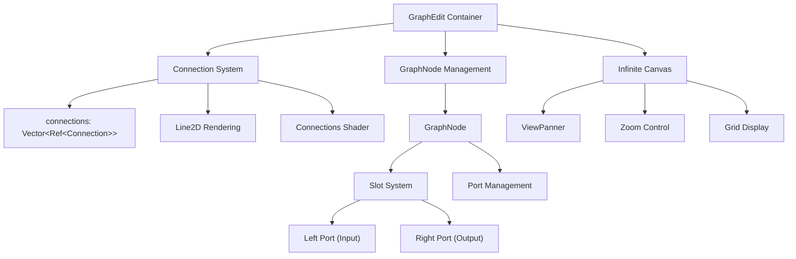
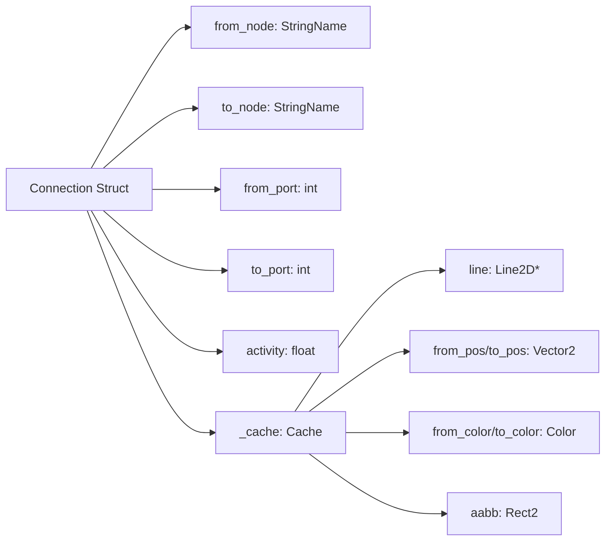
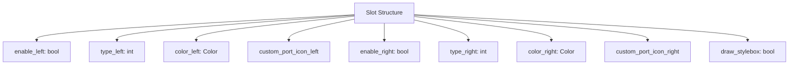
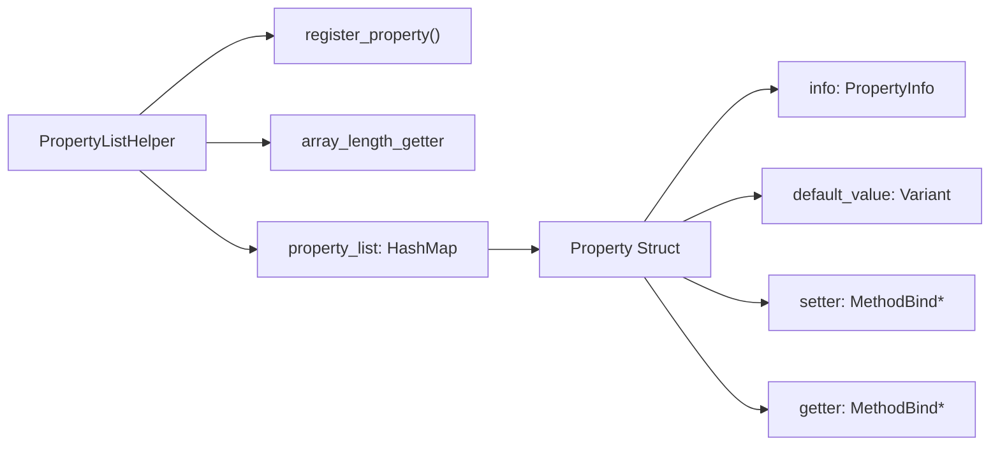

# Tree and Item List Controls

<details>
<summary>Relevant source files</summary>

The following files were used as context for generating this wiki page:

- [doc/classes/AcceptDialog.xml](https://github.com/godotengine/godot/blob/4219ce91/doc/classes/AcceptDialog.xml)
- [doc/classes/BaseButton.xml](https://github.com/godotengine/godot/blob/4219ce91/doc/classes/BaseButton.xml)
- [doc/classes/Button.xml](https://github.com/godotengine/godot/blob/4219ce91/doc/classes/Button.xml)
- [doc/classes/ButtonGroup.xml](https://github.com/godotengine/godot/blob/4219ce91/doc/classes/ButtonGroup.xml)
- [doc/classes/CheckBox.xml](https://github.com/godotengine/godot/blob/4219ce91/doc/classes/CheckBox.xml)
- [doc/classes/CheckButton.xml](https://github.com/godotengine/godot/blob/4219ce91/doc/classes/CheckButton.xml)
- [doc/classes/ColorPickerButton.xml](https://github.com/godotengine/godot/blob/4219ce91/doc/classes/ColorPickerButton.xml)
- [doc/classes/ItemList.xml](https://github.com/godotengine/godot/blob/4219ce91/doc/classes/ItemList.xml)
- [doc/classes/LinkButton.xml](https://github.com/godotengine/godot/blob/4219ce91/doc/classes/LinkButton.xml)
- [doc/classes/MenuButton.xml](https://github.com/godotengine/godot/blob/4219ce91/doc/classes/MenuButton.xml)
- [doc/classes/OptionButton.xml](https://github.com/godotengine/godot/blob/4219ce91/doc/classes/OptionButton.xml)
- [doc/classes/Popup.xml](https://github.com/godotengine/godot/blob/4219ce91/doc/classes/Popup.xml)
- [doc/classes/PopupMenu.xml](https://github.com/godotengine/godot/blob/4219ce91/doc/classes/PopupMenu.xml)
- [doc/classes/Tree.xml](https://github.com/godotengine/godot/blob/4219ce91/doc/classes/Tree.xml)
- [doc/classes/TreeItem.xml](https://github.com/godotengine/godot/blob/4219ce91/doc/classes/TreeItem.xml)
- [scene/gui/base_button.cpp](https://github.com/godotengine/godot/blob/4219ce91/scene/gui/base_button.cpp)
- [scene/gui/base_button.h](https://github.com/godotengine/godot/blob/4219ce91/scene/gui/base_button.h)
- [scene/gui/button.cpp](https://github.com/godotengine/godot/blob/4219ce91/scene/gui/button.cpp)
- [scene/gui/button.h](https://github.com/godotengine/godot/blob/4219ce91/scene/gui/button.h)
- [scene/gui/check_box.cpp](https://github.com/godotengine/godot/blob/4219ce91/scene/gui/check_box.cpp)
- [scene/gui/check_box.h](https://github.com/godotengine/godot/blob/4219ce91/scene/gui/check_box.h)
- [scene/gui/check_button.cpp](https://github.com/godotengine/godot/blob/4219ce91/scene/gui/check_button.cpp)
- [scene/gui/check_button.h](https://github.com/godotengine/godot/blob/4219ce91/scene/gui/check_button.h)
- [scene/gui/dialogs.cpp](https://github.com/godotengine/godot/blob/4219ce91/scene/gui/dialogs.cpp)
- [scene/gui/dialogs.h](https://github.com/godotengine/godot/blob/4219ce91/scene/gui/dialogs.h)
- [scene/gui/item_list.cpp](https://github.com/godotengine/godot/blob/4219ce91/scene/gui/item_list.cpp)
- [scene/gui/item_list.h](https://github.com/godotengine/godot/blob/4219ce91/scene/gui/item_list.h)
- [scene/gui/link_button.cpp](https://github.com/godotengine/godot/blob/4219ce91/scene/gui/link_button.cpp)
- [scene/gui/link_button.h](https://github.com/godotengine/godot/blob/4219ce91/scene/gui/link_button.h)
- [scene/gui/menu_button.cpp](https://github.com/godotengine/godot/blob/4219ce91/scene/gui/menu_button.cpp)
- [scene/gui/menu_button.h](https://github.com/godotengine/godot/blob/4219ce91/scene/gui/menu_button.h)
- [scene/gui/option_button.cpp](https://github.com/godotengine/godot/blob/4219ce91/scene/gui/option_button.cpp)
- [scene/gui/option_button.h](https://github.com/godotengine/godot/blob/4219ce91/scene/gui/option_button.h)
- [scene/gui/popup.cpp](https://github.com/godotengine/godot/blob/4219ce91/scene/gui/popup.cpp)
- [scene/gui/popup.h](https://github.com/godotengine/godot/blob/4219ce91/scene/gui/popup.h)
- [scene/gui/popup_menu.cpp](https://github.com/godotengine/godot/blob/4219ce91/scene/gui/popup_menu.cpp)
- [scene/gui/popup_menu.h](https://github.com/godotengine/godot/blob/4219ce91/scene/gui/popup_menu.h)
- [scene/gui/tree.cpp](https://github.com/godotengine/godot/blob/4219ce91/scene/gui/tree.cpp)
- [scene/gui/tree.h](https://github.com/godotengine/godot/blob/4219ce91/scene/gui/tree.h)
- [scene/property_list_helper.cpp](https://github.com/godotengine/godot/blob/4219ce91/scene/property_list_helper.cpp)
- [scene/property_list_helper.h](https://github.com/godotengine/godot/blob/4219ce91/scene/property_list_helper.h)

</details>


This document provides technical documentation for Godot's primary controls for displaying and interacting with hierarchical and list-based data: `Tree`, `TreeItem`, and `ItemList`. These controls are core to the GUI system and are used for structured data presentation, selection, and editing.

For text editing controls, see page [3.2]. For button and menu controls, see page [3.4]. For editor-specific controls, see [5.4] and [5.5].

## Tree Control System

The `Tree` control is a GUI component for displaying hierarchical data using a tree structure. It is composed of a `Tree` node, which manages a hierarchy of `TreeItem` objects. Each `TreeItem` can have multiple children and multiple columns, with each cell supporting different display and interaction modes.

### Diagram: Tree Control and Code Entities

```mermaid
graph TD
    "Tree(scene/gui/tree.h)"["Tree (scene/gui/tree.h)"] --> "TreeItem(scene/gui/tree.h)"["TreeItem (scene/gui/tree.h)"]
    "Tree(scene/gui/tree.h)" --> "columns:Vector<ColumnInfo>"["columns: Vector<ColumnInfo>"]
    "Tree(scene/gui/tree.h)" --> "SelectionSystem"["Selection System"]
    "TreeItem(scene/gui/tree.h)" --> "parent:TreeItem*"["parent: TreeItem*"]
    "TreeItem(scene/gui/tree.h)" --> "first_child:TreeItem*"["first_child: TreeItem*"]
    "TreeItem(scene/gui/tree.h)" --> "cells:Vector<Cell>"["cells: Vector<Cell>"]
    "cells:Vector<Cell>" --> "mode:TreeCellMode"["mode: TreeCellMode"]
    "cells:Vector<Cell>" --> "text:String"["text: String"]
    "cells:Vector<Cell>" --> "icon:Ref<Texture2D>"["icon: Ref<Texture2D>"]
    "cells:Vector<Cell>" --> "buttons:Vector<Button>"["buttons: Vector<Button>"]
    "SelectionSystem" --> "SELECT_SINGLE"
    "SelectionSystem" --> "SELECT_ROW"
    "SelectionSystem" --> "SELECT_MULTI"
```
Sources: [scene/gui/tree.h:47-443](https://github.com/godotengine/godot/blob/4219ce91/scene/gui/tree.h#L47-L443), [scene/gui/tree.cpp:51-1346](https://github.com/godotengine/godot/blob/4219ce91/scene/gui/tree.cpp#L51-L1346)


### TreeItem Data Structure

Each `TreeItem` represents a node in the tree and maintains pointers to its parent, siblings, and children. Each item contains a vector of `Cell` structures, one per column, which store the cell's content and state.

#### Diagram: TreeItem and Cell Structure

```mermaid
graph LR
    "TreeItem" --> "parent:TreeItem*"
    "TreeItem" --> "prev:TreeItem*"
    "TreeItem" --> "next:TreeItem*"
    "TreeItem" --> "first_child:TreeItem*"
    "TreeItem" --> "last_child:TreeItem*"
    "TreeItem" --> "cells:Vector<Cell>"
    "Cell" --> "mode:TreeCellMode"
    "Cell" --> "text:String"
    "Cell" --> "icon:Ref<Texture2D>"
    "Cell" --> "buttons:Vector<Button>"
    "Cell" --> "meta:Variant"
    "Cell" --> "text_buf:Ref<TextParagraph>"
```
Sources: [scene/gui/tree.h:61-133](https://github.com/godotengine/godot/blob/4219ce91/scene/gui/tree.h#L61-L133), [scene/gui/tree.h:146-154](https://github.com/godotengine/godot/blob/4219ce91/scene/gui/tree.h#L146-L154), [scene/gui/tree.cpp:51-204](https://github.com/godotengine/godot/blob/4219ce91/scene/gui/tree.cpp#L51-L204)


### Tree Cell Modes

Each cell in a `TreeItem` can operate in one of several modes, which determine its display and interaction behavior:

| Cell Mode           | Description                | Key Properties                |
|---------------------|---------------------------|-------------------------------|
| `CELL_MODE_STRING`  | Text display/edit         | `text`, `editable`, `text_buf`|
| `CELL_MODE_CHECK`   | Checkbox                  | `checked`, `indeterminate`    |
| `CELL_MODE_RANGE`   | Numeric slider/range      | `min`, `max`, `step`, `val`   |
| `CELL_MODE_ICON`    | Icon display              | `icon`, `icon_region`, `icon_color` |
| `CELL_MODE_CUSTOM`  | Custom rendering callback | `custom_draw_callback`        |

Cells also support embedded buttons, custom colors, tooltips, and accessibility metadata.

Sources: [scene/gui/tree.h:50-57](https://github.com/godotengine/godot/blob/4219ce91/scene/gui/tree.h#L50-L57), [scene/gui/tree.cpp:183-204](https://github.com/godotengine/godot/blob/4219ce91/scene/gui/tree.cpp#L183-L204), [scene/gui/tree.h:61-133](https://github.com/godotengine/godot/blob/4219ce91/scene/gui/tree.h#L61-L133)


### Selection Modes

The `Tree` control supports three selection modes, which affect how users can select items:

| Selection Mode   | Description                                 |
|------------------|---------------------------------------------|
| `SELECT_SINGLE`  | Single cell selection                       |
| `SELECT_ROW`     | Entire row selection                        |
| `SELECT_MULTI`   | Multiple cells or rows can be selected      |

#### Diagram: Tree Selection Mode State Machine

```mermaid
stateDiagram-v2
    [*] --> "SELECT_SINGLE"
    [*] --> "SELECT_ROW"
    [*] --> "SELECT_MULTI"
    "SELECT_SINGLE" --> "item_selected signal"
    "SELECT_ROW" --> "item_selected signal"
    "SELECT_MULTI" --> "multi_selected signal"
```
Sources: [scene/gui/tree.h:451-455](https://github.com/godotengine/godot/blob/4219ce91/scene/gui/tree.h#L451-L455), [scene/gui/tree.cpp:557-572](https://github.com/godotengine/godot/blob/4219ce91/scene/gui/tree.cpp#L557-L572)


## ItemList Control System

The `ItemList` control provides a flat, optionally multi-column list for displaying and selecting items. Each item can have text, an icon, metadata, and custom colors.

### Diagram: ItemList Structure and Code Entities

```mermaid
graph TD
    "ItemList(scene/gui/item_list.h)"["ItemList (scene/gui/item_list.h)"] --> "items:Vector<Item>"["items: Vector<Item>"]
    "ItemList(scene/gui/item_list.h)" --> "LayoutSystem"
    "ItemList(scene/gui/item_list.h)" --> "SelectionMode"
    "items:Vector<Item>" --> "Item"
    "Item" --> "icon:Ref<Texture2D>"
    "Item" --> "text:String"
    "Item" --> "text_buf:Ref<TextParagraph>"
    "Item" --> "metadata:Variant"
    "Item" --> "selected:bool"
    "Item" --> "disabled:bool"
    "LayoutSystem" --> "icon_mode"
    "LayoutSystem" --> "current_columns"
    "LayoutSystem" --> "fixed_column_width"
    "icon_mode" --> "ICON_MODE_TOP"
    "icon_mode" --> "ICON_MODE_LEFT"
    "SelectionMode" --> "SELECT_SINGLE"
    "SelectionMode" --> "SELECT_MULTI"
    "SelectionMode" --> "SELECT_TOGGLE"
```
Sources: [scene/gui/item_list.h:38-92](https://github.com/godotengine/godot/blob/4219ce91/scene/gui/item_list.h#L38-L92), [scene/gui/item_list.cpp:56-326](https://github.com/godotengine/godot/blob/4219ce91/scene/gui/item_list.cpp#L56-L326)


### Item Management and Properties

Items in `ItemList` are managed as a vector of `Item` structs, each supporting a range of properties for display and interaction.

#### Diagram: ItemList Item Creation and Property Assignment

```mermaid
graph LR
    "add_item()" --> "Item"
    "add_icon_item()" --> "Item"
    "Item" --> "text"
    "Item" --> "icon"
    "Item" --> "text_buf"
    "Item" --> "metadata"
    "Item" --> "selected"
    "Item" --> "disabled"
    "Item" --> "custom_bg"
    "Item" --> "custom_fg"
    "set_item_text()" --> "text"
    "set_item_icon()" --> "icon"
    "set_item_metadata()" --> "metadata"
    "set_item_selectable()" --> "selected"
    "set_item_disabled()" --> "disabled"
    "set_item_custom_bg_color()" --> "custom_bg"
    "set_item_custom_fg_color()" --> "custom_fg"
```
Sources: [scene/gui/item_list.cpp:56-86](https://github.com/godotengine/godot/blob/4219ce91/scene/gui/item_list.cpp#L56-L86), [scene/gui/item_list.cpp:205-326](https://github.com/godotengine/godot/blob/4219ce91/scene/gui/item_list.cpp#L205-L326)


### Layout and Display Modes

`ItemList` supports two icon display modes, which affect the arrangement of icons and text:

| Icon Mode        | Layout Behavior      | Text Wrapping                |
|------------------|---------------------|------------------------------|
| `ICON_MODE_TOP`  | Icon above text     | Enabled with `max_text_lines`|
| `ICON_MODE_LEFT` | Icon left of text   | Disabled                     |

The layout system manages column arrangement, item positioning, and scrollbars based on content and configuration.

Sources: [scene/gui/item_list.h:42-45](https://github.com/godotengine/godot/blob/4219ce91/scene/gui/item_list.h#L42-L45), [scene/gui/item_list.cpp:661-675](https://github.com/godotengine/godot/blob/4219ce91/scene/gui/item_list.cpp#L661-L675), [scene/gui/item_list.cpp:1077-1350](https://github.com/godotengine/godot/blob/4219ce91/scene/gui/item_list.cpp#L1077-L1350)


## Graph-Based Controls

The graph editing system consists of `GraphEdit` as the container and `GraphNode` as connectable elements, designed for visual programming interfaces.



Sources: [scene/gui/graph_edit.h:113-149](https://github.com/godotengine/godot/blob/4219ce91/scene/gui/graph_edit.h#L113-L149), [scene/gui/graph_node.h:37-54](https://github.com/godotengine/godot/blob/4219ce91/scene/gui/graph_node.h#L37-L54)

### Connection System

GraphEdit manages connections between nodes through a structured connection system:



Sources: [scene/gui/graph_edit.h:117-137](https://github.com/godotengine/godot/blob/4219ce91/scene/gui/graph_edit.h#L117-L137), [scene/gui/graph_edit.cpp:262-306](https://github.com/godotengine/godot/blob/4219ce91/scene/gui/graph_edit.cpp#L262-L306)

### GraphNode Slot Configuration

GraphNodes use a slot-based system where each slot can have input and/or output ports:



Sources: [scene/gui/graph_node.h:42-54](https://github.com/godotengine/godot/blob/4219ce91/scene/gui/graph_node.h#L42-L54), [scene/gui/graph_node.cpp:75-84](https://github.com/godotengine/godot/blob/4219ce91/scene/gui/graph_node.cpp#L75-L84)

## Common Infrastructure

### Property Management System

The controls utilize `PropertyListHelper` for dynamic property registration and management, particularly for array-like properties:



Sources: [scene/property_list_helper.h:36-43](https://github.com/godotengine/godot/blob/4219ce91/scene/property_list_helper.h#L36-L43), [scene/property_list_helper.cpp:94-100](https://github.com/godotengine/godot/blob/4219ce91/scene/property_list_helper.cpp#L94-L100)

This system enables dynamic property exposure for items in ItemList and slots in GraphNode, allowing the editor to present configurable properties for each element in arrays or collections.