# Windows and Popups

Relevant source files

The following files were used as context for generating this wiki page:

- [doc/classes/AcceptDialog.xml](https://github.com/godotengine/godot/blob/4219ce91/doc/classes/AcceptDialog.xml)
- [doc/classes/BaseButton.xml](https://github.com/godotengine/godot/blob/4219ce91/doc/classes/BaseButton.xml)
- [doc/classes/Button.xml](https://github.com/godotengine/godot/blob/4219ce91/doc/classes/Button.xml)
- [doc/classes/ButtonGroup.xml](https://github.com/godotengine/godot/blob/4219ce91/doc/classes/ButtonGroup.xml)
- [doc/classes/CheckBox.xml](https://github.com/godotengine/godot/blob/4219ce91/doc/classes/CheckBox.xml)
- [doc/classes/CheckButton.xml](https://github.com/godotengine/godot/blob/4219ce91/doc/classes/CheckButton.xml)
- [doc/classes/ColorPickerButton.xml](https://github.com/godotengine/godot/blob/4219ce91/doc/classes/ColorPickerButton.xml)
- [doc/classes/Control.xml](https://github.com/godotengine/godot/blob/4219ce91/doc/classes/Control.xml)
- [doc/classes/ItemList.xml](https://github.com/godotengine/godot/blob/4219ce91/doc/classes/ItemList.xml)
- [doc/classes/LinkButton.xml](https://github.com/godotengine/godot/blob/4219ce91/doc/classes/LinkButton.xml)
- [doc/classes/MenuButton.xml](https://github.com/godotengine/godot/blob/4219ce91/doc/classes/MenuButton.xml)
- [doc/classes/Node.xml](https://github.com/godotengine/godot/blob/4219ce91/doc/classes/Node.xml)
- [doc/classes/OptionButton.xml](https://github.com/godotengine/godot/blob/4219ce91/doc/classes/OptionButton.xml)
- [doc/classes/Popup.xml](https://github.com/godotengine/godot/blob/4219ce91/doc/classes/Popup.xml)
- [doc/classes/PopupMenu.xml](https://github.com/godotengine/godot/blob/4219ce91/doc/classes/PopupMenu.xml)
- [doc/classes/SceneTree.xml](https://github.com/godotengine/godot/blob/4219ce91/doc/classes/SceneTree.xml)
- [doc/classes/Theme.xml](https://github.com/godotengine/godot/blob/4219ce91/doc/classes/Theme.xml)
- [doc/classes/Tree.xml](https://github.com/godotengine/godot/blob/4219ce91/doc/classes/Tree.xml)
- [doc/classes/TreeItem.xml](https://github.com/godotengine/godot/blob/4219ce91/doc/classes/TreeItem.xml)
- [doc/classes/Viewport.xml](https://github.com/godotengine/godot/blob/4219ce91/doc/classes/Viewport.xml)
- [doc/classes/Window.xml](https://github.com/godotengine/godot/blob/4219ce91/doc/classes/Window.xml)
- [scene/gui/base_button.cpp](https://github.com/godotengine/godot/blob/4219ce91/scene/gui/base_button.cpp)
- [scene/gui/base_button.h](https://github.com/godotengine/godot/blob/4219ce91/scene/gui/base_button.h)
- [scene/gui/button.cpp](https://github.com/godotengine/godot/blob/4219ce91/scene/gui/button.cpp)
- [scene/gui/button.h](https://github.com/godotengine/godot/blob/4219ce91/scene/gui/button.h)
- [scene/gui/check_box.cpp](https://github.com/godotengine/godot/blob/4219ce91/scene/gui/check_box.cpp)
- [scene/gui/check_box.h](https://github.com/godotengine/godot/blob/4219ce91/scene/gui/check_box.h)
- [scene/gui/check_button.cpp](https://github.com/godotengine/godot/blob/4219ce91/scene/gui/check_button.cpp)
- [scene/gui/check_button.h](https://github.com/godotengine/godot/blob/4219ce91/scene/gui/check_button.h)
- [scene/gui/control.cpp](https://github.com/godotengine/godot/blob/4219ce91/scene/gui/control.cpp)
- [scene/gui/control.h](https://github.com/godotengine/godot/blob/4219ce91/scene/gui/control.h)
- [scene/gui/dialogs.cpp](https://github.com/godotengine/godot/blob/4219ce91/scene/gui/dialogs.cpp)
- [scene/gui/dialogs.h](https://github.com/godotengine/godot/blob/4219ce91/scene/gui/dialogs.h)
- [scene/gui/item_list.cpp](https://github.com/godotengine/godot/blob/4219ce91/scene/gui/item_list.cpp)
- [scene/gui/item_list.h](https://github.com/godotengine/godot/blob/4219ce91/scene/gui/item_list.h)
- [scene/gui/link_button.cpp](https://github.com/godotengine/godot/blob/4219ce91/scene/gui/link_button.cpp)
- [scene/gui/link_button.h](https://github.com/godotengine/godot/blob/4219ce91/scene/gui/link_button.h)
- [scene/gui/menu_button.cpp](https://github.com/godotengine/godot/blob/4219ce91/scene/gui/menu_button.cpp)
- [scene/gui/menu_button.h](https://github.com/godotengine/godot/blob/4219ce91/scene/gui/menu_button.h)
- [scene/gui/option_button.cpp](https://github.com/godotengine/godot/blob/4219ce91/scene/gui/option_button.cpp)
- [scene/gui/option_button.h](https://github.com/godotengine/godot/blob/4219ce91/scene/gui/option_button.h)
- [scene/gui/popup.cpp](https://github.com/godotengine/godot/blob/4219ce91/scene/gui/popup.cpp)
- [scene/gui/popup.h](https://github.com/godotengine/godot/blob/4219ce91/scene/gui/popup.h)
- [scene/gui/popup_menu.cpp](https://github.com/godotengine/godot/blob/4219ce91/scene/gui/popup_menu.cpp)
- [scene/gui/popup_menu.h](https://github.com/godotengine/godot/blob/4219ce91/scene/gui/popup_menu.h)
- [scene/gui/tree.cpp](https://github.com/godotengine/godot/blob/4219ce91/scene/gui/tree.cpp)
- [scene/gui/tree.h](https://github.com/godotengine/godot/blob/4219ce91/scene/gui/tree.h)
- [scene/main/node.cpp](https://github.com/godotengine/godot/blob/4219ce91/scene/main/node.cpp)
- [scene/main/node.h](https://github.com/godotengine/godot/blob/4219ce91/scene/main/node.h)
- [scene/main/scene_tree.cpp](https://github.com/godotengine/godot/blob/4219ce91/scene/main/scene_tree.cpp)
- [scene/main/scene_tree.h](https://github.com/godotengine/godot/blob/4219ce91/scene/main/scene_tree.h)
- [scene/main/viewport.cpp](https://github.com/godotengine/godot/blob/4219ce91/scene/main/viewport.cpp)
- [scene/main/viewport.h](https://github.com/godotengine/godot/blob/4219ce91/scene/main/viewport.h)
- [scene/main/window.cpp](https://github.com/godotengine/godot/blob/4219ce91/scene/main/window.cpp)
- [scene/main/window.h](https://github.com/godotengine/godot/blob/4219ce91/scene/main/window.h)
- [scene/property_list_helper.cpp](https://github.com/godotengine/godot/blob/4219ce91/scene/property_list_helper.cpp)
- [scene/property_list_helper.h](https://github.com/godotengine/godot/blob/4219ce91/scene/property_list_helper.h)
- [scene/resources/theme.cpp](https://github.com/godotengine/godot/blob/4219ce91/scene/resources/theme.cpp)
- [scene/resources/theme.h](https://github.com/godotengine/godot/blob/4219ce91/scene/resources/theme.h)

## Purpose and Scope

This document covers the Window and Popup system in Godot Engine, which provides windowing capabilities for both native OS windows and embedded sub-windows. This includes the `Window` base class, the embedded window (sub-window) management system within `Viewport`, and the `Popup` family of classes.

For information about the base GUI control system, see [GUI System](#3). For viewport rendering contexts and rendering surfaces, see [Viewport and Rendering Contexts](#2.2).

---

## System Architecture

The Window and Popup system consists of three primary components: the `Window` class (which extends `Viewport`), the sub-window management system within `Viewport`, and the `Popup` class hierarchy for transient windows.

### Core Class Hierarchy

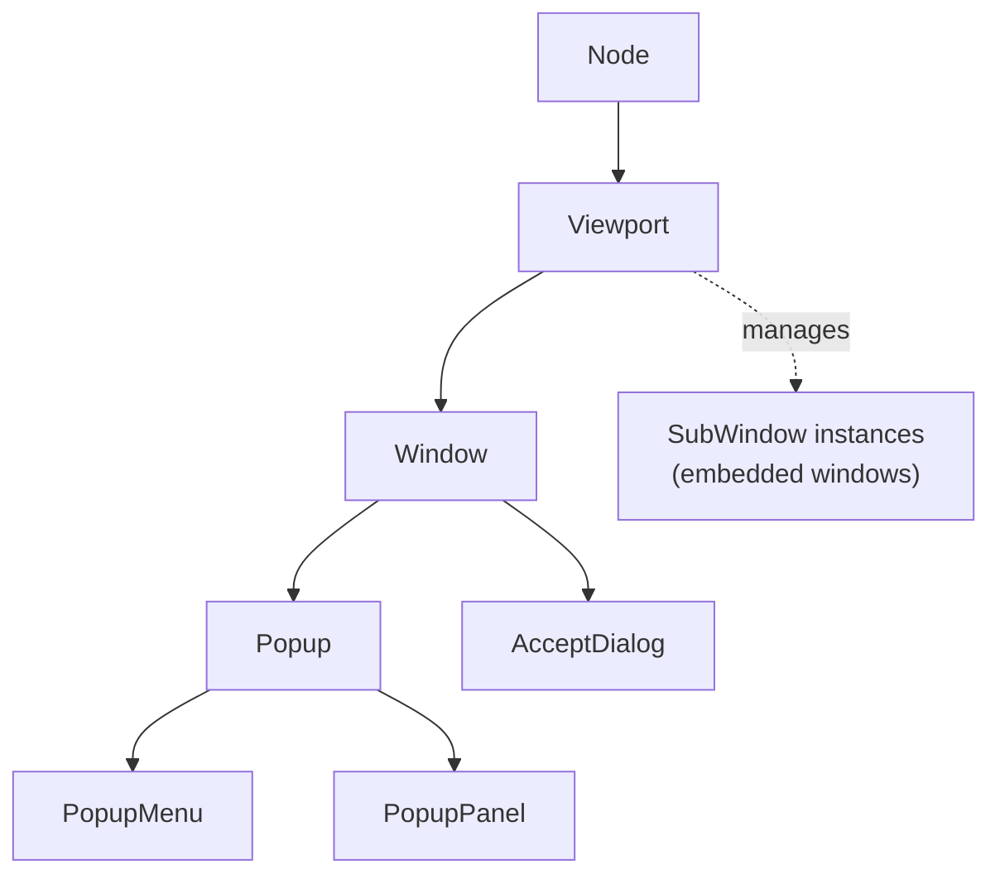

**Sources:** [scene/main/window.h:1-300](https://github.com/godotengine/godot/blob/4219ce91/scene/main/window.h#L1-L300), [scene/main/viewport.h:94-96](https://github.com/godotengine/godot/blob/4219ce91/scene/main/viewport.h#L94-L96), [scene/gui/popup.cpp:1-200](https://github.com/godotengine/godot/blob/4219ce91/scene/gui/popup.cpp#L1-L200)

---

## Window Class

The `Window` class is the base class for all windows, dialogs, and popups. A window can exist as either a native OS window (with its own DisplayServer WindowID) or as an embedded window inside another `Viewport`.

### Window Types and Modes

| Mode | Description | WindowID | Parent Relationship |
|------|-------------|----------|---------------------|
| Native Window | OS-managed window with decorations | Valid `DisplayServer::WindowID` | Can be root or child of another window |
| Embedded Window | Rendered within parent viewport | `INVALID_WINDOW_ID` | Child of a `Viewport` with `gui_embed_subwindows=true` |

**Sources:** [scene/main/window.cpp:1-100](https://github.com/godotengine/godot/blob/4219ce91/scene/main/window.cpp#L1-L100), [doc/classes/Window.xml:1-20](https://github.com/godotengine/godot/blob/4219ce91/doc/classes/Window.xml#L1-L20)

### Window Positioning

Windows support several initial positioning modes defined by the `WindowInitialPosition` enum:

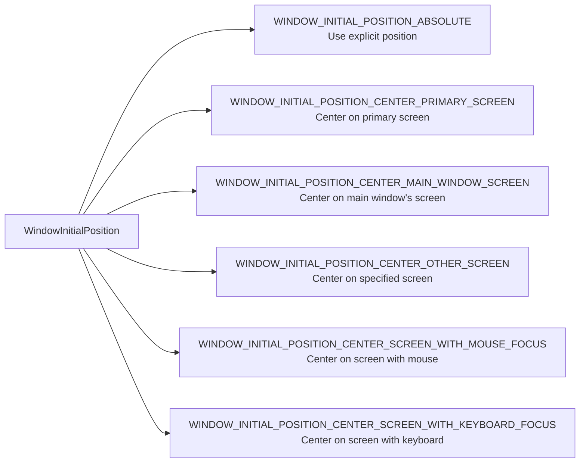

**Sources:** [scene/main/window.h:62-75](https://github.com/godotengine/godot/blob/4219ce91/scene/main/window.h#L62-L75), [scene/main/window.cpp:332-343](https://github.com/godotengine/godot/blob/4219ce91/scene/main/window.cpp#L332-L343)

### Window Flags

Windows can be configured with various flags that control their behavior:

| Flag | Enum Value | Description |
|------|------------|-------------|
| `FLAG_RESIZE_DISABLED` | 0 | Disables window resizing |
| `FLAG_BORDERLESS` | 1 | Removes window decorations |
| `FLAG_ALWAYS_ON_TOP` | 2 | Window stays above others |
| `FLAG_TRANSPARENT` | 3 | Window background is transparent |
| `FLAG_NO_FOCUS` | 4 | Window cannot receive focus |
| `FLAG_POPUP` | 5 | Window behaves as a popup |
| `FLAG_EXTEND_TO_TITLE` | 6 | Content extends to title bar |
| `FLAG_MOUSE_PASSTHROUGH` | 7 | Mouse events pass through window |

**Sources:** [scene/main/window.h:76-90](https://github.com/godotengine/godot/blob/4219ce91/scene/main/window.h#L76-L90), [scene/main/window.cpp:689-750](https://github.com/godotengine/godot/blob/4219ce91/scene/main/window.cpp#L689-L750)

---

## Embedded Window (Sub-Window) System

When `Viewport.gui_embed_subwindows` is enabled, child `Window` nodes are rendered as embedded sub-windows within the viewport rather than as separate OS windows. The viewport manages these through a sub-window system.

### Sub-Window Data Structure

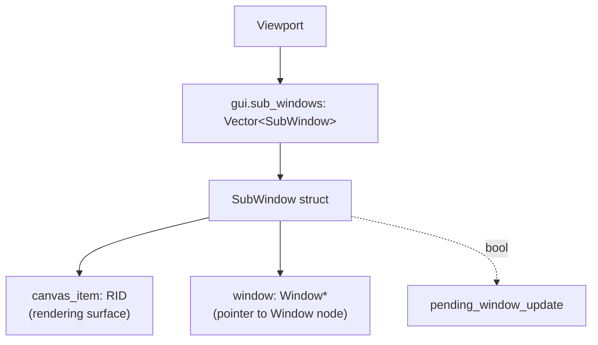

**Sources:** [scene/main/viewport.h:217-221](https://github.com/godotengine/godot/blob/4219ce91/scene/main/viewport.h#L217-L221), [scene/main/viewport.cpp:294-326](https://github.com/godotengine/godot/blob/4219ce91/scene/main/viewport.cpp#L294-L326)

### Sub-Window Registration Flow

The sub-window lifecycle is managed through several key methods in the `Viewport` class:

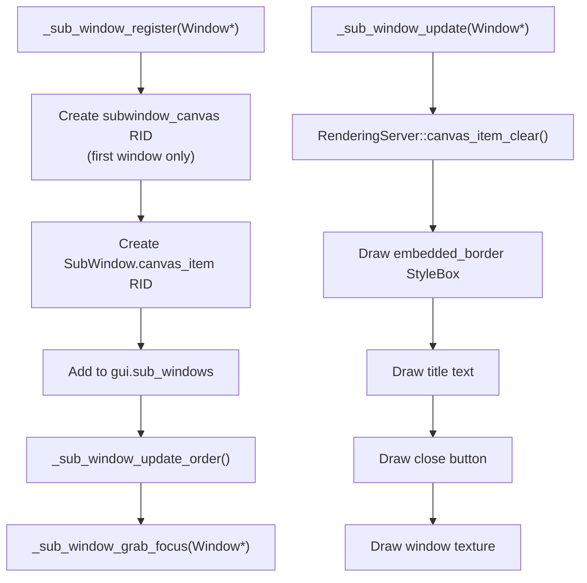

**Sources:** [scene/main/viewport.cpp:294-326](https://github.com/godotengine/godot/blob/4219ce91/scene/main/viewport.cpp#L294-L326), [scene/main/viewport.cpp:328-384](https://github.com/godotengine/godot/blob/4219ce91/scene/main/viewport.cpp#L328-L384)

### Sub-Window Focus Management

Focus handling for embedded windows differs from native windows since they share the same OS window:

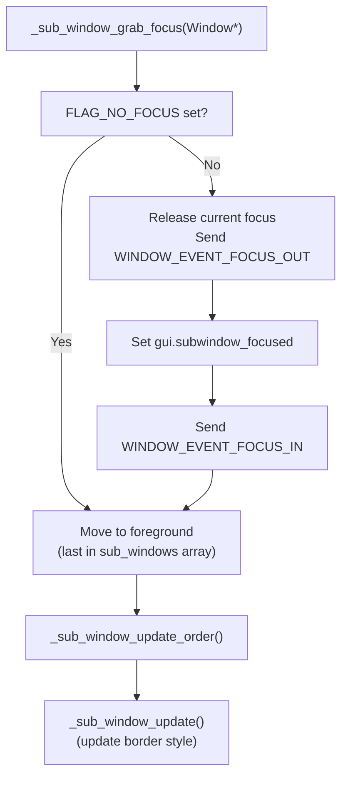

**Sources:** [scene/main/viewport.cpp:386-458](https://github.com/godotengine/godot/blob/4219ce91/scene/main/viewport.cpp#L386-L458)

### Sub-Window Z-Order Management

The `_sub_window_update_order()` method maintains proper rendering order, ensuring windows with `FLAG_ALWAYS_ON_TOP` stay on top:

**Algorithm:**
1. If the last window doesn't have `FLAG_ALWAYS_ON_TOP`, find the first non-always-on-top window from the end
2. Move it to that position
3. Update canvas draw indices via `RenderingServer::canvas_item_set_draw_index()`

**Sources:** [scene/main/viewport.cpp:270-292](https://github.com/godotengine/godot/blob/4219ce91/scene/main/viewport.cpp#L270-L292)

---

## Popup System

The `Popup` class extends `Window` to provide transient window behavior with automatic hiding and exclusive popup management.

### Popup Behavior

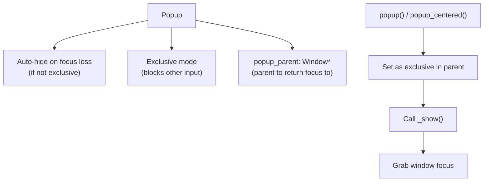

**Sources:** [scene/gui/popup.cpp:1-200](https://github.com/godotengine/godot/blob/4219ce91/scene/gui/popup.cpp#L1-L200), [scene/gui/popup.h:1-100](https://github.com/godotengine/godot/blob/4219ce91/scene/gui/popup.h#L1-L100)

### Popup Visibility Control

Popups have several methods for controlling their appearance:

| Method | Description | Behavior |
|--------|-------------|----------|
| `popup()` | Show popup at current position | Shows without changing position |
| `popup_on_parent(Rect2)` | Show at rect in parent coords | Positions relative to parent |
| `popup_centered(Size2)` | Show centered in parent | Centers with optional size |
| `popup_centered_ratio(float)` | Show centered with ratio | Size as ratio of parent |
| `popup_centered_clamped(Size2, float)` | Centered with max size | Clamped to parent ratio |

**Sources:** [scene/gui/popup.cpp:50-150](https://github.com/godotengine/godot/blob/4219ce91/scene/gui/popup.cpp#L50-L150)

---

## PopupMenu

`PopupMenu` is a specialized popup for displaying interactive menu items. It can operate as either a native menu (via `NativeMenu`) or as a visual popup control.

### PopupMenu Architecture

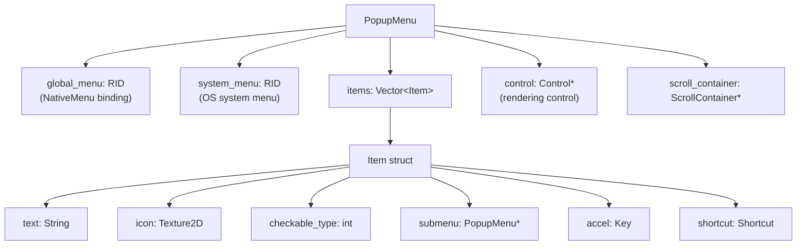

**Sources:** [scene/gui/popup_menu.h:1-200](https://github.com/godotengine/godot/blob/4219ce91/scene/gui/popup_menu.h#L1-L200), [scene/gui/popup_menu.cpp:44-180](https://github.com/godotengine/godot/blob/4219ce91/scene/gui/popup_menu.cpp#L44-L180)

### Native Menu Integration

PopupMenu can bind to native OS menus through the `NativeMenu` singleton:

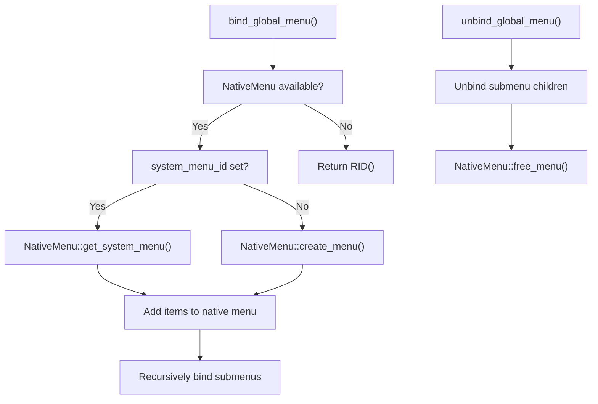

**Sources:** [scene/gui/popup_menu.cpp:80-175](https://github.com/godotengine/godot/blob/4219ce91/scene/gui/popup_menu.cpp#L80-L175)

### PopupMenu Item Management

Items in a PopupMenu are stored in a `Vector<Item>` and managed through various methods:

| Method Pattern | Description |
|----------------|-------------|
| `add_item(text, id)` | Add basic menu item |
| `add_icon_item(icon, text, id)` | Add item with icon |
| `add_check_item(text, id)` | Add checkable item |
| `add_radio_check_item(text, id)` | Add radio button item |
| `add_submenu_item(text, submenu)` | Add item with submenu |
| `add_separator()` | Add visual separator |
| `set_item_*()` | Modify item properties |
| `get_item_*()` | Query item properties |

**Sources:** [scene/gui/popup_menu.cpp:500-1500](https://github.com/godotengine/godot/blob/4219ce91/scene/gui/popup_menu.cpp#L500-L1500)

---

## Window Event System

Windows receive events through the `_event_callback()` method, which processes `DisplayServer::WindowEvent` types:

### Window Event Flow

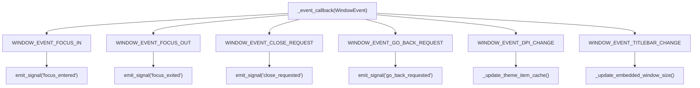

**Sources:** [scene/main/window.cpp:1300-1450](https://github.com/godotengine/godot/blob/4219ce91/scene/main/window.cpp#L1300-L1450)

---

## Window Lifecycle

### Creation and Initialization

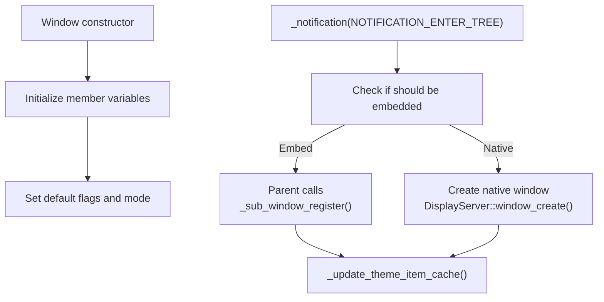

**Sources:** [scene/main/window.cpp:1800-2000](https://github.com/godotengine/godot/blob/4219ce91/scene/main/window.cpp#L1800-L2000)

### Show/Hide Flow

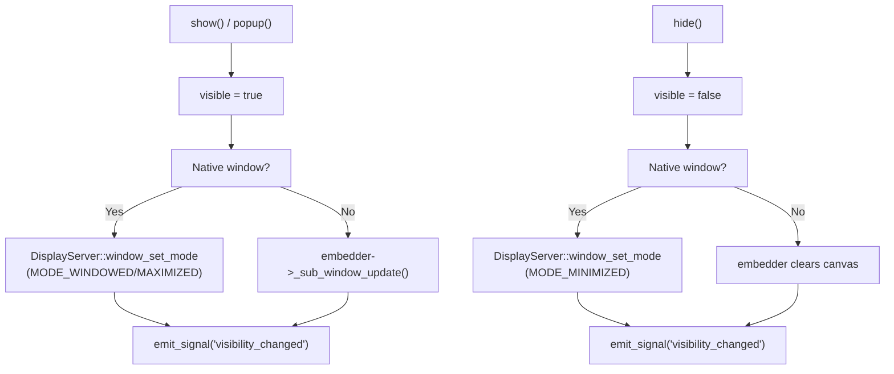

**Sources:** [scene/main/window.cpp:1000-1100](https://github.com/godotengine/godot/blob/4219ce91/scene/main/window.cpp#L1000-L1100)

### Window Destruction

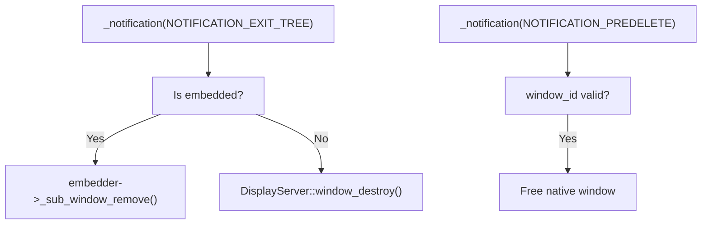

**Sources:** [scene/main/window.cpp:1700-1800](https://github.com/godotengine/godot/blob/4219ce91/scene/main/window.cpp#L1700-L1800)

---

## Embedded Window Rendering

Embedded windows are rendered through the viewport's canvas system, with special handling for window decorations.

### Rendering Pipeline for Embedded Windows

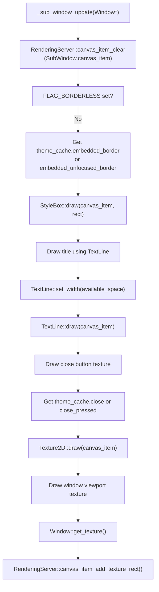

**Sources:** [scene/main/viewport.cpp:328-384](https://github.com/godotengine/godot/blob/4219ce91/scene/main/viewport.cpp#L328-L384)

### Theme Items for Embedded Windows

The embedded window appearance is controlled by theme items accessed through the `Window` class:

| Theme Item | Type | Purpose |
|------------|------|---------|
| `embedded_border` | StyleBox | Border when window is focused |
| `embedded_unfocused_border` | StyleBox | Border when window is unfocused |
| `title_font` | Font | Font for window title |
| `title_font_size` | int | Size of title font |
| `title_color` | Color | Color of title text |
| `title_outline_modulate` | Color | Color of title outline |
| `title_outline_size` | int | Width of title outline |
| `title_height` | int | Height of title bar |
| `close` | Texture2D | Normal close button |
| `close_pressed` | Texture2D | Pressed close button |
| `close_h_offset` | int | Horizontal offset for close button |
| `close_v_offset` | int | Vertical offset for close button |

**Sources:** [scene/main/window.cpp:344-374](https://github.com/godotengine/godot/blob/4219ce91/scene/main/window.cpp#L344-L374), [scene/main/window.h:120-150](https://github.com/godotengine/godot/blob/4219ce91/scene/main/window.h#L120-L150)

---

## Input Handling for Sub-Windows

Embedded windows receive input through the parent viewport's input processing, with special handling for window dragging, resizing, and close button clicks.

### Sub-Window Input Processing

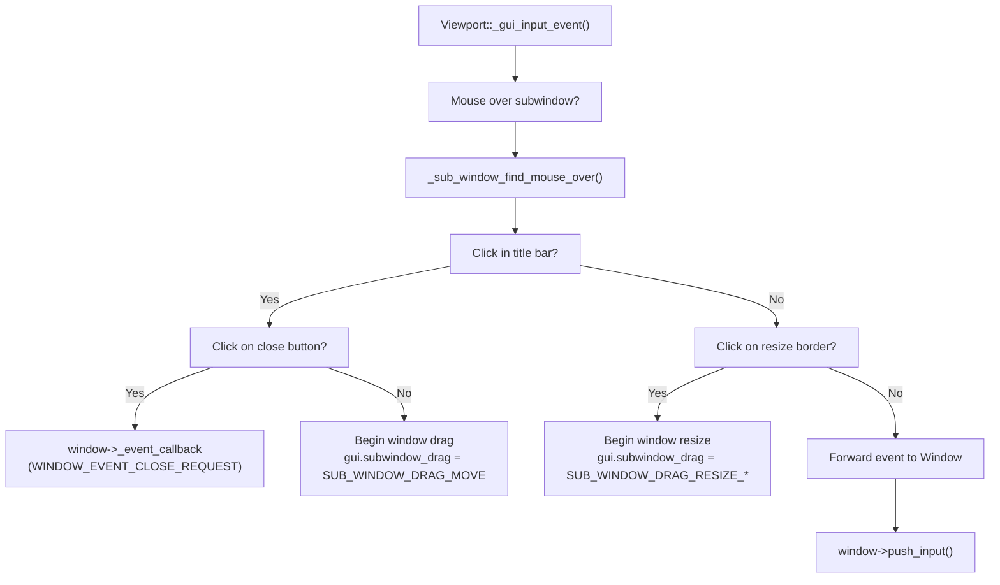

**Sources:** [scene/main/viewport.cpp:2500-2800](https://github.com/godotengine/godot/blob/4219ce91/scene/main/viewport.cpp#L2500-L2800)

### Sub-Window Dragging

Window dragging is handled by tracking the drag state in `Viewport::gui.subwindow_drag`:

```mermaid
graph TB
    DragStates["SubWindowDrag enum"]
    
    Disabled["SUB_WINDOW_DRAG_DISABLED"]
    Move["SUB_WINDOW_DRAG_MOVE"]
    ResizeTL["SUB_WINDOW_DRAG_RESIZE_TOP_LEFT"]
    ResizeT["SUB_WINDOW_DRAG_RESIZE_TOP"]
    ResizeTR["SUB_WINDOW_DRAG_RESIZE_TOP_RIGHT"]
    ResizeL["SUB_WINDOW_DRAG_RESIZE_LEFT"]
    ResizeR["SUB_WINDOW_DRAG_RESIZE_RIGHT"]
    ResizeBL["SUB_WINDOW_DRAG_RESIZE_BOTTOM_LEFT"]
    ResizeB["SUB_WINDOW_DRAG_RESIZE_BOTTOM"]
    ResizeBR["SUB_WINDOW_DRAG_RESIZE_BOTTOM_RIGHT"]
    Close["SUB_WINDOW_DRAG_CLOSE"]
    
    DragStates --> Disabled
    DragStates --> Move
    DragStates --> ResizeTL
    DragStates --> ResizeT
    DragStates --> ResizeTR
    DragStates --> ResizeL
    DragStates --> ResizeR
    DragStates --> ResizeBL
    DragStates --> ResizeB
    DragStates --> ResizeBR
    DragStates --> Close
```

**Sources:** [scene/main/viewport.h:232-245](https://github.com/godotengine/godot/blob/4219ce91/scene/main/viewport.h#L232-L245)

---

## Summary

The Window and Popup system in Godot provides a flexible windowing architecture that supports both native OS windows and embedded sub-windows:

- **Window** is the base class for all windows, inheriting from `Viewport` and providing positioning, flags, and event handling
- **Viewport** manages embedded sub-windows through the `SubWindow` struct and associated methods (`_sub_window_register`, `_sub_window_update`, etc.)
- **Popup** extends Window with transient behavior including auto-hide and exclusive mode
- **PopupMenu** specializes Popup for interactive menus with native menu integration support
- Embedded windows are rendered using RenderingServer canvas items with theme-defined decorations
- Focus management, z-ordering, and input handling are coordinated through the Viewport