# Theme System

Relevant source files

The following files were used as context for generating this wiki page:

- [doc/classes/Control.xml](https://github.com/godotengine/godot/blob/4219ce91/doc/classes/Control.xml)
- [doc/classes/Node.xml](https://github.com/godotengine/godot/blob/4219ce91/doc/classes/Node.xml)
- [doc/classes/SceneTree.xml](https://github.com/godotengine/godot/blob/4219ce91/doc/classes/SceneTree.xml)
- [doc/classes/Theme.xml](https://github.com/godotengine/godot/blob/4219ce91/doc/classes/Theme.xml)
- [doc/classes/Viewport.xml](https://github.com/godotengine/godot/blob/4219ce91/doc/classes/Viewport.xml)
- [doc/classes/Window.xml](https://github.com/godotengine/godot/blob/4219ce91/doc/classes/Window.xml)
- [scene/gui/control.cpp](https://github.com/godotengine/godot/blob/4219ce91/scene/gui/control.cpp)
- [scene/gui/control.h](https://github.com/godotengine/godot/blob/4219ce91/scene/gui/control.h)
- [scene/main/node.cpp](https://github.com/godotengine/godot/blob/4219ce91/scene/main/node.cpp)
- [scene/main/node.h](https://github.com/godotengine/godot/blob/4219ce91/scene/main/node.h)
- [scene/main/scene_tree.cpp](https://github.com/godotengine/godot/blob/4219ce91/scene/main/scene_tree.cpp)
- [scene/main/scene_tree.h](https://github.com/godotengine/godot/blob/4219ce91/scene/main/scene_tree.h)
- [scene/main/viewport.cpp](https://github.com/godotengine/godot/blob/4219ce91/scene/main/viewport.cpp)
- [scene/main/viewport.h](https://github.com/godotengine/godot/blob/4219ce91/scene/main/viewport.h)
- [scene/main/window.cpp](https://github.com/godotengine/godot/blob/4219ce91/scene/main/window.cpp)
- [scene/main/window.h](https://github.com/godotengine/godot/blob/4219ce91/scene/main/window.h)
- [scene/resources/theme.cpp](https://github.com/godotengine/godot/blob/4219ce91/scene/resources/theme.cpp)
- [scene/resources/theme.h](https://github.com/godotengine/godot/blob/4219ce91/scene/resources/theme.h)

## Purpose and Scope

The theme system provides a centralized styling mechanism for GUI controls in Godot. It allows defining visual properties (colors, fonts, icons, styleboxes, constants) that are automatically applied to `Control` and `Window` nodes throughout the scene tree. This document covers the `Theme` resource structure, theme item lookup, propagation hierarchy, and integration with the GUI system.

For information about specific GUI controls and their properties, see [Control Base Class and Layout](#3.1). For details about the scene tree structure, see [SceneTree and Node Hierarchy](#2.1).

---

## Theme Resource Architecture

### Theme Data Structure

The `Theme` class ([scene/resources/theme.h:38-230]()) is a `Resource` that stores theme items organized by theme type (typically a class name like "Button" or "Label") and data type.

**Theme Data Organization:**

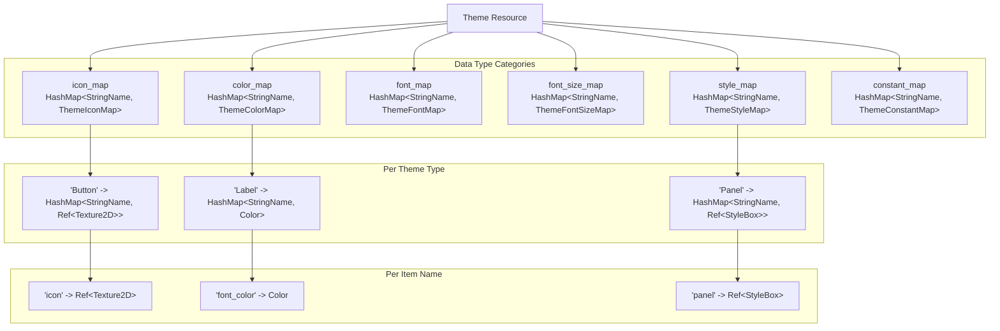

**Sources:** [scene/resources/theme.h:49-64](https://github.com/godotengine/godot/blob/4219ce91/scene/resources/theme.h#L49-L64), [scene/resources/theme.h:104-120](https://github.com/godotengine/godot/blob/4219ce91/scene/resources/theme.h#L104-L120)

### Theme Item Data Types

Six distinct data types are supported, defined in `Theme::DataType` enum:

| Data Type | Storage Type | Example Usage |
|-----------|--------------|---------------|
| `DATA_TYPE_COLOR` | `Color` | Font colors, border colors |
| `DATA_TYPE_CONSTANT` | `int` | Spacing, margins, separations |
| `DATA_TYPE_FONT` | `Ref` | Text rendering fonts |
| `DATA_TYPE_FONT_SIZE` | `int` | Font point sizes |
| `DATA_TYPE_ICON` | `Ref<Texture2D>` | Button icons, checkmarks |
| `DATA_TYPE_STYLEBOX` | `Ref<StyleBox>` | Background panels, borders |

**Theme Item Access Pattern:**

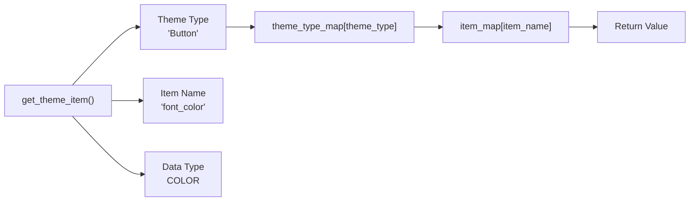

**Sources:** [scene/resources/theme.h:56-64](https://github.com/godotengine/godot/blob/4219ce91/scene/resources/theme.h#L56-L64), [scene/resources/theme.cpp:36-66](https://github.com/godotengine/godot/blob/4219ce91/scene/resources/theme.cpp#L36-L66)

---

## Theme Ownership and Propagation

### Theme Hierarchy

Themes propagate through the scene tree using a hierarchical lookup system. Each `Control` and `Window` can specify a theme, and nodes without an explicit theme inherit from their ancestors.

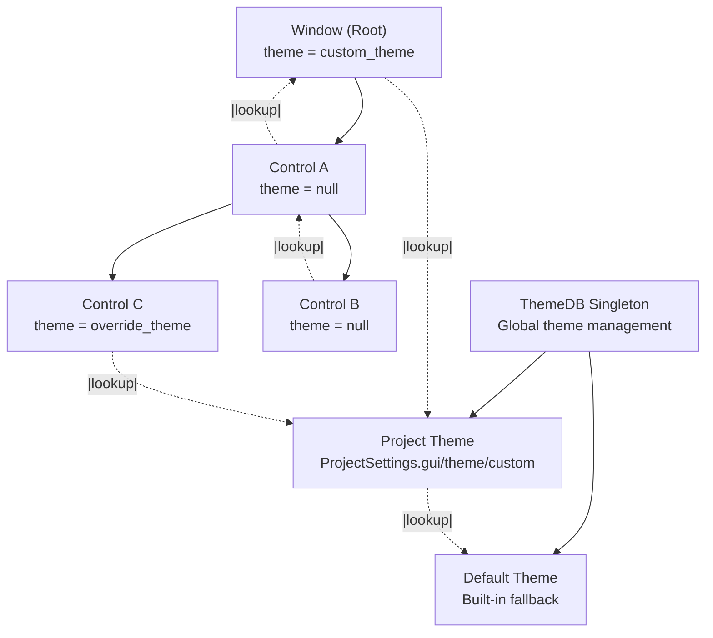

**Sources:** [scene/gui/control.cpp:460-507](https://github.com/godotengine/godot/blob/4219ce91/scene/gui/control.cpp#L460-L507), [scene/main/window.cpp:237-291](https://github.com/godotengine/godot/blob/4219ce91/scene/main/window.cpp#L237-L291)

### Theme Owner Management

The theme system uses `ThemeOwner` (mentioned in [scene/gui/control.h:42]() and [scene/main/window.h:40]()) to manage theme propagation. When a node's theme changes, it notifies all descendants that inherit from it.

**Theme Change Propagation:**

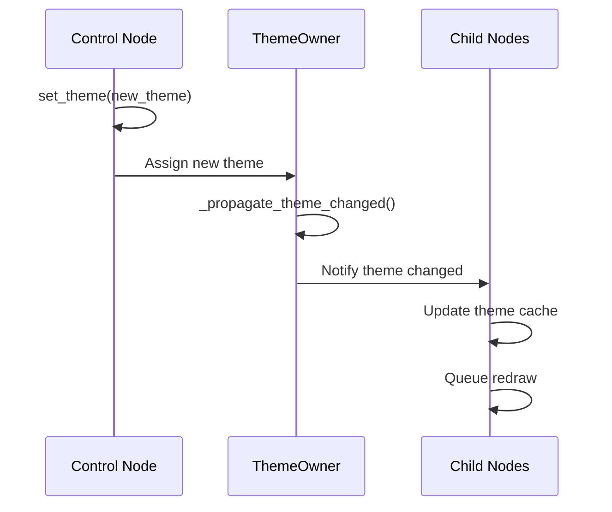

**Sources:** [scene/gui/control.cpp:2863-2906](https://github.com/godotengine/godot/blob/4219ce91/scene/gui/control.cpp#L2863-L2906), [scene/theme/theme_owner.h](https://github.com/godotengine/godot/blob/4219ce91/scene/theme/theme_owner.h) (referenced)

---

## Theme Item Lookup Process

### Lookup Order

When a control requests a theme item, the system searches through multiple sources in priority order:

1. **Local overrides** - `theme_*_override` properties on the node
2. **Node theme** - `theme` property on the control/window
3. **Parent themes** - Inherited from parent controls/windows
4. **Theme type variation** - Custom type specified by `theme_type_variation`
5. **Project theme** - `ThemeDB` project-level theme
6. **Default theme** - `ThemeDB` built-in fallback theme

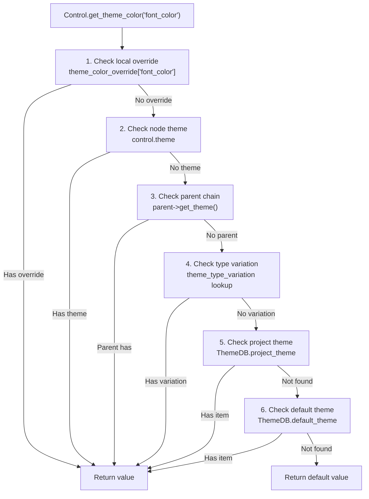

**Sources:** [scene/gui/control.cpp:2485-2653](https://github.com/godotengine/godot/blob/4219ce91/scene/gui/control.cpp#L2485-L2653), [scene/main/window.cpp:735-876](https://github.com/godotengine/godot/blob/4219ce91/scene/main/window.cpp#L735-L876)

### Theme Item Methods

Controls expose methods for accessing theme items with automatic type safety:

| Method Pattern | Return Type | Example |
|----------------|-------------|---------|
| `get_theme_color(name, theme_type)` | `Color` | Font colors |
| `get_theme_constant(name, theme_type)` | `int` | Spacing values |
| `get_theme_font(name, theme_type)` | `Ref` | Text fonts |
| `get_theme_font_size(name, theme_type)` | `int` | Font sizes |
| `get_theme_icon(name, theme_type)` | `Ref<Texture2D>` | Icons |
| `get_theme_stylebox(name, theme_type)` | `Ref<StyleBox>` | Backgrounds |

Each method has a corresponding `has_theme_*()` variant to check existence without returning a default value.

**Sources:** [scene/gui/control.h:412-433](https://github.com/godotengine/godot/blob/4219ce91/scene/gui/control.h#L412-L433), [scene/gui/control.cpp:2485-2653](https://github.com/godotengine/godot/blob/4219ce91/scene/gui/control.cpp#L2485-L2653)

---

## Theme Overrides

### Local Override System

Both `Control` and `Window` support local theme overrides that take precedence over all inherited themes. These are stored in hash maps within the node's data structure.

**Override Storage:**

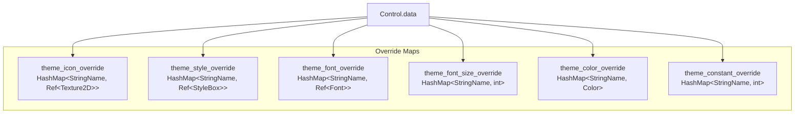

**Sources:** [scene/gui/control.h:245-250](https://github.com/godotengine/godot/blob/4219ce91/scene/gui/control.h#L245-L250), [scene/main/window.h:111-116](https://github.com/godotengine/godot/blob/4219ce91/scene/main/window.h#L111-L116)

### Dynamic Override Properties

Overrides are exposed as dynamic properties using the `theme_override_*` naming convention. The engine handles these through `_set()` and `_get()` methods.

**Property Pattern:**
- `theme_override_colors/font_color` - Color override
- `theme_override_constants/margin` - Constant override
- `theme_override_fonts/font` - Font override
- `theme_override_font_sizes/font_size` - Font size override
- `theme_override_icons/icon` - Icon override
- `theme_override_styles/panel` - StyleBox override

**Override Management Methods:**

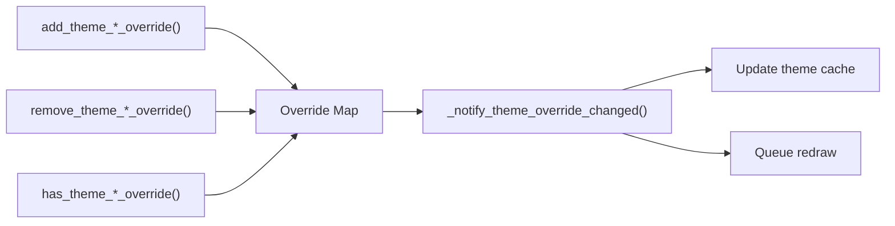

**Sources:** [scene/gui/control.cpp:295-398](https://github.com/godotengine/godot/blob/4219ce91/scene/gui/control.cpp#L295-L398), [scene/main/window.cpp:52-154](https://github.com/godotengine/godot/blob/4219ce91/scene/main/window.cpp#L52-L154)

---

## Type Variations

### Theme Type Variation System

Type variations allow creating themed variants of base types without duplicating theme definitions. For example, a "FlatButton" variation can inherit from "Button" but override specific items.

**Type Variation Hierarchy:**

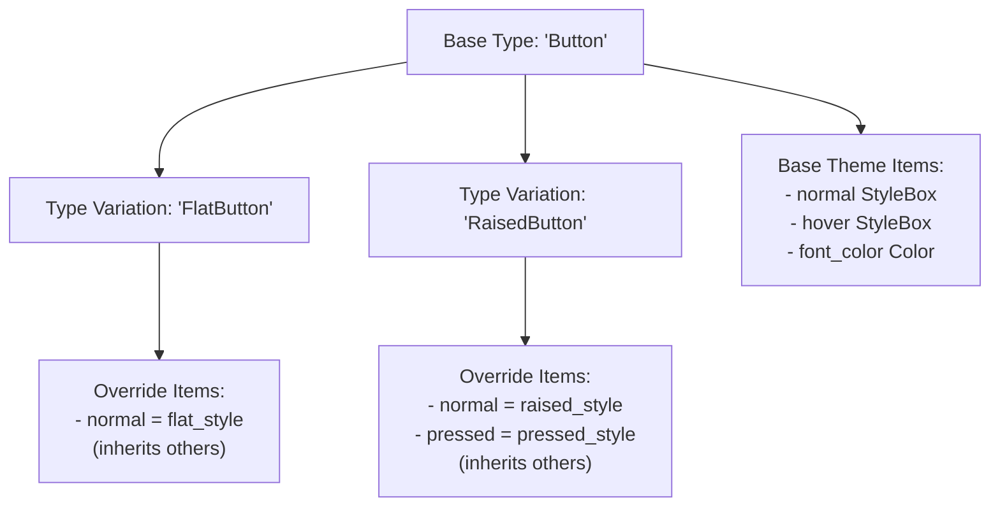

The `theme_type_variation` property on `Control` ([scene/gui/control.h:233]()) specifies which variation to use. When looking up theme items, the system first checks the variation type, then falls back to the base type.

**Variation Lookup in Theme:**

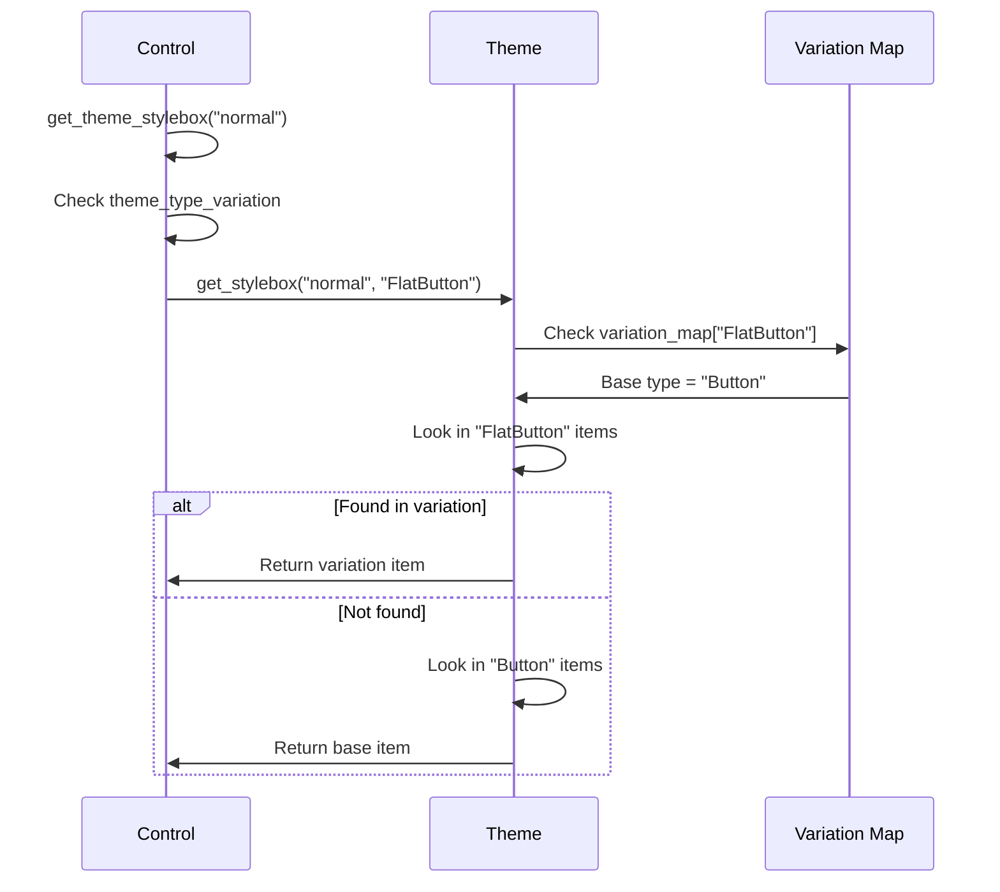

**Sources:** [scene/resources/theme.cpp:143-198](https://github.com/godotengine/godot/blob/4219ce91/scene/resources/theme.cpp#L143-L198), [scene/gui/control.cpp:460-507](https://github.com/godotengine/godot/blob/4219ce91/scene/gui/control.cpp#L460-L507)

---

## Integration with Control and Window

### Control Theme Integration

The `Control` class maintains a theme cache (`theme_cache` structure) that is populated when the theme changes, avoiding repeated lookups during rendering.

**Control Theme Cache Structure:**

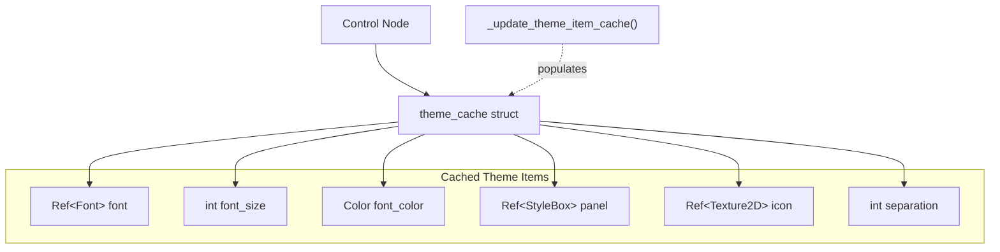

Each `Control` subclass defines its own theme cache structure specific to its visual needs. The `_update_theme_item_cache()` virtual method ([scene/gui/control.h:333]()) is called when the theme changes, allowing controls to refresh their cached items.

**Sources:** [scene/gui/control.h:220-221](https://github.com/godotengine/godot/blob/4219ce91/scene/gui/control.h#L220-L221), [scene/gui/control.cpp:2863-2906](https://github.com/godotengine/godot/blob/4219ce91/scene/gui/control.cpp#L2863-L2906)

### Window Theme Integration

`Window` nodes also participate in the theme system, supporting theme overrides for embedded window styling (title bars, close buttons, borders).

**Window-Specific Theme Items:**

| Item Name | Type | Purpose |
|-----------|------|---------|
| `embedded_border` | StyleBox | Border when embedded |
| `embedded_unfocused_border` | StyleBox | Border when not focused |
| `title_font` | Font | Title bar font |
| `title_font_size` | int | Title bar font size |
| `title_color` | Color | Title text color |
| `title_outline_modulate` | Color | Title outline color |
| `title_height` | int | Title bar height |
| `close` | Texture2D | Close button icon |
| `close_pressed` | Texture2D | Pressed close button |

**Sources:** [scene/main/window.cpp:328-384](https://github.com/godotengine/godot/blob/4219ce91/scene/main/window.cpp#L328-L384), [scene/main/window.h:98-104](https://github.com/godotengine/godot/blob/4219ce91/scene/main/window.h#L98-L104)

### Theme Notification System

When themes change, affected nodes receive notifications to update their cached values and visuals:

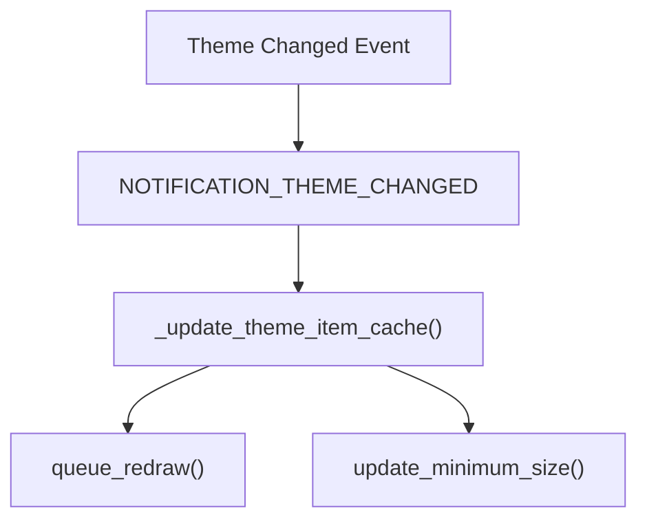

The `NOTIFICATION_THEME_CHANGED` notification ([scene/gui/control.h:376]()) triggers theme cache updates. Controls respond by calling `_update_theme_item_cache()` and requesting a redraw.

**Sources:** [scene/gui/control.cpp:355-387](https://github.com/godotengine/godot/blob/4219ce91/scene/gui/control.cpp#L355-L387), [scene/main/window.cpp:1395-1413](https://github.com/godotengine/godot/blob/4219ce91/scene/main/window.cpp#L1395-L1413)

---

## ThemeDB Singleton

### Global Theme Management

`ThemeDB` (referenced in [scene/theme/theme_db.h]() includes at [scene/gui/control.cpp:43]() and [scene/main/window.cpp:37]()) manages project-wide and default themes. It provides a centralized access point for theme data.

**ThemeDB Architecture:**

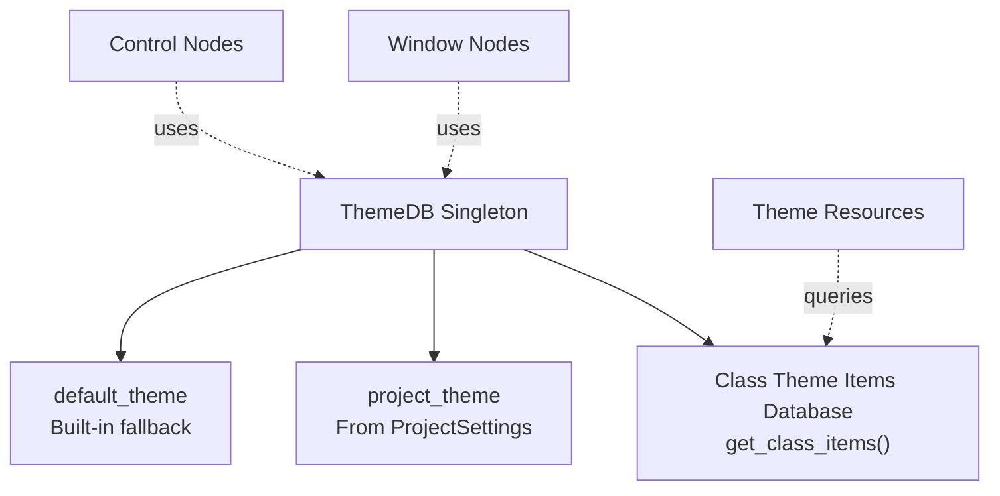

**ThemeDB Responsibilities:**
1. Store and provide access to the default theme
2. Store and provide access to the project theme from `ProjectSettings.gui/theme/custom`
3. Maintain a database of valid theme items per class (used for editor property lists)
4. Handle theme initialization during engine startup

**Sources:** [scene/gui/control.cpp:402-403](https://github.com/godotengine/godot/blob/4219ce91/scene/gui/control.cpp#L402-L403), [scene/main/window.cpp:159](https://github.com/godotengine/godot/blob/4219ce91/scene/main/window.cpp#L159)

---

## Theme Item Registration

### Editor Property Generation

The theme system uses `ThemeDB` to generate property lists for the editor. When a `Control` or `Window` is inspected, the engine queries all valid theme items for that class and exposes them as checkable override properties.

**Property List Generation:**

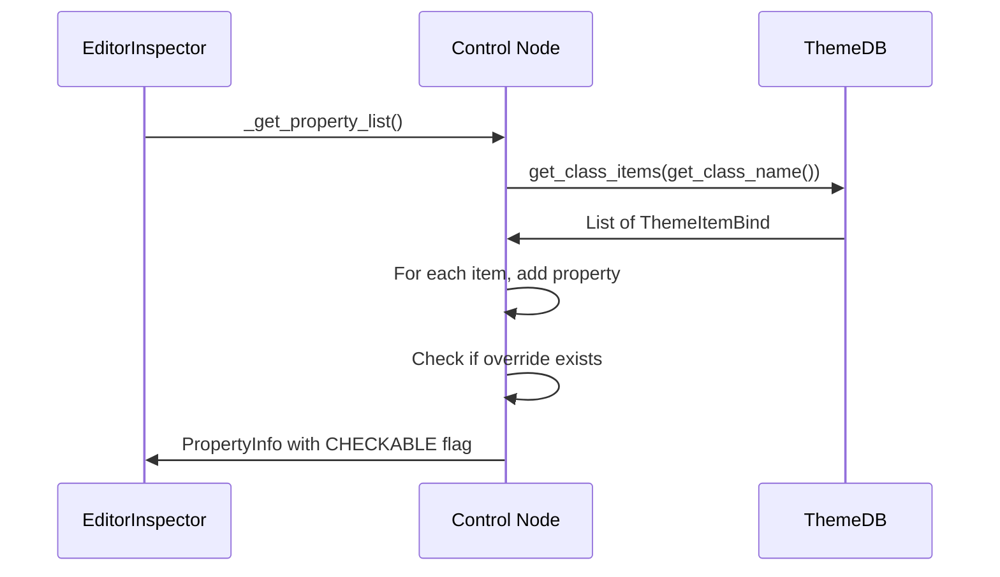

Each theme item appears in the inspector as a checkable property. When checked, the override is stored; when unchecked, it's removed.

**Sources:** [scene/gui/control.cpp:400-458](https://github.com/godotengine/godot/blob/4219ce91/scene/gui/control.cpp#L400-L458), [scene/main/window.cpp:156-235](https://github.com/godotengine/godot/blob/4219ce91/scene/main/window.cpp#L156-L235)

### Theme Item Validation

The `_validate_property()` method ([scene/gui/control.cpp:460-624](), [scene/main/window.cpp:237-292]()) updates theme-related properties dynamically based on the current theme hierarchy. For example, `theme_type_variation` hints are populated with available variations from all themes in the hierarchy.