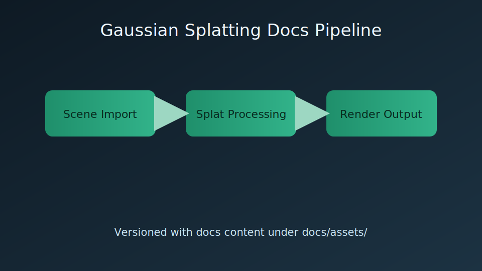

# Version-Controlled Media

## Purpose

Define how to include images and videos in docs content while keeping media artifacts versioned with the repository.

## Folder Conventions

| Media type | Path |
| --- | --- |
| Images | `docs/assets/images/` |
| Videos | `docs/assets/videos/` |

## Example: Image



## Example: Video

<video controls preload="metadata" width="640">
  <source src="../assets/videos/gaussian-demo.webm" type="video/webm">
  <source src="../assets/videos/gaussian-demo.mp4" type="video/mp4">
  Your browser does not support embedded video playback.
</video>

## Authoring Rules

- Keep docs media under `docs/assets/` so each tag/version serves matching assets.
- Prefer `.webm` + `.mp4` pairs for compatibility.
- Use descriptive file names tied to feature/use case.
- Give each image concise alt text and a caption that explains why the visual is on the page.
- Let standard markdown images stay unwrapped so `glightbox` can provide click-to-expand behavior.
- Prefer labeled diagrams or benchmark artifacts over fake editor UI when a real capture is not yet available.
- For large video files, use Git LFS tracking (`*.mp4`, `*.webm`).
- Keep total media footprint within CI budget gates.
- Follow the capture process in [../development/screenshot-capture-spec.md](../development/screenshot-capture-spec.md) for editor screenshots.

## Git LFS Setup

```bash
git lfs install
git lfs track "*.mp4" "*.webm"
```
