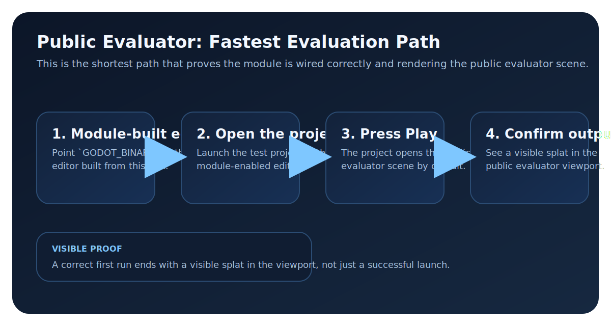

# First Run

Use this page after [Installation](installation.md) when you want the shortest path to a visible splat.

Real editor screenshots for this flow are still pending, so this page stays text-first for now and keeps the diagram as a technical reference at the end.

## 1. Point at Your Editor

If you already have an editor built from this fork, set it directly:

```bash
export GODOT_BINARY=/absolute/path/to/your/godot-editor
```

```powershell
$env:GODOT_BINARY="C:\absolute\path\to\your\godot-editor.exe"
```

Need to build one first? Use [Build from Source](../BUILDING.md), then come back here and set `GODOT_BINARY` to the binary you built.

After a successful build, point `GODOT_BINARY` at the editor in `bin/`:

```bash
export GODOT_BINARY=./bin/<your-editor-binary>
```

```powershell
$env:GODOT_BINARY=".\bin\<your-editor-binary>.exe"
```

You should see an editor binary in `bin/`.

## 2. Generate Synthetic Starter Assets

```bash
python3 tests/runtime/prepare_synthetic_assets.py --quiet
```

```powershell
python .\tests\runtime\prepare_synthetic_assets.py --quiet
```

You should see:
- the synthetic starter asset in the sample project fixture set

## 3. Open the Sample Project

```bash
$GODOT_BINARY --path tests/examples/godot/test_project
```

```powershell
& $env:GODOT_BINARY --path .\tests\examples\godot\test_project
```

You should see the sample project open in the editor.

## 4. Render Your First Splat

1. Open `res://scenes/benchmark_unified.tscn`.
2. If needed, add the splat node the sample scene expects.
3. Set `PLY File Path` to `res://tests/fixtures/test_splats.ply`.
4. Press `F6` to play the scene.

You should see:
- a visible splat in the viewport

## If It Fails

- [Artist workflow overview](../user/quickstart.md)
- [Installation](installation.md)
- [Build from Source](../BUILDING.md)
- [Recurring issues](../troubleshooting/recurring-issues.md)

## Flow Reference

<figure markdown="1">
{ .gs-diagram }
<figcaption>The first-run path is a short proof loop: point at your editor, seed the synthetic fixture asset, open the sample project, and confirm a visible splat in the benchmark_unified scene.</figcaption>
</figure>
