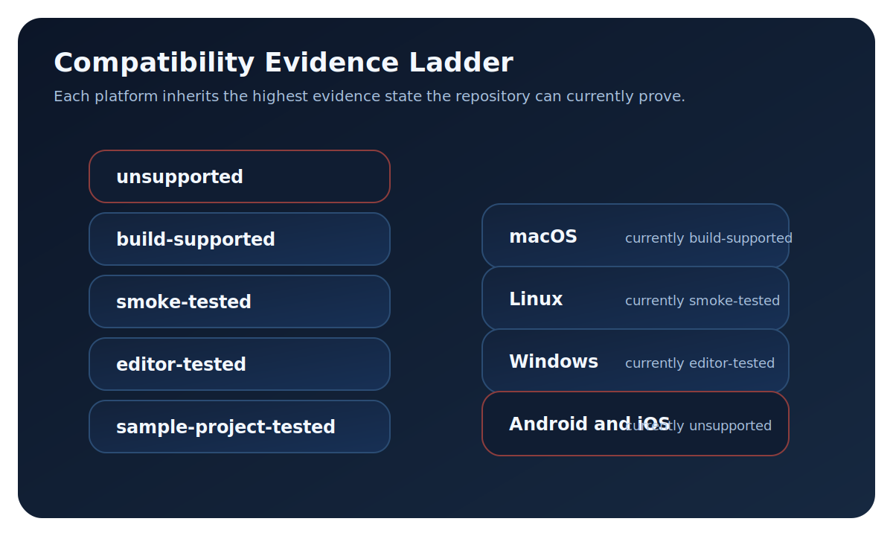

# Compatibility Matrix

Last generated: 2026-03-29

## Purpose
Use this matrix to track evidence-backed platform status for godotGS Gaussian Splatting.

## Usage
| Task | Action |
| --- | --- |
| Review current platform status | Read the `Current state`, `Public binaries`, and `Notes` columns in the platform table. |
| Update compatibility evidence | Edit `docs/reference/compatibility_sources.yaml` and regenerate this file. |

<figure markdown="1">
{ .gs-diagram }
<figcaption>The matrix is a ladder, not a badge wall: each platform only claims the highest evidence state the repository can currently prove.</figcaption>
</figure>

## Evidence Levels
| Level | Meaning |
| --- | --- |
| `unsupported` | The build system rejects the platform. |
| `build-supported` | The build system accepts the platform and the repository can compile it. |
| `smoke-tested` | A minimal runtime, import, or QA lane passes, but not necessarily a non-headless editor lane. |
| `editor-tested` | A non-headless editor or runtime validation lane passes in repo-owned automation. |
| `sample-project-tested` | A published example-project or QA-scene lane passes on the platform. |
| `production-tested` | Published release-signoff or field evidence exists for the platform. |

## Platform States
The state shown for each platform is the strongest evidence level currently documented in this repository.

| Platform | Current state | Public binaries | Evidence | Notes |
| --- | --- | --- | --- | --- |
| Windows | `editor-tested` | No public Windows binaries at present; build from source. | SUPPORTED_PLATFORMS in modules/gaussian_splatting/config.py accepts windows.<br>Gaussian Production Gates builds a Windows editor and runs windows-vulkan runtime validation in .github/workflows/gaussian_production_gates.yml.<br>The production evidence route in tests/ci/collect_production_evidence.ps1 exercises non-headless Vulkan runtime scripts on Windows. | Windows is the strongest in-repo validation lane currently, but the public binary surface is still narrower than the source-support story. |
| Linux | `sample-project-tested` | Primary public binary lane: Linux editor CI artifacts and nightly prereleases. | SUPPORTED_PLATFORMS in modules/gaussian_splatting/config.py accepts linuxbsd.<br>Release Builds compiles and publishes the Linux editor in .github/workflows/release_builds.yml.<br>Baseline QA builds a Linux editor, imports the project, and runs baseline QA under xvfb in .github/workflows/baseline_qa.yml. | Linux is currently the only platform with public binaries. The documented validation includes a sample-project QA lane under xvfb, but it is still not an interactive editor validation row. |
| macOS | `build-supported` | No public macOS binaries at present; build from source. | SUPPORTED_PLATFORMS in modules/gaussian_splatting/config.py accepts macos. | The repo allows macOS builds, but no published smoke, editor, or sample-project evidence is checked in yet. |
| Android | `unsupported` | None. | Android is not listed in SUPPORTED_PLATFORMS in modules/gaussian_splatting/config.py. | The build system rejects this platform. |
| iOS | `unsupported` | None. | iOS is not listed in SUPPORTED_PLATFORMS in modules/gaussian_splatting/config.py. | The build system rejects this platform. |

## Published Test Environments
These rows record the most concrete public environment details currently available from repo-owned automation or published artifacts. Unknown OS, adapter, or driver values are called out explicitly instead of being inferred.

| Platform | State | OS / image | GPU / adapter | Driver / runtime | Evidence | Notes |
| --- | --- | --- | --- | --- | --- | --- |
| Windows | `editor-tested` | Self-hosted Windows runner (OS version not yet published) | NVIDIA GeForce RTX 3090 | Vulkan 1.4.312 + Forward+ + safe render thread; NVIDIA driver version not yet published | .github/workflows/gaussian_production_gates.yml module-validation lane<br>tests/runtime/run_runtime_validation.py --gd-mode windows-vulkan<br>tests/ci/collect_production_evidence.ps1 | The published GPU QA artifact proves the adapter and render route. Windows OS version and NVIDIA driver version are still not printed in repo-owned evidence. |
| Linux | `sample-project-tested` | Ubuntu 24.04.4 LTS (image ubuntu-24.04 20260323.65.1) | No discrete GPU exposed in the published artifact (xvfb / headless CPU-only lane) | mesa-vulkan-drivers 25.2.8-0ubuntu0.24.04.1 + xvfb headless import lane | .github/workflows/baseline_qa.yml CPU-only lane<br>.github/workflows/release_builds.yml Linux editor build lane | The scheduled baseline QA artifact proves a real sample-project environment on ubuntu-24.04, but it is still a headless xvfb lane rather than an interactive editor or hardware-GPU validation row. |

## Reading the Matrix
- `build-supported` means the build system accepts the platform and repo automation can compile it.
- `smoke-tested` means a minimal runtime or QA lane has passed, but not necessarily an interactive editor lane.
- `editor-tested` means a non-headless editor/runtime lane has passed.
- `sample-project-tested` and `production-tested` are reserved for stronger published evidence than this repo currently exposes publicly.

## Examples
```bash
python3 scripts/update_compatibility_matrix.py
```

## Troubleshooting
| Issue | Cause | Fix |
| --- | --- | --- |
| Matrix does not reflect YAML edits | The generator was not rerun. | Run `python3 scripts/update_compatibility_matrix.py`. |
| A platform only reaches `build-supported` | The repo has no documented runtime or editor evidence for it yet. | Add stronger evidence to `docs/reference/compatibility_sources.yaml` only after the lane or test result exists. |
| OS, adapter, or driver fields are still generic | The lane exists, but those identifiers are not yet published in repo-owned evidence. | Capture them from the evidence run and replace the placeholder text in `docs/reference/compatibility_sources.yaml`. |
| Missing platform row | Platform key was removed from the YAML source. | Re-add the platform entry in `docs/reference/compatibility_sources.yaml`. |
