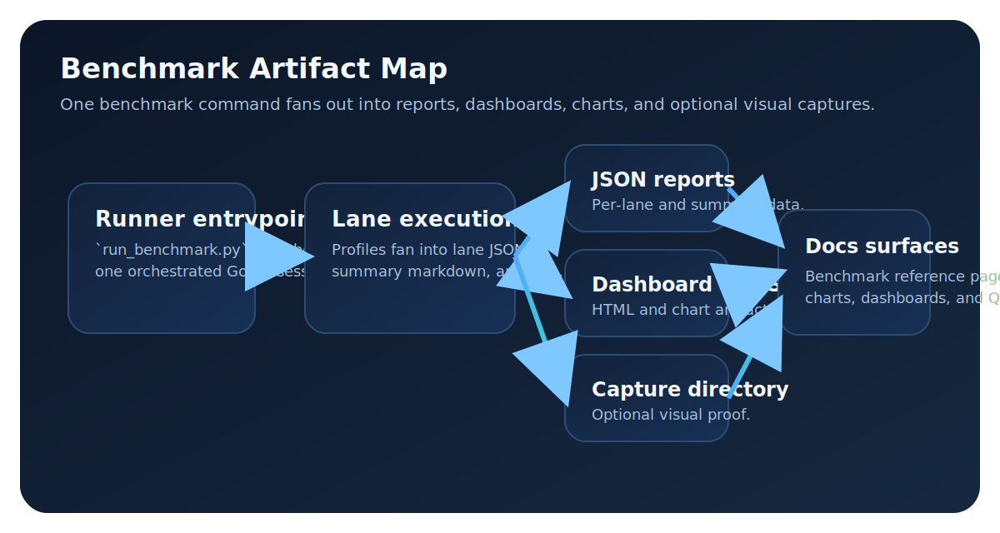

# Benchmark Runner

## Canonical Command

Use this as the single benchmark entrypoint:

```bash
python3 tests/runtime/run_benchmark.py \
  --godot-binary ./bin/godot.linuxbsd.editor.dev.x86_64 \
  --project-path ./tests/examples/godot/test_project
```

`--profile` defaults to `everything`.

## Current Public Snapshot

The current committed public result is a single low-noise raster baseline row:

| Lane | Score | Avg FPS | P99 Frame (ms) | GPU Time (ms) |
| --- | ---: | ---: | ---: | ---: |
| `static_baseline` | 90.7 | 74.0 | 15.62 | 0.0 |

That snapshot is what backs the public performance dashboard until more committed lane results are added.

## Standard Flags

- `--profile` (`everything|quick|performance|synthetic-only|ab-only`)
- `--godot-binary`
- `--project-path`
- `--output-dir`
- `--reference-dir`
- `--capture`
- `--fail-fast`

Compatibility extras are still accepted (`--capture-lane`, `--no-captures`, `--no-dashboard`) but the command above is the supported path.

## Single-Process Execution

`run_benchmark.py` launches one Godot process and delegates all lanes to:

- `res://scenes/benchmark_orchestrator.tscn`

The orchestrator loads each lane scene sequentially in-process and writes lane JSON reports with the existing suite-compatible structure.

## Profiles

- `everything`: suite lanes + unified + small baseline + synthetic scenes
- `quick`: shortened smoke profile
- `performance`: suite-focused performance profile
- `synthetic-only`: synthetic scenes only
- `ab-only`: instance pipeline serial vs single-pass lanes

## Asset Policy

Asset generation and mapping are canonicalized through:

- `tests/runtime/prepare_synthetic_assets.py`
- `tests/fixtures/benchmark_asset_manifest.json`

The benchmark runner calls synthetic asset preparation automatically before execution.

## Suite Coverage

These are the user-relevant lanes already encoded in the suite and available for publication once committed results exist:

| Lane | Purpose | Current publication status |
| --- | --- | --- |
| `static_baseline` | Low-noise raster baseline | Published |
| `streaming_corridor` | Camera sweep stressing chunk turnover | Suite-only |
| `city_flyover` | High-altitude visibility-change stress | Suite-only |
| `instance_storm` | Many-instance submission pressure | Suite-only |
| `lighting_stress` | Animated light and shading stress | Suite-only |
| `unified_composite` | Integrated all-systems composite lane | Suite-only |

## Outputs

Default output directory:

`tests/output/benchmark_suite/<timestamp>/`

Generated artifacts:

- `benchmark_suite_report.json`
- `benchmark_suite_summary.md`
- `benchmark_orchestrator.log`
- `benchmark_orchestrator_report.json`
- `<lane_id>.json` per lane
- optional dashboard artifacts (`benchmark_suite_dashboard.html`, `benchmark_suite_*.svg`)

The public docs surface should prefer the snapshot table above for the current committed result and keep the charts focused on the exported lane data.

<figure markdown="1">
{ .gs-diagram }
<figcaption>The benchmark runner is one orchestrated entrypoint that fans out into JSON, dashboard HTML, SVG charts, and optional capture directories for visual proof.</figcaption>
</figure>

## Interactive Performance Charts

!!! info "Data source"
    Charts below render from `assets/data/benchmark_latest.json`, generated by `scripts/export_benchmark_vegalite.py` during the docs build. If no benchmark data is available, charts will show an empty state.

### Lane Scores

```vegalite
{
  "$schema": "https://vega.github.io/schema/vega-lite/v5.json",
  "data": {"url": "../assets/data/benchmark_latest.json"},
  "mark": {"type": "bar", "tooltip": true},
  "encoding": {
    "y": {"field": "lane_id", "type": "nominal", "sort": "-x", "title": "Lane"},
    "x": {"field": "score", "type": "quantitative", "title": "Score"},
    "color": {"field": "lane_id", "type": "nominal", "legend": null},
    "tooltip": [
      {"field": "lane_id", "title": "Lane"},
      {"field": "score", "title": "Score", "format": ".1f"},
      {"field": "avg_fps", "title": "Avg FPS", "format": ".1f"}
    ]
  },
  "width": "container",
  "height": 200,
  "title": "Benchmark Lane Scores"
}
```

## How to Update

1. Run a benchmark: `python tests/runtime/run_benchmark.py --profile everything`
2. Export data: `python scripts/export_benchmark_vegalite.py`
3. Refresh the snapshot and coverage tables in `docs/performance/index.md` when new committed results are available.
4. Build docs: `python scripts/build_docs_site.py --strict`

### Average FPS by Lane

```vegalite
{
  "$schema": "https://vega.github.io/schema/vega-lite/v5.json",
  "data": {"url": "../assets/data/benchmark_latest.json"},
  "mark": {"type": "bar", "tooltip": true},
  "encoding": {
    "y": {"field": "lane_id", "type": "nominal", "sort": "-x", "title": "Lane"},
    "x": {"field": "avg_fps", "type": "quantitative", "title": "Average FPS"},
    "color": {"value": "#c96b2c"},
    "tooltip": [
      {"field": "lane_id", "title": "Lane"},
      {"field": "avg_fps", "title": "FPS", "format": ".1f"},
      {"field": "p99_frame_ms", "title": "P99 ms", "format": ".2f"}
    ]
  },
  "width": "container",
  "height": 200,
  "title": "Average FPS per Benchmark Lane"
}
```
