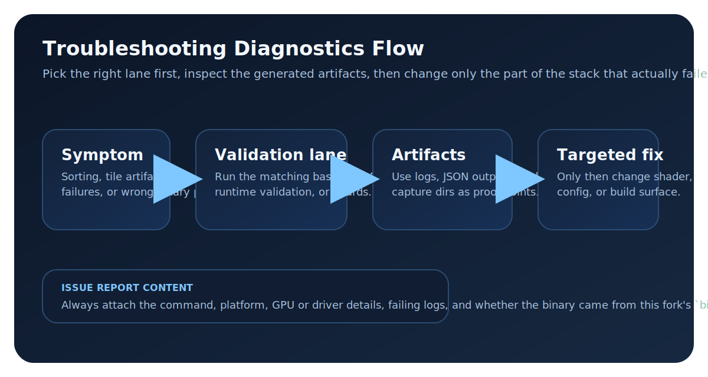

# Recurring Issues

This page is the canonical recurring bug and build/runtime issue reference.

Real troubleshooting screenshots are still pending, so this page stays text-first and uses a reference diagram only at the end.

## 1) Sorting Regressions and Mis-Ordering

### Symptoms
- transparent splats render in the wrong order
- sudden flicker when camera moves
- intermittent switch to CPU sorting path

### Checks
- run baseline sorting lane:
  - `python3 tests/ci/run_baseline_qa.py --category sorting`
- run runtime validation:
  - `python3 tests/runtime/run_runtime_validation.py --godot-binary <module-built-binary> --gd-mode headless`

### Typical Fixes
- verify shader and host sort contracts are synchronized
- verify requested sort mode is supported by the active device
- rebuild and rerun with a module-enabled binary (`modules/gaussian_splatting`)

## 2) Tile Overflow / Underfill / Edge Artifacts

### Symptoms
- missing splats near screen edges
- dense areas showing abrupt holes or popping
- visible tile boundaries

### Checks
- run pipeline lane:
  - `python3 tests/ci/run_baseline_qa.py --category pipeline`
- inspect `tests/output/` artifacts and runtime stats for tile capacity pressure

### Typical Fixes
- reduce visible splat pressure (quality preset / max splat count)
- verify tile/raster shader variants match current host parameters
- rerun after a clean rebuild if shader-generated headers changed

## 3) Shader Contract / Compile Failures

### Symptoms
- shader compile failures at startup
- compute pipeline creation failures
- runtime starts but splats do not render

### Checks
- run shader contract validation:
  - `python3 modules/gaussian_splatting/shaders/compile_shaders.py --contracts-only`
- run module guards:
  - `python3 tests/ci/run_module_tests.py --guard-only`

### Typical Fixes
- install/update shader toolchain required by the validator
- ensure host-side buffer layouts and shader structs are in sync
- rebuild the editor after shader/interface changes

## 4) Module Build Path Mismatch

### Symptoms
- module classes missing at runtime
- link errors around module symbols
- tests failing because stock Godot binary was used

### Checks
- confirm the binary was built from this fork root and comes from `bin/`
- confirm test runner points at module-built binary (`--godot` / `--godot-binary`)

### Typical Fixes
- rebuild with the canonical [Build / Test / CI Command Reference](../reference/build-test-ci.md)
- rerun with explicit binary path:
  - `python3 tests/ci/run_baseline_qa.py --godot <path-to-module-built-editor>`

## Getting Help

- include exact command, platform, GPU, and driver version
- attach failing log excerpts and produced JSON artifacts
- include whether the binary came from this fork's `bin/` output or a stock Godot build

## Troubleshooting Flow Reference

<figure markdown="1">
{ .gs-diagram }
<figcaption>Recurring issues should route into the matching validation lane first so logs, JSON outputs, and capture artifacts point at the real failing layer before any fix attempt.</figcaption>
</figure>
