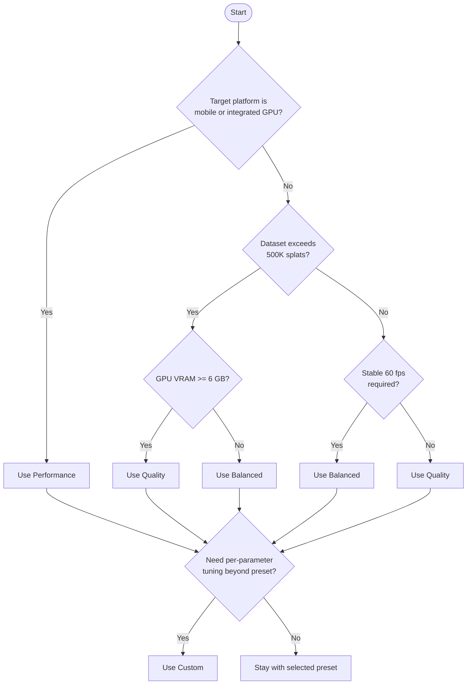

# User Manual: Performance Presets

Last updated: 2026-03-20

## Preset Strategy

- Start with `Balanced`.
- If frame rate is unstable, move toward performance settings.
- If visual quality is insufficient and hardware allows, move toward quality settings.
- Set the preset to `Custom` when you need fine-grained control over individual parameters.

## Available Presets

The `quality/preset` property on `GaussianSplatNode3D` accepts four values.

| Preset | Enum value | Goal | Implementation reference |
| --- | --- | --- | --- |
| Performance | `QUALITY_PERFORMANCE` | Maximize frame rate on constrained hardware. | `modules/gaussian_splatting/nodes/gaussian_splat_node_3d.h:84` |
| Balanced | `QUALITY_BALANCED` | Reasonable tradeoff between quality and frame rate. | `modules/gaussian_splatting/nodes/gaussian_splat_node_3d.h:85` |
| Quality | `QUALITY_QUALITY` | Maximize visual fidelity when GPU headroom is available. | `modules/gaussian_splatting/nodes/gaussian_splat_node_3d.h:86` |
| Custom | `QUALITY_CUSTOM` | All parameters are user-controlled. | `modules/gaussian_splatting/nodes/gaussian_splat_node_3d.h:87` |

## Preset Value Tables

### Rendering and LOD

| Parameter | Performance | Balanced | Quality | Custom (default) | Implementation reference |
| --- | --- | --- | --- | --- | --- |
| `lod_bias` | 2.0 | 1.0 | 0.75 | node value | `modules/gaussian_splatting/nodes/gaussian_splat_node_helpers.cpp:952` |
| `max_splat_count` | 200 000 | 500 000 | 1 000 000 | node value | `modules/gaussian_splatting/nodes/gaussian_splat_node_helpers.cpp:953` |
| `importance_threshold` | 0.2 | 0.12 | 0.08 | 0.1 | `modules/gaussian_splatting/nodes/gaussian_splat_node_helpers.cpp:955` |
| `size_cull_threshold` | 1.5 | 1.0 | 0.6 | 1.0 | `modules/gaussian_splatting/nodes/gaussian_splat_node_helpers.cpp:956` |
| `smooth_transitions` | false | true | true | true | `modules/gaussian_splatting/nodes/gaussian_splat_node_helpers.cpp:957` |
| `transition_time` | 0.1 s | 0.25 s | 0.35 s | 0.25 s | `modules/gaussian_splatting/nodes/gaussian_splat_node_helpers.cpp:958` |
| `temporal_coherence` | false | true | true | true | `modules/gaussian_splatting/nodes/gaussian_splat_node_helpers.cpp:961` |
| `adaptive_quality` | false | true | true | true | `modules/gaussian_splatting/nodes/gaussian_splat_node_helpers.cpp:971` |
| `target_fps` | 75 | 60 | 60 | 60 | `modules/gaussian_splatting/nodes/gaussian_splat_node_helpers.cpp:959` |

### LOD Distance Ratios

LOD distance ratios define how the render distance is divided across LOD levels.

| Parameter | Performance | Balanced | Quality | Custom (default) |
| --- | --- | --- | --- | --- |
| `lod0_ratio` | 0.15 | 0.25 | 0.35 | 0.25 |
| `lod1_ratio` | 0.35 | 0.50 | 0.65 | 0.50 |
| `lod2_ratio` | 0.60 | 0.75 | 0.90 | 0.75 |
| `lod3_ratio` | 1.00 | 1.00 | 1.00 | 1.00 |
| `lod_levels` | 3 | 4 | 4 | 4 |
| `lod_multiplier` | 1.6 | 1.8 | 2.0 | 1.8 |

Source: `modules/gaussian_splatting/nodes/gaussian_splat_node_helpers.cpp:975`

### GPU Memory and Streaming

| Parameter | Performance | Balanced | Quality | Custom (default) | Implementation reference |
| --- | --- | --- | --- | --- | --- |
| `max_gpu_memory_mb` | 256 | 512 | 768 | 512 | `modules/gaussian_splatting/nodes/gaussian_splat_node_helpers.cpp:962` |
| `target_gpu_memory_mb` | 192 | 384 | 640 | 384 | `modules/gaussian_splatting/nodes/gaussian_splat_node_helpers.cpp:963` |
| `max_concurrent_loads` | 1 | 2 | 3 | 2 | `modules/gaussian_splatting/nodes/gaussian_splat_node_helpers.cpp:966` |
| `stream_budget_ms` | 1 | 2 | 3 | 2 | `modules/gaussian_splatting/nodes/gaussian_splat_node_helpers.cpp:972` |
| `load_ahead_factor` | 0.15 | 0.25 | 0.35 | 0.25 | `modules/gaussian_splatting/nodes/gaussian_splat_node_helpers.cpp:964` |
| `unload_factor` | 0.95 | 1.05 | 1.20 | 1.05 | `modules/gaussian_splatting/nodes/gaussian_splat_node_helpers.cpp:965` |
| `predictive_loading` | false | true | true | true | `modules/gaussian_splatting/nodes/gaussian_splat_node_helpers.cpp:967` |
| `prediction_time` | 0.25 s | 0.50 s | 0.75 s | 0.50 s | `modules/gaussian_splatting/nodes/gaussian_splat_node_helpers.cpp:968` |
| `async_loading` | false | true | true | true | `modules/gaussian_splatting/nodes/gaussian_splat_node_helpers.cpp:973` |
| `compression` | true | true | false | true | `modules/gaussian_splatting/nodes/gaussian_splat_node_helpers.cpp:974` |

## GPU Memory Guidance

| Preset | VRAM Target | VRAM Ceiling | Recommended GPU |
| --- | --- | --- | --- |
| Performance | 192 MB | 256 MB | 2 GB+ integrated or discrete GPU |
| Balanced | 384 MB | 512 MB | 4 GB+ discrete GPU |
| Quality | 640 MB | 768 MB | 6 GB+ discrete GPU |
| Custom | User-defined | User-defined | Depends on configuration |

These values represent the memory consumed by the Gaussian splat streaming system alone. The application, engine, and other rendering resources consume additional VRAM. Monitor total usage through Godot's performance monitors and `GaussianStreamingSystem.get_vram_usage()`.

## Choosing a Preset: Decision Flowchart

## When to Use the Custom Preset

Switch to `Custom` when:

- A specific parameter combination not covered by the three presets is required.
- You are profiling and need to isolate the effect of a single setting (for example, testing `compression = false` while keeping all other Balanced defaults).
- The project targets a known hardware profile and you want to push quality or performance beyond preset boundaries.

When `Custom` is active, the node uses its own property values for `lod_bias` and `max_splat_count`. All other quality parameters start at Balanced-equivalent defaults and can be tuned through the streaming and LOD configuration methods.

Source: `modules/gaussian_splatting/nodes/gaussian_splat_node_helpers.cpp:1041`

## Practical Order

1. Preset
2. Max splat count
3. Render distance
4. Advanced streaming/sorting settings (only if needed)

## Validation

Use benchmark and runtime checks from:

- [../../reference/build-test-ci.md](../../reference/build-test-ci.md)
