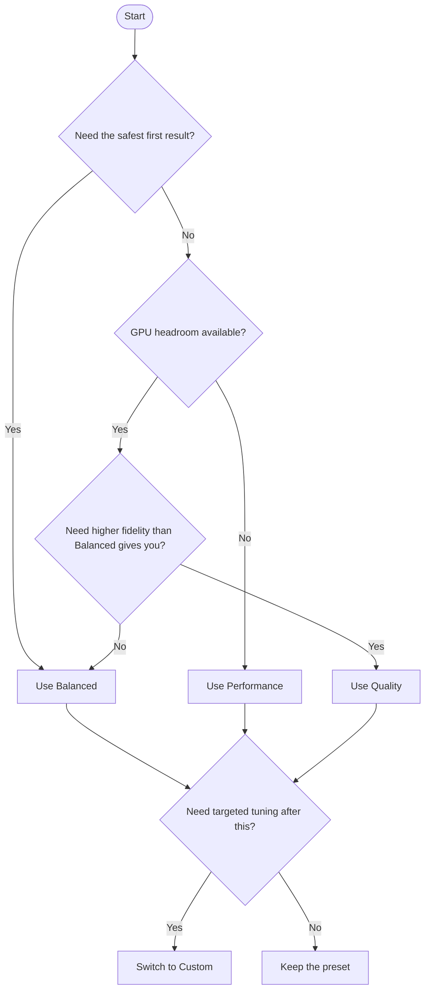

# Performance Presets

Use presets before touching advanced controls. They are the safest way to get a stable starting point.

## Start With This Order

1. `Balanced`
2. `Performance` if frame rate is unstable
3. `Quality` if image quality is too low and the GPU has headroom
4. `Custom` only after one of the built-in presets is already close

## Available Presets

| Preset | Best for | Trade-off |
| --- | --- | --- |
| Performance | Integrated GPUs, low-memory systems, and first stability checks | Lowest detail, strongest frame-rate bias |
| Balanced | Most evaluations and day-to-day editing | Middle ground between quality and stability |
| Quality | Strong discrete GPUs and visual review passes | Highest GPU pressure |
| Custom | Targeted tuning after a preset gets close | Requires manual validation |

## What Changes Between Presets

| Area | Performance | Balanced | Quality |
| --- | --- | --- | --- |
| Visible density | Lower | Medium | Higher |
| Distance detail | Shorter | Moderate | Longer |
| Streaming pressure | Lowest | Moderate | Highest |
| Stability bias | Strongest | Balanced | Lowest |

## Hardware Expectations

| Preset | Typical hardware fit | VRAM expectation |
| --- | --- | --- |
| Performance | Integrated GPUs or smaller discrete GPUs | Lowest |
| Balanced | Mid-range discrete GPUs | Medium |
| Quality | Higher-end discrete GPUs | Highest |
| Custom | Depends on the final settings | User-defined |

These expectations cover the splat system only. The engine, the scene, and any other rendering features still consume additional VRAM.

## Choosing a Preset

## When to Use Custom

Switch to `Custom` when:

- a specific parameter combination matters more than the built-in trade-offs
- you are profiling one setting at a time
- the project targets a known hardware profile and you need a tuned configuration

When `Custom` is active, start from the settings that already work and change one control at a time.

## Practical Order

1. Preset
2. Max splat count
3. Render distance
4. Advanced streaming or sorting controls only if needed

## Validate Changes

- Use [Build / Test / CI Command Reference](../../reference/build-test-ci.md) when you need the maintained validation commands.
