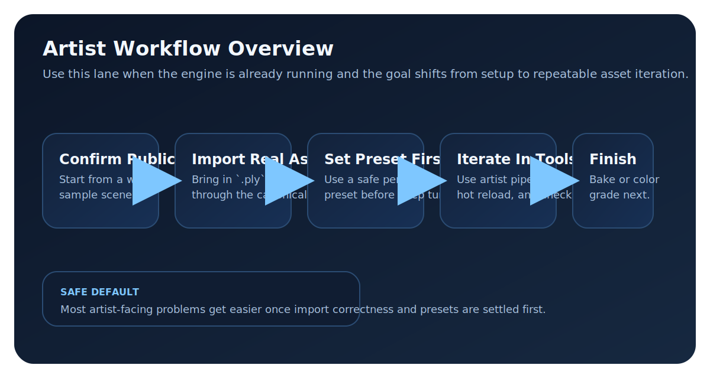

# Artist Workflow Overview

For artists, technical artists, and non-programmers, this page is the handoff from the sample scene into real asset iteration.

Visual captures for the artist lane are still pending, so this page keeps the workflow text-first for now.

## Recommended Order

1. Confirm the editor path and sample scene still work from [First Run](../getting-started/quick-start.md).
2. Bring in a real asset with the canonical [Gaussian Splat Asset Import Workflow](../workflows/importing.md).
3. Use [Performance Presets](manual/performance-presets.md) before touching advanced knobs.
4. Move into [Gaussian Splat Artist Pipeline](../features/artist_pipeline.md) when you need brush tools, hot reload, or bake actions.
5. Use [Color Grading Quick Start](../features/color-grading-quick-start.md) when the scene is readable and you are tuning look, not import correctness.

## Core Task Pages

- [Concepts](manual/concepts.md) for pipeline vocabulary and shared terms.
- [Workflow Details](manual/workflows.md) for secondary workflow groupings after you already know the job.
- [Gaussian Splat Asset Import Workflow](../workflows/importing.md) for importing `.ply` and `.spz` assets.
- [Gaussian Splat Artist Pipeline](../features/artist_pipeline.md) for inspector tools, hot reload, and bake-oriented editing.
- [Performance Presets](manual/performance-presets.md) for the first safe quality/speed decision.
- [Recurring Issues](../troubleshooting/recurring-issues.md) when import or viewport behavior is off.

## Technical Flow Reference

<figure markdown="1">
{ .gs-diagram }
<figcaption>The artist lane starts only after First Run is already working, then moves through import, safe preset selection, iteration tools, and finishing tasks like bake or color grading.</figcaption>
</figure>
