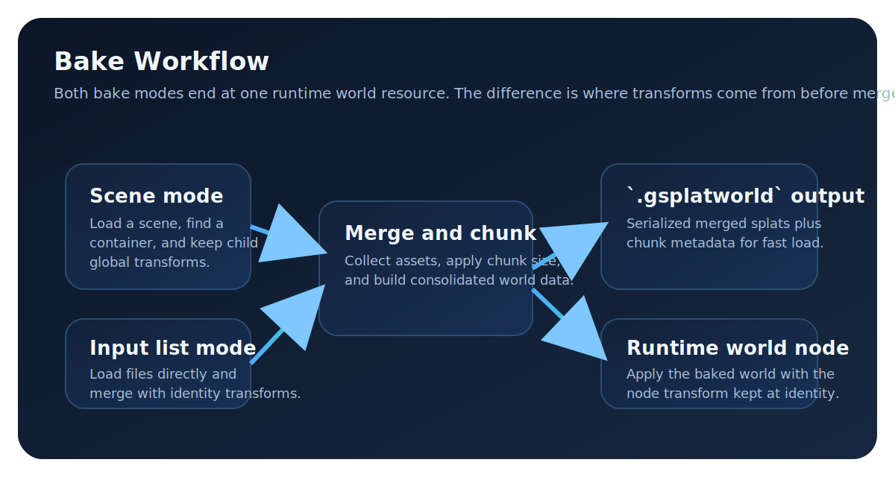

# Gaussian Splat World Bake Workflow

## Purpose

Bake many Gaussian splat assets into one `GaussianSplatWorld` resource to remove runtime parsing overhead for source files.

<figure markdown="1">
{ .gs-diagram }
<figcaption>Scene mode preserves node transforms, input-list mode does not, but both bake paths end at the same gsplatworld runtime resource.</figcaption>
</figure>

## Usage

| Mode | Required input | Transform behavior | Output | Implementation |
| --- | --- | --- | --- | --- |
| Scene mode | `--scene=res://...` | Uses each child `GaussianSplatNode3D` global transform during merge. | `.gsplatworld` file from merged data and chunk metadata. | `scripts/bake_gsplatworld.gd:26`, `modules/gaussian_splatting/nodes/gaussian_splat_container.cpp:201` |
| Input list mode | `--inputs=res://a.ply,res://b.spz` or `--input=...` | Uses identity transforms for every input because nodes are created without transforms. | `.gsplatworld` file from merged data and chunk metadata. | `scripts/bake_gsplatworld.gd:28`, `scripts/bake_gsplatworld.gd:112` |

## API

| Option | Required | Behavior | Implementation |
| --- | --- | --- | --- |
| `--output` | Yes | Fails when missing. | `scripts/bake_gsplatworld.gd:19` |
| `--output=*.gsplatworld` | Yes | Rejects non-`.gsplatworld` extensions. | `scripts/bake_gsplatworld.gd:42` |
| `--scene` | One of `--scene` or `--inputs`/`--input` | Loads a `PackedScene`, finds a `GaussianSplatContainer`, merges children, and exports world data. | `scripts/bake_gsplatworld.gd:62`, `scripts/bake_gsplatworld.gd:78`, `scripts/bake_gsplatworld.gd:84`, `scripts/bake_gsplatworld.gd:86` |
| `--container` | No | Disambiguates container lookup when the scene has multiple containers. | `scripts/bake_gsplatworld.gd:75`, `scripts/bake_gsplatworld.gd:138` |
| `--inputs` or `--input` | One of `--scene` or `--inputs`/`--input` | Splits comma-separated paths and loads each asset before merge. | `scripts/bake_gsplatworld.gd:91`, `scripts/bake_gsplatworld.gd:98`, `scripts/bake_gsplatworld.gd:107` |
| Input file extensions | No | Accepts `.ply`, `.spz`, `.tres`, and `.res`. | `scripts/bake_gsplatworld.gd:160`, `scripts/bake_gsplatworld.gd:168` |
| `--chunk_size` | No | Applies positive values to container chunking and clamps container value to at least `0.1`. | `scripts/bake_gsplatworld.gd:180`, `modules/gaussian_splatting/nodes/gaussian_splat_container.cpp:55` |

## Examples

| Scenario | Settings |
| --- | --- |
| Scene bake with transforms | Use `--scene`, optional `--container`, required `--output`, and optional `--chunk_size`. |
| Input list bake | Use `--inputs` or `--input`, required `--output`, and optional `--chunk_size`. |
| Runtime world usage | Set `GaussianSplatWorld3D.world` and keep the node transform at identity before apply. |

## Troubleshooting

| Symptom | Cause | Action | Implementation |
| --- | --- | --- | --- |
| `Missing --scene or --inputs.` | Neither mode selector was provided. | Pass exactly one bake mode selector and keep `--output`. | `scripts/bake_gsplatworld.gd:31` |
| `No GaussianSplatContainer found in scene.` | The scene has no matching container node. | Add a container or pass a valid `--container` path. | `scripts/bake_gsplatworld.gd:135` |
| `Multiple GaussianSplatContainer nodes found...` | Auto-discovery is ambiguous. | Pass `--container=<nodepath>`. | `scripts/bake_gsplatworld.gd:138` |
| `Output must end with .gsplatworld` | Output path extension is unsupported. | Rename output to `*.gsplatworld`. | `scripts/bake_gsplatworld.gd:42` |
| Misaligned runtime world | World-space merged data is applied to a transformed world node. | Reset `GaussianSplatWorld3D` transform to identity before applying world data. | `modules/gaussian_splatting/nodes/gaussian_splat_world_3d.cpp:323` |

## See also

| Topic | Path |
| --- | --- |
| Import workflow | `docs/workflows/importing.md` |
| World node behavior | `modules/gaussian_splatting/nodes/gaussian_splat_world_3d.cpp` |
| Bake script | `scripts/bake_gsplatworld.gd` |
