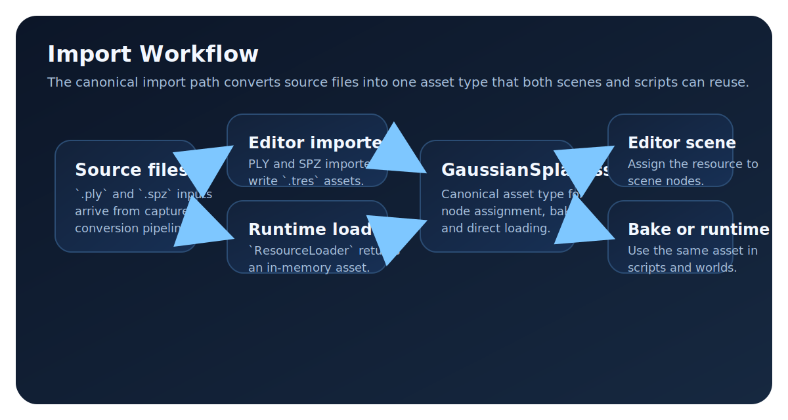

# Gaussian Splat Asset Import Workflow

!!! tip "Canonical task page"
    Use this page as the source of truth for importing `.ply` and `.spz` assets into godotGS.
    For low-level loader and property details, use [PLY Loader](../features/ply-loader.md) as the technical complement.

## Purpose

Load `.ply` and `.spz` files into `GaussianSplatAsset` resources for editor use and runtime loading.

<figure markdown="1">
{ .gs-diagram }
<figcaption>The import workflow has two entrypoints, but both collapse into the same GaussianSplatAsset type used by scenes, bake scripts, and runtime loads.</figcaption>
</figure>

## Usage

| Entry point | Input extensions | Output type | Typical use | Implementation |
| --- | --- | --- | --- | --- |
| `ResourceImporterPLY` | `.ply` | `.tres` `GaussianSplatAsset` | Editor import pipeline for PLY sources. | `modules/gaussian_splatting/io/resource_importer_ply.cpp:145`, `modules/gaussian_splatting/io/resource_importer_ply.cpp:150`, `modules/gaussian_splatting/io/resource_importer_ply.cpp:153` |
| `ResourceImporterSPZ` | `.spz` | `.tres` `GaussianSplatAsset` | Editor import pipeline for SPZ sources. | `modules/gaussian_splatting/io/resource_importer_spz.cpp:125`, `modules/gaussian_splatting/io/resource_importer_spz.cpp:130`, `modules/gaussian_splatting/io/resource_importer_spz.cpp:133` |
| `ResourceLoader.load()` with gaussian loader | `.ply`, `.spz` | In-memory `GaussianSplatAsset` | Direct runtime/editor loading without import dock output. | `modules/gaussian_splatting/io/i_gaussian_loader.cpp:12`, `modules/gaussian_splatting/io/i_gaussian_loader.cpp:23`, `modules/gaussian_splatting/io/i_gaussian_loader.cpp:56` |

## API

| Component | Contract | Implementation |
| --- | --- | --- |
| `ResourceFormatLoaderGaussianSplat` | Recognizes `.ply` and `.spz` and returns `GaussianSplatAsset`. | `modules/gaussian_splatting/io/i_gaussian_loader.cpp:13`, `modules/gaussian_splatting/io/i_gaussian_loader.cpp:70` |
| `GaussianSplatAsset::load_from_file()` | Shared load path used by `ResourceLoader` and bake script input mode. | `modules/gaussian_splatting/io/i_gaussian_loader.cpp:23`, `scripts/bake_gsplatworld.gd:173` |
| `ResourceImporterPLY::validate_ply_properties()` | Enforces required PLY properties before import succeeds. | `modules/gaussian_splatting/io/resource_importer_ply.cpp:476` |
| `SPZLoader` | Expects SPZ magic `0x5053474E` and version `2` or `3`. | `modules/gaussian_splatting/io/spz_loader.h:79`, `modules/gaussian_splatting/io/spz_loader.h:80`, `modules/gaussian_splatting/io/spz_loader.h:81` |

## Examples

| Scenario | Expected result |
| --- | --- |
| Load `.ply` or `.spz` with `ResourceLoader` | The call returns a `GaussianSplatAsset` when extension and file data are valid. |
| Import `.ply` from the editor | The importer writes a `.tres` `GaussianSplatAsset` for scene assignment. |
| Import `.spz` from the editor | The importer writes a `.tres` `GaussianSplatAsset` for scene assignment. |

## Troubleshooting

| Symptom | Cause | Action | Implementation |
| --- | --- | --- | --- |
| `ERR_FILE_UNRECOGNIZED` from `ResourceLoader` | File extension is not `.ply` or `.spz`. | Rename or convert the file to a supported extension. | `modules/gaussian_splatting/io/i_gaussian_loader.cpp:13` |
| PLY import fails with property validation error | Required position, color DC, scale, rotation, or opacity fields are missing. | Ensure PLY contains `x,y,z,f_dc_0..2,scale_0..2,rot_0..3,opacity`. | `modules/gaussian_splatting/io/resource_importer_ply.cpp:482`, `modules/gaussian_splatting/io/resource_importer_ply.cpp:503` |
| Asset loads but shading detail is limited | Optional higher-order SH properties are absent. | Export `f_rest_*` coefficients from the source pipeline. | `modules/gaussian_splatting/io/resource_importer_ply.cpp:552` |
| SPZ import fails early | Header magic or version is unsupported. | Regenerate the SPZ file with supported format constraints. | `modules/gaussian_splatting/io/spz_loader.h:79`, `modules/gaussian_splatting/io/spz_loader.h:80` |

## See also

| Topic | Path |
| --- | --- |
| Bake workflow | [docs/workflows/GSPLATWORLD_BAKE.md](GSPLATWORLD_BAKE.md) |
| Troubleshooting overview | [docs/troubleshooting/recurring-issues.md](../troubleshooting/recurring-issues.md) |
