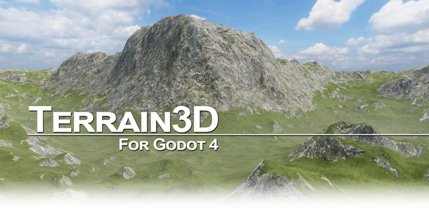

# Terrain3D
A high performance, editable terrain system for Godot 4.

## Features
* Written in C++ as a GDExtension addon, which works with official engine builds
* Can be accessed by GDScript, C#, and any language Godot supports
* Geometric Clipmap Mesh Terrain, as used in The Witcher 3. See [System Architecture](https://terrain3d.readthedocs.io/en/stable/docs/system_architecture.html) 
* Up to 16k x 16k in 1k regions (imagine multiple islands without paying for 16k^2 vram)
* Up to 32 textures
* Up to 10 levels of detail
* Foliage instancing
* Sculpting, holes, texture painting, texture detiling, painting colors and wetness
* Imports heightmaps from [HTerrain](https://github.com/Zylann/godot_heightmap_plugin/), WorldMachine, Unity, Unreal and any tool that can export a heightmap (raw/r16/exr/+). See [importing data](https://terrain3d.readthedocs.io/en/stable/docs/import_export.html)

See [Project Status](https://terrain3d.readthedocs.io/en/stable/docs/project_status.html) for details.

## Getting Started

1. Read the [Installation & Upgrades](https://terrain3d.readthedocs.io/en/stable/docs/installation.html) instructions.

2. For support, read [Getting Help](https://terrain3d.readthedocs.io/en/stable/docs/getting_help.html) or join our [Discord server](https://tokisan.com/discord).

3. Watch the tutorial videos:

**Installation, Setup, Basic Usage**

**Texture Painting, Holes, Navigation, Advanced Usage**

## Credit
Developed for the Godot community by:

|||
|--|--|
| **Cory Petkovsek, Tokisan Games** |     |
| **Roope Palmroos, Outobugi Games** |    |

And other contributors displayed on the right of the github page and in [AUTHORS.md](https://github.com/TokisanGames/Terrain3D/blob/main/AUTHORS.md).

Geometry clipmap mesh code created by [Mike J. Savage](https://mikejsavage.co.uk/blog/geometry-clipmaps.html). Blog and repository code released under the MIT license per email communication with Mike.

## Contributing

Please see [CONTRIBUTING.md](https://github.com/TokisanGames/Terrain3D/blob/main/CONTRIBUTING.md) if you would like to help make Terrain3D the best terrain system for Godot.

## License

This addon has been released under the [MIT License](https://github.com/TokisanGames/Terrain3D/blob/main/LICENSE.txt).

