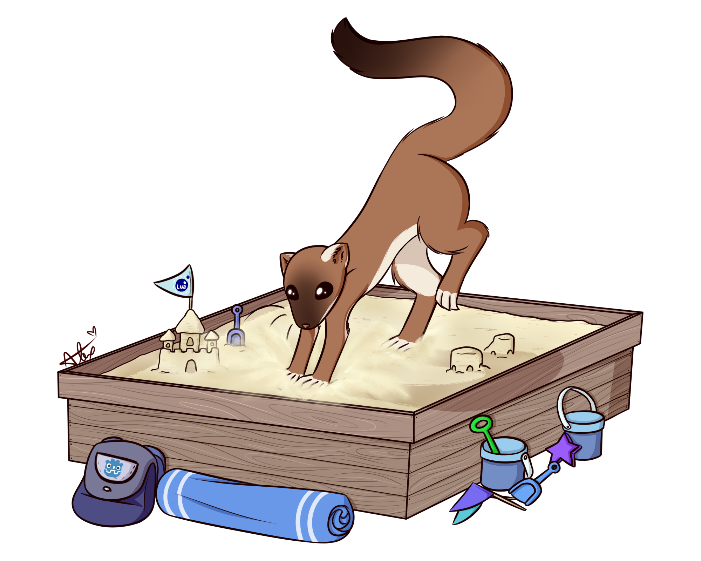

 Godot Lua API
===============
**Table of contents:**
  * [About](#about)
  * [Features](#features)
  * [Release Builds](#release-builds)
  * [Compiling](#compiling)
  * [Getting Started](#getting-started)
  * [Contributing And Feature Requests](#contributing-and-feature-requests)

About
-------

Art created by [Alex](https://www.instagram.com/redheadalex1)

This is a Godot addon that adds Lua API support via GDScript, C# or GDExtension. Importantly this is **NOT** meant to be a replacement for or alternative to GDScript. This addon provides no functionality to program your game out of the box. This addon allows you to create custom Modding API's in a sandboxed environment. You have control of what people can and can not do within that sandbox.

To use you can either [Compile from source](#compiling) or you can download one of the [release builds](#release-builds).

By default the Lua print function is set to print to the GDEditor console. This can be changed by exposing your own print function as it will overwrite the existing one.

**Some things to note**, this is not the only way to support Modding in your game. It's also not the only way to support Lua Modding in your game. In fact, using this mod to create your Modding API will likely take a lot more work than using native scripts for Modding. However, the advantage using luaAPI over native scripts is that the Lua code is sandboxed. No one can access parts of the engine that you don't explicitly give access to.

If you are looking to make your game using Lua or would like to support Modding without worrying about a sandbox, check out one of these projects:
- [luascript](https://github.com/perbone/luascript) by [perbone](https://github.com/perbone)
- [godot-lua-pluginscript](https://github.com/gilzoide/godot-lua-pluginscript) by [gilzoide](https://github.com/gilzoide)
<br />

We will supply a brief overview here. But for more info check out the [wiki](https://luaapi.weaselgames.info/latest).

For discussion related to this project feel free to join the Weasel Games [Discord](https://discord.gg/vGazqdQZ7p) or [Matrix](https://matrix.weaselgames.net/#/room/#weaselgames:weaselgames.net).

Features
--------------------------------
- Run Lua directly from a string or a text file.
- Push any Variant as a global.
- Call Lua functions from GDScript.
- Choose which libraries you want Lua to have access to.
- LuaError type which is used to report any errors this addon or Lua run into.
- LuaCoroutine type which creates a Lua thread. This is not a OS thread but a coroutine.
- Object passed as userdata. See [wiki](https://luaapi.weaselgames.info/latest/examples/objects/).
- Objects can override most of the Lua metamethods. I.E. __index by defining a function with the same name.
- Callables passed as userdata, which allows you to push a Callable as a Lua function.
- Basic types are passed as userdata (currently: Vector2, Vector3, Color, Rect2, Plane) with a useful metatable. This means you can do things like:
```lua
local v1 = Vector2(1,2)
local v2 = Vector2(100.52,100.83)
v2 = v2.floor()
print(v2.x) -- "100"
print(v1+v2) -- "(101,102)"
change_my_sprite_color(Color(1,0,0,1)) -- If "change_my_sprite_color" was exposed, in GDScript it will receive a Color variant.
```

If a feature is missing that you would like to see feel free to create a [Feature Request](https://github.com/WeaselGames/godot_luaAPI/issues/new?assignees=&labels=feature%20request&template=feature_request.md&title=) or submit a PR

Release Builds
---------------
- [⚙️ GDExtension](https://github.com/WeaselGames/godot_luaAPI/releases/latest/download/gdextension.zip)
- [⚙️ GDExtension LuaJIT](https://github.com/WeaselGames/godot_luaAPI/releases/latest/download/gdextension-LuaJIT.zip)
- [🐧 Linux Editor](https://github.com/WeaselGames/godot_luaAPI/releases/latest/download/linux-editor.zip)
- [🐧 Linux Editor LuaJIT](https://github.com/WeaselGames/godot_luaAPI/releases/latest/download/linux-editor-luajit.zip)
- [🐧 Linux Editor Mono](https://github.com/WeaselGames/godot_luaAPI/releases/latest/download/linux-editor.zip)
- [🎨 Windows Editor](https://github.com/WeaselGames/godot_luaAPI/releases/latest/download/windows-editor.zip)
- [🎨 Windows Editor LuaJIT](https://github.com/WeaselGames/godot_luaAPI/releases/latest/download/windows-editor-luajit.zip)
- [🎨 Windows Editor Mono](https://github.com/WeaselGames/godot_luaAPI/releases/latest/download/windows-editor-mono.zip)
- [🍎 MacOS Editor](https://github.com/WeaselGames/godot_luaAPI/releases/latest/download/macos-editor.zip)
- [🍎 MacOS Editor LuaJIT](https://github.com/WeaselGames/godot_luaAPI/releases/latest/download/macos-editor-luajit.zip)
- [🍎 MacOS Editor Mono](https://github.com/WeaselGames/godot_luaAPI/releases/latest/download/macos-editor-mono.zip)
- [🗜️ Export Templates](https://github.com/WeaselGames/godot_luaAPI/releases/latest/download/export-templates.zip)
- [🗜️ Mono Export Templates](https://github.com/WeaselGames/godot_luaAPI/releases/latest/download/export-templates-mono.zip)
- For previous versions see [releases](https://github.com/WeaselGames/godot_luaAPI/releases)

Compiling
------------
This build is for godot 4.1.
- Start by cloning the Godot 4.1 [source](https://github.com/godotengine/godot) with this command `git clone https://github.com/godotengine/godot`
- Next change directories into the modules folder and clone this repo into a folder named luaAPI with this command `git clone --recurse-submodules https://github.com/WeaselGames/godot_luaAPI luaAPI`. Make sure to use --recurse-submodules to pull the submodules as well.

- Now you can follow the Godot build instructions on their [site](https://docs.godotengine.org/en/stable/contributing/development/compiling).

Getting Started
------------
If you are looking for more in depth information please refer to our [wiki](https://luaapi.weaselgames.info/latest).

Pro Tip: Be sure to download the Export Templates! The Export Templates that come with Godot will not work with this 
Editor/Add-on. Please see [Installing Export Templates](EXPORT.MD) for more information. 

Dotnet users will also want to refer to [DOTNET.md](DOTNET.md) For additional information and steps that are needed to 
make the Editor/Add-on work.

**Running Lua for you first time:**
```gdscript
extends Node

var lua: LuaAPI = LuaAPI.new()

func _lua_print(message: String) -> void:
	print(message)

func _ready() -> void:
	lua.push_variant("print", _lua_print)
	lua.push_variant("message", "Hello lua!")

	# All builtin libraries are available to bind with. Use OS and IO at your own risk.
	lua.bind_libraries(["base", "table", "string"])

	# Most methods return a LuaError in case of an error
	var err: LuaError = lua.do_string("""
	for i=1,10,1 do
		print(message)
	end
	function get_message()
		return "Hello gdScript!"
	end
	""")
	if err is LuaError:
		print("ERROR %d: %s" % [err.type, err.message])
		return

	var val = lua.pull_variant("get_message")
	if val is LuaError:
		print("ERROR %d: %s" % [val.type, val.message])
		return

	var message = val.call([])
	print(message)
```

Dotnet (mono) users see example redone in C# in [DOTNET.md](DOTNET.md).

Contributing And Feature Requests
---------------
All contributions are welcome, if you would like to contribute submit a PR.
<br />
Additionally if you do not have the time and or the knowledge you can create a [Feature Request](https://github.com/WeaselGames/godot_luaAPI/issues/new?assignees=&labels=feature%20request&template=feature_request.md&title=).

[](https://www.lua.org/)