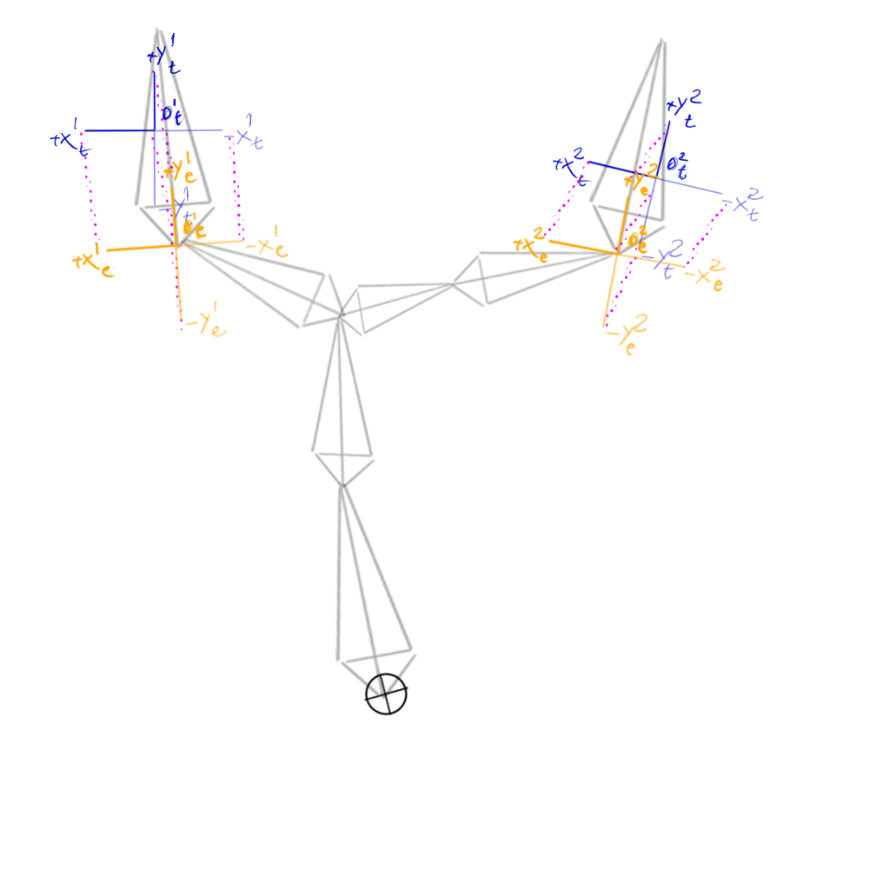
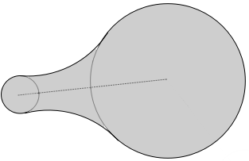
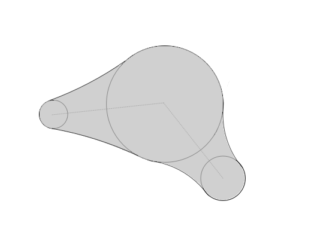
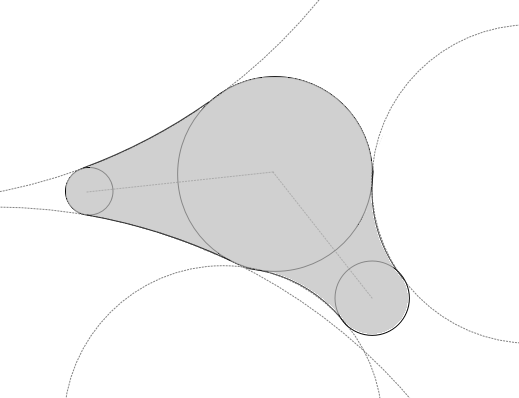

# EWBIK: A Highly General, Fast, Constrainable, and Stable Inverse Kinematics algorithm

_Eron Gjoni_

This document introduces Entirely Wahba's-problem Based Inverse
Kinematics (EWBIK). EWBIK is fast and stable and remains so under
arbitrary joint orientation constraints, multiple end-effectors,
intermediary effectors, position and orientation targets of arbitrary
target weight priority, and any mix of the aforementioned. This document
additionally introduces Kusudama constraints, which provide a means for
fast, continuous, and expressive joint orientation constraints. A full
implementation of the EWB-IK algorithm and Kusudama constraint system is
available on the \*Everything WIll Be IK\* Java library github page^[^1]^,
a Processing demo implementation of the library is also available^[^2]^
for quick visualization and use-case testing.

## 0. Preamble and Authors:

The Godot Engine many bone IK project is a port from a Java project by Eron Gjoni [Everything-Will-Be-IK](https://github.com/EGjoni/Everything-Will-Be-IK).

The authors' GitHub usernames are indicated in parentheses.

- Eron Gjoni (EGjoni)
- K. S. Ernest (iFire) Lee (fire)
- rafallus Rafael M. G. (rafallus)
- lyuma (lyuma)

## 1. Introduction and Motivation:

The two most popular approaches to the Inverse Kinematics problem for
interactive or real-time use cases are Cyclic Coordinate Descent^[^3]^
(CCD) and Forward And Backward Reaching Inverse Kinematics (FABRIK).

CCD offers highly stable and fast solutions that behave well under
joint constraints. However, CCD can solve only for single
target-effector pairs, and becomes highly unstable when negotiating
between multiple effectors aiming for potentially mutually exclusive
targets.

FABRIK offers highly stable and fast solutions that naturally handle
multiple effectors with potentially mutually exclusive targets.
However, FABRIK is, in practice, extremely unstable when used with
joint constraints.

Foregoing joint constraints to ensure stable FABRIK solutions results
in highly unnatural (often extremely painful) looking poses. While
foregoing consideration of more than one target-effector pair per bone
to ensure stable but well constrained CCD solutions results in
incomplete poses where, even if two separate bone chains with two
separate effectors could theoretically reach both of their targets
while obeying all constraints, only one effector actually does.

From this, it should be apparent that the strengths and weaknesses of
these two approaches are approximate complements of one another, in
effect leaving developers to pick their poison. Additionally, both
approaches fail to meaningfully account for target orientations, which
can result in extremely unnatural pose solutions where the
end-effector must be rotated post-hoc to bear the brunt of orientation
alignment.

## 2. The Importance of Orientation Targets:

Consider a humanoid (perhaps yourself, if you happen to be
approximately humanoid in shape) sitting at a table, with the back of
its hand flat against the table such that its fingers are pointing
directly away from its torso. If the humanoid were instructed to
rotate its hand around its middle knuckle, such that the back of its
hand remained flat against the table, but its fingers now pointed
toward its torso; the orientation of all of the bones in the humanoid,
from its wrist up to its shoulder, and perhaps even part of its spine,
would have to change drastically to allow for this.

If we treat the humanoid's pelvis as one effector and the chair as
that effector's target, and treat its knuckle bone as another
effector, and the spot on the table to which the knuckle bone must
remain affixed as the knuckle bone's target, we observe that even if
the *positions *of the targets do not change at all, there can be
massive differences in the poses an armature must adopt based solely
on the *orientations *of its targets.

This should illustrate the importance of treating target orientations
as first class citizens throughout the entire IK procedure. If we
solve only for positions and leave target orientations as an
afterthought (as CCD and FABRIK implementations most often do) we are
left to decide between "cheating" by violating joint constraints so an
effector is still aligned with its target (often resulting in effector
joints that look like they're painfully hyperextending), or else
strictly obeying the joint constraints but failing to solve for an
otherwise reachable target.

## 3. The Basic Idea:

EWBIK can be thought of as a "blockwise" generalization of Inverse
Kinematics by CCD. The primary distinction is that, where CCD seeks to
iteratively minimize the angular discrepancy between a bone-chain's
end-effector and its corresponding target from the perspective of
every bone in the chain, EWBIK instead seeks to minimize an _average_
discrepancy between _all_ effector-target pairs for *every *bone in
the chain.

Broadly EWBIK starts from the outermost bones of an armature, and
proceeds rootward as follows:

1.  Create working copies of the origin and basis vectors and origins of

    all target and effector transforms relevant to a given bone, and
    translate them along with the given bone transform's origin such
    that the bone transform's origin is at (0,0,0).

2.  Find the rotation that minimizes the average of the discrepancy

    between each effector-target pair, and apply that rotation to the
    bone.

3.  Rectify the bone's orientation to reside back within an allowable

    orientation as per any limits imposed by dampening parameters or
    joint constraint on the bone if necessary, then proceed to the
    next bone.

4.  Once the root bone has been reached, repeat the process starting
    from the outermost bones until convergence or budget exhaustion.

\*Figure 1.1 - 1.2: A simplified sketch of a step in the algorithm.
Effector basis vectors are marked in orange, target basis vectors are
marked in blue. Dashed magenta lines indicate the deltas between each
effector basis vector/origin and its corresponding target basis vector
/ origin. **\*⊕** _indicates the origin of the bone under consideration
at this step in the algorithm_.

{width="3.0984in"
height="2.6563in"}{width="3.1193in"
height="2.6457in"}

Figure 1.1 (left): \*Armature prior to rotation about **\*⊕** so as to
_minimize average discrepancies between effector points and
corresponding target points. _

Figure 1.2 (right): *Armature *after rotation about **⊕** so as to
minimize average *discrepancies *between all descendant effector points
and their corresponding target points.

Naively, we might expect difficulties in the EWBIK procedure to arise
in step 2. However, step 2 amounts to a special case of _Wahba's
Problem_: that of finding the orthogonal transformation that best
aligns one set of vectors with a corresponding target set of vectors.
This type of problem arises often in bioinformatics, astronomy,
crystallography and computer vision, and can be solved extremely
quickly by any number of existing algorithms. Of these, the Kabsch
alignment algorithm and the Quaternion Characteristic Polynomial (QCP)
algorithms are perhaps the most popular.

EWBIK has been verified to work fine with either algorithm, though QCP
is recommended for its stability, simplicity, framework agnosticism,
lack of edge-cases^[^4]^, and speed.

Efficient implementations of both the QCP and Kabsch alignment
algorithms are widely available in a number of languages, and since
they (and related algorithms) are roughly interchangeable for our
purposes, their mathematical peculiarities will not be covered here,
and the rest of this document will refer to whatever algorithm you
choose for the purpose of minimizing the discrepancy between
point-pairs as _The Minimizer_.

## 4. Role of The Minimizer:

Chief among EWBIK's strengths is that no distinction is made by the
solver between position and orientation targets. Both orientation and
position are encoded simply as point pairs for the Minimizer to solve
over.

This is achieved by representing each target as a set of up to 7
points. One point representing the target origin, three points
representing the basis vectors emanating from that origin, and three
points representing the opposites of the basis vectors with respect to
the target origin. Effectors are represented in precisely the same
way. These 7 point-pairs are then fed to the minimizer, which attempts
to find the orthogonal transformation (usually just rotation) that
minimizes the average distance between all effector-target pairs.

## 5. Multiple End and Intermediary-Effectors:

\*\* \*\*Since the Minimizer blindly operates on point-pairs, generalizing
to solve for multiple effectors is trivial. We simply feed the Minimizer
all additional effector-target point-pairs for any other effectors we
wish to optimize a bone's orientation for. If the Minimizer optimizes
for the average euclidean distance between effector-target pairs, we can
even weigh some targets more strongly than others by just scaling the
effector-target pairs about the bone origin in proportion to the
precedence we want to place on that target-effector pair. This works
because rotation of any point closer to the origin results in a smaller
change in euclidean distance than does rotation of any point further
from the origin.^[^5]^

Additionally, we can weigh a target\'s orientation more or less
strongly than its position by scaling the basis vectors of the target
and/or effector about their respective origins.

## 6. Preprocessing:

When using EWBIK to solve for a single effector-target pair, no
preprocessing of the armature is required. However, if solving for
multiple effector-target pairs, the armature must be segmented prior to
solve time so as to ensure that ancestor bones are only solved for after
all of their descendant bones have been solved for, otherwise an
ancestor might end up minimizing for stale effector pairs as descendant
lineages have yet to finish solving.

Such a problem scenario is depicted in _Figure 2.1_, the appropriate
segmentation of which is depicted in _Figure 2.2_. The rectangles
indicate logical segments. The numbers and letters indicate processing
order. With the only processing rule being that no bone of a greater
letter may be processed before any bone of a lesser letter, and no bone
of a greater number may be processed before any bone of a lesser number
in the same segment.

_Figure 2.1 (left): An example armature, with effectored bones indicated in orange._

_Figure 2.2 (right): Segmented representation of the example armature in 2.1._

## 7. Solving:

Once the segments have been created, we create working copies of the
basis vectors and origins representing all descendant target and
effector transforms on the segment, as well as opposing basis vectors
(copies of the original basis vectors flipped about their transform's
origin). Below, we will call any copies representing target basis
vectors and their opposites **_c_basisTargets_**, and any copies
representing effector basis vectors and their opposites
**_c_basisEffectors_**. We will call any copies representing origins
**_c_originTargets_** and **_c_originEffectors_**.

From there, the simplest and fastest version of the EWBIK procedure
starts from the outermost segments and works inward to the root segment,
doing as follows for each bone in each segment:

1.  Reset the working copies of the targets and effector to correspond

    to their original values. Subtract the current bone's origin from
    all _c_basisTarget_, *c_basisEffector, c_originTarget, *and*
    c_originEffector * points.

    a. Scale any *c_basisTargets *about their corresponding *c_originTargets *such that their distance from their corresponding _c_originTarget_ is no less than 1, and also no less than the magnitude of their corresponding _c_originTarget, _

    b. Scale any *c_basisEffectors *about their corresponding _c_originEffectors_ such that their distance from their corresponding _c_originEffectors_ is no less than 1, and no less than the magnitude of their corresponding _c_originTargets._

2.  Use The Minimizer to compute the rotation that brings all

    _c\_\*Effector_ points as close as possible to their corresponding
    _c\_\*Target_ points.

    a. Clamp this rotation by the desired dampening parameter.

    b. Apply the clamped rotation to the bone.

3.  Check if the bone has violated any of its orientation constraints as

    a result of this rotation. If it has, rotate the bone to reside
    within a valid region of its orientation constraint.

4.  If the bone's parent is contained in the current segment, repeat
    this process for the parent bone. Otherwise, traversal for this
    segment is complete.

Repeat the whole process until the armature has converged or the
computation budget has been exceeded.

## 8. Constraints:

\*\* \*\*In theory, EWBIK should work well with any type of commonly used
joint constraint (doing so requires no more than implementing step 3 in
the introductory section). Unfortunately, in practice, most commonly
used joint constraints come with their own set of tradeoffs. An ideal
orientation constraint system would provide the following

1.  **Continuity**: No sharp concave corners for a bone to get "stuck" in.

2.  **Versatility**: It should be possible to specify any conceivable orientation region.

3.  **Expressiveness**: The desired shape of the allowable orientation region should be fully specifiable with as few parameters as possible.

4.  **Speed**: as few operations as possible should be required to determine if a Bone is within the valid orientation region, or to determine the smallest rotation that brings it back within a valid orientation (note that this follows naturally from the previous criterion).

5.  **Extensibility**: The constraints should be amenable to specification of any number of additional properties that may vary continuously throughout or beyond the allowable orientations region (hard vs soft boundaries, high vs low friction regions, etc).

The simplest conceivable systems for orientation constraints are Euler
angles, which offer speed, but not much else; and Reach cones, which
offer continuity, speed, and extensibility, but lack expressiveness or
versatility.

More versatile constraint systems allow for per-vertex specification of
a polygonal bounding region on the surface of a sphere. Much like reach
cones, these operate on the principle that any point which resides
outside of the polygonal region should be transformed so as to reside on
the edge or vertex to which it is closest (see _figure 3.1 for a planar
representation_).
Unfortunately, the fewer edges the polygonal region is specified by, the greater the probability that it is closest to a vertex of the polygon than to an edge, which often results in the point getting "stuck" in corners (see _Figure 3.2 for a planar representation_).

_Figure 3.1 (left): A sampling of points outside of the bounding region, with dotted lines indicating the area on the bounding region to which the constraint would transform them._

_Figure 3.2 (right): Colored areas indicate the edge to which any point within that area would be transformed so as to reside within the bounding polygon. Red regions indicate areas where all points would be transformed onto a single vertex._

These discontinuous corners can cause problems for an IK solver because they create local minima that are very difficult for solvers to find a way out of. Worse still, if the solver does get out, it tends to do so very suddenly, leading to jarring and unnatural "pops" between solutions.

A common workaround is to smooth these corners out using splines or bezier curves, (see _Figure 4_ for a planar representation). However, while this solves the discontinuity problem, it does so at a significant performance penalty, because the only way to check whether or not a point on a sphere lies within the bounding spline is by segmenting the spline into very tiny linear segments, which then each have to be checked individually.

_Figure 4: A sampling of points outside of a continuous, spline-based bounding region, with dotted lines indicating the area on the bounding region to which the constraint would transform the point._

Aside from the performance penalty, the spline scheme is also somewhat strange conceptually in that it attempts to overcome the consequences of relying on a polygonal specification by adding an approximation of curvature by an increase in the number of line segments, and then mapping that approximation onto a sphere -- a domain in which curvature is already the rule, and linearity is inherently unnatural.

If we start from scratch, and develop our bounding scheme with the upfront understanding that it will be mapped onto a sphere, instead of using points and lines as the fundamental units of our bounding region, we should prefer instead to think in terms of circles. Under such a scheme, a bounding region similar to that defined by the seven parameters (vertices) of Figure 5.1 might be represented as that defined by the six parameters (three circle centers, and three radii) of Figure 5.2.

_Figure 5.1 (left): A polygonal bounding region, specified in terms of points and lines._

_Figure 5.2 (right): An approximation of the polygonal bounding region in Figure 5.1, specified as a connected sequence of circles of varying radii._

Note that because the bounding "lines" connecting any pair of circles are tangent to both circles, the entire boundary remains continuous. Of course, since we're mapping onto a sphere, these tangent "lines" are actually themselves circles of whatever radius is sufficient to contact both circle pairs (see Figure 6). Because there are an infinite number of circles which can contact two circles (both on the plane and on a sphere) we are also free to specify varying degrees of curvature to the regions bounding any two circles, as depicted in Figures 7.1 and 7.2.

_Figure 6: Spherical representation of bounding regions._

_Figure 7.1 (middle): Two circles (dark outline) and a sampling of the circles which lie tangent to both._

_Figure 7.2 (right): Result of choosing connecting circles of various radii._

These optional curvatures give us similar flexibility to that of the
spline approach, but need specify only one additional radius value per
pair of sequence-circles they connect (as there can only be at most two
tangent-circles satisfying a given radius). We'll look at the specifics
of representing our bounding region on a sphere in the next section, but
for now we'll limit ourselves to the plane so as to more easily
illustrate the form of the algorithm for checking whether we are within
the bounding region.

We will presume our bounding region is made up of the three full circles
(which we will refer to as "sequence-circles") connected by a dotted
line depicted in _figure 8(a),_ and the six tangent-circles depicted in
light gray outlines in _figure_ _8(a2)_.

1.  We check to see if the point is within the two sequence-circles depicted in blue and green in _figure 8(b)_.

    a. If the point is within either sequence-circle, we terminate, as the point is within the allowable region.

    b. Otherwise, we proceed to step 2.

2.  We check to see if the point is within either of the two triangles depicted in amethyst in figure 8(c), which are formed by the centers of our pair of sequence-circle with the centers of the adjacent pair of tangent-circles.

    a. If the point is within either triangle, we proceed to step 3

    b. Otherwise, we skip to step 4.

3.  We check to see if the point is within either of the adjacent tangent circles as depicted in _figure 8(d)_.

    a. If it is within one of the tangent-circles, then we transform it away from the center of the tangent-circle within which it resides such that its distance from the tangent-circle's center is equal to the radius of that tangent-circle (_figure 8(d2)_). Then terminate, as we have finished moving the point to the boundary of the allowable region.

    b. If it isn't within either circle, then proceed to step 4.

4.  Proceed to the next pair in the sequence (_figure 8(f)_), treating the blue sequence-circle from the previous steps as if it were the new green sequence-circle, and treating the next circle in the sequence as being the new blue sequence-circle. Repeat steps 1 through 4 (_figure 8(g)_) until the blue sequence-circle under consideration is the last one in the sequence, then proceed to step 6.

5.  If the point wasn't in any of the regions checked so far, then by process of elimination, it resides outside of any of the sequence circles, and the regions connecting the sequence circles, and anywhere which should be transformed to the regions connecting the sequence circles. So we just iterate through each sequence-circle individually, store the translation that would bring us (h) to its boundary, and apply whichever of the translations was smallest (i).

|  |  |
| :-----------------------------------------------------------: | :------------------------------------------------------------: |
|                              (a)                              |                              (a2)                              |

|  |  |
| :-----------------------------------------------------------: | :-----------------------------------------------------------: |
|                              (b)                              |                              (c)                              |

|  |  |
| :-----------------------------------------------------------: | :------------------------------------------------------------: |
|                              (d)                              |                              (d2)                              |

(f)

(g)

|  |  |
| :-----------------------------------------------------------: | :-----------------------------------------------------------: |
|                              (h)                              |                              (i)                              |

_Figure 8 (black regions indicate areas which have been eliminated from
further consideration by previous steps in the algorithm)_

## 9. Kusudamas:

The spherical representation of such a bounding region uses cones
instead of circles. We replace the centers of the circles with vectors
pointing away from the constraint's origin, and replace their radii
with the half-angle of that cone's apex.

This representation may be considered a generalization of the reach
cone concept. We call it a "Kusudama", as it resembles the spherical
japanese papercraft models made by sewing or glueing pyramidal units
through a common vertex.

We are free to choose the apex angle of our tangent cones (and
therefore the curvature of the bounding region connecting our
sequence-cones) however we wish, so long as the following properties
are met.

1.  As the sum of the apex angles of our pair of sequence-cones

    approaches zero, the apex angles of the tangent cones must
    approach π.

2.  As the sum of the apex angles of our pair of sequence-cones
    approaches π, the apex angles of the tangent cones must approach 0.

A straightforward function for automatically determining a reasonable
tangent cone radius in absence of any information aside from the radii
of the two sequence cones being connected is

$$\frac{\pi - {({\theta{a + \theta}b})}}{2}$$

Where $$\theta a$$ and $$\theta b$$ are the apex angles of the two
sequence-cones being connected.

Once we've determined an appropriate radius for a given tangent-cone,
all that's left is to find the direction in which it should point. To
do this, take the vectors representing the axis of the sequence-cones
being connected, and scale them to a magnitude of
$$\cos\left(\frac{\theta_{s} + \theta_{t}}{2}\right)$$
Where $\theta_{s}$ is the apex angle of the sequence-cone to which the
vector corresponds, and $\theta_{t}$ is the apex angle of the
tangent cone we're determining the direction of. The two planes which
run through and are perpendicular to the tips of these scaled axis
vectors will intersect on a line running through the unit sphere. The
two points where this line intersects the unit sphere may be treated
as vectors representing the directions of our tangent-cone axes.

Our full procedure for checking collisions is much the same as in the
planar case, with only minor modifications to account for the change in
topology. It goes as follows:

1.  We check to see if the angle between the bone's direction and the

    direction of the axis of each sequence-cone is less than the apex
    angle of the sequence cones under consideration.

    a. If it is, we terminate, as the bone orientation is within the allowable region.

    b. Otherwise, we proceed to step 2.

2.  For each adjacent pair of sequence cones, we check to see if the

    bone direction is within either of the tetrahedrons formed by the
    constraint origin, the line connecting the vectors representing
    the two sequence-cone axes to each other, and the lines connecting
    each sequence-cone axis to each tangent cone axis.

    a. If the bone direction is within either tetrahedron, we proceed to step 3

    b. Otherwise, we skip to step 4.

3.  We check to see if the angle between the bone's direction and the direction of the axis of the tangent-cone coinciding with this tetrahedron is less than the apex half-angle of the tangent-cone under consideration.

    a. If it is, then we find the rotation which would transform the bone direction away from the tangent-cone in which it resides such that the angle between the bone direction and the tangent-cone's direction is equal to the apex half-angle of that tangent-cone. We do not terminate or apply this rotation. If the angle of this rotation is less than any currently stored rotation, we replace that rotation with this rotation, otherwise, we ignore this rotation. We then proceed to step 4.

    b. If it isn't, then proceed to step 4.

4.  We shift to the next pair of adjacent sequence cones and repeat steps 1 through 4 until one of the sequence cones under consideration is the last cone defined. Then proceed to step 5

5.  We iterate again through each sequence-cone individually, and for each sequence-cone find the rotation which would transform the bone such that its angle from that sequence-cone axis is less than half the apex-angle of that sequence cone. We update the currently stored smallest rotation whenever we find a smaller rotation. (In effect, preferring to rotate the bone to the nearest constraint boundary)

6.  We apply the currently stored smallest rotation, and terminate.

Note that as presented above, Kusudamas are only constraining the
direction (aka swing) of the bone. To constrain their axial orientation
(aka twist), a swing-twist decomposition may be used (as is common for
reach cone constraints). For best results, the constraint axis against
which twist is determined should be pointing as far away as possible
from the constraint\'s allowable region.

**11. Robustness under enhancement:**

In the canonical form presented above, Kusudumas empirically play quite
well with the EWBIK procedure. However, because the Kusudama scheme is
flexible enough to allow for "soft" or "springy" constraints, it is
possible to create a constraint landscape in which the solver undulates
around some optimum^[^6]^ . If it is absolutely critical that such
undulation be avoided, we can do so by incurring only a minor
performance penalty to check that the RMSD of our solution after
rotating and constraining a bone is less than or equal to our RMSD
before rotating and constraining the bone. If our RMSD is greater, we
simply discard our rotation + constraint transformation that step, and
allow the other bones in the chain to pick up the slack.

[^1]: [_https://github.com/EGjoni/Everything-Will-Be-IK_](https://github.com/EGjoni/Everything-Will-Be-IK)
[^2]: [_https://github.com/EGjoni/Everything-Will-Be-IK-Processing_](https://github.com/EGjoni/Everything-Will-Be-IK-Processing)
[^3]:
    There is some terminological ambiguity as to what constitutes
    "Coordinate Descent." Here, as is the case with the original CCD IK
    algorithm, Coordinate Descent is used to refer to problems in which
    each coordinate (e.g, a single variable at some cross section of a
    multivariable function) can be precisely minimized. Cyclic
    Coordinate Descent guarantees that so long as the function being
    minimized is continuous and convex, successive minimization along
    any permutation of its coordinates will converge on the global
    minimum of the function (so long as evaluation of any coordinate is
    preferred by no more than a constant factor).

    Procedures where multiple variables are minimized per iteration are
    most often referred to as Blockwise Coordinate Descent.

[^4]:
    With single precision floating point, QCP may under some
    degenerate conditions require renormalization of the resultant
    quaternion. This renormalization does not affect solution quality,
    but may be worth considering for anyone looking to hyper-optimize
    performance, as it does require an additional square root operation.
    In theory, double precision floating point should occasionally
    require similar rectification, though for somewhat mysterious
    reasons it never seems to in practice.

[^5]:
    This can occur incidentally, where one set of target-effector
    point-pairs happens to be closer to the origin of a bone being
    solved for than another set of target-effector point-pairs. For this
    reason, the full EWBIK procedure scales the basis vectors of any
    target and effector transforms by the distance between the target
    transform's origin and the origin of the transform of the bone being
    solved for.

[^6]:
    In theory, even the simple canonical form of kusudamas should be
    subject to this. Though, in practice it's almost never an issue
    until soft constraints enter the mix.
