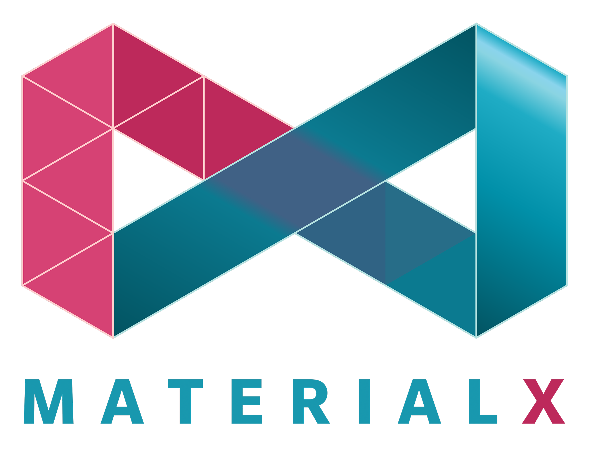
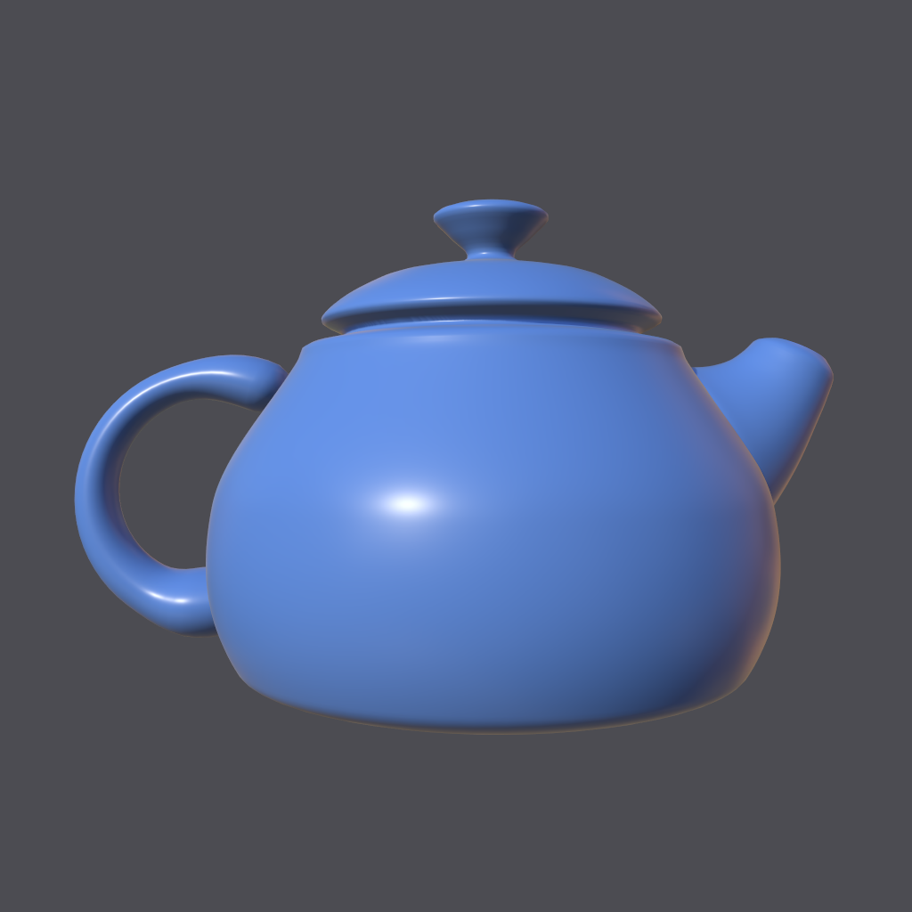
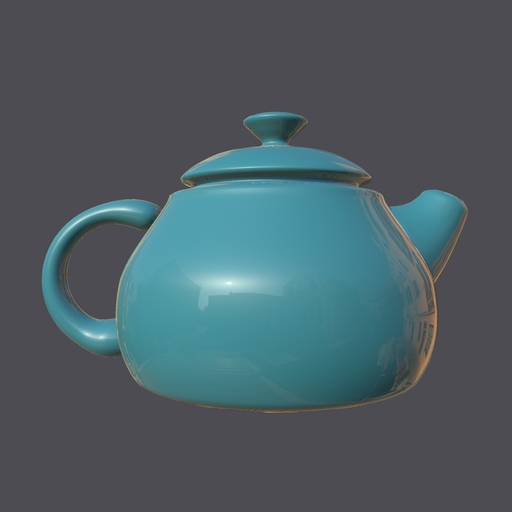

  

### Introduction

MaterialX is an open standard for representing rich material and look-development content in computer graphics, enabling its platform-independent description and exchange across applications and renderers.  Launched at [Industrial Light & Magic](https://www.ilm.com/) in 2012, MaterialX has been a key technology in their feature films and real-time experiences since _Star Wars: The Force Awakens_ and _Millennium Falcon: Smugglers Run_.  The project was released as open source in 2017, with companies including Sony Pictures Imageworks, Pixar, Autodesk, Adobe, and SideFX contributing to its ongoing development.  In 2021, MaterialX became the seventh hosted project of the [Academy Software Foundation](https://www.aswf.io/).

### Quick Start for Developers

- Download the latest version of the [CMake](https://cmake.org/) build system.
- Point CMake to the root of the MaterialX library and generate C++ projects for your platform and compiler.
- Select the `MATERIALX_BUILD_PYTHON` option to build Python bindings.
- Select the `MATERIALX_BUILD_VIEWER` option to build the MaterialX viewer.

### Supported Platforms

The MaterialX codebase requires a compiler with support for C++14, and can be built with any of the following:

- Microsoft Visual Studio 2017 or newer
- GCC 6 or newer
- Clang 6 or newer

The Python bindings for MaterialX are based on [PyBind11](https://github.com/pybind/pybind11), and support Python versions 3.6 and greater.

### MaterialX Viewer

The [MaterialX Viewer](documents/DeveloperGuide/Viewer.md) leverages shader generation to build GLSL shaders from MaterialX graphs, rendering the results using the NanoGUI framework.

**Figure 1:** Procedural and uniform materials in the MaterialX viewer

  
   
   
   

**Figure 2:** Textured, color-space-managed materials in the MaterialX viewer

  
   

### Open Chess Set

The Open Chess Set is an open reference asset, consisting of a [MaterialX file](resources/Materials/Examples/StandardSurface/standard_surface_chess_set.mtlx) in the Standard Surface shading model and a [geometry file](resources/Geometry) in the glTF format.  It was authored by Moeen Sayed and Mujtaba Sayed, and was contributed to the MaterialX project by Side Effects.

**Figure 3:** The Open Chess Set, rendered in Arnold for Maya

**Figure 4:** The Open Chess Set, rendered in Karma XPU for Houdini

### Pre-Built Binaries

The following packages contain pre-built binaries for the latest release, including the MaterialX viewer, Python libraries, and example assets:

- [Microsoft Windows (Visual Studio 2022, Python 3.11)](https://github.com/AcademySoftwareFoundation/MaterialX/releases/latest/download/MaterialX_Windows_VS2022_x64_Python311.zip)
- [MacOS (Xcode 14, Python 3.11)](https://github.com/AcademySoftwareFoundation/MaterialX/releases/latest/download/MaterialX_MacOS_Xcode_14_Python311.zip)
- [Linux (GCC 12, Python 3.11)](https://github.com/AcademySoftwareFoundation/MaterialX/releases/latest/download/MaterialX_Linux_GCC_12_Python311.zip)

### Additional Resources

- The [Developer Guide](http://www.materialx.org/docs/api/index.html) contains a developer-oriented overview of MaterialX with API documentation.
- The [Python Scripts](python/Scripts) folder contains standalone examples of MaterialX Python code.
- The [JavaScript](javascript) folder contains details on building JavaScript bindings for MaterialX.
- Presentations at [ASWF Open Source Days](https://materialx.org/assets/ASWF_OSD2023_MaterialX_Final.pdf) and the [SIGGRAPH Physically Based Shading Course](https://blog.selfshadow.com/publications/s2020-shading-course/#materialx) provide details on the roadmap for MaterialX development.
