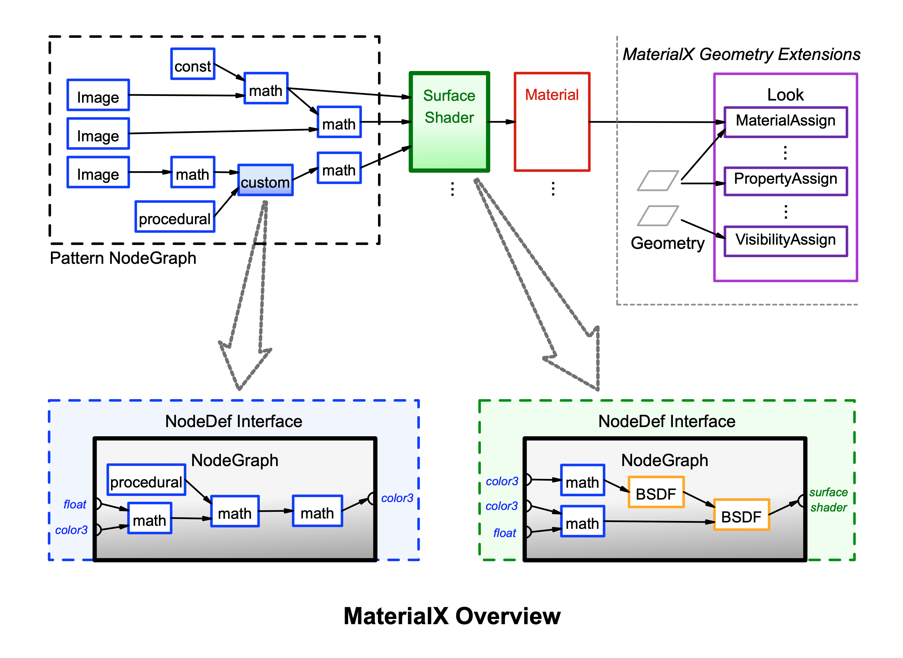
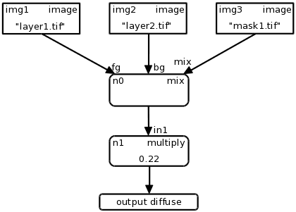
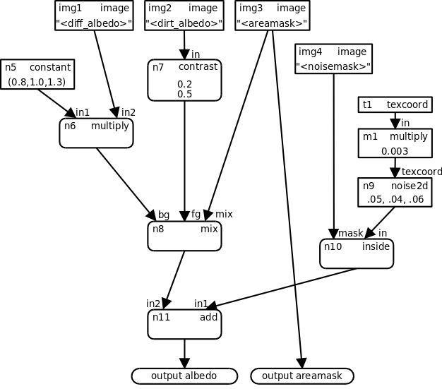

<!-----
MaterialX Specification v1.39
----->


# MaterialX: An Open Standard for Network-Based CG Object Looks

**Version 1.39**  
Doug Smythe - Industrial Light & Magic  
Jonathan Stone - Lucasfilm Advanced Development Group  
April 20, 2023


# Introduction

Computer graphics production studios commonly use workflows involving multiple software tools for different parts of the production pipeline.  There is also a significant amount of sharing and outsourcing of work across facilities, requiring companies to hand off fully look-developed models to other divisions or studios which may use different software packages and rendering systems.  In addition, studio rendering pipelines that previously used monolithic shaders built by expert programmers or technical directors with fixed, predetermined texture-to-shader connections and hard-coded texture color-correction options are now using more flexible node-based shader networks built up by connecting images and procedurals to shader inputs through a graph of image processing and blending operators.

At least four distinct interrelated data relationships are required to specify the complete "look" of a CG object:

1. _Image processing networks_ of sources, operators, connections and input values, outputting a number of spatially-varying data streams.
2. _Geometry-specific information_ such as associated texture filenames or IDs for various map types.
3. Associations between spatially-varying data streams and/or uniform values and the inputs of surface, volume, or other shaders, defining a number of _materials_.
4. Associations between materials and specific geometries to create a number of _looks_.

**MaterialX** addresses the need for an open, platform-independent, well-defined standard for specifying the "look" of computer graphics objects built using node networks by defining a material content schema along with a corresponding XML-based file format to read and write MaterialX content.  The MaterialX schema defines a number of primary element types plus several supplemental and sub-element types, as well as a set of **standard nodes** with specific functionality for defining data-processing graphs, shaders and materials.

This document describes the core MaterialX specification.  Companion documents [**MaterialX Physically Based Shading Nodes**](./MaterialX.PBRSpec.md), [**MaterialX Geometry Extensions**](./MaterialX.GeomExts.md) and [**MaterialX Supplemental Notes**](./MaterialX.Supplement.md) describe additional node and element types and other information about the library.


## Table of Contents

**[Introduction](#introduction)**  

**[MaterialX Overview](#materialx-overview)**  
 [Definitions](#definitions)  
 [MaterialX Names](#materialx-names)  
 [MaterialX Data Types](#materialx-data-types)  
 [Custom Data Types](#custom-data-types)  
 [MTLX File Format Definition](#mtlx-file-format-definition)  
 [Color Spaces and Color Management Systems](#color-spaces-and-color-management-systems)  
 [Units](#units)  
 [MaterialX Namespaces](#materialx-namespaces)  
 [Geometric Properties](#geometric-properties)  
 [File Prefixes](#file-prefixes)  
 [Filename Substitutions](#filename-substitutions)  

**[Nodes](#nodes)**  
 [Inputs](#inputs)  
 [Node Graph Elements](#node-graph-elements)  
 [Output Elements](#output-elements)  

 [Standard Source Nodes](#standard-source-nodes)  
  [Texture Nodes](#texture-nodes)  
  [Procedural Nodes](#procedural-nodes)  
  [Geometric Nodes](#geometric-nodes)  
  [Global Nodes](#global-nodes)  
  [Application Nodes](#application-nodes)  

 [Standard Operator Nodes](#standard-operator-nodes)  
  [Math Nodes](#math-nodes)  
  [Adjustment Nodes](#adjustment-nodes)  
  [Compositing Nodes](#compositing-nodes)  
  [Conditional Nodes](#conditional-nodes)  
  [Channel Nodes](#channel-nodes)  
  [Convolution Nodes](#convolution-nodes)  

 [Standard Node Inputs](#standard-node-inputs)  
 [Standard UI Attributes](#standard-ui-attributes)  
 [Backdrop Elements](#backdrop-elements)  
 [Node Graph Examples](#node-graph-examples)  

**[Customization, Targeting and Shading](#customization-targeting-and-shading)**  
 [Target Definition](#target-definition)  
 [Custom Attributes and Inputs](#custom-attributes-and-inputs)  

 [Custom Nodes](#custom-nodes)  
  [Custom Node Declaration NodeDef Elements](#custom-node-declaration-nodedef-elements)  
   [NodeDef Parameter Interface](#nodedef-parameter-interface)  
   [NodeDef Input Elements](#nodedef-input-elements)  
   [NodeDef Token Elements](#nodedef-token-elements)  
   [NodeDef Output Elements](#nodedef-output-elements)  
  [Custom Node Definition Using Implementation Elements](#custom-node-definition-using-implementation-elements)  
   [Implementation AOV Elements](#implementation-aov-elements)  
   [Example Custom Nodes Defined by External File Implementations](#example-custom-nodes-defined-by-external-file-implementations)  
  [Custom Node Definition Using Node Graphs](#custom-node-definition-using-node-graphs)  
   [Functional Nodegraphs](#functional-nodegraphs)  
   [Compound Nodegraphs](#compound-nodegraphs)  
   [Example Custom Node Defined by a Nodegraph](#example-custom-node-defined-by-a-nodegraph)  
  [Custom Node Use](#custom-node-use)  
 [Shader Nodes](#shader-nodes)  
  [Standard Library Shader Nodes](#standard-library-shader-nodes)  
  [AOV Output Elements](#aov-output-elements)   
   [AOVOutput Example](#aovoutput-example)   
 [Material Nodes](#material-nodes)  
  [Material Inheritance](#material-inheritance)  
  [Example Pre-Shader Compositing Material](#example-pre-shader-compositing-material)  
 [Material Variants](#material-variants)  

**[References](#references)**


# MaterialX Overview

The diagram below gives a high-level overview of a typical MaterialX look definition.  A directed acyclic graph of pattern generation and processing nodes is connected to inputs of a surface Shader which defines a layered BSDF response.  One or more shaders can be connected to form a Material, which is ultimately associated with specific scene geometry via a MaterialAssign, a number of which comprise a Look.  The assignments of Materials to geometries can be defined within a MaterialX document in applications supporting MaterialX Geometry Extensions, or using an alternative mechanism such as USD[^1] or a native application's toolset.  Each of the pattern nodes and even the Shaders may in turn be implemented using a graph of nodes: these NodeGraphs are given a parameter interface using NodeDefs, and these implementations may be reused with different input values just like any other Standard node defined by MaterialX.



MaterialX also allows the specification of additional information not shown in this diagram, such as geometry-specific properties, material variations, arbitrary custom inputs and attributes for nodes, rendering-target-specific versions of shaders, nodes and implementations, external compiled or generated shader implementations, and much more.


## Definitions

Because the same word can be used to mean slightly different things in different contexts, and because each studio and package has its own vocabulary, it's important to define exactly what we mean by any particular term in this proposal and use each term consistently.

An **Element** is a named object within a MaterialX document, which may possess any number of child elements and attributes.  An **Attribute** is a named property of a MaterialX element.

A **Node** is a function that generates or operates upon spatially-varying data.  This specification provides a set of standard nodes with precise definitions, and also supports the creation of custom nodes for application-specific uses.  The interface for a node’s incoming data is declared through **Inputs**, which may be spatially-varying or uniform, and **Tokens**, which are string values that can be substituted into filenames declared in node inputs.

A **Pattern** is a node that generates or processes simple scalar, vector, and color data, and has access to local properties of any geometry that has been bound.

A **Shader** is a node that can generate or process arbitrary lighting or BSDF data, and has access to global properties of the scene in which it is evaluated.  

A **Material** is a node which internally or externally references one or more shaders with specific data streams or uniform values bound to their inputs.

A **Node Graph** is a directed acyclic graph of nodes, which may be used to define arbitrarily complex generation or processing networks.  Common uses of Node Graphs are to describe a network of pattern nodes flowing into shader inputs, or to define a complex or layered node in terms of simpler nodes.

A **Stream** refers to a flow of spatially-varying data from one node to another.  A Stream most commonly consists of color, vector, or scalar data, but can transport data of any standard or custom type.

A **Layer** is a named 1-, 2-, 3- or 4-channel color "plane" within an image file. Image file formats that do not support multiple or named layers within a file should be treated as if the (single) layer was named "rgba".

A **Channel** is a single float value within a color or vector value, e.g. each layer of an image might have a red Channel, a green Channel, a blue Channel and an alpha Channel.

A **Geometry** is any renderable object, while a **Partition** refers to a specific named renderable subset of a piece of geometry, such as a face set.

A **Collection** is a recipe for building a list of geometries, which can be used as a shorthand for assigning e.g. a Material to a number of geometries in a Look.

A **Target** is a software environment that interprets MaterialX content to generate images, with common examples being digital content creation tools and 3D renderers.


## MaterialX Names

All elements in MaterialX (nodes, materials, shaders, etc.) are required to have a `name` attribute of type "string".  The `name` attribute of a MaterialX element is its unique identifier, and no two elements within the same scope (i.e. elements with the same parent) may share a name.

Element names are restricted to upper- and lower-case letters, numbers, and underscores (“_”) from the ASCII character set; all other characters and symbols are disallowed.  MaterialX names are case-sensitive and are not allowed to begin with a digit.


## MaterialX Data Types

All values, input and output ports, and streams in MaterialX are strongly typed, and are explicitly associated with a specific data type.  The following standard data types are defined by MaterialX:

**Base Types**:

```
    integer, boolean, float,
    color3, color4,
    vector2, vector3, vector4,
    matrix33, matrix44, string, filename
```

**Array Types**:

```
    integerarray, floatarray,
    color3array, color4array,
    vector2array, vector3array, vector4array,
    stringarray
```


The following examples show the appropriate syntax for MaterialX attributes in MTLX files:

**Integer**, **Float**: just a value inside quotes:

```
    integervalue = "1"
    floatvalue = "1.0"
```

**Boolean**: the lower-case word "true" or "false" inside quotes:

```
    booleanvalue = "true"
```

**Color** types: MaterialX supports two different color types:

* color3 (red, green, blue)
* color4 (red, green, blue, alpha)

Color channel values should be separated by commas (with or without whitespace), within quotes:

```
    color3value = "0.1,0.2,0.3"
    color4value = "0.1,0.2,0.3,1.0"
```

Note: all color3 values and the RGB components of a color4 value are presumed to be specified in the "working color space" defined in the enclosing &lt;materialx> element, although any element within a document may provide a `colorspace` attribute that explicitly states the space in which color values within its scope should be interpreted; implementations are expected to translate those color values into the working color space before performing computations with those values.  See the [Color Spaces and Color Management Systems](#color-spaces-and-color-management-systems) section below.

**Vector** types: similar to colors, MaterialX supports three different vector types:

* vector2 (x, y)
* vector3 (x, y, z)
* vector4 (x, y, z, w)

Coordinate values should be separated by commas (with or without whitespace), within quotes:

```
    vector2value = "0.234,0.885"
    vector3value = "-0.13,12.883,91.7"
    vector4value = "-0.13,12.883,91.7,1.0"
```

While color<em>N</em> and vector<em>N</em> types both describe vectors of floating-point values, they differ in a number of significant ways.  First, the final channel of a color4 value is interpreted as an alpha channel by compositing operators, and is only meaningful within the [0, 1] range, while the fourth channel of a vector4 value _could be_ (but is not necessarily) interpreted as the "w" value of a homogeneous 3D vector.  Additionally, values of type color3 and color4 are always associated with a particular color space and are affected by color transformations, while values of type vector3 and vector4 are not.  More detailed rules for color<em>N</em> and vector<em>N</em> operations may be found in the [Standard Operator Nodes](#standard-operator-nodes) section of the specification.

**Matrix** types: MaterialX supports two matrix types that may be used to represent geometric and color transforms.  The `matrix33` and `matrix44` types, respectively, represent 3x3 and 4x4 matrices and are written as nine or sixteen float values separated by commas, in row-major order:

```
    matrix33value = "1,0,0, 0,1,0, 0,0,1"
    matrix44value = "1,0,0,0, 0,1,0,0, 0,0,1,0, 0,0,0,1"
```

**String**: literal text within quotes.  See the [MTLX File Format Definition](#mtlx-file-format-definition) section for details on representing special characters within string data.

```
    stringvalue = "some text"
```

**Filename**: attributes of type "filename" are just strings within quotes, but specifically mean a Uniform Resource Identifier ([https://en.wikipedia.org/wiki/Uniform_Resource_Identifier](https://en.wikipedia.org/wiki/Uniform_Resource_Identifier)) optionally containing one or more Filename Substitution strings (see below) that represents a reference to an external asset, such as a file on disk or a query into a content management system.

```
    filevalue = "diffuse/color01.tif"
    filevalue = "/s/myshow/assets/myasset/v102.1/wetdrips/drips.{frame}.tif"
    filevalue = "https://github.com/organization/project/tree/master/src/node.osl"
    filevalue = "cmsscheme:myassetdiffuse.<UDIM>.tif?ver=current"
```

**IntegerArray**, **FloatArray**, **Color3Array**, **Color4Array**, **Vector2Array**, **Vector3Array**, **Vector4Array**, **StringArray**: any number of values (including zero) of the same base type, separated by commas (with or without whitespace), within quotes; arrays of color3’s, color4’s, vector2's, vector3's or vector4's are simply a 1D list of channel values in order, e.g. "r0, g0, b0, r1, g1, b1, r2, g2, b2".  Individual string values within stringarrays may not contain commas or semicolons, and any leading and trailing whitespace characters in them is ignored.  MaterialX does not support multi-dimensional or nested arrays.  Array-typed inputs to nodes must be static uniform values of a length specified by another uniform input value of the node, or implicitly by the node's implementation requirements.  Nodes cannot output an Array type.

```
    integerarrayvalue = "1,2,3,4,5"
    floatarrayvalue = "1.0, 2.2, 3.3, 4.4, 5.5"
    color3arrayvalue = ".1,.2,.3, .2,.3,.4, .3,.4,.5"
    color4arrayvalue = ".1,.2,.3,1, .2,.3,.4,.98, .3,.4,.5,.9"
    vector2arrayvalue = "0,.1, .4,.5, .9,1.0"
    vector3arrayvalue = "-0.2,0.11,0.74, 5.1,-0.31,4.62"
    vector4arrayvalue = "-0.2,0.11,0.74,1, 5.1,-0.31,4.62,1"
    stringarrayvalue = "hello, there, world"
```


## Custom Data Types

In addition to the standard data types, MaterialX supports the specification of custom data types for the inputs and outputs of shaders and custom nodes.  This allows documents to describe data streams of any complex type an application may require; examples might include spectral color samples or compound geometric data.

Types can be declared to have a specific semantic, which can be used to determine how values of that type should be interpreted, and how nodes outputting that type can be connected.  Currently, MaterialX defines three semantics:

* "`color`": the type is interpreted to represent or contain a color, and thus should be color-managed as described in the [Color Spaces and Color Management Systems](#color-spaces-and-color-management-systems) section.
* "`shader`": the type is interpreted as a shader output type; nodes or nodegraphs which output a type with a "shader" semantic can be used to define a shader-type node, which can be connected to inputs of "material"-type nodes.
* "`material`": the type is interpreted as a material output type; nodes or nodegraphs which output a type with a "material" semantic can be referenced by a &lt;materialassign> in a &lt;look>.

Types not defined with a specific semantic are assumed to have semantic="default".

Custom types are defined using the &lt;typedef> element:

```xml
  <typedef name="spectrum" semantic="color"/>
  <typedef name="manifold"/>
```

Attributes for &lt;typedef> elements:

* `name` (string, required): the name of this type.  Cannot be the same as a built-in MaterialX type.
* `semantic` (string, optional): the semantic for this type (see above); the default semantic is "default".
* `context` (string, optional): a semantic-specific context in which this type should be applied.  For "shader" semantic types, `context` defines the rendering context in which the shader output is interpreted; please see the [Shader Nodes](#shader-nodes) section for details.
* `inherit` (string, optional): the name of another type that this type inherits from, which can be either a built-in type or a custom type.  Applications that do not have a definition for this type can use the inherited type as a "fallback" type.
* `hint` (string, optional): A hint to help those creating code generators understand how the type might be defined.  The following hints for typedefs are currently defined:
    * "halfprecision": the values within this type are half-precision
    * "doubleprecision: the values within this type are double-precision

Once a custom type is defined by a &lt;typedef>, it can then be used in any MaterialX element that allows "any MaterialX type"; the list of MaterialX types is effectively expanded to include the new custom type.  It should be noted however that the &lt;typedef> is only declaring the existence of the type and perhaps some hints about its intended definition, but it is up to each application and code generator to provide its own precise definition for any type.

The standard MaterialX distribution includes definitions for four "shader"-semantic data types: **surfaceshader**, **displacementshader**, **volumeshader**, and **lightshader**.  These types are discussed in more detail in the [Shader Nodes](#shader-nodes) section below.


## MTLX File Format Definition

An MTLX file (with file extension ".mtlx") has the following general form:

```xml
  <?xml version="1.0" encoding="UTF-8"?>
  <materialx version="major.minor" [root-level attributes]>
    <!-- various combinations of MaterialX elements and sub-elements -->
  </materialx>
```

That is, a standard XML declaration line followed by a root &lt;materialx> element, which contains any number of MaterialX elements and sub-elements.  The default character encoding for MTLX files is UTF-8, and this encoding is expected for the in-memory representation of string values in MaterialX implementations.

Standard XML XIncludes are supported ([http://en/wikipedia.org/wiki/XInclude](http://en/wikipedia.org/wiki/Xinclude)), as well as standard XML comments and the XML character entities `&quot;`, `&amp;`, `&apos;`, `&lt;` and `&gt;`:

```xml
  <xi:include href="includedfile.mtlx"/>
  <!-- this is a comment -->
  <input name="example" type="string" value="&quot;text in quotes&quot;"/>
```

To support stringarray types, MaterialX supports a non-standard XML convention where a comma (and any following whitespace) is a separator for strings within a stringarray, a comma or semicolon preceded by a backslash is interpreted as a regular comma or semicolon rather than as a separator, and two backslashes are interpreted as a single backslash.

Each XIncluded document must itself be a valid MTLX file, containing an XML header and its own root `<materialx>` element, the children of which are added to the root element of the including document.  Hierarchical root-level attributes such as `colorspace` and `namespace` are distributed to the included children to maintain correct semantics within the including MaterialX document.

Attributes for a &lt;materialx> element:

* `version` (string, required): a string containing the version number of the MaterialX specification that this document conforms to, specified as a major and minor number separated by a dot.  The MaterialX library automatically upgrades older-versioned documents to the current MaterialX version at load time.
* `colorspace` (string, optional): the name of the "working color space" for this element and all of its descendants.  This is the default color space for all image inputs and color values, and the color space in which all color computations will be performed.  The default is "none", for no color management.
* `namespace` (string, optional): defines the namespace for all elements defined within this &lt;materialx> scope.  Please see the [MaterialX Namespaces](#materialx-namespaces) section below for details.


## Color Spaces and Color Management Systems

MaterialX supports the use of color management systems to associate RGB colors and images with specific color spaces.  MaterialX documents typically specify the working color space of the application that created them, and any input color or image described in the document can specify the name of its color space if different from the working color space.  This allows applications using MaterialX to transform color values within input colors and images from their original color space into a desired working color space upon ingest.  MaterialX does not specify _how_ or _when_ color values should be transformed: that is up to the host application, which can use any appropriate method including code generation, conversion when loading images into memory, maintaining cached or pre-converted image textures, etc.  It is generally presumed that the working color space of a MaterialX document will be linear (as opposed to log, a display-referred space such as sRGB, or some other non-linear encoding), although this is not a firm requirement.

By default, MaterialX supports the following color spaces as defined in ACES 1.2 ([http://www.oscars.org/science-technology/sci-tech-projects/aces)](http://www.oscars.org/science-technology/sci-tech-projects/aces), and applications rendering MaterialX documents are expected to transform input colors and images from these spaces to the color space of their renderer.  One straightforward option for providing this support is to leverage MaterialX code generators, which support these transforms automatically, but applications may use any appropriate means to handle the transforms on their own.

* `srgb_texture`
* `lin_rec709`
* `g22_rec709`
* `g18_rec709`
* `acescg`
* `lin_ap1 (alias for "acescg")`
* `g22_ap1`
* `g18_ap1`
* `lin_srgb`
* `adobergb`
* `lin_adobergb`
* `srgb_displayp3`
* `lin_displayp3`

The working color space of a MaterialX document is defined by the `colorspace` attribute of its root &lt;materialx> element, and it is strongly recommended that all &lt;materialx> elements define a specific `colorspace` if they wish to use a color-managed workflow rather than relying on a default colorspace setting from an external configuration file.

The color space of individual color image files and values may be defined via a `colorspace` attribute in an input which defines a filename or value.  Color images and values in spaces other than the working color space are expected to be transformed by the application into the working space before computations are performed.  In the example below, an image file has been defined in the “srgb_texture” color space, while its default value has been defined in “lin_rec709”; both should be transformed to the application’s working color space before being applied to any computations.

```xml
  <image name="in1" type="color3">
    <input name="file" type="filename" value="input1.tif"
         colorspace="srgb_texture"/>
    <input name="default" type="color3" value="0.5,0.5,0.5"
         colorspace="lin_rec709"/>
  </image>
```

MaterialX reserves the color space name "none" to mean no color space conversion should be applied to the images and color values within their scope.


## Units

MaterialX allows floating-point and vector values to be defined in terms of a specific unit and unit type, and can automatically convert values from their specified unit into a scene unit of the same type specified by the application.  This allows images and the quantities they represent such as displacement amount to be specified at an absolute real-world size, and then be converted automatically to the expected scene units of the application.

Unit types are defined using a &lt;unittypedef> element, and a set of units of that type is defined using a &lt;unitdef> element with one or more child &lt;unit> elements:

```xml
  <unittypedef name="distance"/>
  <unitdef name="UD_stdlib_distance" unittype="distance">
    <unit name="micron" scale="0.000001"/>
    <unit name="millimeter" scale="0.001"/>
    <unit name="centimeter" scale="0.01"/>
    <unit name="meter" scale="1.0"/>
    <unit name="kilometer" scale="1000.0"/>
    <unit name="inch" scale="0.0254"/>
    <unit name="foot" scale="0.3048"/>
    <unit name="yard" scale="0.9144"/>
    <unit name="mile" scale="1609.34"/>
  </unitdef>
```

The &lt;unittypedef> defines the name of a unittype, while the &lt;unitdef> defines any number of units for a unittype along with the multiplicative conversion `scale` values relative to the other units.  Additional unit definitions for any unit type may be done by providing another &lt;unitdef> with the same `unittype` attribute value.

Any input or other floating-point value may specify a `unit` and/or `unittype` attribute subject to guidelines clarified throughout this document.  Units and unittypes may also be provided for floatarray, vector<em>N</em> and vector<em>N</em>array quantities, with all components of the vector or all values in the array using the same unit, and for "filename"-type input, in which case the `unit` and/or `unittype` attribute applies to the float or vector<em>N</em> values read from those files.  It is not expected that all inputs will have defined units or unittypes; in fact, it is expected that the vast majority of inputs will have neither.  Units and unittypes should only be specified where specific units are important and it is reasonably expected that unit conversion may need to take place.

Please refer to the [Inputs](#inputs), [Custom Node Declaration NodeDef Elements](#custom-node-declaration-nodedef-elements), [Geometric Properties](#geometric-properties) and [Geometric Nodes](#geometric-nodes) sections below and in the MaterialX Geometry Extensions document for additional specific requirements for the use of units.


## MaterialX Namespaces

MaterialX supports the specification of “namespaces”, which qualify the MaterialX names of all elements within their scope.  Namespaces are specified via a `namespace` attribute in a &lt;materialx> element, and other MaterialX files which &lt;xi:include> this .mtlx file can refer to its content without worrying about element or object naming conflicts, similar to the way namespaces are used in various programming languages.  It is permissible for multiple &lt;materialx> elements to specify the same namespace; the elements from each will simply be merged into the same namespace.  &lt;materialx> elements which do not specify a namespace will define elements into the (unnamed) global namespace.  MaterialX namespaces are most commonly used to define families of custom nodes (nodedefs), material libraries, or commonly-used network shaders or nodegraphs.

References to elements in a different namespace are qualified using the syntax "_namespace_:_elementname_", where _namespace_ is the namespace at the scope of the referenced element and _elementname_ is the name of the referenced element.  References to elements in the same namespace, or to elements in the global namespace, should not be qualified.

#### Namespace Examples

Mtllib.mtlx contains the following (assuming that "..." contains any necessary material input connections and other element definitions):

```xml
  <?xml version="1.0" encoding="UTF-8"?>
  <materialx version="major.minor" namespace="stdmaterials">
    ...
    <surfacematerial name="wood">
      ...
    </surfacematerial>
    <surfacematerial name="plastic">
      ...
    </surfacematerial>
  </materialx>
```

Then another MaterialX file could reference these materials like this:

```xml
    <xi:include href="mtllib.mtlx"/>
    ...
    <look name="hero">
      <materialassign name="m1" material="stdmaterials:wood" collection="C_wood">
      <materialassign name="m2" material="stdmaterials:plastic" collection="C_plastic">
    </look>
```

Similarly, if a .mtlx file defining the "site_ops" namespace defined a custom color3-typed node "mynoise" with a single float input "f", it could be used in a node graph like this:

```xml
    <site_ops:mynoise name="mn1" type="color3">
      <input name="f" type="float" value="0.3"/>
    </site_ops:mynoise>
```

A `namespace` attribute may also be added to individual &lt;nodedef>s or &lt;nodegraph>s, in which case the `name` and `node` of a &lt;nodedef>, or just the `name` of a &lt;nodegraph> will be assigned to the specified `namespace`.  In a &lt;nodegraph>, the `nodedef` must include a namespace reference if the &lt;nodedef> to which it refers is defined in a specific namespace, even if it's the same namespace as the &lt;nodegraph>: this is because the `namespace` only applies to the content that is created by or contained within an element, not to anything external referenced by that element.

```xml
  <nodedef name="ND_myshader" node="myshader" namespace="mynamespace">
    <output name="surfaceshader" type="surfaceshader"/>
  </nodedef>

  <nodegraph name="NG_myshader" nodedef="mynamespace:ND_myshader"
             namespace="mynamespace">
    <standard_surface name="my_surf_shader" type="surfaceshader" >
      <input name="base_color" type="color3" value="0.264575,1.0,1.0" />
    </standard_surface>
    <output name="surfaceshader" type="surfaceshader" nodename="my_surf_shader" />
  </nodegraph>
```


## Geometric Properties

Geometric Properties, or "geomprops", are intrinsic or user-defined surface coordinate properties of geometries referenced in a specific space and/or index, and are functionally equivalent to USD's concept of "primvars".  A number of geometric properties are predefined in MaterialX: `position`, `normal`, `tangent`, `bitangent`, `texcoord` and `geomcolor`, the values of which can be accessed in nodegraphs using elements of those same names; see the [Geometric Nodes](#geometric-nodes) section below for details.  The value of a varying geometric property can also be used as the default value for a node input using a `defaultgeomprop` attribute.

One may also define custom geometric properties using a &lt;geompropdef> element:

```xml
  <geompropdef name="geompropname" type="geomproptype" [uniform="true|false"]
        [geomprop="geomproperty"] [space="geomspace"] [index="indexnumber"]/>
```

e.g.

```xml
  <geompropdef name="Pworld" type="vector3" geomprop="position" space="world"/>
  <geompropdef name="uv1" type="vector2" geomprop="texcoord" index="1"/>
```

The `type` of the geomprop may be any non-array MaterialX type, although `string`- or `filename`-type geomprops must be declared with uniform="true".  The "geomprop", "space" and "index" attributes are optional; if "geomprop" is specified, it must be one of the standard geometric properties noted above, and if it is not specified, the new geomprop is a blind geometric property, e.g. one that can be referenced but which MaterialX knows no details about.  The "space" and "index" attributes may only be specified if a "geomprop" attribute is specified and the standard geomproperty supports it.  "Geomprop", "space" and "index" attributes may not be specified for `uniform="true"` geomprops.

Once defined, a custom geomprop name may be used any place that a standard geomprop can:

```xml
  <nodedef name="ND1" ... internalgeomprops="position, Pworld, normal, uv1">
```

A geompropdef may also specify a `unittype` and a `unit` to indicate that the geometric property is defined in terms of a specific unit.  If a geomprop with a defined unit is accessed in a nodegraph using &lt;geompropvalue>, the geometric property value will be converted from the unit specified by the geompropdef to the application-specified scene unit.

```xml
  <geompropdef name="objheight" type="float" unittype="distance" unit="meter"/>
```


## File Prefixes

As a shorthand convenience, MaterialX allows the specification of a `fileprefix` attribute which will be prepended to input values of type "filename" (e.g. `file` inputs in `<image>` nodes, or any shader input of type "filename") specified within the scope of the element defining the `fileprefix`.  Note that `fileprefix` values are only prepended to input with a `type` attribute that explicitly states its data type as “filename”.  Since the values of the prefix and the filename are string-concatenated, the value of a `fileprefix` should generally end with a "/".  Fileprefixes are frequently used to split off common path components for asset directories, e.g. to define an asset's "texture root" directory.

So the following snippets are equivalent:

```xml
  <nodegraph name="nodegraph1">
    <image name="in1" type="color3">
      <input name="file" type="filename" value="textures/color/color1.tif"/>
    </image>
    <image name="in2" type="color3">
      <input name="file" type="filename" value="textures/color2/color2.tif"/>
    </image>
  </nodegraph>

  <nodegraph name="nodegraph1" fileprefix="textures/color/">
    <image name="in1" type="color3">
      <input name="file" type="filename" value="color1.tif"/>
    </image>
    <image name="in2" type="color3">
      <input name="file" type="filename" fileprefix="textures/"
            value="color2/color2.tif"/>
    </image>
  </nodegraph>
```

Note in the second example that `<image>` "in2" redefined `fileprefix` for itself, and that any other nodes in the same nodegraph would use the fileprefix value ("textures/color/") defined in the parent/enclosing scope.

Note: Application implementations have access to both the raw input values and attributes (e.g. the "file" name and the current "fileprefix") and to fully-resolved filenames at the scope of any given element.


## Filename Substitutions

Filename input values for various nodes can include one or more special strings, which will be replaced as described in the following table.  Substitution strings within &lt;>'s come from the current geometry, strings within []'s come from the MaterialX state, and strings within {}'s come from the host application environment.

| Token | Description |
| ---- | ---- |
| &lt;UDIM> | A special geometry token that will be replaced with the computed four digit Mari-style "udim" value at render or evaluation time based on the current point’s uv value, using the formula UDIM = 1001 + U + V*10, where U is the integer portion of the u coordinate, and V is the integer portion of the v coordinate. |
| &lt;UVTILE> | A special geometry token that will be replaced with the computed Mudbox-style "u<em>U</em>_v<em>V</em>" string,  where <em>U</em> is 1+ the integer portion of the u coordinate, and <em>V</em> is 1+ the integer portion of the v coordinate. |
| [<em>interface token</em>] | The value of a specified token declared in the containing nodegraph's &lt;nodedef> interface; the value for the token may be set in the shader node in a material referencing the node or within a &lt;variant>; it is an error if the same token is defined in more than one of those places for the current geometry. |
| {<em>hostattr</em>} | The host application may define other variables which can be resolved within filenames. |
| {frame} | A special string that will be replaced by the current frame number, as defined by the host environment. |
| {0<em>N</em>frame} | A special string that will be replaced by the current frame number padded with zeros to be <em>N</em> digits total (replace <em>N</em> with a number): e.g. {04frame} will be replaced by a 4-digit zero-padded frame number such as "0010". |


Note: Implementations are expected to retain substitution strings within filenames upon export rather than "baking them out" into fully-evaluated filenames.  Applications using USD for geometry and assignments may additionally use a &lt;_geometry token_> (a.k.a. "&lt;_primvarname_>") as the entire filename string to access an entire string primvar value unchanged (though that string value may contain the USD-supported &lt;UDIM> token).


# Nodes

Nodes are individual data generation or processing "blocks".  Node functionality can range from simple operations such as returning a constant color value or adding two input values, to more complex image processing operations, 3D spatial data operations, or even complete shader BxDFs.  Nodes are connected together into a network or "node graph", and pass typed data streams between them.

Individual node elements have the form:

```xml
  <nodecategory name="nodename" type="outputdatatype" [version="version"]
               [nodedef="nodedef_name"]>
    <input name="inputname" type="type" [nodename="nodename"] [value="value"]/>
    ...additional input or token elements...
  </nodecategory>
```

where _nodecategory_ is the general "category" of the node (e.g. "image", "add" or "mix"), `name` (string, required) defines the name of this instance of the node, which must be unique within the scope it appears in, and `type` (string, required) specifies the MaterialX type (typically float, color<em>N</em>, or vector<em>N</em>) of the output of that node.  If the application uses a different name for this instance of the node in the user interface, a `uiname` attribute may be added to the &lt;_nodecategory_> element to indicate the name of the node as it appears to the user.

Node elements may optionally specify a `version` string attribute in "_major_[._minor_]" format, requesting that a specific version of that node's definition be used instead of the default version.  Normally, the types of a node's inputs and outputs are sufficient to disambiguate which signature of the applicable version of a node is intended, but if necessary, a node instantiation may also declare a specific nodedef name to precisely define exactly which node signature is desired.  Please refer to the [Custom Node Declaration NodeDef Elements](#custom-node-declaration-nodedef-elements) section below for further details.

MaterialX defines a number of Standard Nodes which all implementations should support as described to the degree their architecture and capabilities allow.  These standard nodes are grouped into [Standard Source Nodes](#standard-source-nodes) and [Standard Operator Nodes](#standard-operator-nodes); these groups are further divided into additional subcategories of nodes.  In the descriptions below, a node with an "(NG)" annotation indicates a node that is implemented using a nodegraph in the MaterialX distribution, while unannotated nodes are implemented natively in the various renderer shading languages.   One can define new nodes by declaring their parameter interfaces and providing portable nodegraph or target-specific shading language implementations.  Please see the [Custom Nodes](#custom-nodes) section for notes and implementation details.


## Inputs

Node elements contain zero or more &lt;input> elements defining the name, type, and value or connection for each node input.  Input elements can assign an explicit uniform value by providing a `value` attribute, make a connection to the output of another node by providing a `nodename` attribute, or make a connection to the output of a nodegraph by providing a `nodegraph` attribute.  An optional `output` attribute may also be provided for &lt;input> elements, allowing the input to connect to a specific, named output of the referenced upstream node or nodegraph.  If the referenced node/nodegraph has multiple outputs, `output` is required; if it has only one output, the `output` attribute of the &lt;input> is ignored.  Input elements may be defined to only accept uniform values, in which case the input may provide a `value` or a `nodename` connection to the output of a [&lt;constant> node](#node-constant) (possibly through one or more no-op [&lt;dot> nodes](#node-dot)) or any other node whose output is explicitly declared to be "uniform" (such as [&lt;geompropvalueuniform>](#node-geompropvalueuniform)), but may not provide a `nodename` or `nodegraph` connection to any arbitrary node output or to any nodegraph output.  String- and filename-type inputs are required to be "uniform", as are any array-typed inputs.  Input elements may be connected to an external parameter interface in the node definition, allowing them to be assigned values from materials or node instantiations; this includes "uniform" and string/filename-type inputs, however, the same connectability restrictions listed above apply to the inputs of the material or node instance.  Inputs may only be connected to node/nodegraph outputs or nodedef interface inputs of the same type, though it is permissible for a `string`-type output to be connected to a `filename`-type input (but not the other way around).

A float/vector<em>N</em> input of a node, or a "filename"-type input referring to an image file containing float or vector<em>N</em> values, may specify a unit for its value by providing a `unit` attribute, and that unit must be one associated with the `unittype` for that input in the nodedef, if specified; please see the [Units](#units) section above for details on declaring units and unittypes.  If the nodedef for a node (see the [Custom Nodes](#custom-nodes) section below) does not declare a `unittype` for an input, the node may do so; it is not permissible to provide a `unit` for a node input without a compatible `unittype` being defined on either the node or applicable nodedef.

```xml
  <constant name="boxwidth" type="float">
    <input name="value" type="float" value="2.39" unittype="distance" unit="foot"/>
  </constant>
```

Unless specified otherwise, all inputs default to a value of 0 in all channels for integer, float, color and vector  types, "" for string and filename types, "false" for boolean types, the identity matrix for matrix types, and for array types, an appropriate-length array consisting of the default value for the array's base type.

A node input must generally be connected to outputs of the same type, but float inputs may also be connected to any single channel within a multi-channel data types by adding an integer "channel" attribute, indicating the channel number (0-3) to extract from the input:

```xml
  <constant name="c3" type="color3">
    <input name="value" type="color3" value="0.1, 0.2, 0.3"/>
  </constant>
  <constant name="v4" type="vector4">
    <input name="value" type="vector4" value="0.1, 0.2, 0.3, 0.4"/>
  </constant>
  <add name="mult1" type="float">
    <input name="in1" type="float" nodename="c3" channel="0"/>
    <input name="in2" type="float" nodename="v4" channel="3"/>
  </add>
```

The "channel" attribute is valid in any non-token element that allows a "nodename" attribute.

Standard MaterialX nodes have exactly one output, while custom nodes may have any number of outputs; please see the [Custom Nodes](#custom-nodes) section for details.


## Node Graph Elements

A graph containing any number of nodes and output declarations forms a Node Graph, which may be enclosed within a &lt;nodegraph> element to group them together into a single functional unit.  Please see the [Custom Node Definition Using Node Graphs](#custom-node-definition-using-node-graphs) section below for details on how nodegraphs can be used to describe the functionality of new nodes.

```xml
  <nodegraph name="graphname">
    ...node element(s)...
    ...output element(s)...
  </nodegraph>
```


## Output Elements

Output data streams are defined using **&lt;output>** elements, and may be used to declare which output streams are connectable to other MaterialX elements.  Within a node graph, an &lt;output> element declares an output stream that may be connected to a shader input or to the input of a referencing node in another graph when the nodegraph is the implementation of a custom node.  See the [Custom Node Definition Using Node Graphs](#custom-node-definition-using-node-graphs) section for details on the use of node graphs as node implementations.

```xml
  <output name="albedo" type="color3" nodename="n9"/>
  <output name="precomp" type="color4" nodename="n13" width="1024" height="512"
          bitdepth="16"/>
```

Attributes for Output elements:

* `name` (string, required): the name of the output
* `type` (string, required): the MaterialX type of the output
* `nodename` (string, optional): the name of a node at the same scope within the document, whose result value will be output.  This attribute is required for &lt;output> elements within a node graph, but is not allowed in &lt;output> elements within a &lt;nodedef>.
* `output` (string, optional): if the node specified by `nodename` has multiple outputs, the name of the specific output to connect this &lt;output> to.
* `uniform` (boolean, optional): If set to "true", then the output of this node is treated as a uniform value, and this output may be connected to a uniform input of the same (or compatible) type.  It is up to the application creating the nodegraph to ensure that the value actually is uniform.  Default is "false".

MaterialX also supports the following additional attributes for Output elements in applications which process node graphs in 2D space and save or cache outputs as images for efficiency, such as texture baking or image caching.  These attributes do **not** affect values from this &lt;output> connected to other nodes, e.g. they would remain in the working colorspace and retain full resolution and bitdepth precision.

* `colorspace` (string, optional): the name of the color space for the output image.  Applications that support color space management are expected to perform the required transformations of output colors into this space.
* `width` (integer, optional): the expected width in pixels of the output image.
* `height` (integer, optional): the expected height in pixels of the output image.
* `bitdepth` (integer, optional): the expected per-channel bit depth of the output image, which may be used to capture expected color quantization effects.  Common values for `bitdepth` are 8, 16, 32, and 64.  It is up to the application to determine what the internal representation of any declared bit depth is (e.g. scaling factor, signed or unsigned, etc.).


## Standard Source Nodes

Source nodes use external data and/or procedural functions to form an output; they do not have any required inputs.  Each source node must define its output type.

This section defines the Source Nodes that all MaterialX implementations are expected to support.  Standard Source Nodes are grouped into the following classifications: [Texture Nodes](#texture-nodes), [Procedural Nodes](#procedural-nodes), [Geometric Nodes](#geometric-nodes), [Global Nodes](#global-nodes) and [Application Nodes](#application-nodes).


### Texture Nodes

Texture nodes are used to read filtered image data from image or texture map files for processing within a node graph.

```xml
  <image name="in1" type="color4">
    <input name="file" type="filename" value="layer1.tif"/>
    <input name="default" type="color4" value="0.5,0.5,0.5,1"/>
  </image>
  <image name="in2" type="color3">
    <input name="file" type="filename" value="<albedomap>"/>
    <input name="default" type="color3" value="0.18,0.18,0.18"/>
  </image>
```

Standard Texture nodes:

<a id="node-image"> </a>

* **`image`**: samples data from a single image, or from a layer within a multi-layer image.  When used in the context of rendering a geometry, the image is mapped onto the geometry based on geometry UV coordinates, with the lower-left corner of an image mapping to the (0,0) UV coordinate (or to the fractional (0,0) UV coordinate for tiled images).
The type of the &lt;image> node determines the number of channels output, which may be less than the number of channels in the image file, outputting the first N channels from the image file.  So a `float` &lt;image> would return the Red channel of an RGB image, and a `color3` &lt;image> would return the RGB channels of an RGBA image.
    * `file` (uniform filename): the URI of an image file.  The filename can include one or more substitutions to change the file name (including frame number) that is accessed, as described in the [Filename Substitutions](#filename-substitutions) section above.
    * `layer` (uniform string): the name of the layer to extract from a multi-layer input file.  If no value for `layer` is provided and the input file has multiple layers, then the "default" layer will be used, or "rgba" if there is no "default" layer.  Note: the number of channels defined by the `type` of the `<image>` must match the number of channels in the named layer.
    * `default` (float or color<em>N</em> or vector<em>N</em>): a default value to use if the `file` reference can not be resolved (e.g. if a &lt;_geometry token_>, [_interface token_] or {_hostattr_} is included in the filename but no substitution value or default is defined, or if the resolved `file` URI cannot be read), or if the specified `layer` does not exist in the file.  The `default` value must be the same type as the `<image>` element itself.  If `default` is not defined, the default color value will be 0.0 in all channels.
    * `texcoord` (vector2): the name of a vector2-type node specifying the 2D texture coordinate at which the image data is read.  Default is to use the current u,v coordinate.
    * `uaddressmode` (uniform string): determines how U coordinates outside the 0-1 range are processed before sampling the image; see below.  Default is "periodic".
    * `vaddressmode` (uniform string): determines how V coordinates outside the 0-1 range are processed before sampling the image; see below.  Default is "periodic".
    * `filtertype` (uniform string): the type of texture filtering to use; standard values include "closest" (nearest-neighbor single-sample), "linear", and "cubic".  If not specified, an application may use its own default texture filtering method.

<a id="node-tiledimage"> </a>

* **`tiledimage`** (NG): samples data from a single image, with provisions for tiling and offsetting the image across uv space.
    * `file` (uniform filename): the URI of an image file.  The filename can include one or more substitutions to change the file name (including frame number) that is accessed, as described in the [Filename Substitutions](#filename-substitutions) section.
    * `default` (float or color<em>N</em> or vector<em>N</em>): a default value to use if the `file` reference can not be resolved (e.g. if a &lt;geomtoken>, [interfacetoken] or {hostattr} is included in the filename but no substitution value or default is defined, or if the resolved file URI cannot be read), or if the specified `layer` does not exist in the file.  The `default` value must be the same type as the `<image>` element itself.  If `default` is not defined, the default color value will be 0.0 in all channels.
    * `texcoord` (vector2): the name of a vector2-type node specifying the 2D texture coordinate at which the image data is read.  Default is to use the current u,v coordinate.
    * `uvtiling` (vector2): the tiling rate for the given image along the U and V axes. Mathematically equivalent to multiplying the incoming texture coordinates by the given vector value. Default value is (1.0, 1.0).
    * `uvoffset` (vector2): the offset for the given image along the U and V axes. Mathematically equivalent to subtracting the given vector value from the incoming texture coordinates. Default value is (0.0, 0.0).
    * `realworldimagesize` (vector2): the real-world size represented by the `file` image, with unittype "distance".  A `unit` attribute may be provided to indicate the units that `realworldimagesize` is expressed in.
    * `realworldtilesize` (vector2): the real-world size of a single square 0-1 UV tile, with unittype "distance".  A `unit` attribute may be provided to indicate the units that `realworldtilesize` is expressed in.
    * `filtertype` (uniform string): the type of texture filtering to use; standard values include "closest" (nearest-neighbor single-sample), "linear", and "cubic".  If not specified, an application may use its own default texture filtering method.

<a id="node-triplanarprojection"> </a>

* **`triplanarprojection`** (NG): samples data from three images (or layers within multi-layer images), and projects a tiled representation of the images along each of the three respective coordinate axes, computing a weighted blend of the three samples using the geometric normal.
    * `filex` (uniform filename): the URI of an image file to be projected in the direction from the +X axis back toward the origin.
    * `filey` (uniform filename): the URI of an image file to be projected in the direction from the +Y axis back toward the origin with the +X axis to the right.
    * `filez` (uniform filename): the URI of an image file to be projected in the direction from the +Z axis back toward the origin.
    * `layerx` (uniform string): the name of the layer to extract from a multi-layer input file for the x-axis projection.  If no value for `layerx` is provided and the input file has multiple layers, then the "default" layer will be used, or "rgba" if there is no "default" layer.  Note: the number of channels defined by the `type` of the `<image>` must match the number of channels in the named layer.
    * `layery` (uniform string): the name of the layer to extract from a multi-layer input file for the y-axis projection.
    * `layerz` (uniform string): the name of the layer to extract from a multi-layer input file for the z-axis projection.
    * `default` (float or color<em>N</em> or vector<em>N</em>): a default value to use if any `file<em>X</em>` reference can not be resolved (e.g. if a &lt;geomtoken>, [interfacetoken] or {hostattr} is included in the filename but no substitution value or default is defined, or if the resolved file URI cannot be read)  The `default` value must be the same type as the `<triplanarprojection>` element itself.  If `default` is not defined, the default color value will be 0.0 in all channels.
    * `position` (vector3): a spatially-varying input specifying the 3D position at which the projection is evaluated.  Default is to use the current 3D object-space coordinate.
    * `normal` (vector3): a spatially-varying input specifying the 3D normal vector used for blending.  Default is to use the current object-space surface normal.
    * `blend` (float): a 0-1 weighting factor for blending the three axis samples using the geometric normal, with higher values giving softer blending.  Default is 1.0.
    * `filtertype` (uniform string): the type of texture filtering to use; standard values include "closest" (nearest-neighbor single-sample), "linear", and "cubic".  If not specified, an application may use its own default texture filtering method.


<a id="addressmode-values"> </a>

The following values are supported by `uaddressmode` and `vaddressmode` inputs of [image](#node-image) nodes:

* “constant”: Texture coordinates outside the 0-1 range return the value of the node's `default` input.
* “clamp”: Texture coordinates are clamped to the 0-1 range before sampling the image.
* “periodic”: Texture coordinates outside the 0-1 range "wrap around", effectively being processed by a modulo 1 operation before sampling the image.
* "mirror": Texture coordinates outside the 0-1 range will be mirrored back into the 0-1 range, e.g. u=-0.01 will return the u=0.01 texture coordinate value, and u=1.01 will return the u=0.99 texture coordinate value.


Texture nodes using `file*` inputs also support the following inputs to handle boundary conditions for image file frame ranges for all `file*` inputs:

* `framerange` (uniform string): a string "_minframe_-_maxframe_", e.g. "10-99", to specify the range of frames that the image file is allowed to have, usually the range of image files on disk.  Default is unbounded.
* `frameoffset` (integer): a number that is added to the current frame number to get the image file frame number.  E.g. if `frameoffset` is 25, then processing frame 100 will result in reading frame 125 from the imagefile sequence.  Default is no frame offset.
* `frameendaction` (uniform string): what to do when the resolved image frame number is outside the `framerange` range:
    * "constant": Return the value of the node's `default` input (default action)
    * "clamp": Hold the minframe image for all frames before _minframe_ and hold the maxframe image for all frames after _maxframe_
    * "periodic": Frame numbers "wrap around", so after the _maxframe_ it will start again at _minframe_ (and similar before _minframe_ wrapping back around to _maxframe_)
    * "mirror": Frame numbers "mirror" or "ping-pong" at the endpoints of framerange, so a read of the frame after _maxframe_ will return the image from frame _maxframe_-1, and a read of the frame before _minframe_ will return the image from frame _minframe_+1.

Arbitrary frame number expressions and speed changes are not supported.


### Procedural Nodes

Procedural nodes are used to generate value data programmatically.

```xml
  <constant name="n8" type="color3">
    <input name="value" type="color3" value="0.8,1.0,1.3"/>
  </constant>
  <noise2d name="n9" type="float">
    <input name="pivot" type="float" value="0.5"/>
    <input name="amplitude" type="float" value="0.05"/>
  </noise2d>
```

Standard Procedural nodes:

<a id="node-constant"> </a>

* **`constant`**: a constant value.
    * `value` (any non-shader-semantic type): the value to output

<a id="node-tokenvalue"> </a>

* **`tokenvalue`**: a constant "interface token" value, may only be connected to &lt;token>s in nodes, not to &lt;input>s.
    * `value` (any uniform non-shader-semantic type): the token value to output; "enum" and "enumvalues" attributes may be provided to define a specific set of allowed token values.

<a id="node-ramplr"> </a>

* **`ramplr`**: a left-to-right linear value ramp.
    * `valuel` (float or color<em>N</em> or vector<em>N</em>): the value at the left (U=0) edge
    * `valuer` (float or color<em>N</em> or vector<em>N</em>): the value at the right (U=1) edge
    * `texcoord` (vector2): the name of a vector2-type node specifying the 2D texture coordinate at which the ramp interpolation is evaluated.  Default is to use the first set of texture coordinates.

<a id="node-ramptb"> </a>

* **`ramptb`**: a top-to-bottom linear value ramp.
    * `valuet` (float or color<em>N</em> or vector<em>N</em>): the value at the top (V=1) edge
    * `valueb` (float or color<em>N</em> or vector<em>N</em>): the value at the bottom (V=0) edge
    * `texcoord` (vector2): the name of a vector2-type node specifying the 2D texture coordinate at which the ramp interpolation is evaluated.  Default is to use the first set of texture coordinates.

<a id="node-ramp4"> </a>

* **`ramp4`** (NG): a 4-corner bilinear value ramp.
    * `valuetl` (float or color<em>N</em> or vector<em>N</em>): the value at the top-left (U0V1) corner
    * `valuetr` (float or color<em>N</em> or vector<em>N</em>): the value at the top-right (U1V1) corner
    * `valuebl` (float or color<em>N</em> or vector<em>N</em>): the value at the bottom-left (U0V0) corner
    * `valuebr` (float or color<em>N</em> or vector<em>N</em>): the value at the bottom-right (U1V0) corner
    * `texcoord` (vector2, optional): the name of a vector2-type node specifying the 2D texture coordinate at which the ramp interpolation is evaluated.  Default is to use the first set of texture coordinates.

<a id="node-splitlr"> </a>

* **`splitlr`**: a left-right split matte, split at a specified U value.
    * `valuel` (float or color<em>N</em> or vector<em>N</em>): the value at the left (U=0) edge
    * `valuer` (float or color<em>N</em> or vector<em>N</em>): the value at the right (U=1) edge
    * `center` (float): a value representing the U-coordinate of the split; all pixels to the left of "center" will be `valuel`, all pixels to the right of "center" will be `valuer`.  Default is 0.5.
    * `texcoord` (vector2): the name of a vector2-type node specifying the 2D texture coordinate at which the split position is evaluated.  Default is to use the first set of texture coordinates.

<a id="node-splittb"> </a>

* **`splittb`**: a top-bottom split matte, split at a specified V value.
    * `valuet` (float or color<em>N</em> or vector<em>N</em>): the value at the top (V=1) edge
    * `valueb` (float or color<em>N</em> or vector<em>N</em>): the value at the bottom (V=0) edge
    * `center` (float): a value representing the V-coordinate of the split; all pixels above "center" will be `valuet`, all pixels below "center" will be `valueb`.  Default is 0.5.
    * `texcoord` (vector2): the name of a vector2-type node specifying the 2D texture coordinate at which the split position is evaluated.  Default is to use the first set of texture coordinates.

<a id="node-checkerboard"> </a>

* **`checkerboard`**: a 2D checkerboard pattern.
    * `color1` (color3): The first color used in the checkerboard pattern.
    * `color2` (color3): The second color used in the checkerboard pattern.
    * `uvtiling` (vector2): The tiling of the checkerboard pattern along each axis, with higher values producing smaller squares. Default is (8, 8).
    * `uvoffset` (vector2): The offset of the checkerboard pattern along each axis. Default is (0, 0).
    * `texcoord` (vector2): The input 2d space. Default is the first texture coordinates.

<a id="node-noise2d"> </a>

* **`noise2d`**: 2D Perlin noise in 1, 2, 3 or 4 channels.
    * `amplitude` (float or vector<em>N</em>): the center-to-peak amplitude of the noise (peak-to-peak amplitude is 2x this value).  Default is 1.0.
    * `pivot` (float): the center value of the output noise; effectively, this value is added to the result after the Perlin noise is multiplied by `amplitude`.  Default is 0.0.
    * `period` (float or vector<em>N</em>): the positive integer distance at which the noise function returns the same value for texture coordinates repeated at that step.  Default is 0, meaning the noise is not periodic.
    * `texcoord` (vector2): the 2D texture coordinate at which the noise is evaluated.  Default is to use the first set of texture coordinates.

<a id="node-noise3d"> </a>

* **`noise3d`**: 3D Perlin noise in 1, 2, 3 or 4 channels.
    * `amplitude` (float or vector<em>N</em>): the center-to-peak amplitude of the noise (peak-to-peak amplitude is 2x this value).  Default is 1.0.
    * `pivot` (float): the center value of the output noise; effectively, this value is added to the result after the Perlin noise is multiplied by `amplitude`.  Default is 0.0.
    * `period` (float or vector<em>N</em>): the positive integer distance at which the noise function returns the same value for position coordinates repeated at that step.  Default is 0, meaning the noise is not periodic.
    * `position` (vector3): the 3D position at which the noise is evaluated.  Default is to use the current 3D object-space coordinate.

<a id="node-fractal2d"> </a>

* **`fractal2d`**: Zero-centered 2D Fractal noise in 1, 2, 3 or 4 channels, created by summing several octaves of 2D Perlin noise, increasing the frequency and decreasing the amplitude at each octave.
    * `amplitude` (float or vector<em>N</em>): the center-to-peak amplitude of the noise (peak-to-peak amplitude is 2x this value).  Default is 1.0.
    * `octaves` (integer): the number of octaves of noise to be summed.  Default is 3.
    * `lacunarity` (float or vector<em>N</em>): the exponential scale between successive octaves of noise; must be an integer value if period is non-zero so the result is properly tileable.  VectorN-output types can provide either a float (isotropic) or vector<em>N</em> (anisotropic) values for lacunarity and diminish.  Default is 2.0.
    * `diminish` (float or vector<em>N</em>): the rate at which noise amplitude is diminished for each octave.  Should be between 0.0 and 1.0; default is 0.5.  VectorN-output types can provide either a float (isotropic) or vector<em>N</em> (anisotropic) values for lacunarity and diminish.
    * `period` (float or vector<em>N</em>): the positive integer distance at which the noise function returns the same value for texture coordinates repeated at that step.  Default is 0, meaning the noise is not periodic.
    * `texcoord` (vector2): the 2D texture coordinate at which the noise is evaluated.  Default is to use the first set of texture coordinates.

<a id="node-fractal3d"> </a>

* **`fractal3d`**: Zero-centered 3D Fractal noise in 1, 2, 3 or 4 channels, created by summing several octaves of 3D Perlin noise, increasing the frequency and decreasing the amplitude at each octave.
    * `amplitude` (float or vector<em>N</em>): the center-to-peak amplitude of the noise (peak-to-peak amplitude is 2x this value).  Default is 1.0.
    * `octaves` (integer): the number of octaves of noise to be summed.  Default is 3.
    * `lacunarity` (float or vector<em>N</em>): the exponential scale between successive octaves of noise; must be an integer value if period is non-zero so the result is properly tileable.  Default is 2.0.  Vector<em>N</em>-output types can provide either a float (isotropic) or vector<em>N</em> (anisotropic) values for `lacunarity` and `diminish`.
    * `diminish` (float or vector<em>N</em>): the rate at which noise amplitude is diminished for each octave.  Should be between 0.0 and 1.0; default is 0.5.  Vector<em>N</em>-output types can provide either a float (isotropic) or vector<em>N</em> (anisotropic) values for `lacunarity` and `diminish`.
    * `period` (float or vector<em>N</em>): the positive integer distance at which the noise function returns the same value for position coordinates repeated at that step.  Default is 0, meaning the noise is not periodic.
    * `position` (vector3): the 3D position at which the noise is evaluated.  Default is to use the current 3D object-space coordinate.

<a id="node-cellnoise1d"> </a>

* **`cellnoise1d`**: 1D cellular noise, 1 or 3 channels (type float or vector3).
    * `period` (float or vector3): the positive integer distance at which the noise function returns the same value for input coordinate repeated at that step.  Default is 0, meaning the noise is not periodic.
    * `in` (float): the 1D coordinate at which the noise is evaluated.

<a id="node-cellnoise2d"> </a>

* **`cellnoise2d`**: 2D cellular noise, 1 or 3 channels (type float or vector3).
    * `period` (float or vector3): the positive integer distance at which the noise function returns the same value for texture coordinates repeated at that step.  Default is 0, meaning the noise is not periodic.
    * `texcoord` (vector2): the 2D position at which the noise is evaluated.  Default is to use the first set of texture coordinates.

<a id="node-cellnoise3d"> </a>

* **`cellnoise3d`**: 3D cellular noise, 1 or 3 channels (type float or vector3).
    * `period` (float or vector3): the positive integer distance at which the noise function returns the same value for position coordinates repeated at that step.  Default is 0, meaning the noise is not periodic.
    * `position` (vector3): the 3D position at which the noise is evaluated.  Default is to use the current 3D object-space coordinate.

<a id="node-worleynoise2d"> </a>

* **`worleynoise2d`**: 2D Worley noise using centered jitter, outputting float (distance metric to closest feature), vector2 (distance metrics to closest 2 features) or vector3 (distance metrics to closest 3 features).
    * `metric` (uniform string): the distance metric to return, one of "distance" (Euclidean distance to feature), "distance2" (Euclidean distance squared), "manhattan" or "chebyshev".  Default is "distance".
    * `period` (float or vector3): the positive integer distance at which the noise function returns the same value for texture coordinates repeated at that step.  Default is 0, meaning the noise is not periodic.
    * `jitter` (float): amount to jitter the cell center position, with smaller values creating a more regular pattern.  Default is 1.0.
    * `texcoord` (vector2): the 2D position at which the noise is evaluated.  Default is to use the first set of texture coordinates.

<a id="node-worleynoise3d"> </a>

* **`worleynoise3d`**: 3D Worley noise using centered jitter, outputting float (distance metric to closest feature), vector2 (distance metrics to closest 2 features) or vector3 (distance metrics to closest 3 features).
    * `metric` (uniform string): the distance metric to return, one of "distance" (Euclidean distance to feature), "distance2" (Euclidean distance squared), "manhattan" or "chebyshev".  Default is "distance".
    * `period` (float or vector3): the positive integer distance at which the noise function returns the same value for position coordinates repeated at that step.  Default is 0, meaning the noise is not periodic.
    * `jitter` (float): amount to jitter the cell center position, with smaller values creating a more regular pattern.  Default is 1.0.
    * `position` (vector3): the 3D position at which the noise is evaluated.  Default is to use the current 3D object-space coordinate.

<a id="node-unifiednoise2d"> </a>

* **`unifiednoise2d`** (NG): a single node supporting 2D Perlin, Cell, Worley or Fractal noise in a unified interface.
    * `type` (integer): The type of noise function to use.  One of 0 (Perlin), 1 (Cell), 2 (Worley), or 3 (Fractal); default is Perlin.
    * `texcoord` (vector2): the input 2d space. Default is the first texture coordinates.
    * `freq` (vector2): Adjusts the noise frequency, with higher values producing smaller noise shapes. Default is (1,1).
    * `offset` (vector2): Shift the noise in 2d space. Default is (0,0).
    * `jitter` (float): Adjust uniformity of Worley noise; for other noise types jitters the results.
    * `outmin` (float): The lowest values fit to the noise. Default is 0.0.
    * `outmax` (float): The highest values fit to the noise. Default is 1.0.
    * `clampoutput` (boolean): Clamp the output to the min and max output values.
    * `octaves` (integer): The number of octaves of Fractal noise to be generated. Default is 3.
    * `lacunarity` (float): The exponential scale between successive octaves of Fractal noise. Default is 2.0.
    * `diminish` (float): The rate at which noise amplitude is diminished for each octave of Fractal noise. Default is 0.5.

<a id="node-unifiednoise3d"> </a>

* **`unifiednoise3d`** (NG): a single node supporting 3D Perlin, Cell, Worley or Fractal noise in a unified interface.
    * `type` (integer): The type of noise function to use.  One of 0 (Perlin), 1 (Cell), 2 (Worley), or 3 (Fractal); default is Perlin.
    * `position` (vector3): the input 3d space. Default is position in object-space.
    * `freq` (vector3): Adjusts the noise frequency, with higher values producing smaller noise shapes. Default is (1,1,1).
    * `offset` (vector3): Shift the noise in 3d space. Default is (0,0,0).
    * `jitter` (float): Adjust uniformity of Worley noise; for other noise types jitters the results.
    * `outmin` (float): The lowest values fit to the noise. Default is 0.0.
    * `outmax` (float): The highest values fit to the noise. Default is 1.0.
    * `clampoutput` (boolean): Clamp the output to the min and max output values.
    * `octaves` (integer): The number of octaves of Fractal noise to be generated. Default is 3.
    * `lacunarity` (float): The exponential scale between successive octaves of Fractal noise. Default is 2.0.
    * `diminish` (float): The rate at which noise amplitude is diminished for each octave of Fractal noise. Default is 0.5.


To scale or offset the noise pattern generated by `noise3d`, `fractal3d` or `cellnoise3d`, use a &lt;position> or other [Geometric Node](#geometric-nodes) (see below) connected to vector3 &lt;multiply> and/or &lt;add> nodes, in turn connected to the noise node's `position` input.  To scale or offset `rampX`, `splitX`, `noise2d` or `cellnoise2d` input coordinates, use a &lt;texcoord> or similar Geometric node processed by vector2 &lt;multiply>, &lt;rotate> and/or &lt;add> nodes, and connect to the node's `texcoord` input.


### Geometric Nodes

Geometric nodes are used to reference local geometric properties from within a node graph:

```xml
  <position name="wp1" type="vector3" space="world"/>
  <texcoord name="c1" type="vector2">
    <input name="index" type="integer" value="1"/>
  </texcoord>
```

Standard Geometric nodes:

<a id="node-position"> </a>

* **`position`**: the coordinates associated with the currently-processed data, as defined in a specific coordinate space.  This node must be of type vector3.
    * `space` (uniform string): the name of the coordinate space in which the position is defined.  Default is "object", see below for details.

<a id="node-normal"> </a>

* **`normal`**: the geometric normal associated with the currently-processed data, as defined in a specific coordinate space.  This node must be of type vector3.
    * `space` (uniform string): the name of the coordinate space in which the normal vector is defined.  Default is "object", see below for details.

<a id="node-tangent"> </a>

* **`tangent`**: the geometric tangent vector associated with the currently-processed data, as defined in a specific coordinate space.  This node must be of type vector3.
    * `space` (uniform string): the name of the coordinate space in which the tangent vector is defined.  Default is "object", see below for details.
    * `index` (uniform integer): the index of the texture coordinates against which the tangent is computed.  The default index is 0.

<a id="node-bitangent"> </a>

* **`bitangent`**: the geometric bitangent vector associated with the currently-processed data, as defined in a specific coordinate space.  This node must be of type vector3.
    * `space` (uniform string): the name of the coordinate space in which the bitangent vector is defined.  Default is "object", see below for details.
    * `index` (uniform integer): the index of the texture coordinates against which the tangent is computed.  The default index is 0.

<a id="node-bump"> </a>

* **`bump`**: offset the surface normal by a scalar value.  This node must be of type type vector3, and is generally connected to a shader node's "normal" input.
    * `height` (float): Amount to offset the surface normal.
    * `scale` (float): Scalar to adjust the height amount.
    * `normal` (vector3): Surface normal; defaults to the current world-space normal.
    * `tangent` (vector3): Surface tangent vector, defaults to the current world-space tangent vector.

<a id="node-texcoord"> </a>

* **`texcoord`**: the 2D or 3D texture coordinates associated with the currently-processed data.  This node must be of type vector2 or vector3.
    * `index` (uniform integer): the index of the texture coordinates to be referenced.  The default index is 0.

<a id="node-geomcolor"> </a>

* **`geomcolor`**: the color associated with the current geometry at the current `position`, generally bound via per-vertex color values.  Can be of type float, color3 or color4, and must match the type of the "color" bound to the geometry.
    * `index` (uniform integer): the index of the color to be referenced, default is 0.

<a id="node-geompropvalue"> </a>

* **`geompropvalue`**: the value of the specified varying geometric property (defined using &lt;geompropdef>) of the currently-bound geometry.  This node's type must match that of the referenced geomprop.
    * `geomprop` (uniform string): the geometric property to be referenced.
    * `default` (same type as the geomprop's value): a value to return if the specified `geomprop` is not defined on the current geometry.

<a id="node-geompropvalueuniform"> </a>

* **`geompropvalueuniform`**: the value of the specified uniform geometric property (defined using &lt;geompropdef>) of the currently-bound geometry.  This node's type must match that of the referenced geomprop.
    * `geomprop` (uniform string): the geometric property to be referenced.
    * `default` (same type as the geomprop's value): a value to return if the specified `geomprop` is not defined on the current geometry.

Additionally, the `geomcolor`, `geompropvalue` and `geompropvalueuniform` nodes for color3/color4-type properties can take a `colorspace` attribute to declare what colorspace the color property value is in; the default is "none" for no colorspace declaration (and hence no colorspace conversion).


<a id="space-values"> </a>

The following values are supported by the `space` inputs of Geometric nodes and when transforming from one space to another:


* "model": The local coordinate space of the geometry, before any local deformations or global transforms have been applied.
* "object": The local coordinate space of the geometry, after local deformations have been applied, but before any global transforms.
* "world": The global coordinate space of the geometry, after local deformations and global transforms have been applied.
* "tangent": A coordinate space defined by the tangent, bitangent and normal vectors of the geometry.

Applications may also reference other renderer-specific named spaces, at the expense of portability.


### Global Nodes

Global nodes generate color data using non-local geometric context, requiring access to geometric features beyond the surface point being processed.  This non-local context can be provided by tracing rays into the scene, rasterizing scene geometry, or any other appropriate method.

```xml
  <ambientocclusion name="occl1" type="float">
    <input name="maxdistance" type="float" value="10000.0"/>
  </ambientocclusion>
```

Standard Global nodes:

<a id="node-ambientocclusion"> </a>

* **`ambientocclusion`**: Compute the ambient occlusion at the current surface point, returning a scalar value between 0 and 1.  Ambient occlusion represents the accessibility of each surface point to ambient lighting, with larger values representing greater accessibility to light.  This node must be of type float.
    * `coneangle` (float): the half-angle of a cone about the surface normal, within which geometric surface features are considered as potential occluders.  The unit for this input is degrees, and its default value is 90.0 (full hemisphere).
    * `maxdistance` (float): the maximum distance from the surface point at which geometric surface features are considered as potential occluders.  Defaults to 1e38, e.g. "unlimited".


### Application Nodes

Application nodes are used to reference application-defined properties within a node graph, and have no inputs:

```xml
  <frame name="f1" type="float"/>
  <updirection name="updir1" type="vector3"/>
```

Standard Application nodes:

<a id="node-frame"> </a>

* **`frame`**: the current frame number as defined by the host environment.  This node must be of type float.  Applications may use whatever method is appropriate to communicate the current frame number to the &lt;frame> node's implementation, whether via an internal state variable, a custom input, or other method.

<a id="node-time"> </a>

* **`time`**: the current time in seconds, as defined by the host environment.  This node must be of type float.  Applications may use whatever method is appropriate to communicate the current time to the &lt;time> node's implementation, whether via an internal state variable, a custom input, dividing the current frame number by a local "frames per second" value, or other method; real-time applications may return some variation of wall-clock time.

<a id="node-updirection"> </a>

* **`updirection`**: the current scene "up vector" direction, as defined by the shading environment.  This node must be of type vector3.
    * `space` (uniform string):  the space in which to return the up vector direction, defaults to "world". 


## Standard Operator Nodes

Operator nodes process one or more required input streams to form an output.  Like other nodes, each operator must define its output type, which in most cases also determines the type(s) of the required input streams.

```xml
  <multiply name="n7" type="color3">
    <input name="in1" type="color3" nodename="n5"/>
    <input name="in2" type="float" value="2.0"/>
  </multiply>
  <over name="n11" type="color4">
    <input name="fg" type="color4" nodename="n8"/>
    <input name="bg" type="color4" nodename="inbg"/>
  </over>
  <add name="n2" type="color3">
    <input name="in1" type="color3" nodename="n12"/>
    <input name="in2" type="color3" nodename="img4"/>
  </add>
```

The inputs of compositing operators are called "fg" and "bg" (plus "alpha" for float and color3 variants, and "mix" for all variants of the `mix` operator), while the inputs of other operators are called "in" if there is exactly one input, or "in1", "in2" etc. if there are more than one input.  If an implementation does not support a particular operator, it should pass through the "bg", "in" or "in1" input unchanged.

This section defines the Operator Nodes that all MaterialX implementations are expected to support.  Standard Operator Nodes are grouped into the following classifications: [Math Nodes](#math-nodes), [Adjustment Nodes](#adjustment-nodes), [Compositing Nodes](#compositing-nodes), [Conditional Nodes](#conditional-nodes), [Channel Nodes](#channel-nodes) and [Convolution Nodes](#convolution-nodes).


### Math Nodes

Math nodes have one or two spatially-varying inputs, and are used to perform a math operation on values in one spatially-varying input stream, or to combine two spatially-varying input streams using a specified math operation.  The given math operation is performed for each channel of the input stream(s), and the data type of each input must either match that of the input stream(s), or be a float value that will be applied to each channel separately.


<a id="node-add"> </a>

* **`add`**: add a value to the incoming float/color/vector/matrix.
    * `in1` (float or color<em>N</em> or vector<em>N</em> or matrix<em>NN</em>): the value or nodename for the primary input
    * `in2` (same type as `in1` or float): the value or nodename to add; for matrix types, the default is the zero matrix.

<a id="node-subtract"> </a>

* **`subtract`**: subtract a value from the incoming float/color/vector/matrix, outputting "in1-in2".
    * `in1` (float or color<em>N</em> or vector<em>N</em> or matrix<em>NN</em>): the value or nodename for the primary input
    * `in2` (same type as `in1` or float): the value or nodename to subtract; for matrix types, the default is the zero matrix

<a id="node-multiply"> </a>

* **`multiply`**: multiply an incoming float/color/vector/matrix by a value.  Multiplication of two vectors is interpreted as a component-wise vector multiplication, while multiplication of two matrices is interpreted as a standard matrix product.  To multiply a vector and a matrix, use one of the `transform*` nodes.
    * `in1` (float or color<em>N</em> or vector<em>N</em> or matrix<em>NN</em>): the value or nodename for the primary input
    * `in2` (same type as `in1` or float): the value or nodename to multiply by; default is 1.0 in all channels for float/color/vector types, or the identity matrix for matrix types.

<a id="node-divide"> </a>

* **`divide`**: divide an incoming float/color/vector/matrix by a value; dividing a channel value by 0 results in floating-point "NaN".  Division of two vectors is interpreted as a component-wise division of the first vector by the second, while division of two matrices is interpreted as a standard matrix product of the `in1` matrix and the inverse of the `in2` matrix.
    * `in1` (float or color<em>N</em> or vector<em>N</em> or matrix<em>NN</em>): the value or nodename for the primary input
    * `in2` (same type as `in1` or float): the value or nodename to divide by; default is 1.0 in all channels for float/color/vector types, or the identity matrix for matrix types.

<a id="node-modulo"> </a>

* **`modulo`**: the remaining fraction after dividing an incoming float/color/vector by a value and subtracting the integer portion.  Modulo always returns a non-negative result, matching the interpretation of the GLSL and OSL `mod()` function (not `fmod()`).
    * `in1` (float or color<em>N</em> or vector<em>N</em>): the value or nodename for the primary input
    * `in2` (same type as `in1` or float): the modulo value or nodename to divide by, cannot be 0 in any channel; default is 1.0 in all channels, which effectively returns the fractional part of a float value

<a id="node-invert"> </a>

* **`invert`**: subtract the incoming float/color/vector from "amount" in all channels, outputting: `amount - in`.
    * `in` (float or color<em>N</em> or vector<em>N</em>): the value or nodename for the primary input
    * `amount` (same type as `in` or float): the value or nodename to subtract from; default is 1.0 in all channels

<a id="node-absval"> </a>

* **`absval`**: the per-channel absolute value of the incoming float/color/vector.
    * `in` (float or color<em>N</em> or vector<em>N</em>): the input value or nodename

<a id="node-sign"> </a>

* **`sign`**: the per-channel sign of the incoming float/color/vector value: -1 for negative, +1 for positive, or 0 for zero.
    * `in` (float or color<em>N</em> or vector<em>N</em>): the input value or nodename

<a id="node-floor"> </a>

* **`floor`**: the per-channel nearest integer value less than or equal to the incoming float/color/vector.  The output remains in floating point per-channel, i.e. the same type as the input, except that the floor(float) also has a variant outputting an integer type.
    * `in` (float or color<em>N</em> or vector<em>N</em>): the input value or nodename

<a id="node-ceil"> </a>

* **`ceil`**: the per-channel nearest integer value greater than or equal to the incoming float/color/vector.  The output remains in floating point per-channel, i.e. the same type as the input, except that the ceil(float) also has a variant outputting an integer type.
    * `in` (float or color<em>N</em> or vector<em>N</em>): the input value or nodename

<a id="node-round"> </a>

* **`round`**: round each channel of the incoming float/color/vector values to the nearest integer value, e.g "floor(in+0.5)"; the round(float) also has a variant outputting an integer type.
    * `in` (float or color<em>N</em> or vector<em>N</em>): the input value or nodename

<a id="node-power"> </a>

* **`power`**: raise incoming float/color values to the specified exponent, commonly used for "gamma" adjustment.
    * `in1` (float or color<em>N</em> or vector<em>N</em>): the value or nodename for the primary input
    * `in2` (same type as `in1` or float): exponent value or nodename; output = pow(in1, in2); default is 1.0 in all channels

<a id="node-safepower"> </a>

* **`safepower`** (NG): raise incoming float/color values to the specified exponent.  Unlike the standard [&lt;power>](#node-power) node, negative `in1` values for &lt;safepower> will result in negative output values, e.g. `out = sign(in1)*pow(abs(in1),in2)`.
    * `in1` (float or color<em>N</em> or vector<em>N</em>): the value or nodename for the primary input
    * `in2` (same type as `in1` or float): exponent value or nodename; default is 1.0 in all channels

<a id="node-sin"> </a>

* **`sin`**: the sine of the incoming value, which is expected to be expressed in radians.
    * `in` (float or vector<em>N</em>): the input value or nodename

<a id="node-cos"> </a>

* **`cos`**: the cosine of the incoming value, which is expected to be expressed in radians.
    * `in` (float or vector<em>N</em>): the input value or nodename

<a id="node-tan"> </a>

* **`tan`**: the tangent of the incoming value, which is expected to be expressed in radians.
    * `in` (float or vector<em>N</em>): the input value or nodename

<a id="node-asin"> </a>

* **`asin`**: the arcsine of the incoming value; the output will be expressed in radians.
    * `in` (float or vector<em>N</em>): the input value or nodename

<a id="node-acos"> </a>

* **`acos`**: the arccosine of the incoming value; the output will be expressed in radians.
    * `in` (float or vector<em>N</em>): the input value or nodename

<a id="node-atan2"> </a>

* **`atan2`**: the arctangent of the expression (iny/inx); the output will be expressed in radians.  If both `in1` and `in2` are provided, they must be the same type.
    * `iny` (float or vector<em>N</em>): the value or nodename for the "y" input; default is 0.0.
    * `inx` (float or vector<em>N</em>): the value or nodename for the "x" input; default is 1.0.

<a id="node-sqrt"> </a>

* **`sqrt`**: the square root of the incoming value.
    * `in` (float or vector<em>N</em>): the input value or nodename

<a id="node-ln"> </a>

* **`ln`**: the natural log of the incoming value.
    * `in` (float or vector<em>N</em>): the input value or nodename; default is 1.0.

<a id="node-exp"> </a>

* **`exp`**: "e" to the power of the incoming value.
    * `in` (float or vector<em>N</em>): the input value or nodename

<a id="node-clamp"> </a>

* **`clamp`**: clamp incoming values per-channel to a specified range of float/color/vector values.
    * `in` (float or color<em>N</em> or vector<em>N</em>): the input value or nodename
    * `low` (same type as `in` or float): clamp low value; any value lower than this will be set to "low".  Default is 0 in all channels.
    * `high` (same type as `in` or float): clamp high value; any value higher than this will be set to "high".  Default is 1 in all channels.

<a id="node-min"> </a>

* **`min`**: select the minimum of the two incoming values
    * `in1` (float or color<em>N</em> or vector<em>N</em>): the first value or nodename
    * `in2` (same type as `in1` or float): the second value or nodename

<a id="node-max"> </a>

* **`max`**: select the maximum of the two incoming values
    * `in1` (float or color<em>N</em> or vector<em>N</em>): the first value or nodename
    * `in2` (same type as `in1` or float): the second value or nodename

<a id="node-and"> </a>

* **`and`**: boolean "and" of the two incoming boolean values
    * `in1` (boolean): the first value or nodename
    * `in2` (boolean): the second value or nodename

<a id="node-or"> </a>

* **`or`**: boolean "or" of the two incoming boolean values
    * `in1` (boolean): the first value or nodename
    * `in2` (boolean): the second value or nodename

<a id="node-not"> </a>

* **`not`**: boolean "not" of the incoming boolean value
    * `in` (boolean): the value or nodename

<a id="node-normalize"> </a>

* **`normalize`**: output the normalized vector<em>N</em> from the incoming vector<em>N</em> stream; cannot be used on float or color<em>N</em> streams.  Note: the fourth channel in vector4 streams is not treated any differently, e.g. not as a homogeneous "w" value.
    * `in` (vector<em>N</em>): the input value or nodename

<a id="node-magnitude"> </a>

* **`magnitude`**: output the float magnitude (vector length) of the incoming vector<em>N</em> stream; cannot be used on float or color<em>N</em> streams.  Note: the fourth channel in vector4 streams is not treated any differently, e.g. not as a homogeneous "w" value.
    * `in` (vector<em>N</em>): the input value or nodename


<a id="node-distance"> </a>

* **`distance`**: Measures the distance between two points in 2D, 3D, or 4D.
    * `in1` (vector<em>N</em>): the first input value or nodename
    * `in2` (same type as `in1`): the second input value or nodename

<a id="node-dotproduct"> </a>

* **`dotproduct`**: output the (float) dot product of two incoming vector<em>N</em> streams; cannot be used on float or color<em>N</em> streams.
    * `in1` (vector<em>N</em>): the input value or nodename for the primary input.
    * `in2` (same type as `in1`): the secondary value or nodename

<a id="node-crossproduct"> </a>

* **`crossproduct`**: output the (vector3) cross product of two incoming vector3 streams; cannot be used on any other stream type.  A disabled `crossproduct` node passes through the value of `in1` unchanged.
    * `in1` (vector3): the input value or nodename for the primary input.
    * `in2` (vector3): the secondary value or nodename

<a id="node-transformpoint"> </a>

* **`transformpoint`**: transform the incoming vector3 coordinate from one specified space to another; cannot be used on any other stream type.
    * `in` (vector3): the input coordinate vector.
    * `fromspace` (uniform string): the name of a vector space understood by the rendering target to transform the `in` point from; may be empty to specify the renderer's working or "common" space.
    * `tospace` (uniform string): the name of a vector space understood by the rendering target for the space to transform the `in` point to.

<a id="node-transformvector"> </a>

* **`transformvector`**: transform the incoming vector3 vector from one specified space to another; cannot be used on any other stream type.
    * `in` (vector3): the input vector.
    * `fromspace` (uniform string): the name of a vector space understood by the rendering target to transform the `in` point from; may be empty to specify the renderer's working or "common" space.
    * `tospace` (uniform string): the name of a vector space understood by the rendering target for the space to transform the `in` point to.

<a id="node-transformnormal"> </a>

* **`transformnormal`**: transform the incoming vector3 normal from one specified space to another; cannot be used on any other stream type.
    * `in` (vector3): the input normal vector; default is (0,0,1).
    * `fromspace` (uniform string): the name of a vector space understood by the rendering target to transform the `in` point from; may be empty to specify the renderer's working or "common" space.
    * `tospace` (uniform string): the name of a vector space understood by the rendering target for the space to transform the `in` point to.

<a id="node-transformmatrix"> </a>

* **`transformmatrix`**: transform the incoming vector<em>N</em> coordinate by the specified matrix.
    * `in` (vector<em>N</em>): the input vector.  If needed, an additional 1.0 component will be temporarily appended to the `in` vector to make it match the dimension of the transforming `mat` matrix, then removed after transformation.
    * `mat` matrix33/44): the matrix used to transform the vector; a vector2 `in` can be transformed by a matrix33, a vector3 by a matrix33 or a matrix44, and a vector4 by a matrix44.  Default is the identity matrix.

<a id="node-transformcolor"> </a>

* **`transformcolor`**: transform the incoming color from one specified colorspace to another, ignoring any colorspace declarations that may have been provided upstream.  For color4 types, the alpha channel value is unaffected.
    * `in` (color3 or color4): the input color.
    * `fromspace` (uniform string): the name of a standard colorspace or a colorspace understood by the application to transform the `in` color from; may be empty (the default) to specify the document's working colorspace.
    * `tospace` (uniform string): the name of a standard colorspace or a colorspace understood by the application to transform the `in` color to; may be empty (the default) to specify the document's working colorspace.

<a id="node-normalmap"> </a>

* **`normalmap`**: transform a normal vector from encoded tangent space to world space.  The input normal vector is assumed to be encoded with all channels in the [0-1] range, as would commonly be output from a normal map.
    * `in` (vector3): the input vector; default is (0.5, 0.5, 1.0).
    * `scale` (float or vector2): a scalar multiplier for the (x,y) components of the incoming vector; defaults to 1.0
    * `normal` (vector3): surface normal; defaults to the current world-space normal.
    * `tangent` (vector3): surface tangent vector, defaults to the current world-space tangent vector. 
    * `bitangent` (vector3): surface bitangent vector, defaults to the current world-space bitangent vector. 

<a id="node-creatematrix"> </a>

* **`creatematrix`**: build a 3x3 or 4x4 matrix from three vector3 or four vector3 or vector4 inputs.  A matrix44 may also be created from vector3 input values, in which case the fourth value will be set to 0.0 for in1-in3, and to 1.0 for in4 when creating the matrix44.
    * `in1` (vector3 or vector4): the vector for the first row of the matrix.  Default is (1,0,0) for matrix33 or (1,0,0,0) for matrix44.
    * `in2` (vector3 or vector4): the vector for the second row of the matrix.  Default is (0,1,0) for matrix33 or (0,1,0,0) for matrix44.
    * `in3` (vector3 or vector4): the vector for the third row of the matrix.  Default is (0,0,1) for matrix33 or (0,0,1,0) for matrix44.
    * `in4` (vector3 or vector4): For matrix44 output type, the vector for the fourth row of the matrix.  Default is (0, 0, 0, 1).

<a id="node-transpose"> </a>

* **`transpose`**: output the transpose of the incoming matrix.
    * `in` (matrix<em>NN</em>): the input value or nodename

<a id="node-determinant"> </a>

* **`determinant`**: output the float determinant of the incoming matrix<em>NN</em> stream.
    * `in` (matrix<em>NN</em>): the input value or nodename

<a id="node-invertmatrix"> </a>

* **`invertmatrix`**: output the inverse of the incoming matrix; if the input matrix is not invertible, the output matrix will consist of all floating-point "NaN" values.
    * `in` (matrix<em>NN</em>): the input value or nodename

<a id="node-rotate2d"> </a>

* **`rotate2d`**: rotate a vector2 value about the origin in 2D.
    * `in` (vector2): the input value or nodename
    * `amount` (float): the amount to rotate, specified in degrees, with positive values rotating the incoming vector counterclockwise.  Default is 0.

<a id="node-rotate3d"> </a>

* **`rotate3d`**: rotate a vector3 value about a specified unit axis vector.
    * `in` (vector3): the input value or nodename
    * `amount` (float): the amount to rotate, specified in degrees; default is 0.
    * `axis` (vector3): For vector3 inputs only, the unit axis vector about which to rotate; default is (0,1,0).

<a id="node-place2d"> </a>

* **`place2d`** (NG): transform incoming UV texture coordinates for 2D texture placement.
    * `texcoord` (vector2): the input UV coordinate to transform; defaults to the current surface index=0 uv coordinate.
    * `pivot` (vector2): the pivot coordinate for scale and rotate: this is subtracted from u,v before applying scale/rotate, then added back after.  Default is (0,0).
    * `scale` (vector2): divide the u,v coord (after subtracting `pivot`) by this, so a scale (2,2) makes the texture image appear twice as big.  Negative values can be used to flip or flop the texture space.  Default is (1,1).
    * `rotate` (float): rotate u,v coord (after subtracting pivot) by this amount in degrees, so a positive value rotates UV coords counter-clockwise, and the image clockwise.  Default is 0.
    * `offset` (vector2): subtract this amount from the scaled/rotated/“pivot added back” UV coordinate; since U0,V0 is typically the lower left corner, a positive offset moves the texture image up and right.  Default is (0,0).
    * `operationorder` (integer enum): the order in which to perform the transform operations. "0" or "SRT" performs <em>-pivot scale rotate translate +pivot</em> as per the original implementation matching the behavior of certain DCC packages, and "1" or "TRS" performs <em>-pivot translate rotate scale +pivot</em> which does not introduce texture shear.  Default is 0 "SRT" for backward compatibility.

<a id="node-triplanarblend"> </a>

* **`triplanarblend`** (NG): samples data from three inputs, and projects a tiled representation of the images along each of the three respective coordinate axes, computing a weighted blend of the three samples using the geometric normal.
    * `inx` (float or colorN): the image to be projected in the direction from the +X axis back toward the origin.  Default is 0 in all channels.
    * `iny` (float or colorN): the image to be projected in the direction from the +Y axis back toward the origin with the +X axis to the right.  Default is 0 in all channels.
    * `inz` (float or colorN): the image to be projected in the direction from the +Z axis back toward the origin.  Default is 0 in all channels.
    * `position` (vector3): a spatially-varying input specifying the 3D position at which the projection is evaluated.  Default is to use the current 3D object-space coordinate.
    * `normal` (vector3): a spatially-varying input specifying the 3D normal vector used for blending.  Default is to use the current object-space surface normal.
    * `blend` (float): a 0-1 weighting factor for blending the three axis samples using the geometric normal, with higher values giving softer blending.  Default is 1.0.
    * `filtertype` (uniform string): the type of texture filtering to use; standard values include "closest" (nearest-neighbor single-sample), "linear", and "cubic".  If not specified, an application may use its own default texture filtering method.

<a id="node-dot"> </a>

* **`dot`**: a no-op, passes its input through to its output unchanged.  Users can use dot nodes to shape edge connection paths or provide documentation checkpoints in node graph layout UI's.  Dot nodes may also pass uniform values from &lt;constant>, &lt;tokenvalue> or other nodes with uniform="true" outputs to uniform &lt;input>s and &lt;token>s.
    * `in` (any type): the nodename to be connected to the Dot node's "in" input.  Unlike inputs on other node types, the &lt;dot> node's input is specifically disallowed to provide a `channels` attribute: input data can only be passed through unmodified.


### Adjustment Nodes

Adjustment nodes have one input named "in", and apply a specified function to values in the incoming stream.

<a id="node-contrast"> </a>

* **`contrast`** (NG): increase or decrease contrast of incoming float/color values using a linear slope multiplier.
    * `in` (float or color<em>N</em> or vector<em>N</em>): the input value or nodename
    * `amount` (same type as `in` or float): slope multiplier for contrast adjustment, 0.0 to infinity range.  Values greater than 1.0 increase contrast, values between 0.0 and 1.0 reduce contrast.  Default is 1.0 in all channels.
    * `pivot` (same type as `in` or float): center pivot value of contrast adjustment; this is the value that will not change as contrast is adjusted.  Default is 0.5 in all channels.

<a id="node-remap"> </a>

* **`remap`**: linearly remap incoming values from one range of float/color/vector values to another.
    * `in` (float or color<em>N</em> or vector<em>N</em>): the input value or nodename
    * `inlow` (same type as `in` or float): low value for input range; default is 0.0 in all channels
    * `inhigh` (same type as `in` or float): high value for input range; default is 1.0 in all channels
    * `outlow` (same type as `in` or float): low value for output range; default is 0.0 in all channels
    * `outhigh` (same type as `in` or float): high value for output range; default is 1.0 in all channels

<a id="node-range"> </a>

* **`range`** (NG): remap incoming values from one range of float/color/vector values to another, optionally applying a gamma correction "in the middle".  Input values below `inlow` or above `inhigh` are extrapolated unless `doclamp` is true, in which case the output values will be clamped to the `outlow`..`outhigh` range.
    * `in` (float or color<em>N</em> or vector<em>N</em>): the input value or nodename
    * `inlow` (same type as `in` or float): low value for input range.  Default is 0.0 in all channels.
    * `inhigh` (same type as `in` or float): high value for input range.  Default is 1.0 in all channels.
    * `gamma` (same type as `in` or float): inverse exponent applied to input value after first transforming from `inlow`..`inhigh` to 0..1; `gamma` values greater than 1.0 make midtones brighter.  Default is 1.0 in all channels.
    * `outlow` (same type as `in` or float): low value for output range.  Default is 0.0 in all channels.
    * `outhigh` (same type as `in` or float): high value for output range.  Default is 1.0 in all channels.
    * `doclamp` (boolean): If true, the output is clamped to the range `outlow`..`outhigh`.  Default is false.

<a id="node-smoothstep"> </a>

* **`smoothstep`**: output a smooth (hermite-interpolated) remapping of input values from low-high to output 0-1.
    * `in` (float or color<em>N</em> or vector<em>N</em>): the input value or nodename
    * `low` (same type as `in` or float): input low value; an input value of this or lower will result in an output value of 0; default is 0.0 in all channels
    * `high` (same type as `in` or float): input high value; an input value of this or higher will result in an output value of 1; default is 1.0 in all channels

<a id="node-curveinversecubic"> </a>

* **`curveinversecubic`**: remap a 0-1 input float value using an inverse Catmull-Rom spline lookup on the input `knots` values.  Outputs a 0-1 float interpolant value.
    * `in` (float): the input value or nodename
    * `knots` (uniform floatarray): the list of non-uniformly distributed input values defining the curve for the remapping.  At least 2 values must be provided, and the first and last knot have multiplicity 2.

<a id="node-curveuniformlinear"> </a>

* **`curveuniformlinear`**: output a float, color<em>N</em> or vector<em>N</em> value linearly interpolated between a number of `knotvalues` values, using the value of `in` as the interpolant.
    * `in` (float): the input interpolant value or nodename
    * `knotvalues` (uniform floatarray or color<em>N</em>array or vector<em>N</em>array): the array of at least 2 values to interpolate between.

<a id="node-curveuniformcubic"> </a>

* **`curveuniformcubic`**: output a float, color<em>N</em> or vector<em>N</em> value smoothly interpolated between a number of `knotvalues` values using a Catmull-Rom spline with the value of `in` as the interpolant.
    * `in` (float): the input interpolant value or nodename
    * `knotvalues` (uniform floatarray or color<em>N</em>array or vector<em>N</em>array): the array of at least 2 values to interpolate between.

<a id="node-curveadjust"> </a>

* **`curveadjust`** (NG): output a smooth remapping of input values using the centripetal Catmull-Rom cubic spline curve defined by specified knot values, using an inverse spline lookup on input knot values and a forward spline through output knot values.  All channels of the input will be remapped using the same curve.
    * `in` (float or colorN or vectorN): the input value or nodename
    * `numknots` (uniform integer): the number of values in the knots and knotvalues arrays
    * `knots` (uniform floatarray): the list of input values defining the curve for the remapping.  At least 2 and at most 16 values must be provided.
    * `knotvalues` (uniform floatarray): the list of output values defining the curve for the remapping.  Must be the same length as knots.

<a id="node-curvelookup"> </a>

* **`curvelookup`** (NG): output a float, colorN or vectorN value smoothly interpolated between a number of knotvalue values, using the position of in within knots as the knotvalues interpolant.
    * `in` (float): the input interpolant value or nodename
    * `numknots` (uniform integer): the number of values in the knots and knotvalues arrays
    * `knots` (uniform floatarray): the list of knot values to interpolate in within.  At least 2 and at most 16 values must be provided.
    * `knotvalues` (uniform floatarray or colorNarray or vectorNarray): the values at each knot position to interpolate between. Must be the same length as knots.

<a id="node-luminance"> </a>

* **`luminance`**: (color3 or color4 only) output a grayscale value containing the luminance of the incoming RGB color in all color channels, computed using the dot product of the incoming color with the luma coefficients of the working colorspace; the alpha channel is left unchanged if present.
    * `in` (color3/color4): the input value or nodename
    * `lumacoeffs` (uniform color3): the luma coefficients of the current working color space; if no specific color space can be determined, the ACEScg (ap1) luma coefficients [0.2722287, 0.6740818, 0.0536895] will be used.  Applications which support color management systems may choose to retrieve the luma coefficients of the working colorspace from the CMS to pass to the &lt;luminance> node's implementation directly, rather than exposing it to the user.

<a id="node-rgbtohsv"> </a>

* **`rgbtohsv`**: (color3 or color4 only) convert an incoming color from RGB to HSV space (with H and S ranging from 0 to 1); the alpha channel is left unchanged if present.  This conversion is not affected by the current color space.
    * `in` (color3/color4): the input value or nodename

<a id="node-hsvtorgb"> </a>

* **`hsvtorgb`**: (color3 or color4 only) convert an incoming color from HSV to RGB space; the alpha channel is left unchanged if present.  This conversion is not affected by the current color space.
    * `in` (color3/color4): the input value or nodename

<a id="node-hsvadjust"> </a>

* **`hsvadjust`** (NG): adjust the hue, saturation and value of an RGB color by converting the input color to HSV, adding amount.x to the hue, multiplying the saturation by amount.y, multiplying the value by amount.z, then converting back to RGB.  A positive "amount.x" rotates hue in the "red to green to blue" direction, with amount of 1.0 being the equivalent to a 360 degree (e.g. no-op) rotation.  Negative or greater-than-1.0 hue adjustment values are allowed, wrapping at the 0-1 boundaries.  For color4 inputs, the alpha value is unchanged.
    * `in` (color3 or color4): the input value or nodename
    * `amount` (vector3): the HSV adjustment; a value of (0, 1, 1) is "no change" and is the default.

<a id="node-saturate"> </a>

* **`saturate`** (NG): (color3 or color4 only) adjust the saturation of a color; the alpha channel will be unchanged if present.  Note that this operation is **not** equivalent to the "amount.y" saturation adjustment of `hsvadjust`, as that operator does not take the working or any other colorspace into account.
    * `in` (float or color<em>N</em> or vector<em>N</em>): the input value or nodename
    * `amount` (float): a multiplier for saturation; the saturate operator performs a linear interpolation between the luminance of the incoming color value (copied to all three color channels) and the incoming color value itself.  Note that setting amount to 0 will result in an R=G=B gray value equal to the value that the `luminance` node (below) returns.  Default is 1.0.
    * `lumacoeffs` (uniform color3): the luma coefficients of the current working color space; if no specific color space can be determined, the ACEScg (ap1) luma coefficients [0.272287, 0.6740818, 0.0536895] will be used.  Applications which support color management systems may choose to retrieve this value from the CMS to pass to the &lt;saturate> node's implementation directly, rather than exposing it to the user.

<a id="node-colorcorrect"> </a>

* **`colorcorrect`** (NG): Combines various adjustment nodes into one artist-friendly color correction node.  For color4 inputs, the alpha value is unchanged.
    * `in` (color3 or color4): the input color to be adjusted.
    * `hue` (float): Rotates the color hue, with values wrapping at 0-1 boundaries; default is 0.
    * `saturation` (float): Multiplies the input color saturation level; default is 1.
    * `gamma` (float): Applies a gamma correction to the color; default is 1.
    * `lift` (float): Raise the dark color values, leaving the white values unchanged; default is 0.
    * `gain` (float): Multiplier increases lighter color values, leaving black values unchanged; default is 1.
    * `contrast` (float): Linearly increase or decrease the color contrast; default is 1.
    * `contrastpivot` (float): Pivot value around which contrast applies. This value will not change as contrast is adjusted; default is 0.5.
    * `exposure` (float): Multplier which increases or decreases color brightness by 2^value; default is 0.


### Compositing Nodes

Compositing nodes have two (required) inputs named `fg` and `bg`, and apply a function to combine them.  Compositing nodes are split into five subclassifications: [Premult Nodes](#premult-nodes), [Blend Nodes](#blend-nodes), [Merge Nodes](#merge-nodes), [Masking Nodes](#masking-nodes), and the [Mix Node](#mix-node).


#### Premult Nodes

Premult nodes operate on 4-channel (color4) inputs/outputs, have one input named `in`, and either apply or unapply the alpha to the float or RGB color.

<a id="node-premult"> </a>

* **`premult`**: multiply the RGB channels of the input by the Alpha channel of the input.
    * `in` (color4): the input value or nodename; default is (0,0,0,1).

<a id="node-unpremult"> </a>

* **`unpremult`**: divide the RGB channels of the input by the Alpha channel of the input.  If the Alpha value is zero, the original color4 input value is passed through unchanged.
    * `in` (color4): the input value or nodename; default is (0,0,0,1).


#### Blend Nodes

Blend nodes take two 1-4 channel inputs and apply the same operator to all channels (the math for alpha is the same as for R or RGB).  In the Blend Operator table, "F" and "B" refer to any individual channel of the `fg` and `bg` inputs respectively.  Blend nodes support an optional float input `mix`, which can be used to mix the original `bg` value (`mix`=0) with the result of the blend operation (`mix`=1, the default).

<a id="node-plus"> </a>
<a id="node-minus"> </a>
<a id="node-difference"> </a>
<a id="node-burn"> </a>
<a id="node-dodge"> </a>
<a id="node-screen"> </a>
<a id="node-overlay"> </a>


| Blend Operator | Each Channel Output | Supported Types |
| --- | --- | --- |
| **`plus`** | B+F | float, color<em>N</em> |
| **`minus`** | B-F | float, color<em>N</em> |
| **`difference`** | abs(B-F) | float, color<em>N</em> |
| **`burn`** | 1-(1-B)/F | float, color<em>N</em> |
| **`dodge`** | B/(1-F) | float, color<em>N</em> |
| **`screen`** | 1-(1-F)(1-B) | float, color<em>N</em> |
| **`overlay`** | 2FB if B&lt;0.5;<br> 1-2(1-F)(1-B) if B>=0.5 | float, color<em>N</em> |


#### Merge Nodes

Merge nodes take two 4-channel (color4) inputs and use the built-in alpha channel(s) to control the compositing of the `fg` and `bg` inputs.  In the Merge Operator table, "F" and "B" refer to the non-alpha channels of the `fg` and `bg` inputs respectively, and "f" and "b" refer to the alpha channels of the `fg` and `bg` inputs.  Merge nodes are not defined for 1-channel or 3-channel inputs, and cannot be used on vector<em>N</em> streams.  Merge nodes support an optional float input `mix`, which can be used to mix the original `bg` value (`mix`=0) with the result of the blend operation (`mix`=1, the default).

<a id="node-disjointover"> </a>
<a id="node-in"> </a>
<a id="node-mask"> </a>
<a id="node-matte"> </a>
<a id="node-out"> </a>
<a id="node-over"> </a>


| Merge Operator | RGB output | Alpha Output |
| --- | --- | --- |
| **`disjointover`** | F+B if f+b&lt;=1;<br> F+B(1-f)/b if f+b>1 | min(f+b,1) |
| **`in`** | Fb | fb |
| **`mask`** | Bf | bf |
| **`matte`** | Ff+B(1-f) | f+b(1-f) |
| **`out`** | F(1-b) | f(1-b) |
| **`over`** | F+B(1-f) | f+b(1-f) |


#### Masking Nodes

Masking nodes take one 1-4 channel input `in` plus a separate float `mask` input and apply the same operator to all channels (if present, the math for alpha is the same as for R or RGB).  The default value for the `mask` input is 1.0 for the `inside` operator, and 0.0 for the `outside` operator  In the Masking Operator table, "F" refers to any individual channel of the `in` input.

<a id="node-inside"> </a>
<a id="node-outside"> </a>


| Masking Operator | Each Channel Output |
| --- | --- |
| **`inside`** | Fm |
| **`outside`** | F(1-m) |


Note: for all types, `inside` is equivalent to the `multiply` node: both operators exist to provide companion functions for other data types or their respective inverse or complementary operations.


#### Mix Node

The Mix node takes two 1-4 channel inputs `fg` and `bg` plus a separate 1-channel (float) or N-channel (same type and number of channels as `fg` and `bg`) `mix` input and mixes the `fg` and `bg` according to the mix value, either uniformly for a "float" `mix` type, or per-channel for non-float `mix` types.  The equation for "mix" is as follows, with "F" and "B" referring to any channel of the `fg` and `bg` inputs respectively (which can be float, color<em>N</em> or vector<em>N</em> but must match), and "m" referring to the float `mix` input value (which has a default value of 0):

<a id="node-mix"> </a>


| Mix Operator | Each Channel Output |
| --- | --- |
| **`mix`** | Fm+B(1-m) |


See also the [Standard Library Shader Nodes](#standard-library-shader-nodes) section below for additional `mix` operator variants supporting shader-semantic types.


### Conditional Nodes

Conditional nodes are used to compare values of two streams, or to select a value from one of several streams.


<a id="node-ifgreater"> </a>

* **`ifgreater`**: output the value of the `in1` or `in2` stream depending on whether the value of one test input is greater than the value of another.  Ifgreater nodes can be of output type float, color<em>N</em> or vector<em>N</em>.  There is also a "boolean" output-type **`ifgreater`** node, with `value1` and `value2` inputs but no `in1` or `in2`: output is "true" if `value1` > `value2`.
    * `value1` (integer or float): the first value or nodename to compare.  Default is 1.0.
    * `value2` (integer or float): the second value or nodename to compare must be the same type as `value1`.  Default is 0.0.
    * `in1` (float or color<em>N </em>or vector<em>N</em>): the value or nodename to output if `value1` > `value2`; must be the same type as the `ifgreater` node's output.  Default is 0.0.
    * `in2` (float or color<em>N </em>or vector<em>N</em>): the value or nodename to output if `value1` &lt;= `value2`; must be the same type as the `ifgreater` node's output.  Default is 0.0.

<a id="node-ifgreatereq"> </a>

* **`ifgreatereq`**: output the value of the `in1` or `in2` stream depending on whether the value of one test input is greater than or equal to the value of another.  Ifgreatereq nodes can be of output type float, color<em>N</em> or vector<em>N</em>. There is also a "boolean" output-type **`ifgreatereq`** node, with `value1` and `value2` inputs but no `in1` or `in2`: output is "true" if `value1` >= `value2`.
    * `value1` (integer or float): the first value or nodename to compare.  Default is 1.0.
    * `value2` (integer or float): the second value or nodename to compare; must be the same type as `value1`.  Default is 0.0.
    * `in1` (float or color<em>N </em>or vector<em>N</em>): the value or nodename to output if `value1` >= `value2`; must be the same type as the `ifgreatereq` node's output.  Default is 0.0.
    * `in2` (float or color<em>N </em>or vector<em>N</em>): the value or nodename to output if `value1` &lt; `value2`; must be the same type as the `ifgreatereq` node's output.  Default is 0.0.

<a id="node-ifequal"> </a>

* **`ifequal`**: output the value of the `in1` or `in2` stream depending on whether the value of two test inputs are equal or not.  Ifequal nodes can be of output type float, color<em>N</em> or vector<em>N</em>. There is also a "boolean" output-type **`ifequal`** node, with `value1` and `value2` inputs but no `in1` or `in2`: output is "true" if `value1` == `value2`.
    * `value1` (boolean or integer or float): the first value or nodename to compare.  Default is 0 or "false".
    * `value2` (boolean or integer or float): the second value or nodename to compare; must be the same type as `value1`.  Default is 0 or "false".
    * `in1` (float or color<em>N </em>or vector<em>N</em>): the value or nodename to output if `value1` == `value2`; must be the same type as the `ifequal` node's output.  Default is 0.0.
    * `in2` (float or color<em>N </em>or vector<em>N</em>): the value or nodename to output if `value1` != `value2`; must be the same type as the `ifequal` node's output.  Default is 0.0.

<a id="node-switch"> </a>

* **`switch`**: output the value of one of up to ten input streams, according to the value of a selector input `which`.  Switch nodes can be of output type float, color<em>N</em> or vector<em>N</em>, and have five inputs, in1 through in10 (not all of which must be connected), which must match the output type.
    * `in1`, `in2`, `in3`, `in4`, `in5`, `in6`, `in7`, `in8`, `in9`, `in10` (float or color<em>N</em> or vector<em>N</em>): the values or nodenames to select from based on the value of the `which` input.  The types of the various `in`<em>N</em> inputs must match the type of the `switch` node itself.  The default value of all `in`<em>N</em> inputs is 0.0 in all channels.
    * `which` (integer or float): a selector to choose which input to take values from; the output comes from input "floor(`which`)+1", clamped to the 1-10 range.  So `which`&lt;1 will pass on the value from in1, 1&lt;=`which`&lt;2 will pass the value from in2, 2&lt;=`which`&lt;3 will pass the value from in3, and so on up to 9&lt;=`which` will pass the value from in10.  The default value of `which` is 0.

<a id="node-ifelse"> </a>

* **`ifelse`**: output the value of one of two input streams, according to whether the value of a boolean selector input is true or false
    * `infalse`, `intrue` (float or color<em>N</em> or vector<em>N</em>): the values or nodenames to select from based on the value of the `which` input.  The types of the various `in<em>N</em>` inputs must match the type of the `switch` node itself.  The default value of all `in<em>N</em>` inputs is 0.0 in all channels.
    * `which` (boolean): a selector to choose which input to take values from; default is "false".


### Channel Nodes

Channel nodes are used to perform channel manipulations and data type conversions on streams.


<a id="node-extract"> </a>

* **`extract`**: extract the specified channel number from a color<em>N</em> or vector<em>N</em> stream.
    * `in` (color<em>N</em> or vector<em>N</em>): the input value or nodename
    * `which` (integer): the channel number to extract.  For color<em>N</em> streams, use "0" to extract the red channel, "1" for green, "2" for blue and "3" for alpha; for vector<em>N</em> streams, use "0" to extract the x channel, "1" for y, "2" for z and "3" for w.  Default is 0.

<a id="node-extractrowvector"> </a>

* **`extractrowvector`**: extract the specified row vector number from a matrix<em>N</em> stream.
    * `in` (matrix<em>N</em>): the input value or nodename
    * `which` (integer): the row number to extract, should be 0-2 for matrix33 streams, or 0-3 for matrix44 streams.

<a id="node-convert"> </a>

* **`convert`**: convert a stream from one data type to another.  Only certain unambiguous and commonly-needed conversions are supported; see list below.
    * `in` (boolean or integer or float or color<em>N</em> or vector<em>N</em> or string): the input value or nodename

<a id="node-combine2"> </a>
<a id="node-combine3"> </a>
<a id="node-combine4"> </a>

* **`combine2`**, **`combine3`**, **`combine4`**: combine the channels from two, three or four streams into the same total number of channels of a single output stream of a specified compatible type; please see the table below for a list of all supported combinations of input and output types.  For colorN output types, no colorspace conversion will take place; the channels are simply copied as-is.
    * `in1` (float/color3/vector2/vector3): the input value or nodename which will be sent to the N channels of the output; default is 0.0 in all channels
    * `in2` (float/vector2): the input value or nodename which will be sent to the next N channels of the output; default is 0.0 in all channels
    * `in3` (float): for **`combine3`** or **`combine4`**, the input value or nodename which will be sent to the next channel of the output after `in2`; default is 0.0
    * `in4` (float): for **`combine4`**, the input value or nodename which will be sent to the last channel of the output; default is 0.0

<a id="node-separate2"> </a>

* **`separate2`** (NG): output each of the channels of a vector2 as a separate float output.
    * `in` (vector2): the input value or nodename
    * `outx` (**output**, float): the value of x channel.
    * `outy` (**output**, float): the value of y channel.

<a id="node-separate3"> </a>

* **`separate3`** (NG): output each of the channels of a color3 or vector3 as a separate float output.
    * `in` (color3 or vector3): the input value or nodename
    * `outr`/`outx` (**output**, float): the value of the red (for color3 streams) or x (for vector3 streams) channel.
    * `outg`/`outy` (**output**, float): the value of the green (for color3 streams) or y (for vector3 streams) channel.
    * `outb`/`outz` (**output**, float): the value of the blue (for color3 streams) or z (for vector3 streams) channel.

<a id="node-separate4"> </a>

* **`separate4`** (NG): output each of the channels of a color4 or vector4 as a separate float output.
    * `in` (color4 or vector4): the input value or nodename
    * `outr`/`outx` (**output**, float): the value of the red (for color4 streams) or x (for vector4 streams) channel.
    * `outg`/`outy` (**output**, float): the value of the green (for color4 streams) or y (for vector4 streams) channel.
    * `outb`/`outz` (**output**, float): the value of the blue (for color4 streams) or z (for vector4 streams) channel.
    * `outa`/`outw` (**output**, float): the value of the alpha (for color4 streams) or w (for vector4 streams) channel.

<a id="node-separatecolor4"> </a>

* **`separatecolor4`** (NG): output the RGB and alpha channels of a color4 as separate outputs.
    * `in` (color4): the input value or nodename
    * `outcolor` (output, color3): the RGB channel values.
    * `outa` (output, float): the value of the alpha channel.


The following input/output data type conversions are supported by **`convert`**:

* float to color<em>N</em>/vector<em>N</em>: copy the input value to all channels of the output
* color<em>N</em> to vector<em>N</em> / vector<em>N</em> to color<em>N</em>, where _N_ is the same for in and out: straight copy of channel values
* color3 to color4: copy RGB, set output alpha to 1.0
* color4 to color3: drop alpha channel
* boolean or integer to float: output is 0.0 or 1.0
* vector2 to vector3, or vector3 to vector4: copy incoming channels and append an additional channel with value 1.0 (e.g. convert from non-homogeneous to homogeneous vector)
* vector3 to vector2, or vector4 to vector3: drop the last channel; if a homogeneous vector conversion is desired, use a **`divide`** node with `in1` connected to a `convert` node on the input to remove its last channel,and `in2` connected to the input with `channel="3"`.
* string to filename: no change in value

Table of allowable input/output types for **`combine2`**, **`combine3`**, **`combine4`**:


| Operator | `type` | `in1` | `in2` | `in3` | `in4` | Output |
| --- | --- | --- | --- | --- | --- | --- |
| `combine2` | `vector2` | `float` "x" | `float` "y" | n/a | n/a | "xy" |
| `combine3` | `color3` | `float` "r" | `float` "g" | `float` "b" | n/a | "rgb" |
| `combine3` | `vector3` | `float` "x" | `float` "y" | `float` "z" | n/a | "xyz" |
| `combine4` | `color4` | `float` "r" | `float` "g" | `float` "b" | `float` "a" | "rgba" |
| `combine4` | `vector4` | `float` "x" | `float` "y" | `float` "z" | `float` "w" | "xyzw" |
| `combine2` | `color4` | `color3` "rgb" | `float` "a" | n/a | n/a | "rgba" |
| `combine2` | `vector4` | `vector3` "xyz" | `float` "w" | n/a | n/a | "xyzw" |
| `combine2` | `vector4` | `vector2` "xy" | `vector2` "zw" | n/a | n/a | "xyzw" |


### Convolution Nodes

Convolution nodes have one input named "in", and apply a defined convolution function on the input stream.  Some of these nodes may not be implementable in ray tracing applications; they are provided for the benefit of purely 2D image processing applications.


<a id="node-blur"> </a>

* **`blur`**: a convolution blur.
    * `in` (float or color<em>N</em> or vector<em>N</em>): the input value or nodename
    * `size` (float): the size of the blur kernel, relative to 0-1 UV space; default is 0.
    * `filtertype` (uniform string): the spatial filter used in the blur, either "box" for a linear box filter, or "gaussian" for a gaussian filter.  Default is "box".

<a id="node-heighttonormal"> </a>

* **`heighttonormal`**: convert a scalar height map to a normal map of type vector3.
    * `in` (float): the input value or nodename
    * `scale` (float): the scale of normal map deflections relative to the gradient of the height map.  Default is 1.0.
    * space (string): the space in which the output normal map vector should be; defaults to "tangent".


## Standard Node Inputs

All standard nodes which define a `defaultinput` or `default` value support the following input:

<a id="nodeinput-disable"> </a>

* `disable` (uniform boolean): if set to true, the node will pass its default input or value to its output, effectively disabling the node; default is false.  Applications may choose to implement the `disable` input by skipping over the disabled node during traversal and instead passing through a connection to the defaultinput node or outputting the node's default value, rather than using an actual `disable` input in the node implementation.


## Standard UI Attributes

All elements support the following additional UI-related attributes:

<a id="attr-doc"> </a>

* `doc` (string attribute): a description of the function or purpose of this element; may include standard HTML formatting strings such as &lt;b>, &lt;ul>, &lt;p>, etc. but no complex formatting such as CSS or external references (e.g. no hyperlinks or images).  May be used for functional documentation, or for UI pop-up "tool tip" strings.


All node types (sources, operators, shader nodes and material nodes) as well as &lt;look> elements support the following UI-related attributes:

<a id="attr-xpos"> </a>

* `xpos` (float attribute): X-position of the upper-left corner of the node when drawn in a UI.

<a id="attr-ypos"> </a>

* `ypos` (float attribute): Y-position of the upper-left corner of the node when drawn in a UI.

<a id="attr-width"> </a>

* `width` (float attribute): the relative width of the node when drawn in a UI; default is 1.0.

<a id="attr-height"> </a>

* `height` (float attribute): the relative height of the node when drawn in a UI; default is 1.0.

<a id="attr-uicolor"> </a>

* `uicolor` (color3 attribute): the display-referred color of the node as drawn in the UI, normalized to 0.0-1.0 range; default is to not specify a particular color so the application's default node color would be used.  `uicolor` values are expressed as color3 values in "none" colorspace, and thus are not affected by the current `colorspace`.

All positioning and sizing attribute values are specified relative to an application's default size for drawing a node including any minimal-length connection edges and arrows.  So a node drawn at position (xpos, ypos) will "look good" if connected to nodes drawn at position (xpos+width, ypos) and at position (xpos, ypos+height), and a node specifying `width="2"` would be drawn twice as wide (including outside whitespace for a minimal connecting arrow) as a node with the default width.  It is not necessary that nodes be placed exactly on integer grid boundaries; this merely states the scale of nodes. It is also not assumed that the pixel scaling factors for X and Y are the same: the actual UI unit "grid" does not have to be square.  If xpos and ypos are not both specified, placement of the node when drawn in a UI is undefined, and it is up to the application to figure out placement (which could mean "all piled up in the center in a tangled mess").

MaterialX defines xpos values to be increasing left to right, ypos values to be increasing top to bottom, and the general flow is generally downward.  E.g. node inputs are on the top and outputs on the bottom, and a node at (10, 10) could connect naturally to a node at (10, 11).  Content creation applications using left-to-right flow can simply exchange X and Y coordinates in their internal representations when reading or writing MaterialX data, and applications that internally use Y coordinates increasing upward rather than downward can invert the Y coordinates between MTLX files and their internal representations.

The &lt;input> and &lt;token> elements within &lt;nodedef>s and node instantiations (but not within &lt;implementation>s or &lt;nodegraph> parameter interfaces) support the following UI-related attributes:

<a id="attr-uivisible"> </a>

* `uivisible` (boolean attribute): whether or not the input is visible in the UI.  If `uivisible` is specified on an input/token in a &lt;nodedef> that defines the default visibility of that input/token, while a `uivisible` specified on a input/token in a node instantiation affects just the visibility of the input/token within that particular instantiation.  Default is "true".

<a id="attr-uiadvanced"> </a>

* `uiadvanced` (boolean attribute): whether or not the input is considered to be an "advanced" parameter which an application may choose to hide in a more "basic" mode.  Should normally be declared only within a &lt;nodedef>.  Default is "false", meaning the input should be displayed if `uivisible` is true, while "true" means the input would be displayed if `uivisible` is true and the application UI is set to show "advanced" parameters.


## Backdrop Elements

Backdrop elements are used to contain, group, and document nodes within a node graph, and they have no impact on the functionality of the graph.  The following attributes are supported by &lt;backdrop> elements:

* `contains` (stringarray attribute): a comma-separated list of node names that the backdrop "contains"; default is to contain no nodes.
* `minimized` (boolean attribute): whether or not this backdrop is collapsed to a single node-sized box in the application's UI or not; default is false.

Backdrop elements also support the standard `width`, `height`, `xpos`, `ypos` and `doc` attributes.


## Node Graph Examples

#### Nodegraph Example 1

A simple merge of two single-layer images with a separate mask image, followed by a simple color operation.



```xml
<?xml version="1.0" encoding="UTF-8"?>
<materialx>
  <image name="img1" type="color3">
    <input name="file" type="filename" value="layer1.tif"/>
  </image>
  <image name="img2" type="color3">
    <input name="file" type="filename" value="layer2.tif"/>
  </image>
  <image name="img3" type="float">
    <input name="file" type="filename" value="mask1.tif"/>
  </image>
  <mix name="n0" type="color3">
    <input name="fg" type="color3" nodename="img1"/>
    <input name="bg" type="color3" nodename="img2"/>
    <input name="mix" type="float" nodename="img3"/>
  </mix>
  <multiply name="n1" type="color3">
    <input name="in1" type="color3" nodename="n0"/>
    <input name="in2" type="float" value="0.22"/>
  </multiply>
  <output name="diffuse" type="color3" nodename="n1"/>
</materialx>
```


#### Nodegraph Example 2

A more complex nodegraph using geometry properties to define two diffuse albedo colors and two masks, then color-correcting one albedo less red and more blue and increasing the contrast of the other, blending the two through an area mask, and adding a small amount of scaled 2D Perlin noise within a second mask.  The graph outputs the area mask layer separately from the composited diffuse albedo color.



```xml
<?xml version="1.0" encoding="UTF-8"?>
<materialx>
  <image name="img1" type="color3">
    <input name="file" type="filename" value="<diff_albedo>"/>
  </image>
  <image name="img2" type="color3">
    <input name="file" type="filename" value="<dirt_albedo>"/>
  </image>
  <image name="img3" type="float">
    <input name="file" type="filename" value="<areamask>"/>
  </image>
  <image name="img4" type="float">
    <input name="file" type="filename" value="<noisemask>"/>
  </image>
  <constant name="n5" type="color3">
    <input name="value" type="color3" value="0.8,1.0,1.3"/>
  </constant>
  <multiply name="n6" type="color3">
    <input name="in1" type="color3" nodename="n5"/>
    <input name="in2" type="color3" nodename="img1"/>
  </multiply>
  <contrast name="n7" type="color3">
    <input name="in" type="color3" nodename="img2"/>
    <input name="amount" type="float" value="0.2"/>
    <input name="pivot" type="float" value="0.5"/>
  </contrast>
  <mix name="n8" type="color3">
    <input name="fg" type="color3" nodename="n7"/>
    <input name="bg" type="color3" nodename="n6"/>
    <input name="mix" type="float" nodename="img3"/>
  </mix>
  <texcoord name="t1" type="vector2"/>
  <multiply name="m1" type="vector2">
    <input name="in1" type="vector2" nodename="t1"/>
    <input name="in2" type="float" value="0.003"/>
  </multiply>
  <noise2d name="n9" type="color3">
    <input name="texcoord" type="vector2" nodename="m1"/>
    <input name="amplitude" type="vector3" value="0.05,0.04,0.06"/>
  </noise2d>
  <inside name="n10" type="color3">
    <input name="mask" type="float" nodename="img4"/>
    <input name="in" type="color3" nodename="n9"/>
  </inside>
  <add name="n11" type="color3">
    <input name="in1" type="color3" nodename="n10"/>
    <input name="in2" type="color3" nodename="n8"/>
  </add>
  <output name="albedo" type="color3" nodename="n11"/>
  <output name="areamask" type="float" nodename="img3"/>
</materialx>
```


# Customization, Targeting and Shading

While the Standard Nodes are considered universal across all MaterialX applications, there are many circumstances in which one would like to extend this with new custom functionality, or define functionality or underlying implementations specific to different applications or renderers.  This includes the definition of nodes for shading and materials.


## Target Definition

MaterialX supports the definition of nodes, attributes and inputs that are specific to particular rendering "targets".  This allows a single implementation to restrict certain values or nodes to only the targets for which they are valid, or to allow separate definitions of the same node functionality for different renderers.

Targets are declared using a &lt;targetdef> element:

```xml
  <targetdef name="oslpattern"/>
  <targetdef name="glsl"/>
  <targetdef name="mdl"/>
```

A target may inherit from another target, so that any reference to a parent target will automatically include any definitions specific to the inherited child target that do not have a definition for the parent target itself:

```xml
  <targetdef name="osl" inherit="oslpattern"/>
  <targetdef name="vrayglsl" inherit="glsl"/>
  <targetdef name="vrayosl" inherit="oslpattern"/>
```

In the above example, any renderer that requests nodes/inputs/attributes for the "osl" target will also see any node/input/attribute that is defined with `target="oslpattern"`.  A renderer may also declare that it will accept implementations for multiple targets, e.g. Vray might declare it will accept either "vrayosl", "mdl" or "vrayglsl", with "vrayosl" preferred.

A targetdef element may also specify additional custom attributes for that target, such as configuration or code generation options.


## Custom Attributes and Inputs

#### Custom Attributes

While the MaterialX specification describes the attributes and elements that are meaningful to MaterialX-compliant applications, it is permissible to add custom attributes and inputs to standard MaterialX elements.  These custom attributes and child elements are ignored by applications that do not understand them, although applications should preserve and re-output them with their values and connections even if they do not understand their meaning.

If an application requires additional information related to any MaterialX element, it may define and utilize additional attributes with non-standard names.  Custom attributes are defined using &lt;attributedef> elements:


```xml
  <attributedef name="name" attrname="attrname" type="type" value="defaultvalue"
               [target="targets"] [elements="elements"] [exportable="true"]/>
```

where _name_ is a unique name for the attributedef, _attrname_ is the name of the custom attribute to define, _type_ is the type of the attribute (typically string, stringarray, integer or boolean, although any MaterialX type is allowed), _defaultvalue_ is the default value for the attribute, _target_ is an optional list of targets to which this attribute applies, and _elements_ is an optional list of element names or elementname/inputname in which the attribute may be used.  It is also permissible to provide enum and enumvalues attributes for an attributedef, to define specific labels and values that the custom attribute is allowed to take, using the same syntax and limitations as enum/enumvalues on nodedef inputs and tokens (see below).  By default, a custom attribute is not emitted as metadata in generated shaders, but can be exported if the `exportable` attribute is set to "true".  Examples:

```xml
  <attributedef name="AD_maxmtlname" attrname="maxmtlname" type="string" value=""
                target="3dsmax" elements="surfacematerial"/>
  <attributedef name="AD_updir" attrname="updir" type="integer" value="1"
                enum="Yup,Zup" enumvalues="1,2"/>
  <attributedef name="AD_img_vflip" attrname="vflip" type="boolean" value="false"
                target="mystudio" elements="image/file"/>
```

The first example above defines a 3ds Max-specific name attribute for surface materials, which may be given a value in addition to its MaterialX-compliant name in order to preserve the original package-specific name; it is assumed here that `maxmtlname` is the attribute name used by that particular implementation for this purpose.  The second example defines a "mystudio"-specific boolean attribute "vflip", which could be used in the "file" input of &lt;image> nodes.

Once defined, custom attributes may be used in exactly the same manner as standard attributes:

```xml
  <surfacematerial name="sssmarble" maxmtlname="SSS Marble">
    <input name="surfaceshader" node="marblesrf"/>
  </surfacematerial>
  <image name="im1" type="color3">
    <input name="file" type="filename" value="X.tif" vflip="true"/>
    ...
  </image>
```


#### Custom Inputs

If an application requires additional custom inputs within a standard MaterialX node, it may define a target application-specific &lt;nodedef> for that node inheriting the base input definitions from the standard node's &lt;nodedef>, then add inputs specific to that target application.  

```xml
  <nodedef name="ND_image_color4_maya" node="image" target="maya" inherit="ND_image_color4">
    <input name="preFilter" type="boolean" value="true"/>
  </nodedef>
```

In the above example, a Maya-specific version of the color4-type &lt;image> node has been declared, inheriting from the standard declaration then adding a maya-specific "preFilter" input.

When using a node, the definition appropriate for the current target will automatically be used, and other targets will ignore any inputs that are not part of the nodedef for that target.  However, one may specify a documentational  `target` attribute on an input to hint what target it is intended for if desired.  In this example, the "preFilter" input has indicated that it is specific to the "maya" target.

```xml
  <image name="image1" type="color4">
    <input name="file" type="filename" value="image1.tif"/>
    <input name="preFilter" type="boolean" value="true" target="maya"/>
  </image>
```


## Custom Nodes

Specific applications will commonly support sources and operators that do not map directly to standard MaterialX nodes.  Individual implementations may provide their own custom nodes, with &lt;nodedef> elements to declare their parameter interfaces, and &lt;implementation> and/or &lt;nodegraph> elements to define their behaviors.


### Custom Node Declaration NodeDef Elements

Each custom node must be explicitly declared with a &lt;nodedef> element, with child &lt;input>, &lt;token> and &lt;output> elements specifying the expected names and types of the node’s inputs and output(s).

Attributes for &lt;nodedef> elements:

* `name` (string, required): a unique name for this &lt;nodedef>
* `node` (string, required): the name of the custom node being defined
* `inherit` (string, optional): the `name` of a &lt;nodedef> to inherit node definitions from; the output types of this nodedef and the inherited one must match, and the input/output definitions of this nodedef will be applied on top of those in the inherited-from one.
* `nodegroup` (string, optional): an optional group to which this node declaration belongs.  Standard MaterialX nodes have `nodegroup` values matching the titles of the section headings in which they are described, e.g. "texture2d", "procedural", "geometric", "global", "application", "math", "adjustment", "compositing", "conditional", "channel", "convolution", or "organization".
* `version` (string, optional): a version string for this nodedef, allowing usage of a node to reference a specific version of a node.  Version strings should be of the format "_major_[._minor_]", i.e. one or two integer numbers separated by a dot (the minor version is assumed to be "0" if not provided).  If there are multiple nodedefs for the same `node` and `target` with the same combination of input and output types, they must each specify a `version`.
* `isdefaultversion` (boolean, optional): If true, then this nodedef should be used for node instances which do not request a specific version.  Specifying `isdefaultversion` "true" is only required if there are multiple nodedefs for a node declaring a `version`, and it is not permissible for multiple nodedefs for the same `node` and `target` with the same combination of input and output types to set `isdefaultversion` "true".  Defaults to "false".
* `target` (stringarray, optional): the set of targets to which this nodedef is restricted.  By default, a nodedef is considered universal, not restricted to any specific targets, but it is possible that certain targets may have different parameter names or usage for the same node.
* `uiname` (string, optional): an alternative "node" value for this nodedef to be displayed in the UI.  If `uiname` is not provided, then `node` is the presumed UI node value for the nodedef.  This is most useful when the &lt;nodedef> defines a namespace, so the user doesn't need to see a full namespaced path for the node.
* `internalgeomprops` (stringarray, optional): a list of MaterialX geometric properties (e.g. "position", "normal", "texcoord", etc. or any name defined by a &lt;geompropdef> element) that the node expects to be able to access internally.  This metadata hint allows code generators to ensure this data is available and can be used for error checking.  `Internalgeomprops` is most useful for nodes whose implementation is defined by external code; it is not necessary for nodegraph-defined nodes, as the list of geometric properties accessed can be determined by examining the nodegraph.

Custom nodes are allowed to overload a single `node` name by providing multiple &lt;nodedef> elements with different combinations of input and output types.  This overloading is permitted both for custom `node` names and for the standard MaterialX node set.  Within the scope of a single MaterialX document and its included content, no two &lt;nodedef> elements with an identical combination of input and output types for the same target and version may be provided for a single `node` name.  It is recommended that all &lt;nodedef> variations for a `node` use exactly the same set of input names differing only in their types, with no variation adding or removing any inputs.  It is also recommended that newer versions of nodes be fully backward-compatible with earlier versions (including default values of input) so that a change in default version of a node does not break functionality; if this is not possible, using a different `node` name is recommended.

The `inherit` attribute may be provided to allow one &lt;nodedef> to inherit from another: this is most useful for defining additional inputs in a target- or version-specific &lt;nodedef>, inheriting from a generic, canonical definition of a node or shader.  NodeDefs which inherit from another nodedef may not re-declare &lt;output>s from the parent nodedef, only add additional new &lt;output>s.

NodeDefs must define one or more child &lt;output> elements within the &lt;nodedef> to state the name and type of each output; for nodes defined using a nodegraph, the names and types of the outputs must agree with the &lt;output> elements in the nodegraph.  The output name for a single-output &lt;nodedef> is less important, as any connection made to the output of a single-output node will succeed regardless of the actual `name` referenced, although by convention, the name "out" is preferred for single-output nodes.  See the [**NodeDef Output Elements**](#nodedef-output-elements) section below for details.


#### NodeDef Parameter Interface

The parameter interface of a custom node is specified via a set of child &lt;input> and &lt;token> elements of the &lt;nodedef>, while documentation of the folder structure of a node may be defined using a number of &lt;uifolder> elements, each of which may provide a doc attribute to provide documentation for that folder layer.  A &lt;uifolder> element may not contain any other elements; in particular, the &lt;input>s and &lt;token>s of the nodedef interface must be direct children of the &lt;nodedef>.  Nested folders may be indicated using a full path for the folder, with a "/" separator between folder levels.

```xml
  <nodedef name="ND_multinoise" node="multinoise">
    <uifolder name="ui_noise" uifolder="Noise" doc="Noise Controls">
    <uifolder name="ui_noiselarge" uifolder="Noise/Large" doc="Large Scale Noise">
    <uifolder name="ui_noisefine" uifolder="Noise/Fine" doc="Fine Scale Noise">
    ...input and token definitions...
  </nodedef>
```


#### NodeDef Input Elements

**Input** elements are used within a &lt;nodedef> to declare the spatially-varying and uniform inputs for a node:

```xml
  <input name="inputname" type="inputtype" [value="value"]/>
```

Attributes for NodeDef Input elements:

* `name` (string, required): the name of the shader input
* `type` (string, required): the MaterialX type of the shader input
* `value` (same type as `type`, optional): a default value for this input, to be used if the input remains unconnected and is not otherwise assigned a value
* `uniform` (boolean, optional): if set to "true", then this input can only take uniform values and may only be connected to the outputs of &lt;constant> nodes or any other node whose output is explicitly declared to be "uniform" (optionally through a number of &lt;dot> nodes), but not to the outputs of other (non-"uniform") nodes.  `uniform` must be set to true for string and filename-type inputs.
* `defaultgeomprop` (string, optional): for vector2 or vector3 inputs, the name of an intrinsic geometric property that provides the default value for this input, must be one of "position", "normal", "tangent", "bitangent" or "texcoord" or vector3-type custom geometric property for vector3 inputs, or "texcoord" or vector2-type custom geometric property for vector2 inputs.  For standard geometric properties, this is effectively the same as declaring a default connection of the input to a Geometric Node with default input values.  May not be specified on uniform inputs.
* `enum` (stringarray, optional): a comma-separated non-exclusive list of string value descriptors that the input couldmayis allowed to take: for string- and stringarray-type inputs, these are the actual values (or values per array index for stringarrays); for other types, these are the "enum" labels e.g. as shown in the application user interface for each of the actual underlying values specified by `enumvalues`.  The enum list can be thought of as a list of commonly used values or UI labels for the input rather than a strict list, and MaterialX itself does not enforce that a specified input enum value is actually in this list, with the exception that if the input is a "string" (or "stringarray") type and an enum list is provided, then the value(s) must in fact be one of the enum stringarray values.
* `enumvalues` (<em>type</em>array, optional): for non-string/stringarray types, a comma-separated list of values of the same base type as the &lt;input>, representing the values that would be used if the corresponding `enum` string was chosen in the UI.  MaterialX itself does not enforce that a specified input value is actually in this list.  Note that implementations are allowed to redefine `enumvalues` (but not `enum`) for specific targets: see the [Custom Node Definition Using Implementation Elements](#custom-node-definition-using-implementation-elements) section below.
* `colorspace` (string, optional): for color3- or color4-type inputs, the expected colorspace for this input.  Nodedef inputs do not typically specify a colorspace; the most common use case is to specify `colorspace="none"` for inputs that are color-like but which should not be affected by colorspace conversions.
* `unittype` (string, optional): the type of unit for this input, e.g. "distance", which must be defined by a &lt;unittypedef>.  Default is to not specify a unittype.  Only float-, vector<em>N</em>- and filename-type inputs may specify a `unittype`.
* `unit` (string, optional): the specific unit for this input.  Nodedef inputs do not typically specify a unit; if it does, that would indicate that the implementation of that node expects values to be specified in that unit, and that any invocation of that node using a different unit should be converted to the nodedef-specified unit for that input rather than to the application's scene unit.  The most common instance of this is for angular values, where a nodedef might specify that it expects values to be given in degrees.
* `uiname` (string, optional): an alternative name for this input as it appears in the UI.  If `uiname` is not provided, then `name` is the presumed UI name for the input.
* `uifolder` (attribute, string, optional): the pathed name of the folder in which this input appears in the UI, using a "/" character as a separator for nested UI folders.
* `uimin` (integer or float or color<em>N</em> or vector<em>N</em>, optional): for inputs of type integer, float, color<em>N</em> or vector<em>N</em>, the minimum value that the UI allows for this particular value.  MaterialX itself does not enforce this as an actual minimum value.
* `uimax` (integer or float or color<em>N</em> or vector<em>N</em>, optional): for inputs of type integer, float, color<em>N</em> or vector<em>N</em>, the maximum value that the UI allows for this particular value.  MaterialX itself does not enforce this as an actual maximum value.
* `uisoftmin` (integer or float or color<em>N</em> or vector<em>N</em>, optional): for inputs of type integer, float, color<em>N</em> or vector<em>N</em>, a suggested minimum UI slider value for this input, should be >= `uimin`.  MaterialX itself does not enforce this as an actual minimum value.
* `uisoftmax` (integer or float or color<em>N</em> or vector<em>N</em>, optional): for inputs of type integer, float, color<em>N</em> or vector<em>N</em>, a suggested maximum UI slider value for this inputs, should be &lt;= `uimax`.  MaterialX itself does not enforce this as an actual maximum value.
* `uistep` (integer or float or color<em>N</em> or vector<em>N</em>, optional): for inputs of type integer, float, color<em>N</em> or vector<em>N</em>, the increment size that the UI would increment or decrement a component of the input value.
* `hint` (string): A hint to help code generators understand how the input may be used.  The following hints for nodedef inputs are currently defined:
    * "transparency": the input is indicating a level of shading transparency.
    * "opacity": the input is indicating a level of shading opacity (inverse of transparency).
    * "anisotropy": the presence of this hint on an input indicates that anisotropic reflections _may_ (but not necessarily) be taking place; if no input on a shading node(def) defines an "anisotropic" hint, then some implementations may use this as an optimization to allow only isotropic reflections.

It is permissible to define a `value` or a `defaultgeomprop` for an input but not both.  If neither `value` or `defaultgeomprop` are defined, then the input becomes required, and any invocation of the custom node without providing a value or connection for this input would be in error.


#### NodeDef Token Elements

**Token** elements are used within a &lt;nodedef> to declare uniform "interface token" string-substitution values to be referenced and substituted within filenames used in a node's nodegraph implementation:

```xml
  <token name="tokenname" type="tokentype" [value="value"]/>
```

Attributes for NodeDef Token elements:

* `name` (string, required): the name of the token
* `type` (string, required): the MaterialX type of the token; when the token's value is substituted into a filename, the token value will be cast to a string, so string or integer types are recommended for tokens, although any MaterialX type is permitted.
* `value` (same type as `type`, optional): a default value for this token, to be used if the node is invoked without a value defined for this token.  If a default value is not defined, then the token becomes required, so any invocation of the custom node without a value assigned to that token would be in error.
* `enum` (stringarray, optional): a comma-separated non-exclusive list of string value descriptors that the token could take: for string-type tokens, these are the actual values; for other types, these are the "enum" labels e.g. as shown in the application user interface for each of the actual underlying values specified by enumvalues.  The enum list can be thought of as a list of commonly used values or UI labels for the input rather than a strict list, and MaterialX itself does not enforce that a specified token enum value is actually in this list, with the exception that if the input is a "string" (or "stringarray") type and an enum list is provided, then the value(s) must in fact be one of the enum stringarray values.
* `enumvalues` (<em>type</em>array, optional): for non-string types, a comma-separated list of values of the same base type as the &lt;token>, representing the values that would be used if the corresponding enum string was chosen in the UI.  MaterialX itself does not enforce that a specified token value is actually in this list.  Note that implementations are allowed to redefine enumvalues (but not enum) for specific targets: see the [Custom Node Definition Using Implementation Elements](#custom-node-definition-using-implementation-elements) section below.
* `uiname` (string, optional): an alternative name for this token as it appears in the UI.  If `uiname` is not provided, then `name` is the presumed UI name for the token.
* `uifolder` (string, optional): the pathed name of the folder in which this token appears in the UI, using a "/" character as a separator for nested UI folders.

Please see the [Example Pre-Shader Compositing Material](#example-pre-shader-compositing-material) in the [Material Nodes](#material-nodes) section below for an example of how Tokens are used.


#### NodeDef Output Elements

**Output** elements are used within a &lt;nodedef> to declare an output for node definitions, including the output's name, type, and default value or "defaultinput" connection:

```xml
  <output name="outputname" type="outputtype" [value="value"]/>
```

Attributes for NodeDef Output elements:

* `name` (string, required): the name of the output.  For nodes with a single output, the name "out" is preferred.
* `type` (string, required): the MaterialX type of the output.
* `defaultinput` (string, optional): the name of an &lt;input> element within the &lt;nodedef>, which must be the same type as `type`, that will be passed through unmodified by applications that don’t have an implementation for this node.
* `default` (same type as `type`, optional): a constant value which will be output by applications that don’t have an implementation for this node, or if a `defaultinput` input is specified but that input is not connected.

The &lt;output> elements for NodeDefs are similar to those for NodeGraph outputs, except that they may define default output values for the node but may not define a connection to another node (except for the `defaultinput` pass-through connection declaration) or any output file-related attributes such as width, height, colorspace or bitdepth.


### Custom Node Definition Using Implementation Elements

Once the parameter interface of a custom node has been declared through a &lt;nodedef>, MaterialX provides two methods for precisely defining its functionality: via an &lt;implementation> element that references external source code, or via a &lt;nodegraph> element that composes the required functionality from existing nodes.  Providing a definition for a custom node is optional in MaterialX, but is recommended for maximum clarity and portability.

**Implementation** elements are used to associate external function source code with a specific nodedef.  Implementation elements support the following attributes:

* `name` (string, required): a unique name for this &lt;implementation>
* `nodedef` (string, required): the name of the &lt;nodedef> for which this &lt;implementation> applies
* `nodegraph` (string, optional): the name of the &lt;nodegraph> which is the implementation for the specified nodedef; see the [Custom Node Definition Using Node Graphs](#custom-node-definition-using-node-graphs) section below.
* `implname` (string, optional): an alternative name for this node for the specified target; this allows one to say that for this particular target, the node/shader is called something else but is functionally equivalent to the node described by the nodedef.  Note that node graphs in MaterialX documents should always use the node names defined in the nodedefs, never implementation-specific names.
* `file` (filename, optional): the URI of an external file containing the source code for the entry point of this particular node template.  This file may contain source code for other templates of the same custom node, and/or for other custom nodes.
* `sourcecode` (string, optional): a string containing the actual source code for the node.
* `function` (string, optional): the name of a function within the given source code that contains the implementation of this node.  If this attribute is not given it is assumed the source code is an inline expression for a shader code generator like ShaderGen. Please refer to appropriate language specifications and developer guides (such as the ShaderGeneration.md file in the GitHub documents/DeveloperGuide directory) for valid syntax for using inline code.
* `target` (stringarray, optional): the set of targets to which this implementation is restricted.  By default, an implementation is considered applicable to all targets that the referenced nodedef applies to.  If the referenced &lt;nodedef> also specifies a target, then this `target` must be a subset of the nodedef's target list.
* `format` (string, optional): the format used by the given source code, typically "shader" if the source code is a complete shader that can be compiled and executed as is by a target renderer, or "fragment" if the source code is a code fragment that requires processing of a code generator before it can be compiled and executed.  Default is "shader".

An &lt;implementation> may define a `file` or `sourcecode` attribute, or neither, but not both.  If an &lt;implementation> element specifies a `target` with no `file` or `sourcecode`, then it is interpreted purely as documentation that a private definition exists for the given target.  Because the definition in an &lt;implementation> may be restricted to specific targets, a &lt;nodedef> that is defined with such restrictions may not be available in all applications; for this reason, a &lt;nodedef> that is defined through an &lt;implementation> is expected to provide a value for `default` and/or `defaultinput` when possible, specifying the expected behavior when no definition for the given node can be found.  It should be noted that specifying `target` is intended to help applications differentiate between different implementations of nodes and implies compatibility for specific situations, but does not necessarily guarantee compatibility: they are intended to be hints about the particular implementation, and it is up to the host application to determine which &lt;implementation>, if any, is appropriate for any particular use.

Because the names used for node inputs (such as "normal" or "default") may conflict with the reserved words in various shading languages, or may simply be different for specific targets, &lt;implementation> elements may contain a number of &lt;input> elements to remap the `name`s of &lt;input>s as specified in the &lt;nodedef> to different `implname`s to indicate what the input name is actually called in the implementation's code.  Only the inputs that need to be remapped to new `implname`s need to be listed; for each, it is recommended that the `type` of that input be listed for clarity, but if specified, it must match the type specified in the &lt;nodedef>: &lt;implementation>s are not allowed to change the type or any other attribute defined in the &lt;nodedef>.  In this example, the &lt;implementation> declares that the "default" input defined in the "ND_image_color3" nodedef is actually called "default_value" in the "mx_image_color" function:

```xml
  <implementation name="IM_image_color3_osl" nodedef="ND_image_color3"
      file="mx_image_color.osl" function="mx_image_color" target="oslpattern">
    <input name="default" type="color3" implname="default_value"/>
  </implementation>
```

For uniform inputs and tokens whose nodedef description includes an enum list of allowable values, individual implementations may associate different target-specific resolved values for them potentially of a different type; these may be described by providing an `enumvalues` attribute on the uniform input or token within an &lt;implementation> and if appropriate, an `impltype` to declare the target-specific type of these enumvalues.  Note that if the type of an enum input in the nodedef is an array type, then the `impltype` (if specified) must also be an array type, while `enumvalues` is a list of values of the base (non-array) type.  The following &lt;implementation> states that for the "mystudio" target, the uaddressmode and vaddressmode inputs of the "image" node are actually called "extrapolate_u" and "extrapolate_v", are integers rather than strings, and take different values (e.g. "clamp" is 2):

```xml
  <!-- In ND_image_color3, u/vaddressmode have enum="constant,clamp,periodic,mirror" -->
  <implementation name="IM_image_color3_mystudio" nodedef="ND_image_color3" target="mystudio">
    <input name="uaddressmode" type="string"
      implname="extrapolate_u" impltype="integer" enumvalues="0, 2, 1, 3"/>
    <input name="vaddressmode" type="string"
      implname="extrapolate_v" impltype="integer" enumvalues="0, 2, 1, 3"/>
  </implementation>
```


#### Implementation AOV Elements

An &lt;implementation> element with a file attribute defining an external compiled implementation of a surface shader may contain one or more &lt;aov> elements to declare the names and types of arbitrary output variables ("AOVs") which the shader can output to the renderer.  AOVs must be of type float, color3, vector3, BSDF or EDF.  Note that in MaterialX, AOVs for pre-shading "pattern" colors are normally of type color3, while post-shaded color-like values are normally of type BSDF and emissive color-like values are normally of type EDF.  An &lt;implementation> with a `nodegraph` attribute may not contain &lt;aov> elements; instead, &lt;aovoutput> elements within the nodegraph should be used.

```xml
  <implementation name="IM_basicsurface_surface_rmanris"
                  nodedef="ND_basic_surface_surface" implname="basic_srf"
                  target="rmanris" file="basic_srf.C">
    ...<inputs>...
    <aov name="IMalbedo" type="color3" aovname="albedo"/"/>
    <aov name="IMdiffuse" type="BSDF" aovname="diffuse"/"/>
  </implementation>
```

#### Example Custom Nodes Defined by External File Implementations

```xml
  <nodedef name="ND_mariblend_color3" node="mariBlend">
    <input name="in1" type="color3" value="0.0, 0.0, 0.0"/>
    <input name="in2" type="color3" value="1.0, 1.0, 1.0"/>
    <input name="ColorA" type="color3" value="0.0, 0.0, 0.0"/>
    <input name="ColorB" type="color3" value="0.0, 0.0, 0.0"/>
    <output name="out" type="color3" defaultinput="in1"/>
  </nodedef>
  <nodedef name="ND_mariblend_float" node="mariBlend">
    <input name="in1" type="float" value="0.0"/>
    <input name="in2" type="float" value="1.0"/>
    <input name="ColorA" type="float" value="0.0"/>
    <input name="ColorB" type="float" value="0.0"/>
    <output name="out" type="float" defaultinput="in1"/>
  </nodedef>
  <nodedef name="ND_marinoise_color3" node="mariCustomNoise">
    <input name="ColorA" type="color3" value="0.5, 0.5, 0.5"/>
    <input name="Size" type="float" value="1.0"/>
    <output name="out" type="color3" default="0.5,0.5,0.5"/>
  </nodedef>
  <implementation name="IM_mariblend_color3_glsl" nodedef="ND_mariblend_color3"
      file="lib/mtlx_funcs.glsl" target="glsl"/>
  <implementation name="IM_mariblend_float_glsl" nodedef="ND_mariblend_float"
      file="lib/mtlx_funcs.glsl" target="glsl"/>
  <implementation name="IM_marinoise_color3_glsl" nodedef="ND_marinoise_color3"
      file="lib/mtlx_funcs.glsl" target="glsl"/>
  <implementation name="IM_mariblend_color3_osl" nodedef="ND_mariblend_color3"
      file="lib/mtlx_funcs.osl" target="oslpattern"/>
  <implementation name="IM_mariblend_float_osl" nodedef="ND_mariblend_float"
      file="lib/mtlx_funcs.osl" target="oslpattern"/>
  <implementation name="IM_marinoise_color3_osl" nodedef="ND_marinoise_color3"
      file="lib/mtlx_funcs.osl" target="oslpattern"/>
  <implementation name="IM_marinoise_color3_osl_vray" nodedef="ND_marinoise_color3"
      file="lib/mtlx_vray_funcs.osl" target="vrayosl"/>
```

This example defines two templates for a custom operator node called "mariBlend" (one operating on color3 values, and one operating on floats), and one template for a custom source node called "mariCustomNoise".  Implementations of these functions have been defined in both OSL and GLSL.  There is also in this example an alternate implementation of the "mariCustomNoise" function specifically for VRay, as if the author had determined that the generic OSL version was not appropriate for that renderer.

Here is an example of a two-output node definition and external implementation declaration.

```xml
  <nodedef name="ND_doublecolor_c3c3" node="doublecolor">
    <input name="in1" type="color3" value="0.0, 0.0, 0.0"/>
    <input name="seed" type="float" value="1.0"/>
    <output name="c1" type="color3" default="1.0, 1.0, 1.0"/>
    <output name="c2" type="color3" defaultinput="in1"/>
  </nodedef>
  <implementation name="IM_doublecolor_c3c3_osl" nodedef="ND_doublecolor_c3c3"
      file="lib/mtlx_funcs.osl" target="oslpattern"/>
```


### Custom Node Definition Using Node Graphs

Alternatively, a custom node's implementation may be described using a Node Graph.  A &lt;nodegraph> element wraps a graph of standard or custom nodes, taking the inputs and producing the output(s) described in the specified &lt;nodedef>.

A **&lt;nodegraph>** element consists of at least one node element and at least one &lt;output> element contained within a &lt;nodegraph> element.  Nodegraph elements may be one of two types: a **functional nodegraph**, which is the implementation of a node defined by a separate &lt;nodedef>, or a **compound nodegraph**, which is a set of nodes grouped together into a nodegraph container.  A functional nodegraph must either itself specify a `nodedef` attribute or be referenced by an &lt;implementation> element with a "nodegraph" attribute, while a compound nodegraph may do neither but may optionally specify one or more &lt;input> and/or &lt;token> elements.


#### Functional Nodegraphs

A **functional nodegraph** is a nodegraph-based implementation for a specified &lt;nodedef>, with the &lt;nodedef> declaring the set of inputs that the nodegraph accepts: a functional nodegraph may not itself specify any direct child input elements.

```xml
  <nodegraph name="graphname" nodedef="nodedefname" [target="target"]>
    ...node element(s)...
    ...output element(s)...
  </nodegraph>
```

or

```xml
  <nodegraph name="graphname">
    ...node element(s)...
    ...output element(s)...
  </nodegraph>
  <implementation name="implementationname" nodedef="nodedefname"
         nodegraph="graphname" [target="target"]/>
```

The type(s) of the &lt;output>(s) of the &lt;nodedef> and the type(s) of the nodegraph &lt;output>(s) must agree, and if there are multiple outputs, then the `name`s of the &lt;output>s in the &lt;nodegraph> and &lt;nodedef> must also agree.  The inputs and tokens of the &lt;nodedef> can be referenced within &lt;input> and &lt;token> elements of nodes within the nodegraph implementation using `interfacename` attributes in place of `value` or `nodename` attributes, e.g. a nodedef input "i2" and interface token "diffmap" could be referenced as follows:

```xml
    <input name="in2" type="color3" interfacename="i2"/>
    <token name="map1" type="string" interfacename="diffmap"/>
```

Note that a uniform &lt;input> of a node within the nodegraph may use `interfacename` to reference a uniform input in the nodedef, but it may not reference a non-uniform nodedef input.


#### Compound Nodegraphs

A **compound &lt;nodegraph>** element may specify one or more child &lt;input> and/or &lt;token> elements.  In this case, the &lt;nodegraph> functions as a collapsible "wrapper" for the contained nodes.

```xml
  <nodegraph name="graphname">
    [...input and/or token element(s)...]
    ...node and/or (compound) nodegraph element(s)...
    ...output element(s)...
  </nodegraph>
```

A compound nodegraph provides a set of named input and output connection ports which may be referenced by its contained nodes using `interfacename` attributes, and interface token names whose values may be substituted into filenames used within the nodegraph; nodes within this &lt;nodegraph> adopt the context of that nodegraph.  The &lt;input>s and &lt;token>s of a compound nodegraph may also be connected to other nodes outside the &lt;nodegraph> at the same scope as the &lt;nodegraph> itself using `nodename` attributes; inputs of nodes within a compound nodegraph may only be connected to the outputs of other nodes within the same compound nodegraph, or to the input connection ports using interfacename.   This is in contrast to a &lt;backdrop> node whose contained nodes connect directly to nodes outside the backdrop at the same level of context without going through an intermediate named &lt;input>.  A &lt;nodegraph> element of this form may specify the same float `width` and `height` and boolean `minimized` attributes as &lt;backdrop> nodes.  Inputs of other nodes, or the inputs of a compound nodegraph, can connect to an output of a (different) compound nodegraph using a `nodegraph` attribute (and for multiple-output compound nodegraphs, an `output` attribute as well) on a node's &lt;input>.

It is permissible to define multiple nodegraph- and/or file-based implementations for a custom node for the same combination of input and output types, as long as the specified `version`/`target`/`format` combinations are unique, e.g. one implementation for target "oslpattern" and another for "glsl", or one "osl" target with `format="shader"` and another with `format="fragment"`.  It is allowable for there to be both a &lt;nodegraph> and an &lt;implementation> for the same nodedef target/version, with the &lt;implementation> generally prevailing in order to allow for optimized native-code node implementations, although ultimately it would be up to the host application to determine which implementation to actually use.


#### Example Custom Node Defined by a Nodegraph

```xml
  <nodedef name="ND_blendadd_color4" node="blend_add">
    <input name="fg" type="color4" value="0,0,0,0"/>
    <input name="bg" type="color4" value="0,0,0,0"/>
    <input name="amount" type="float" value="1.0"/>
    <output name="out" type="color4" defaultinput="bg"/>
  </nodedef>
  <nodegraph name="NG_blendadd_color4" nodedef="ND_blendadd_color4">
    <multiply name="n1" type="color4">
      <input name="in1" type="color4" interfacename="fg"/>
      <input name="in2" type="float" interfacename="amount"/>
    </multiply>
    <add name="n2" type="color4">
      <input name="in1" type="color4" nodename="n1"/>
      <input name="in2" type="color4" interfacename="bg"/>
    </add>
    <output name="out" type="color4" nodename="n2"/>
  </nodegraph>
```

The inputs of the nodegraph are declared by the &lt;nodedef>, and the nodes within the nodegraph reference those inputs using `interfacename` attributes.  The "fg" and "bg" inputs provide default values which are used if an input is left unconnected when the custom node is used, and the "amount" input defines a default value which will be used if invocations of the node do not explicitly provide a value for "amount".


### Custom Node Use

Once defined with a &lt;nodedef>, using a custom node within a node graph follows the same syntax as any other standard node: the name of the element is the name of the custom node, and the MaterialX type of the node's output is required; the custom node's child elements define connections of inputs to other node outputs as well as any input values for the custom node.

```xml
  <mariCustomNoise name="custnoise1" type="color3">
    <input name="ColorA" type="color3" value="1.0, 1.0, 1.0"/>
    <input name="Size" type="float" value="0.5"/>
  </mariCustomNoise>
  <mariBlend name="customblend1" type="color3">
    <input name="in1" type="color3" nodename="custnoise1"/>
    <input name="in2" type="color3" value="0.3, 0.4, 0.66"/>
    <input name="ColorA" type="color3" value="1.0, 1.0, 0.9"/>
    <input name="ColorB" type="color3" value="0.2, 0.4, 0.6"/>
  </mariBlend>
```

When invoking nodes with multiple outputs, the `type` of the node should be declared as "multioutput", and other node inputs connecting to an output of the node must include an `output` attribute to specify which output of the node to connect to:

```xml
  <doublecolor name="dc1" type="multioutput">
    <input name="in1" type="color3" nodename="n0"/>
    <input name="seed" type="float" value="0.442367"/>
  </doublecolor>
  <contrast name="n1" type="color3">
    <input name="in" type="color3" nodename="dc1" output="c1"/>
    <input name="amount" type="float" value="0.14"/>
  </contrast>
  <add name="n2" type="color3">
    <input name="in1" type="color3" nodename="dc1" output="c2"/>
    <input name="in2" type="color3" nodename="n1"/>
  </add>
```


## Shader Nodes

Custom nodes that output data types with a "shader" semantic are referred to in MaterialX as "Shader Nodes".  Shaders, along with their inputs, are declared using the same &lt;nodedef>, &lt;implementation> and &lt;nodegraph> elements described above:

```xml
  <nodedef name="name" node="shaderfunctionname">
    ...input declarations...
    <output name="out" type="shadertype"/>
  </nodedef>
```

The attributes for &lt;nodedef> elements as they pertain to the declaration of shaders are:

* `name` (string, required): a user-chosen name for this shader node definition element.  
* `node` (string, required): the name of the shader node being defined, which typically matches the name of an associated shader function such as “blinn_phong”, “Disney_BRDF_2012”, “volumecloud_vol”.  Just as for custom nodes, this shading program may be defined precisely through an &lt;implementation> or &lt;nodegraph>, or left to the application to locate by name using any shader definition method that it chooses.

The child &lt;output> element within the &lt;nodedef> defines the "data type" of the output for this shader, which must have been defined with a "shader" semantic; see the [Custom Data Types](#custom-data-types) section above and discussion below for details.

NodeDef elements defining shader nodes do not typically include `default` or `defaultinput` attributes, though they are permitted using the syntax described in the [Custom Data Types](#custom-data-types) section if the output type of the shader node is not a blind data type.

As mentioned in the [Custom Data Types](#custom-data-types) section earlier, the standard MaterialX distribution includes the following standard data types for shaders:

```xml
  <typedef name="surfaceshader" semantic="shader" context="surface"/>
  <typedef name="volumeshader" semantic="shader" context="volume"/>
  <typedef name="displacementshader" semantic="shader" context="displacement"/>
  <typedef name="lightshader" semantic="shader" context="light"/>
```

These types all declare that they have "shader" semantic, but define different contexts in which a rendering target should interpret the output of the shader node.  For a shading language based on deferred lighting computations (e.g. OSL), a shader-semantic data type is equivalent to a radiance closure.  For a shading language based on in-line lighting computations (e.g. GLSL), a shader-semantic data type is equivalent to the final output values of the shader.

Instantiation of shader nodes to give them specific values is done the same way as instantiating any other node type:

```xml
  <unified_srf name="blueplasticsrf">
    <input name="diffColor" type="color3" value="0.04,0.12,0.64"/>
    <input name="specColor" type="color3" value="0.1,0.1,0.1"/>
    <input name="specRoughness" type="float" value="0.16"/>
  </unified_srf>
```

Instantiated shader nodes can also inherit from other shader nodes of the same class:

```xml
  <unified_srf name="glossyblueplasticsrf" inherit="blueplasticsrf">
    <input name="specRoughness" type="float" value="0.005"/>
  </unified_srf>
```

Declarations of shader node source implementations are accomplished using either &lt;implementation> elements for external source file declarations, or functional nodegraphs for nodegraph-based definitions.

As with non-shader custom nodes, **Input** elements are used within a &lt;nodedef> to declare the input ports for a shader node.

An input with a shader-semantic type may be given a value of "" to indicate no shader node is connected to this input; this is typically the default for shader-semantic inputs of operator nodes.  It is up to applications to decide what to do with unconnected shader-semantic inputs.


### Standard Library Shader Nodes

The Standard MaterialX Library defines the following nodes and node variants operating on "shader"-semantic types.  Standard library shaders do not respond to external illumination; please refer to the [**MaterialX Physically Based Shading Nodes**](./MaterialX.PBRSpec.md#materialx-pbs-library) document for definitions of additional nodes and shader constructors which do respond to illumination.

<a id="node-surface-unlit"> </a>

* **`surface_unlit`**: an unlit surface shader node, representing a surface that can emit and transmit light, but does not receive illumination from light sources or other surfaces.  Output type surfaceshader.
    * `emission` (float): the surface emission amount; default is 1.0
    * `emission_color` (color3): surface emission color; default is (1, 1, 1)
    * `transmission` (float): the surface transmission amount; default is 0
    * `transmission_color` (color3): surface transmission color; default is (1, 1, 1)
    * `opacity` (float): surface cutout opacity; default is 1.0

<a id="node-displacement"> </a>

* **`displacement`**: Constructs a displacement shader describing geometric modification to surfaces.  Output type "displacementshader".
    * `displacement` (float or vector3): Scalar (along the surface normal direction) or vector displacement (in (dPdu, dPdv, N) tangent/normal space) for each position.  Default is 0.
    * `scale` (float): Scale factor for the displacement vector.  Default is 1.0.

<a id="node-mix-shader"> </a>

* **`mix`**: linear blend between two surface/displacement/volumeshader closures.
    * `bg` (surface/displacement/volumeshader): the name of the background shader-semantic node
    * `fg` (surface/displacement/volumeshader): the name of the foreground shader-semantic node
    * `mix` (float): the blending factor used to mix the two input closures


### AOV Output Elements

A functional nodegraph with either a "shader" or "material"-semantic output type may contain a number of &lt;aovoutput> elements to declare arbitrary output variables ("AOVs") which the renderer can see and output as additional streams of information.  AOVoutputs must be of type float, color3 or vector3 for pre-shading "pattern" values, or BSDF or EDF for shader-node output values; the renderer is expected to extract the appropriate color-like information from BSDF and EDF types.  AOVs defined within a shader-semantic node instantiated within this functional nodegraph may be "passed along" and potentially renamed (but may not be modified or operated on in any way) by providing a sourceaov attribute in the &lt;aovoutput>.

```xml
  <aovoutput name="name" type="type" aovname="aovname"
             nodename="node_to_connect_to" [sourceaov="aovname"]/>
```

The attributes for &lt;aovoutput> elements are:

* name (string, required): a user-chosen name for this aov output definition element.
* type (string, required): the type of the AOV, which must be one of the supported types listed above.
* aovname (string, required): the name that the renderer should use for the AOV.
* nodename (string, required): the name of the node whose output defines the AOV value.
* sourceaov (string, optional): If nodename is a surfaceshader type, the name of the output AOV defined within nodename to pass along as the output AOV.  The type of the sourceaov defined within nodename must match the &lt;aovoutput> type.

Examples:

```xml
  <aovoutput name="Aalbedo" type="color3" aovname="albedo"
             nodename="coat_affected_diffuse_color"/>
  <aovoutput name="Adiffuse" type="BSDF" aovname="diffuse">
             nodename="diffuse_bsdf"/>
```

#### AovOutput Example

Example of using &lt;aovoutput> with sourceaov to forward AOVs from within an instantiation of a shader-semantic node; this assumes that &lt;standard_surface> has itself defined &lt;aovoutput>s for "diffuse" and "specular" AOVs:

```xml
  <nodegraph name="NG_basic_surface_srfshader" nodedef="ND_basic_surface_srfshader">
    <image name="i_diff1" type="color3">
      <input name="file" type="filename"
                 value="txt/[diff_map_effect]/[diff_map_effect].<UDIM>.tif"/>
    </image>
    <mix name="diffmix" type="color3">
      <input name="bg" type="color3" interfacename="diff_albedo"/>
      <input name="fg" type="color3" nodename="i_diff1"/>
      <input name="mix" type="float" interfacename="diff_map_mix"/>
    </mix>
    <standard_surface name="stdsurf1" type="surfaceshader">
      <input name="base_color" type="color3" nodename="diffmix"/>
      <input name="diffuse_roughness" type="float" interfacename="roughness"/>
      <input name="specular_color" type="color3" interfacename="spec_color"/>
      <input name="specular_roughness" type="float" interfacename="roughness"/>
      <input name="specular_IOR" type="float" interfacename="spec_ior"/>
    </standard_surface>
    <output name="out" type="surfaceshader" nodename="stdsurf1"/>
    <aovoutput name="NGAalbedo" type="color3" aovname="albedo" nodename="diffmix"/>
    <aovoutput name="NGAdiffuse" type="BSDF" aovname="diffuse" nodename="stdsurf1"
                  sourceaov="diffuse"/>
    <aovoutput name="NGAspecular" type="BSDF" aovname="specular" nodename="stdsurf1"
                  sourceaov="specular"/>
  </nodegraph>
```

Layered shaders or materials must internally handle blending of AOV-like values from source layers before outputting them as AOVs: there is currently no facility for blending AOVs defined within post-shading blended surfaceshaders.

Note: while it is syntactically possible to create &lt;aovoutput>s for geometric primitive values such as shading surface point and normal accessed within a nodegraph, it is preferred that renderers derive such information directly from their internal shading state or geometric primvars.


## Material Nodes

Custom nodes that output data types with a "material" semantic are referred to in MaterialX as "Material Nodes".  Material nodes typically have one or more "shader" semantic inputs which establish what shaders the material references; previous versions of MaterialX used &lt;shaderref> elements to establish these shader-to-material connections.  Material Nodes are declared using the same &lt;nodedef> elements as described above:

```xml
  <nodedef name="name" node="materialname">
    <input name="shaderinput1" type="shadertype" [target="target"]/>
    ...additional shader or input declarations...
    <output name="out" type="material"/>
  </nodedef>
```

The attributes for &lt;nodedef> elements as they pertain to the declaration of materials are:

* `name` (string, required): a user-chosen name for this material node definition element.  
* `node` (string, required): the name of the material node class being defined.

The standard MaterialX distribution includes a single material type definition used as the output type for all material nodes:

```xml
  <typedef name="material" semantic="material"/>
```

as well as definitions for three standard material nodes, all outputting type "material":

<a id="node-surfacematerial"> </a>

* **`surfacematerial`**: a surface shading material.
    * `surfaceshader` (surfaceshader): the name of the surfaceshader node.
    * `backsurfaceshader` (surfaceshader): the name of the surfaceshader node to be used for the back surface of an object, if the geometry is two-sided.  Default is "", meaning the `surfaceshader` shader will be used for both sides of a surface if the geometry is two-sided.
    * `displacementshader` (displacementshader): the name of the displacementshader node to use; default is "" for no displacement.

<a id="node-volumematerial"> </a>

* **`volumematerial`**: a volume shading material.
    * `volumeshader` (volumeshader): the name of the volumeshader node.

<a id="node-lightmaterial"> </a>

* **`lightmaterial`**: a light shader material.
    * `lightshader` (lightshader): the name of the lightshader node.

Material nodes supporting multiple shaders of the same type for different rendering targets can be defined:

```xml
  <nodedef name="ND_surfacematerialmulti" node="surfacematerialmulti">
    <input name="surfaceshader" type="surfaceshader" value=""/>
    <input name="displacementshader" type="displacementshader" value=""/>
    <input name="glslsurface" type="surfaceshader" value="" target="glsl"/>
    <input name="rmansurface" type="surfaceshader" value="" target="rman"/>
    <input name="rmandisplacement" type="displacementshader" value="" target="rman"/>
    <output name="out" type="material"/>
  </nodedef>
```

Creating materials with specific values bound to shader inputs involves instantiating a Shader Node for each desired shader type and setting values on those shader nodes, and connecting the shader node(s) to the inputs of a Material Node:

```xml
  <standard_surface name="goldsrf" type="surfaceshader">
    <input name="base" type="float" value="1"/>
    <input name="base_color" type="color3" value="0.944, 0.776, 0.373"/>
    <input name="specular" type="float" value="1"/>
    <input name="specular_color" type="color3" value="0.998, 0.981, 0.751"/>
    <input name="specular_roughness" type="float" value="0.02"/>
    <input name="metalness" type="float" value="1"/>
  </standard_surface>
  <surfacematerial name="Mgold" type="material">
    <input name="surfaceshader" type="surfaceshader" nodename="goldsrf"/>
  </surfacematerial>
```

Alternatively, and perhaps more usefully, a complete network of multiple shader nodes of different types or for different targets along with a material node to collect them all can be packaged within a nodegraph, and the various inputs of the shader nodes and any other nodes connected to their inputs can be connected to a single material nodedef interface to provide parameter values for the entire multi-shader network.  Because nodedef inputs can be referenced by more than one node, a single unified interface could be created for several shaders for different targets, and the networks for those targets could contain input value conversion nodes as needed to handle differences in parametrization or shading methodologies.


#### Material Inheritance

Materials can inherit from other materials, to add or change shaders connected to different inputs; in this example, a displacement shader is added to the above "Mgold" material to create a new "Mgolddsp" material:

```xml
  <noise2d name="noise1" type="float">
    <input name="amplitude" type="float" value="1.0"/>
    <input name="pivot" type="float" value="0.0"/>
  </noise2d>
  <displacement name="stddsp" type="displacementshader">
    <input name="displacement" type="float" nodename="noise1"/>
    <input name="scale" tpe="float" value="0.1"/>
  </displacement>
  <surfacematerial name="Mgolddsp" type="material" inherit="Mgold">
    <input name="displacementshader" type="displacementshader" nodename="stddsp"/>
  </surfacematerial>
```

Inheritance of material-type custom nodes is also allowed, so that new or changed input values can be applied on top of those specified in the inherited material.

#### Example Pre-Shader Compositing Material

A material to blend between three different surface layers using mask textures.  This example also demonstrates the use of the "target" attribute of a shader implementation element to define multiple renderer-specific shaders of the same type referenced within a single material, and the use of interface tokens to define texture filenames.

```xml
<?xml version="1.0" encoding="UTF-8"?>
<materialx>
  <!-- Define a basic surface shader node with two implementations; the first
       uses a simple nodegraph wrapper around standard_surface, while the
       second uses an external implementation, is specific to the target
       "rmanris" and uses "implname" to remap the parameter names.  The
       surface shader allows mixing of the diffuse color with a texture.
  -->
  <nodedef name="ND_basic_surface_srfshader" node="basic_surface">
    <input name="diff_albedo" type="color3" value="0.18,0.18,0.18"/>
    <token name="diff_map_effect" type="string" value="diffalbedo"/>
    <input name="diff_map_mix" type="float" value="1.0"/>
    <input name="spec_color" type="color3" value="1,1,1"/>
    <input name="roughness" type="float" value="0.3"/>
    <input name="spec_ior" type="float" value="1.5"/>
    <output name="out" type="surfaceshader"/>
  </nodedef>

  <nodegraph name="NG_basic_surface_srfshader" nodedef="ND_basic_surface_srfshader">
    <image name="i_diff1" type="color3">
      <input name="file" type="filename"
                 value="txt/[diff_map_effect]/[diff_map_effect].<UDIM>.tif"/>
    </image>
    <mix name="diffmix" type="color3">
      <input name="bg" type="color3" interfacename="diff_albedo"/>
      <input name="fg" type="color3" nodename="i_diff1"/>
      <input name="mix" type="float" interfacename="diff_map_mix"/>
    </mix>
    <standard_surface name="stdsurf1" type="surfaceshader">
      <input name="base_color" type="color3" nodename="diffmix"/>
      <input name="diffuse_roughness" type="float" interfacename="roughness"/>
      <input name="specular_color" type="color3" interfacename="spec_color"/>
      <input name="specular_roughness" type="float" interfacename="roughness"/>
      <input name="specular_IOR" type="float" interfacename="spec_ior"/>
    </standard_surface>
    <output name="out" type="surfaceshader" nodename="stdsurf1"/>
   </nodegraph>
  <implementation name="IM_basicsurface_surface_rmanris"
                  nodedef="ND_basic_surface_surface" implname="basic_srf"
                  target="rmanris" file="basic_srf.C">
    <input name="diff_albedo" type="color3" implname="diffColor"/>
    <token name="diff_map_effect" type="string" implname="diffMap"/>
    <input name="diff_map_mix" type="float" implname="diffMapMix"/>
    <input name="spec_color" type="color3" implname="specColor"/>
    <input name="roughness" type="float" implname="specRoughness"/>
    <input name="spec_ior" type="float" implname="ior"/>
  </implementation>

  <!-- Define an interface and shading network for a simple blended material
    	driven by mask image files.
  -->
  <nodedef name="ND_threelayermtl_material" node="threelayermtl">
    <input name="diffcolor1" type="color3" value="0.18,0.18,0.18"/>
    <token name="diffmap1" type="string" value="diffalbedo1"/>
    <input name="diffmapmix1" type="float" value="1.0"/>
    <input name="speccolor1" type="color3" value="1,1,1"/>
    <input name="roughness1" type="float" value="0.3"/>
    <input name="spec_ior1" type="float" value="1.5"/>
    <input name="diffcolor2" type="color3" value="0.18,0.18,0.18"/>
    <token name="diffmap2" type="string" value="diffalbedo2"/>
    <input name="diffmapmix2" type="float" value="1.0"/>
    <input name="speccolor2" type="color3" value="1,1,1"/>
    <input name="roughness2" type="float" value="0.3"/>
    <input name="spec_ior2" type="float" value="1.5"/>
    <input name="diffcolor3" type="color3" value="0.18,0.18,0.18"/>
    <token name="diffmap3" type="string" value="diffalbedo3"/>
    <input name="diffmapmix3" type="float" value="1.0"/>
    <input name="speccolor3" type="color3" value="1,1,1"/>
    <input name="roughness3" type="float" value="0.3"/>
    <input name="spec_ior3" type="float" value="1.5"/>
    <input name="layer2maskfile" type="filename" uiname="Middle Layer Mask"/>
    <input name="layer3maskfile" type="filename" uiname="Top Layer Mask"/>
    <output name="out" type="material"/>
  </nodedef>

  <nodegraph name="NG_threelayermtl_material" nodedef="ND_threelayermtl_material">
    <basic_surface name="bs_layer1" type="surfaceshader">
      <input name="diff_albedo" type="color3" interfacename="diffcolor1"/>
      <token name="diff_map_effect" type="string" interfacename="diffmap1"/>
      <input name="diff_map_mix" type="float" interfacename="diffmapmix1"/>
      <input name="spec_color" type="color3" interfacename="speccolor1"/>
      <input name="roughness" type="float" interfacename="roughness1"/>
      <input name="spec_ior" type="float" interfacename="spec_ior1"/>
    </basic_surface>
    <basic_surface name="bs_layer2" type="surfaceshader">
      <input name="diff_albedo" type="color3" interfacename="diffcolor2"/>
      <token name="diff_map_effect" type="string" interfacename="diffmap2"/>
      <input name="diff_map_mix" type="float" interfacename="diffmapmix2"/>
      <input name="spec_color" type="color3" interfacename="speccolor2"/>
      <input name="roughness" type="float" interfacename="roughness2"/>
      <input name="spec_ior" type="float" interfacename="spec_ior2"/>
    </basic_surface>
    <image name="mask2" type="float">
      <input name="file" type="filename" interfacename="layer2maskfile"/>
    </image>
    <mix name="L2srfmix" type="surfaceshader">
      <input name="bg" type="surfaceshader" nodename="bs_layer1"/>
      <input name="fg" type="surfaceshader" nodename="bs_layer2"/>
      <input name="mix" type="float" nodename="mask2"/>
    </mix>
    <basic_surface name="bs_layer3" type="surfaceshader">
      <input name="diff_albedo" type="color3" interfacename="diffcolor3"/>
      <token name="diff_map_effect" type="string" interfacename="diffmap3"/>
      <input name="diff_map_mix" type="float" interfacename="diffmapmix3"/>
      <input name="spec_color" type="color3" interfacename="speccolor3"/>
      <input name="roughness" type="float" interfacename="roughness3"/>
      <input name="spec_ior" type="float" interfacename="spec_ior3"/>
    </basic_surface>
    <image name="mask3" type="float">
      <input name="file" type="filename" interfacename="layer3maskfile"/>
    </image>
    <mix name="L3srfmix" type="surfaceshader">
      <input name="bg" type="surfaceshader" nodename="L2srfmix"/>
      <input name="fg" type="surfaceshader" nodename="bs_layer3"/>
      <input name="mix" type="float" nodename="mask3"/>
    </mix>
    <surfacematerial name="mtl" type="material">
      <input name="surfaceshader" type="surfaceshader" nodename="L3srfmix"/>
    </surfacematerial>
    <output name="out" type="material" nodename="mtl"/>
  </nodegraph>

  <!-- Create a material using the above threelayermtl node -->
  <threelayermtl name="Mpaintglassrust" type="material">
    <input name="diffcolor1" type="color3" value="0.447, 0.447, 0.447"/>
    <token name="diffmap1" type="string" value="paintcolor"/>
    <input name="diffmapmix1" type="float" value="1.0"/>
    <input name="speccolor1" type="color3" value="0.144, 0.144, 0.144"/>
    <input name="roughness1" type="float" value="0.137"/>
    <input name="spec_ior1" type="float" value="1.46"/>

    <input name="diffcolor2" type="color3" value="0.001, 0.001, 0.001"/>
    <input name="diffmapmix2" type="float" value="0.0"/>
    <input name="speccolor2" type="color3" value="0.25, 0.25, 0.25"/>
    <input name="roughness2" type="float" value="0.002"/>
    <input name="spec_ior2" type="float" value="1.5"/>

    <input name="diffcolor3" type="color3" value="0.16, 0.05, 0.02"/>
    <token name="diffmap3" type="string" value="rustcolor"/>
    <input name="diffmapmix3" type="float" value="1.0"/>
    <input name="speccolor3" type="color3" value="0.043, 0.043, 0.043"/>
    <input name="roughness3" type="float" value="0.75"/>
    <input name="spec_ior3" type="float" value="2.95"/>
  </threelayermtl>
</materialx>
```


## Material Variants

A Variant is a container for any number of uniform values for material inputs and interface tokens.  One or more mutually-exclusive variants are defined as part of a &lt;variantset>; variants may not be defined outside of a &lt;variantset>.

```xml
  <variantset name="wetvars">
    <variant name="wet1">
      <token name="diffmap" type="string" value="diff_wet1"/>
      <token name="specmap" type="string" value="spec_wet1"/>
      <input name="roughness" type="float" value="0.001"/>
    </variant>
    ...additional <variant> declarations for this variantset...
  </variantset>
```

&lt;Input> elements within a &lt;variant> may only define a `value`, not a connection to a node or &lt;output>.

Example uses for variants include defining a number of allowable colors and texture tokens for different costume variations, and defining values for progressively increasing levels of damage to a model.

Variants and variantsets are not intrinsically associated with any particular material; they merely state a number of values for a number of named inputs/tokens.  However, variantsets may state that they are associated with specific shader-semantic nodes and/or &lt;nodedef> declarations by providing stringarray-type `node` and/or `nodedef` attributes:

```xml
  <variantset name="damagevars" node="Disney_BRDF_2012,Disney_BRDF_2015">
    ...
  <variantset name="costumevars" nodedef="ND_unifiedsrf_studio">
    ...
```

Variants and variantsets can be defined in any MaterialX implementation, but because variants are applied to materials within a &lt;look>, they can only be applied in applications supporting MaterialX Geometry Extensions; please see the [**VariantAssign Elements**](./MaterialX.GeomExts.md#variantassign-elements) section in that document for information on using material variants.


# References

[^1]: <https://graphics.pixar.com/usd/release/index.html>

