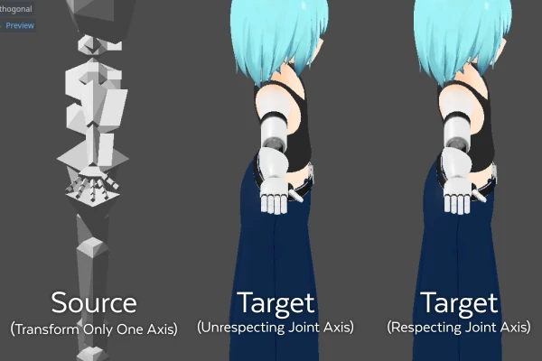
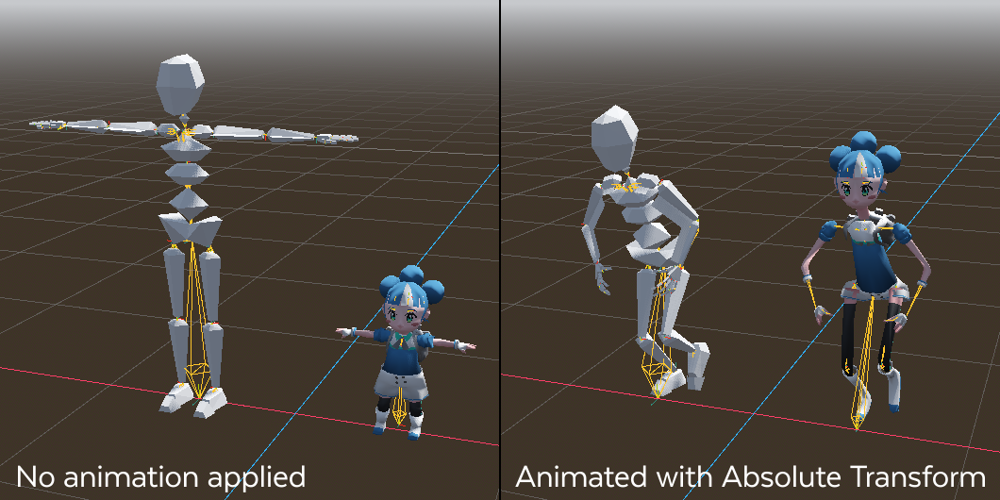
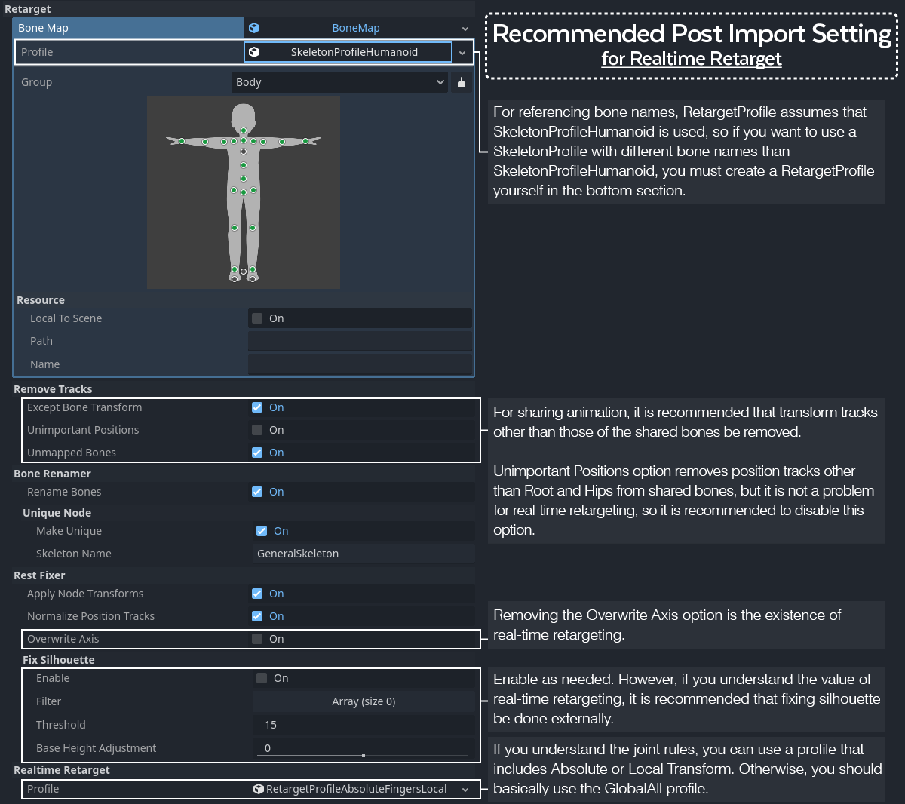
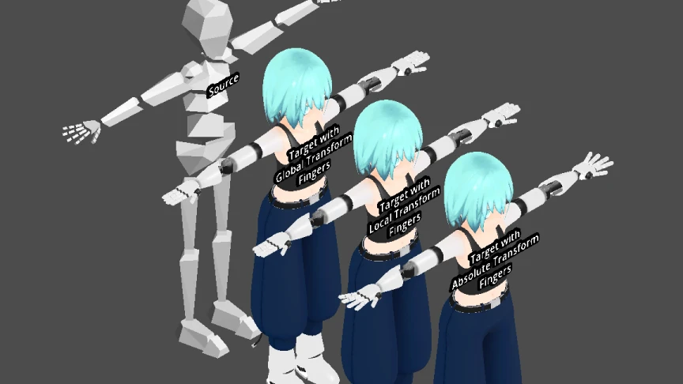
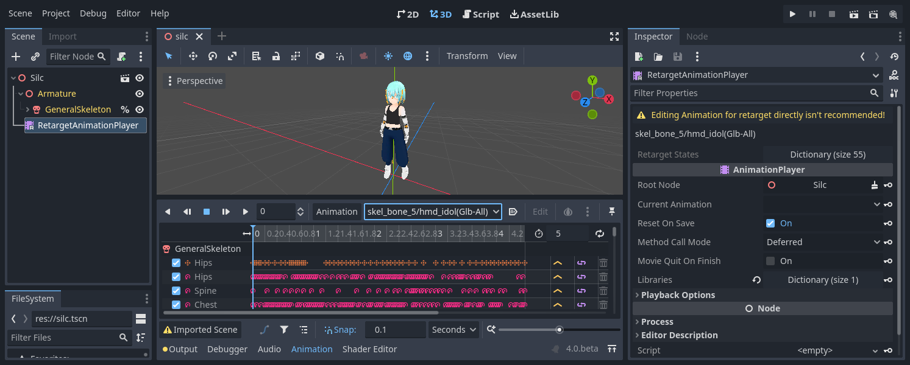
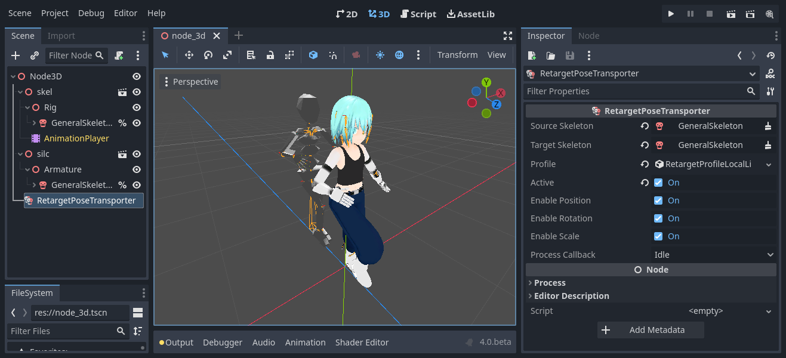

# Godot Realtime Retarget

Godot Realtime Retarget module needs to override the virtual functions used by the Godot editor, so it has to be implemented as a custom module. To install a custom module, you need to build the Godot. Please refer to this [document](https://docs.godotengine.org/en/stable/development/cpp/custom_modules_in_cpp.html#compiling-a-module-externally).

## Why is this module needed?

Godot 4 has implemented a static retargeting system in the post importer. However, the following several options may cause problems.

### Overwrite Axis

This option is most important for static retarget, but we need to know that it can corrupt the original data. For example, applying the `OverwriteAxis` option to a model designed to roll on the X axis may change it to roll on the Y axis implicitly.

And worse, the `OverwriteAxis` option sets the joint axis (it is represented as `BoneRest` on Godot) without respecting the original orientation. For joints which have a clearly definable orientation depending on the shape of the model, such as the human finger or a robot, this may cause unexpected rotations.

Especially when asset store resources are mixed in a project, the angles of those fingers are model-dependent and ambiguous. Fixing axes with `OverwriteAxis` and `FixSilhouette` option are not very effective for that case, so the finger animations easily can get messy.

In the case of this image, retargeting an animation that rotates only the X axis of the source model, but does not respect the axes, it can cause unpredict rotation like fractures.

It is also important to be aware of the possibility of corrupting externally configured glTF extention settings. For example, [VRMConstraint](https://github.com/vrm-c/vrm-specification/tree/master/specification/VRMC_node_constraint-1.0) in [VRM 1.0](https://github.com/vrm-c/vrm-specification) needs to refer to the model's original `BoneRest`, but if the `BoneRest` is implicitly changed by `OverwriteAxis` option, it will not work correctly. 

Such implicit changes to `BoneRest` should be avoided as much as possible. **If you are using Blender, you should also be aware of the `BoneDir` option in the glTF Importer since it is currently set by default to change the model's `BoneRest` implicitly**, which may break the external animation. See the [discussion](https://github.com/KhronosGroup/glTF-Blender-IO/issues/1662) for about that problem.

### Remove Tracks / Unimportant Positions

Since `BonePose` values in Godot 4, meaning animation key values, include `BoneRest`. So we need to remove `PositionTrack`s on most of the shared bones. This is provided as an `UnimportantPositions` option in `RemoveTracks` section on post importer, but if it is disabled, it can cause terrible transformation on models with very different body styles, as shown below.

*low-poly-godette / CC by [SirRichard94](https://github.com/SirRichard94/low-poly-godette)*

In the case of the above image, `NormalizePositionTracks` option is disabled to make the problem easier to understand. `NormalizePositionTracks` option reduces this problem to some extent by taking into account the model's hips height as a ratio, but still `RemoveTracks/UnimportantPositions` option must be enabled.

Actually, this problem did not exist in Godot 3. This is because the `BonePose` and animation key values were relative to the `BoneRest`. However, glTF animation keys contained `BoneRest`, and Godot 3 just extracted the relative values implicitly from there. In addition, some models do not have `BoneRest`, such as glTF exported from Maya. As a result, Godot 4 has made the `BonePose` and animation keys absolute values from the initial transform (means `Transform(Quaternion(0, 0, 0, 1), Vector3(0, 0, 0))`). See the [article](https://godotengine.org/article/animation-data-redesign-40).

However, if you are sharing animations, it makes more sense to use relative values in most cases. This Godot Realtime Retarget module allows animation using relative values.

## Available Animation Types

The animation type is defined as `TransformType`.

### Absolute Transform

Use the absolute value from the initial transform.

This is the same as the default animation in Godot 4. The key values include the `BoneRest`.

To share animation, the model [joint rules](#joint-rules) must be matched.

If only `RotationTrack` is used, the target model's silhouette can be made to closely match the source model as long as the [joint rules](#joint-rules) are unified. This means that `AbsoluteTransform` animations from T-pose model can be shared with A-pose model, even without `FixSilhouette` option.

Although this may sound useful, using this extensively can cause distortions in the body shape. For example, if a model with an S-shaped spine shares an animation with a model with an I-shaped spine, the model's torso will be distorted.

Moreover, if `PositionTrack` is included, it will cause horrible transformation of the body shape, as shown above.

### Local Transform

Uses the relative value from the `BoneRest`.

This is the same as the default animation in Godot 3. The key values do not include the `BoneRest` since the value is relative to the `BoneRest`.

To share animation, the model silhouette and [joint rules](#joint-rules) must be matched.

Both `AbsoluteTransform` and `LocalTransform` respect the joint orientation, but the difference is whether the animation is absolute such that it overrides `BoneRest`, or relative to `BoneRest`.

### Global Transform

Use the relative value from the `BoneRest` **as perceived from the model space**.

The difference between `LocalTransform` and `GlobalTransform` is almost the same as the difference between gizmo handling of local space based transforms and world space based transforms in a 3D viewport.

Briefly, it does something similar to `OverwriteAxis` in real-time (but not exactly the same). Therefore, be aware that the joints may not transform neatly in certain cases, as mentioned above.

The key values do not include the `BoneRest` since the value is relative to the `BoneRest`.

To share animation, the model silhouette must be matched. Then, **`OverwriteAxis` option is completely unnecessary and `RemoveTracks/UnimportantPositions` option is not required**.

## How to use

### Post Importer

After implementing this custom module, you can find a `RealTimeRetarget` section in the post importer. Set the profile there.

- RetargetProfile
	- RetargetProfileGlobalAll
		- Import and mark all `SkeletonProfileHumanoid` bone transform tracks as `GlobalTransform`
	- RetargetProfileLocalAll
		- Import and mark all `SkeletonProfileHumanoid` bone transform tracks as `LocalTransform`
	- RetargetProfileAbsoluteAll
		- Import and mark all `SkeletonProfileHumanoid` bone transform tracks as `AbsoluteTransform`
	- RetargetProfileLocalFingersGlobalOthers
		- Import and mark the bone transform tracks for the fingers in `SkeletonProfileHumanoid` as `LocalTransform` and the other bone transform tracks as `GlobalTransform`
	- RetargetProfileLocalLimbsGlobalOthers
		- Import and mark the bone transform tracks for the limbs in `SkeletonProfileHumanoid` as `LocalTransform` and the other bone transform tracks as `GlobalTransform`
	- RetargetProfileAbsoluteFingersGlobalOthers
		- Import and mark the bone transform tracks for the fingers in `SkeletonProfileHumanoid` as `AbsoluteTransform` and the other bone transform tracks as `GlobalTransform`
	- RetargetProfileAbsoluteLimbsGlobalOthers
		- Import and mark the bone transform tracks for the limbs in `SkeletonProfileHumanoid` as `AbsoluteTransform` and the other bone transform tracks as `GlobalTransform`
	- RetargetProfileAbsoluteFingersLocalLimbsGlobalOthers
		- Import and mark the bone transform tracks for the fingers in `SkeletonProfileHumanoid` as `AbsoluteTransform`, the limbs in `SkeletonProfileHumanoid` as `LocalTransform` and the other bone transform tracks as `GlobalTransform`

As you can see from the above profiles, `TransformType` can be specified for each bone and can be mixed. For example, there is a case that in order to bend fingers neatly, `AbsoluteTransform` or `LocalTransform` is used for fingers, and `GlobalTransform` is used for the ambiguous joints close to the trunk. In this case, it is recommended to use the profile which contain specifications for "Fingers" or "Limbs" with the joint rules matched.

The animations extracted for `RealtimeRetarget` will have `TransformType` information as `Metadata`. To read the `Metadata` and apply the transforms properly, these animations must be played back in `RetargetAnimationPlayer` or `RetargetAnimationTree`.

The animation name has a label at the end, but this is just a sign to indicate which profile was used to import the animation in the pull-down list, and the animation name itself has no meaning in `RetargetAnimationPlayer` and `RetargetAnimationTree`.

Also, you can see the markings of the tracks in the `RetargetAnimationPlayer` inspector, but you cannot edit them directly.

### RetargetPoseTransporter

In the above, the key values for real-time retargeting were extracted by the post importer statically, but if we extract the key values from skeleton bone poses in real-time, we can transfer the pose from one skeleton to another. This is implemented as the `RetargetPoseTransporter`.

For example, if you want to use motion tracking for VR applications, you can set a calibrated skeleton that matches the user's body shape for IK as the source, and then set the actual model to be displayed as the target, which allows for more reasonable posing.

Set up the profile in the same way as in the post importer. Of course, using `RetargetProfileGlobalAll` will allow to share poses between the models with different `BoneRest`s.

As long as you use `SkeletonProfileHumanoid` and the `RenameBones` option is enabled, this is not a concern, but note that bone names that share a pose must be matched and included in the `RetargetProfile`.

By the way, the bone transform tracks not specified in `RetargetProfile` are treated as `AbsoluteTransform` by `RetargetAnimationPlayer` and `RetargetAnimationTree`, but these are ignored by `RetargetPoseTransporter` and pose transfers will not be executed. This means that `RetargetProfileAbsoluteAll` exists for use cases where you want to transfer a pose using `AbsoluteTransform` in `RetargetPoseTransporter`.

## Joint Rules

To use `AbsoluteTransform` and `LocalTransform` effectively, it is necessary to define joint rules. For example, define restrictions such as +Y rotation to roll the arm outside, +X rotation to bend the arm, etc.

If the joint rules are unified in your project, there is no problem. However, the joint rules are not clearly defined as a file format, such as glTF. It is one way to determine the joint rules for each bone and summarize them as a list. However, that is not recommended considering the understandability and the maintainability.

Instead, I recommend the rule that *the +Y axis is pointed from the parent joint to the child joint as the roll axis, and the +X rotation bend the joints to the inside of the body (it is almost the direction of the muscle contraction)*. This is the rule I adopted as the `ReferencePose` for `SkeletonProfileHumanoid` in Godot 4.

This rule is compatible with Blender's bone format since in Blender's default settings will point the bone's +Y axis implicitly from the `Head` to the `Tail`. Also, you can check if the Joint Rules are correct by selecting multiple bones and rotating them to the +X direction in the local/independent mode, and see if the joints bend to the inside of the body.

Moreover, this rule is welcomed by IK. This is because it makes it easy to determine the prioritized axis and direction of bending for chained joints.

Well, we can say that if the `OverwriteAxis` option is enabled, the model will generally adopt this rule, but note that the original axis of rotation will not be respected. If we truly want to respect the original axis of rotation, we need to snap and rotate the axis every 90 degrees and visually check it. Besides, as I mentioned above, there are many problems with the `OverwriteAxis` option, so if you want to use `AbsoluteTransform` or `LocalTransform`, I recommend that you be aware of the axis rules and set them manually.

I think that it is the right way to go to develop a Blender add-on such as rest validator which checks if the joint rules are correct or not, but that should be provided separately from this module.

## Summary

This is a summary of the animation sharing way and its problems.

- To share animation
	- Between models with different joint rules
		- OverwriteAxis option
			- The silhouette must be unified
			- The original `BoneRest`s are discarded
			- The joint orientations are not respected (looks like a bone fracture)
		- GlobalTransform
			- The silhouette must be unified
			- The joint orientations are not respected (looks like a bone fracture)
	- Between models with same joint rules
		- AbsoluteTransform
			- `PositionTrack` cannot be used well
			- Not recommended for use on the spine (may cause distortion)
		- LocalTransform
			- The silhouette must be unified
			- The BoneRest difference is clearly visible in the animation
