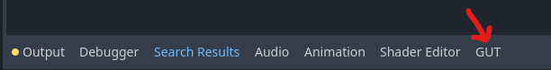

# Install
GUT is a Godot Plugin.  You can download it directly or install it from the Asset Lib in the Godot Editor.

## Installing from in-editor Godot Asset Lib
1.  Click the AssetLib button at the top of the editor
1.  Search for "Gut"
1.  Click it.
1.  Click "Install".  This will kick off the download.
1.  Click the 2nd "Install" button that appears when the download finishes.  It will be in a little dialog at the bottom of the AssetLib window.
1.  Click the 3rd "Install" button.
1.  You did it!

Finish the install by following the instructions in [Setup](#setup) below.

## Download and install
Download the zip from the [releases](https://github.com/bitwes/gut/releases) or from the [Godot Asset Library](https://godotengine.org/asset-library/asset/54).

Extract the zip and place the `gut` directory into your `addons` directory in your project.  If you don't have an `addons` folder at the root of your project, then make one and THEN put the `gut` directory in there.

Finish the install by following the instructions in Setup below.

## Installing from this repository
GUT's file structure is not organized to be used as a Git submodule.  If you would like to have GUT as a submodule of your project you could:
1. Add GUT as a submodule at `<path to gut>/gut`
1. Symlink `<path to gut>/gut/addons/gut` to `addons/gut`

This will clone the entire GUT repository, including all of its documentation and tests (which are unnecessary).  It may be better to clone GUT outside your project and symlink to it from there instead (contributors must all have a copy of GUT at the same location for the symlink to work).

## Setup
### Activate
1.  From the menu choose Project->Project Settings, click the Plugins tab and activate Gut.  Once activated, the GUT Panel will appear at the bottom of your editor:

### Setup directories for tests
The next few steps cover the suggested configuration.  Feel free to deviate where you see fit.

1.  Create directories to store your tests and test related code (suggested config)
	* `res://test`
	* `res://test/unit`
	* `res://test/integration`

## Running Tests

### Run tests from the GUT Panel
Set the test directories in the settings subpanel (below) and click "Run All".  That's all there is to it.

### Run tests from the command line
GUT comes with a command line interface, more info can be found on the [Command Line](Command-Line) page.

### Run tests through VSCode
There is also a VSCode plugin that you can use to run tests directly from VSCode.  You can find the plugin and related documentation [here](https://github.com/bitwes/gut-extension).

## Where to next?
* [Quick Start](Quick-Start)
* [Creating Tests](Creating-Tests)
* [Command Line](Command-Line)

