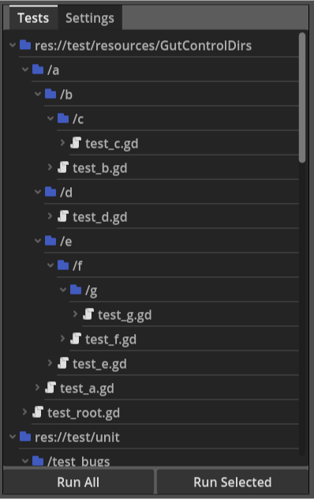
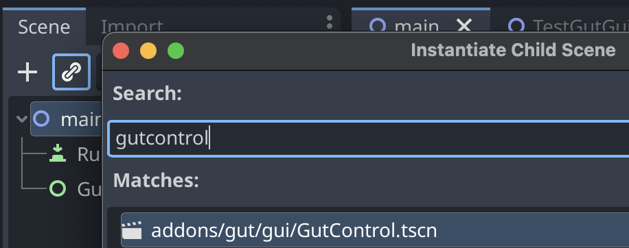

# Running on Devices

You may want to deploy your tests with your game so you can run tests on different devices and platforms.  GUT provides the handy `GutControl` to help you run your tests.



In order to run tests in a deployed game you must create a scene to kick off the tests from within the game.  Here's the steps:
* Create a scene
* Add a `GutControl` to the scene.

* Add a script to your scene and paste in the code below.
* You're off to the races.

Remember to add `*.json` in your export settings (resources tab), or your config file will not be exported with your game.

```
# ------------------------------------------------------------------------------
# This is an example of using the GutControl (res://addons/gut/gui/GutContro.tscn)
# to execute tests in a deployed game.
#
# Setup:
# Create a scene.
# Add a GutControl to your scene, name it GutControl.
# Add this script to your scene.
# Run it.
# ------------------------------------------------------------------------------
extends Node2D
@onready var _gut_control = $GutControl

# Holds a reference to the current test script object being run.  Set in
# signal callbacks.
var _current_script_object = null
# Holds the name of the current test being run.  Set in signal callbacks.
var _current_test_name = null


func _ready():
	simple_setup()
	# complex_setup()


func simple_setup():
	# You must load a gut config file to use this control.  Here we are loading
	# the default config file used by the command line.  You can use any config
	# file you have created.  Use the "save as" button in the Settings subpanel
	# to create a config file, or write your own.
	#
	# Some settings may not work.  For example, the exit flags do not have any
	# effect.
	#
	# Settings are not saved, so any changes will be lost. The idea is that you
	# want to deploy the settings and users should not be able to save them.  If
	# you want to save changes, you can call:
	# 	_gut_control.get_config().write_options(path).
	# Note that you cannot to write to res:// on mobile platforms, so you will
	# have to juggle the initial loading from res:// or user:// and save to
	# user://.
	_gut_control.load_config_file('res://.gutconfig.json')

	# That's it.  Just get a reference to the control you added to the scene and
	# give it a config.  The rest of the stuff in this script optional.


func complex_setup():
	# See simple setup
	_gut_control.load_config_file('res://.gutconfig.json')

	# Returns a gut_config.gd instance.
	var config = _gut_control.get_config()

	# Override specific values for the purposes of this scene.  You can see all
	# the options available in the default_options dictionary in gut_config.gd.
	# Changing settings AFTER _ready will not have any effect.
	config.options.should_exit = false
	config.options.should_exit_on_success = false
	config.options.compact_mode = false
	# Note that if you are exporting xml results you may want to set the path to
	# a file in user:// instead of an absolute path.  Your game may not have
	# permissions to save files elsewhere when running on a mobile device.
	config.options.junit_xml_file = 'user://deployed_results.xml'

	# Some actions cannot be done until after _ready has finished in all objects
	_post_ready_setup.call_deferred()


# If you would like to connect to signals provided by gut.gd then you must do
# so after _ready.  This is an example of getting a reference to gut and all
# of the signals it provides.
func _post_ready_setup():
	var gut = _gut_control.get_gut()
	gut.start_run.connect(_on_gut_run_start)

	gut.start_script.connect(_on_gut_start_script)
	gut.end_script.connect(_on_gut_end_script)

	gut.start_test.connect(_on_gut_start_test)
	gut.end_test.connect(_on_gut_end_test)

	gut.end_run.connect(_on_gut_run_end)


# -----------------------
# Events
# -----------------------
func _on_gut_run_start():
	print('Starting tests')


# This signal passes a TestCollector.gd/TestScript instance
func _on_gut_start_script(script_obj):
	print(script_obj.get_full_name(), ' has ', script_obj.tests.size(), ' tests')
	_current_script_object = script_obj


func _on_gut_end_script():
	var pass_count = 0
	for test in _current_script_object.tests:
		if(test.did_pass()):
			pass_count += 1
	print(pass_count, '/', _current_script_object.tests.size(), " passed\n")
	_current_script_object = null


func _on_gut_start_test(test_name):
	_current_test_name = test_name
	print('  ', test_name)


func _on_gut_end_test():
	# get_test_named returns a TestCollector.gd/Test instance for the name
	# passed in.
	var test_object = _current_script_object.get_test_named(_current_test_name)
	var status = "failed"
	if(test_object.did_pass()):
		status = "passed"
	elif(test_object.pending):
		status = "pending"

	print('    ', status)
	_current_test_name = null


func _on_gut_run_end():
	print('Tests Done')


# You can kick of the tests via code if you want.
func _on_run_gut_tests_button_pressed():
	_gut_control.run_tests()
```