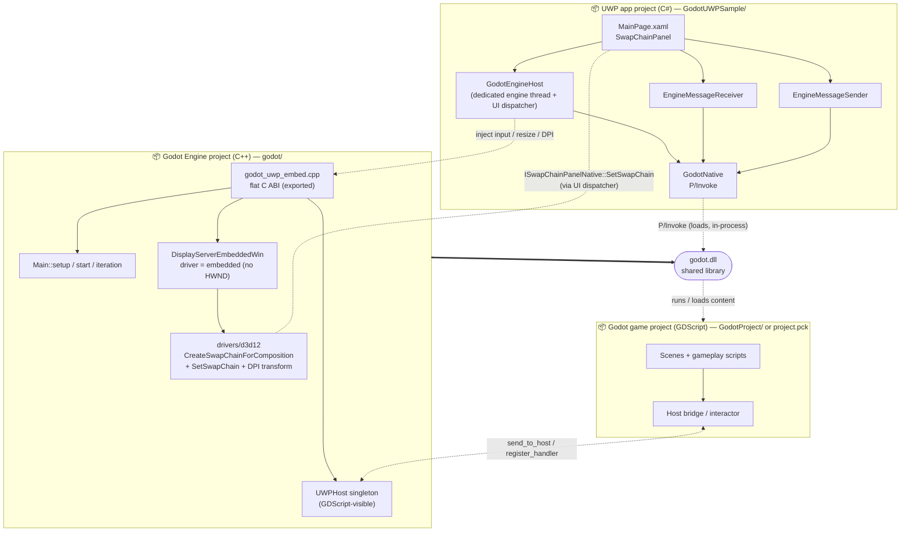
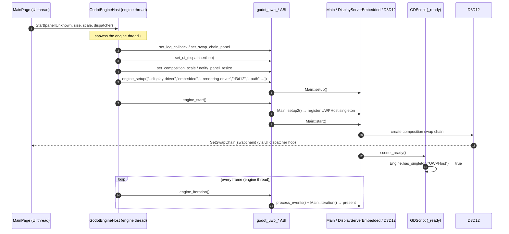
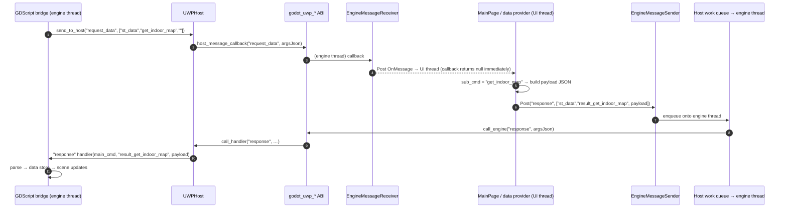
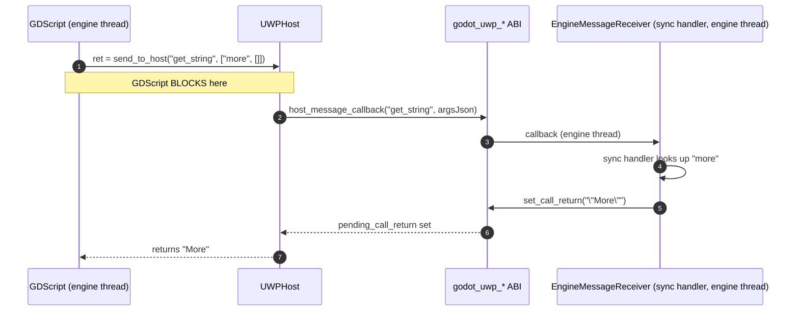

# Godot ⇆ UWP Embedding — Architecture & Integration

This document explains how a full Godot 4.6 engine is embedded **in-process** inside a UWP
(AppContainer) application and rendered into a XAML `SwapChainPanel`, how to wire up a fresh
set of three projects from scratch, and how the host ⇆ engine command bridge works (using the
`get_indoor_map` / `get_rooms` / … commands from the MapView app as the worked example).

> The three "projects" referred to throughout:
> | Project | Language | Produces |
> |---|---|---|
> | **Godot Engine project** (`godot/`) | C++ (SCons) | `godot.dll` (a shared-library engine build with the embedding patches) |
> | **UWP app project** (`GodotUWPSample/`) | C# (.NET Native, UWP) | the `.exe`/`.msix` that hosts the panel and loads `godot.dll` |
> | **Godot game project** (`GodotProject/` or an exported `.pck`) | GDScript / scenes | the content the engine runs |

---

## Table of contents
1. [How the UWP embedding is implemented](#1-how-the-uwp-embedding-is-implemented)
2. [Starting fresh — integrating a new game project + UWP app + engine](#2-starting-fresh)
3. [Bridge communication (commands)](#3-bridge-communication)
4. [Package diagram](#4-package-diagram)
5. [Sequence diagrams](#5-sequence-diagrams)

---

## 1. How the UWP embedding is implemented

### 1.1 The problem UWP creates

A UWP app runs inside an **AppContainer** sandbox and on the WinRT/`CoreWindow` app model.
That breaks the "normal" desktop embedding tricks:

- **No usable HWND** to re-parent a child window into (so the WinUI3-desktop approach of
  `SetParent`-ing Godot's window is impossible).
- The process cannot leave the sandbox; everything the engine does must be sandbox-legal.

The design therefore avoids windows entirely: the engine renders into a **DXGI composition
swap chain** that is bound to a XAML `SwapChainPanel`, and **all input is injected** from XAML
events. This is the only in-process path that works under AppContainer, and it happens to also
work for WinUI3 hosts.

### 1.2 Engine-side pieces (in `godot/platform/windows` + `drivers/d3d12`)

| Component | File | Responsibility |
|---|---|---|
| **Windowless display server** | `display_server_embedded_win.{h,cpp}` | Registered as display driver **`embedded`**. Subclasses `DisplayServerHeadless`. Creates **no Win32 window**; owns the D3D12 rendering context/device; reports the panel as a single "screen"; converts host-injected events into Godot `InputEvent`s. |
| **Composition swap chain** | `drivers/d3d12/rendering_device_driver_d3d12.cpp` | When a panel is present, `swap_chain_create` uses `CreateSwapChainForComposition` (not `…ForHwnd`), then QIs `ISwapChainPanelNative` and calls `SetSwapChain`. Applies `IDXGISwapChain2::SetMatrixTransform(1/dpiScale)` so the DIP-composited buffer maps 1:1 to physical pixels. |
| **Flat C ABI** | `godot_uwp_embed.{h,cpp}` | `extern "C"` exports the C# host P/Invokes (lifecycle, panel/size/DPI, input injection, message bus). Drives `Main::setup/setup2/start/iteration` directly (the LibGodot pattern). |
| **GDScript bridge singleton** | `uwp_host.{h,cpp}` | The `UWPHost` object exposed to GDScript (`send_to_host`, `register_handler`, `has_host`). Registered between `Main::setup2()` and `Main::start()`. |

The engine is built as a shared library so it exports a C ABI:

```
scons platform=windows target=template_release arch=x86_64 ^
      library_type=shared_library debug_symbols=yes disable_path_overrides=no
```

### 1.3 Host-side pieces (C#, in the UWP project's `Godot/` folder)

| Component | File | Responsibility |
|---|---|---|
| **P/Invoke surface** | `GodotNative.cs` | 1:1 declarations for the `godot_uwp_*` exports. Manual UTF-8 marshalling (no `Marshal.PtrToStringUTF8` on .NET Native); callback delegates pinned in static fields. |
| **Engine host** | `GodotEngineHost.cs` | Owns the **dedicated engine thread** that runs the whole lifecycle; a work queue marshals host→engine calls onto it; provides the **UI-thread dispatcher** the engine needs for `SetSwapChain`; pause/resume; file logging. |
| **Bus receiver** | `EngineMessageReceiver.cs` | Engine→host messages: an async `OnMessage` event + a synchronous-handler registry. |
| **Bus sender** | `EngineMessageSender.cs` | Host→engine messages: `Post` / `Call` / `CallAsync`. |
| **Page** | `MainPage.xaml(.cs)` | Hosts the `SwapChainPanel`; forwards pointer/keyboard/size/DPI; drives lifecycle. |

### 1.4 The threading model (the core invariant)

Godot is single-threaded; every engine call must run on **one** thread.

- `GodotEngineHost` spawns the **engine thread** and runs `setup → start → iteration loop →
  shutdown` there. The UI thread never calls the engine directly — it **enqueues** work
  (input, resize) that the loop drains.
- The **one** exception is `ISwapChainPanelNative::SetSwapChain`, which is **UI-thread
  affine**. The engine reaches it through a host-supplied dispatcher: the engine (on the
  engine thread) calls `embed_ui_dispatch`, which `CoreDispatcher.RunAsync`-es the work onto
  the UI thread and blocks until it returns.
- **Iron rule:** no managed exception may cross a native→managed callback — .NET Native
  fail-fasts. Every callback body is wrapped in try/catch.

### 1.5 AppContainer adaptations (done by the host, not the engine)

Before engine setup, `GodotEngineHost` adapts the sandbox around the engine:

```csharp
// user:// must resolve somewhere writable — Godot reads it from %APPDATA%
Environment.SetEnvironmentVariable("APPDATA",      ApplicationData.Current.LocalFolder.Path);
Environment.SetEnvironmentVariable("LOCALAPPDATA", ApplicationData.Current.LocalFolder.Path);
// The D3D12 Agility SDK loader probes ".\x86_64" then ".\" relative to the CWD
// (which is System32 under UWP activation) — point it at the package root.
Directory.SetCurrentDirectory(Package.Current.InstalledLocation.Path);
```

---

## 2. Starting fresh

Bringing up a brand-new trio (engine + UWP app + game project).

### 2.1 Godot Engine project

1. Take a clean Godot **4.6** checkout. Add the embedding files (Section 1.2): the three new
   `platform/windows` file pairs, plus the edits to `SCsub`, `os_windows.cpp`,
   `display_server_windows.cpp`, and the two `drivers/d3d12` files.
2. Install D3D12 deps once: `python misc\scripts\install_d3d12_sdk_windows.py`.
3. Build the shared library (command in 1.2). Output:
   `bin\godot.windows.template_release.x86_64.dll` (+ `D3D12Core.dll`, `d3d12SDKLayers.dll`).
4. `dumpbin /exports godot…dll | findstr godot_uwp` to confirm the ABI is exported.

### 2.2 Godot game project

A project needs **nothing special just to render** — drop any project in and it runs.
Add a bridge only if you want host data:

1. Create the project; set a `forward_plus` (or `mobile`/`forward_plus`) renderer — the
   embedded display server is **D3D12 / RenderingDevice-only** (the host also forces
   `--rendering-method forward_plus`).
2. Add an autoload bridge that talks to the host singleton:

   ```gdscript
   extends Node
   var _host: Object = null

   func _ready() -> void:
       if Engine.has_singleton("UWPHost"):           # absent in the editor → no-op
           _host = Engine.get_singleton("UWPHost")
           _host.register_handler("response", _on_response)   # host → engine replies
           _host.send_to_host("scene_ready", [])

   func request_data(main_cmd: String, sub_cmd: String, json: String) -> void:
       if _host: _host.send_to_host("request_data", [main_cmd, sub_cmd, json])

   func _on_response(main_cmd: String, sub_cmd: String, json: String) -> void:
       pass  # route the payload to your data layer
   ```
   > Guard everything with `Engine.has_singleton("UWPHost")` so the same project still runs
   > in the editor. If a factory `new()`s the bridge **off-tree**, wire it in `_init` (not
   > `_ready`, which never fires off-tree).
3. For shipping, export a **`.pck`** (Windows Desktop preset, *Export PCK/ZIP*). Prefer a
   `.pck` over a loose folder — one opaque file avoids the MRT resource-indexer crash
   (`0x80073B0C`) and the `MAX_PATH`/DEP1000 layout-copy failure. Match the editor version to
   the engine (4.6 ↔ 4.6). GDExtension DLLs can't load from inside a `.pck` — ship them loose
   in the package root.

### 2.3 UWP app project

1. Old-style C# UWP project (`OutputType=AppContainerExe`, `UseDotNetNativeToolchain=true`
   for both configs). Namespace e.g. `Godot.Uwp.Embedding`.
2. Copy the `Godot/` folder (`GodotNative`, `GodotEngineHost`, `EngineMessageReceiver`,
   `EngineMessageSender`) into the project.
3. `MainPage.xaml`: a bare `<SwapChainPanel>` (⚠ do **not** set `Background` — UWP's panel
   throws `XamlParseException`). Wire `Loaded`, `SizeChanged`, `CompositionScaleChanged`,
   `PointerPressed/Released/Moved/WheelChanged`; wire `CoreWindow.KeyDown/KeyUp`.
4. `MainPage.xaml.cs` `Loaded`:
   ```csharp
   IntPtr panel = Marshal.GetIUnknownForObject(GodotPanel);     // engine QIs the panel
   _receiver.OnMessage += OnBusMessage;  _receiver.Initialize(); // before Start()
   _host.ProjectPath = "<pkg>\\Assets\\project.pck"  // or "<pkg>\\GodotProject"
   _host.Start(panel, widthPx, heightPx, scaleX, scaleY, Dispatcher);
   ```
   Wire `Application.Suspending → _host.Pause()` and `Resuming → _host.Resume()` (a suspended
   app that keeps presenting is killed by PLM).
5. `.csproj` Content (PreserveNewest): `godot.dll`, `D3D12Core.dll`, `d3d12SDKLayers.dll`, the
   `.pck` (or the `GodotProject\` folder with `.godot\shader_cache`/`editor`/`exported` and
   `build\` excluded), any loose GDExtension DLLs.

### 2.4 Build, deploy, run

```powershell
Get-AppxPackage -Name "<identity>" | Remove-AppxPackage     # unregister frees the ilc layout
msbuild GodotUWPSample\GodotUWPSample\GodotUWPSample.csproj /restore /p:Configuration=Release /p:Platform=x64
Add-AppxPackage -Register "…\bin\x64\Release\ilc\AppxManifest.xml"   # ilc\ is the deployable layout
explorer.exe "shell:AppsFolder\<PFN>!App"
```
First-boot signals in `%LOCALAPPDATA%\Packages\<PFN>\LocalState\Logs\godot_*.log`:
`display server: embedded`, `D3D12 … Using Device`, `Engine running`.

---

## 3. Bridge communication

### 3.1 The transport (generic)

Everything rides on three primitives. The transport carries only `(method, argsJson)`; the
**command vocabulary is an application-level convention** layered on top.

| Primitive | Who calls it | Meaning |
|---|---|---|
| `UWPHost.send_to_host(method, args) -> Variant` | GDScript | Engine→host. Serializes `args` to a JSON array, fires the host callback, returns the host's optional **synchronous** reply (parsed). |
| `UWPHost.register_handler(method, callable)` | GDScript | Lets the host invoke a GDScript function (host→engine). |
| `EngineMessageSender.Post/Call(method, argsJson)` | C# host | Host→engine. Invokes a GDScript handler registered above (`Call` waits for a return). |

On the C# side `EngineMessageReceiver.OnMessage` raises each engine→host message on the UI
thread, and `RegisterSyncHandler(method, fn)` answers a message **inline on the engine thread**
(used when GDScript needs the value immediately).

### 3.2 The MapView app convention (the worked example)

The MapView project layered a request/response protocol on the transport using two methods,
`request_data` (engine→host) and `response` (host→engine), each carrying a
**`[main_cmd, sub_cmd, payload]`** triple. `main_cmd` is the channel (`"st_data"` for
SmartThings data); `sub_cmd` is the command; the reply's `sub_cmd` is prefixed `result_`.

**Asynchronous data commands** — `get_indoor_map`, `get_rooms`, `get_scenes`, `get_devices`,
`get_locations`, `get_user`, `get_capability_status`:

```
GDScript  →  UWPHost.send_to_host("request_data", ["st_data", "get_indoor_map", ""])
host      →  (reads sub_cmd, builds JSON)
host      →  sender.Post("response", ["st_data", "result_get_indoor_map", <payload-json>])
GDScript  →  "response" handler → _on_response("st_data","result_get_indoor_map",payload)
          →  fans out to the data store (signal on_st_data_published)
```

**Synchronous commands** — `get_string`, `get_quantity_string` (the caller needs the value on
the same line):

```
GDScript  →  var s = UWPHost.send_to_host("get_string", ["more", []])   # BLOCKS
host      →  RegisterSyncHandler("get_string", …) returns "\"More\"" inline
GDScript  ←  "More"
```

**Fire-and-forget notifications** — `print_log`, `scene_ready`, `notify_renderer_*` (host
just logs/acts; no reply).

### 3.3 Command reference (MapView example)

| Command (`sub_cmd`) | Direction | Mode | Host responds with |
|---|---|---|---|
| `get_indoor_map` | engine→host | async | `result_get_indoor_map` (floors/rooms geometry envelope) |
| `get_rooms` | engine→host | async | `result_get_rooms` (room list) |
| `get_scenes` | engine→host | async | `result_get_scenes` |
| `get_devices` | engine→host | async | `result_get_devices` (device list w/ `indoorMap` placement) |
| `get_locations` | engine→host | async | `result_get_locations` |
| `get_user` | engine→host | async | `result_get_user` (`countryIso3`/`id`/`permissionType`) |
| `get_capability_status` | engine→host | async | `result_get_capability_status` |
| `get_string` / `get_quantity_string` | engine→host | **sync** | the localized string (inline) |
| `print_log`, `scene_ready` | engine→host | fire-and-forget | — |

> **Gotchas learned in practice:** in `.pck` mode there is **no simulated fallback** — every
> command the boot sequence issues must be answered or the bridge hangs. The MapView storage
> also gated all rendering on `get_user` arriving *before* rooms/devices, so the host pushes
> `result_get_user` ahead of the first data reply. Devices render only when their `indoorMap`
> has `visible:true`, non-zero `coordinates`, and an `expressionType`, and their `roomId` /
> `locationId` must match the other payloads.

---

## 4. Package diagram



**Dependency summary:** the UWP project **builds against nothing** in the engine — it only
P/Invokes `godot.dll` at runtime. The game project depends only on the **`UWPHost`** API
surface (and degrades gracefully when absent, i.e. in the editor). The engine project is the
only one compiled from C++.

---

## 5. Sequence diagrams

### 5.1 Startup & panel binding



### 5.2 Asynchronous data command — `get_indoor_map`



### 5.3 Synchronous command — `get_string`



---

### Appendix — full C ABI surface

```
// lifecycle
int  godot_uwp_engine_setup(int argc, char** argv);
int  godot_uwp_engine_start(void);
int  godot_uwp_engine_iteration(void);   // returns 1 when the engine wants to quit
void godot_uwp_engine_shutdown(void);
// configuration (before setup)
void godot_uwp_set_log_callback(cb);
void godot_uwp_set_swap_chain_panel(IUnknown*);
void godot_uwp_set_ui_dispatcher(fn);
void godot_uwp_notify_panel_resize(int w, int h);
void godot_uwp_set_composition_scale(float sx, float sy);
// input injection
void godot_uwp_inject_mouse_button(int button, int pressed, float x, float y, int dbl);
void godot_uwp_inject_mouse_motion(float x, float y, float rx, float ry);
void godot_uwp_inject_mouse_wheel(float x, float y, float dx, float dy);
void godot_uwp_inject_key(uint vk, int pressed, int echo, uint unicode);
// message bus
void godot_uwp_set_host_message_callback(cb);
void godot_uwp_set_call_return(const char* json);
int  godot_uwp_call_engine(const char* method, const char* argsJson, char** retJson);
void godot_uwp_free_string(char* str);
```
