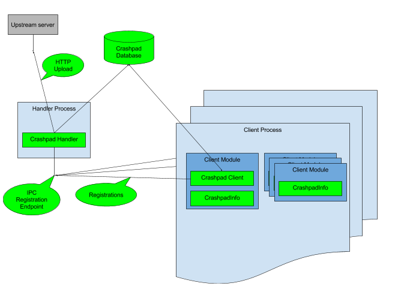
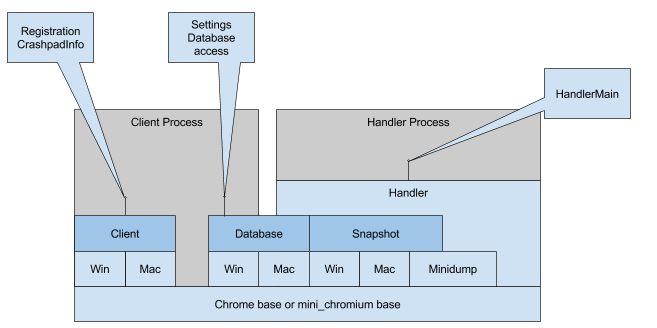

<!--
Copyright 2017 The Crashpad Authors. All rights reserved.

Licensed under the Apache License, Version 2.0 (the "License");
you may not use this file except in compliance with the License.
You may obtain a copy of the License at

    http://www.apache.org/licenses/LICENSE-2.0

Unless required by applicable law or agreed to in writing, software
distributed under the License is distributed on an "AS IS" BASIS,
WITHOUT WARRANTIES OR CONDITIONS OF ANY KIND, either express or implied.
See the License for the specific language governing permissions and
limitations under the License.
-->

# Crashpad Overview Design

[TOC]

## Objective

Crashpad is a library for capturing, storing and transmitting postmortem crash
reports from a client to an upstream collection server. Crashpad aims to make it
possible for clients to capture process state at the time of crash with the best
possible fidelity and coverage, with the minimum of fuss.

Crashpad also provides a facility for clients to capture dumps of process state
on-demand for diagnostic purposes.

Crashpad additionally provides minimal facilities for clients to adorn their
crashes with application-specific metadata in the form of per-process key/value
pairs. More sophisticated clients are able to adorn crash reports further
through extensibility points that allow the embedder to augment the crash report
with application-specific metadata.

## Background

It’s an unfortunate truth that any large piece of software will contain bugs
that will cause it to occasionally crash. Even in the absence of bugs, software
incompatibilities can cause program instability.

Fixing bugs and incompatibilities in client software that ships to millions of
users around the world is a daunting task. User reports and manual reproduction
of crashes can work, but even given a user report, often times the problem is
not readily reproducible. This is for various reasons, such as e.g. system
version or third-party software incompatibility, or the problem can happen due
to a race of some sort. Users are also unlikely to report problems they
encounter, and user reports are often of poor quality, as unfortunately most
users don’t have experience with making good bug reports.

Automatic crash telemetry has been the best solution to the problem so far, as
this relieves the burden of manual reporting from users, while capturing the
hardware and software state at the time of crash.

TODO(siggi): examples of this?

Crash telemetry involves capturing postmortem crash dumps and transmitting them
to a backend collection server. On the server they can be stackwalked and
symbolized, and evaluated and aggregated in various ways. Stackwalking and
symbolizing the reports on an upstream server has several benefits over
performing these tasks on the client. High-fidelity stackwalking requires access
to bulky unwind data, and it may be desirable to not ship this to end users out
of concern for the application size. The process of symbolization requires
access to debugging symbols, which can be quite large, and the symbolization
process can consume considerable other resources. Transmitting un-stackwalked
and un-symbolized postmortem dumps to the collection server also allows deep
analysis of individual dumps, which is often necessary to resolve the bug
causing the crash.

Transmitting reports to the collection server allows aggregating crashes by
cause, which in turn allows assessing the importance of different crashes in
terms of the occurrence rate and e.g. the potential security impact.

A postmortem crash dump must contain the program state at the time of crash
with sufficient fidelity to allow diagnosing and fixing the problem. As the full
program state is usually too large to transmit to an upstream server, the
postmortem dump captures a heuristic subset of the full state.

The crashed program is in an indeterminate state and, in fact, has often crashed
because of corrupt global state - such as heap. It’s therefore important to
generate crash reports with as little execution in the crashed process as
possible. Different operating systems vary in the facilities they provide for
this.

## Overview

Crashpad is a client-side library that focuses on capturing machine and program
state in a postmortem crash report, and transmitting this report to a backend
server - a “collection server”. The Crashpad library is embedded by the client
application. Conceptually, Crashpad breaks down into the handler and the client.
The handler runs in a separate process from the client or clients. It is
responsible for snapshotting the crashing client process’ state on a crash,
saving it to a crash dump, and transmitting the crash dump to an upstream
server. Clients register with the handler to allow it to capture and upload
their crashes.

### The Crashpad handler

The Crashpad handler is instantiated in a process supplied by the embedding
application. It provides means for clients to register themselves by some means
of IPC, or where operating system support is available, by taking advantage of
such support to cause crash notifications to be delivered to the handler. On
crash, the handler snapshots the crashed client process’ state, writes it to a
postmortem dump in a database, and may also transmit the dump to an upstream
server if so configured.

The Crashpad handler is able to handle cross-bitted requests and generate crash
dumps across bitness, where e.g. the handler is a 64-bit process while the
client is a 32-bit process or vice versa. In the case of Windows, this is
limited by the OS such that a 32-bit handler can only generate crash dumps for
32-bit clients, but a 64-bit handler can acquire nearly all of the detail for a
32-bit process.

### The Crashpad client

The Crashpad client provides two main facilities.
1. Registration with the Crashpad handler.
2. Metadata communication to the Crashpad handler on crash.

A Crashpad embedder links the Crashpad client library into one or more
executables, whether a loadable library or a program file. The client process
then registers with the Crashpad handler through some mode of IPC or other
operating system-specific support.

On crash, metadata is communicated to the Crashpad handler via the CrashpadInfo
structure. Each client executable module linking the Crashpad client library
embeds a CrashpadInfo structure, which can be updated by the client with
whatever state the client wishes to record with a crash.

Here is an overview picture of the conceptual relationships between embedder (in
light blue), client modules (darker blue), and Crashpad (in green). Note that
multiple client modules can contain a CrashpadInfo structure, but only one
registration is necessary.

## Detailed Design

### Requirements

The purpose of Crashpad is to capture machine, OS and application state in
sufficient detail and fidelity to allow developers to diagnose and, where
possible, fix the issue causing the crash.

Each distinct crash report is assigned a globally unique ID, in order to allow
users to associate them with a user report, report in bug reports and so on.

It’s critical to safeguard the user’s privacy by ensuring that no crash report
is ever uploaded without user consent. Likewise it’s important to ensure that
Crashpad never captures or uploads reports from non-client processes.

### Concepts

* **Client ID**. A UUID tied to a single instance of a Crashpad database. When
  creating a crash report, the Crashpad handler includes the client ID stored
  in the database. This provides a means to determine how many individual end
  users are affected by a specific crash signature.

* **Crash ID**. A UUID representing a single crash report. Uploaded crash
  reports also receive a “server ID.” The Crashpad database indexes both the
  locally-generated and server-generated IDs.

* **Collection Server**. See [crash server documentation.](
  https://goto.google.com/crash-server-overview)

* **Client Process**. Any process that has registered with a Crashpad handler.

* **Handler process**. A process hosting the Crashpad handler library. This may
  be a dedicated executable, or it may be hosted within a client executable
  with control passed to it based on special signaling under the client’s
  control, such as a command-line parameter.

* **CrashpadInfo**. A structure used by client modules to provide information to
  the handler.

* **Annotations**. Each CrashpadInfo structure points to a dictionary of
  {string, string} annotations that the client can use to communicate
  application state in the case of crash.

* **Database**. The Crashpad database contains persistent client settings as
  well as crash dumps pending upload.

TODO(siggi): moar concepts?

### Overview Picture

Here is a rough overview picture of the various Crashpad constructs, their
layering and intended use by clients.

Dark blue boxes are interfaces, light blue boxes are implementation. Gray is the
embedding client application. Note that wherever possible, implementation that
necessarily has to be OS-specific, exposes OS-agnostic interfaces to the rest of
Crashpad and the client.

### Registration

The particulars of how a client registers with the handler varies across
operating systems.

#### macOS

At registration time, the client designates a Mach port monitored by the
Crashpad handler as the EXC_CRASH exception port for the client. The port may be
acquired by launching a new handler process or by retrieving service already
registered with the system. The registration is maintained by the kernel and is
inherited by subprocesses at creation time by default, so only the topmost
process of a process tree need register.

Crashpad provides a facility for a process to disassociate (unregister) with an
existing crash handler, which can be necessary when an older client spawns an
updated version.

#### Windows

There are two modes of registration on Windows. In both cases the handler is
advised of the address of a set of structures in the client process’ address
space. These structures include a pair of ExceptionInformation structs, one for
generating a postmortem dump for a crashing process, and another one for
generating a dump for a non- crashing process.

##### Normal registration

In the normal registration mode, the client connects to a named pipe by a
pre-arranged name. A registration request is written to the pipe. During
registration, the handler creates a set of events, duplicates them to the
registering client, then returns the handle values in the registration response.
This is a blocking process.

##### Initial Handler Creation

In order to avoid blocking client startup for the creation and initialization of
the handler, a different mode of registration can be used for the handler
creation. In this mode, the client creates a set of event handles and inherits
them into the newly created handler process. The handler process is advised of
the handle values and the location of the ExceptionInformation structures by way
of command line arguments in this mode.

#### Linux/Android

TODO(mmentovai): describe this. See this preliminary doc.

### Capturing Exceptions

The details of how Crashpad captures the exceptions leading to crashes varies
between operating systems.

#### macOS

On macOS, the operating system will notify the handler of client crashes via the
Mach port set as the client process’ exception port. As exceptions are
dispatched to the Mach port by the kernel, on macOS, exceptions can be handled
entirely from the Crashpad handler without the need to run any code in the crash
process at the time of the exception.

#### Windows

On Windows, the OS dispatches exceptions in the context of the crashing thread.
To notify the handler of exceptions, the Crashpad client registers an
UnhandledExceptionFilter (UEF) in the client process. When an exception trickles
up to the UEF, it stores the exception information and the crashing thread’s ID
in the ExceptionInformation structure registered with the handler. It then sets
an event handle to signal the handler to go ahead and process the exception.

##### Caveats

* If the crashing thread’s stack is smashed when an exception occurs, the
  exception cannot be dispatched. In this case the OS will summarily terminate
  the process, without the handler having an opportunity to generate a crash
  report.
* If an exception is handled in the crashing thread, it will never propagate
  to the UEF, and thus a crash report won’t be generated. This happens a fair
  bit in Windows as system libraries will often dispatch callbacks under a
  structured exception handler. This occurs during Window message dispatching
  on some system configurations, as well as during e.g. DLL entry point
  notifications.
* A growing number of conditions in the system and runtime exist where
  detected corruption or illegal calls result in summary termination of the
  process, in which case no crash report will be generated.

###### Out-Of-Process Exception Handling

There exists a mechanism in Windows Error Reporting (WER) that allows a client
process to register for handling client exceptions out of the crashing process.
Unfortunately this mechanism is difficult to use, and doesn’t provide coverage
for many of the caveats above. [Details
here.](https://crashpad.chromium.org/bug/133)

#### Linux/Android

TODO(mmentovai): describe this. See [this preliminary
doc.](https://goto.google.com/crashpad-android-dd)

### The CrashpadInfo structure

The CrashpadInfo structure is used to communicate information from the client to
the handler. Each executable module in a client process can contain a
CrashpadInfo structure. On a crash, the handler crawls all modules in the
crashing process to locate all CrashpadInfo structures present. The CrashpadInfo
structures are linked into a special, named section of the executable, where the
handler can readily find them.

The CrashpadInfo structure has a magic signature, and contains a size and a
version field. The intent is to allow backwards compatibility from older client
modules to newer handler. It may also be necessary to provide forwards
compatibility from newer clients to older handler, though this hasn’t occurred
yet.

The CrashpadInfo structure contains such properties as the cap for how much
memory to include in the crash dump, some tristate flags for controlling the
handler’s behavior, a pointer to an annotation dictionary and so on.

### Snapshot

Snapshot is a layer of interfaces that represent the machine and OS entities
that Crashpad cares about. Different concrete implementations of snapshot can
then be backed different ways, such as e.g. from the in-memory representation of
a crashed process, or e.g. from the contents of a minidump.

### Crash Dump Creation

To create a crash dump, a subset of the machine, OS and application state is
grabbed from the crashed process into an in-memory snapshot structure in the
handler process. Since the full application state is typically too large for
capturing to disk and transmitting to an upstream server, the snapshot contains
a heuristically selected subset of the full state.

The precise details of what’s captured varies between operating systems, but
generally includes the following
* The set of modules (executable, shared libraries) that are loaded into the
  crashing process.
* An enumeration of the threads running in the crashing process, including the
  register contents and the contents of stack memory of each thread.
* A selection of the OS-related state of the process, such as e.g. the command
  line, environment and so on.
* A selection of memory potentially referenced from registers and from stack.

To capture a crash dump, the crashing process is first suspended, then a
snapshot is created in the handler process. The snapshot includes the
CrashpadInfo structures of the modules loaded into the process, and the contents
of those is used to control the level of detail captured for the crash dump.

Once the snapshot has been constructed, it is then written to a minidump file,
which is added to the database. The process is un-suspended after the minidump
file has been written. In the case of a crash (as opposed to a client request to
produce a dump without crashing), it is then either killed by the operating
system or the Crashpad handler.

In general the snapshotting process has to be very intimate with the operating
system it’s working with, so there will be a set of concrete implementation
classes, many deriving from the snapshot interfaces, doing this for each
operating system.

### Minidump

The minidump implementation is responsible for writing a snapshot to a
serialized on-disk file in the minidump format. The minidump implementation is
OS-agnostic, as it works on an OS-agnostic Snapshot interface.

TODO(siggi): Talk about two-phase writes and contents ordering here.

### Database

The Crashpad database contains persistent client settings, including a unique
crash client identifier and the upload-enabled bit. Note that the crash client
identifier is assigned by Crashpad, and is distinct from any identifiers the
client application uses to identify users, installs, machines or such - if any.
The expectation is that the client application will manage the user’s upload
consent, and inform Crashpad of changes in consent.

The unique client identifier is set at the time of database creation. It is then
recorded into every crash report collected by the handler and communicated to
the upstream server.

The database stores a configurable number of recorded crash dumps to a
configurable maximum aggregate size. For each crash dump it stores annotations
relating to whether the crash dumps have been uploaded. For successfully
uploaded crash dumps it also stores their server-assigned ID.

The database consists of a settings file, named "settings.dat" with binary
contents (see crashpad::Settings::Data for the file format), as well as
directory containing the crash dumps. Additionally each crash dump is adorned
with properties relating to the state of the dump for upload and such. The
details of how these properties are stored vary between platforms.

#### macOS

The macOS implementation simply stores database properties on the minidump files
in filesystem extended attributes.

#### Windows

The Windows implementation stores database properties in a binary file named
“metadata” at the top level of the database directory.

### Report Format

Crash reports are recorded in the Windows minidump format with
extensions to support Crashpad additions, such as e.g. Annotations.

### Upload to collection server

#### Wire Format

For the time being, Crashpad uses the Breakpad wire protocol, which is
essentially a MIME multipart message communicated over HTTP(S). To support this,
the annotations from all the CrashpadInfo structures found in the crashing
process are merged to create the Breakpad “crash keys” as form data. The
postmortem minidump is then attached as an “application/octet- stream”
attachment with the name “upload_file_minidump”. The entirety of the request
body, including the minidump, can be gzip-compressed to reduce transmission time
and increase transmission reliability. Note that by convention there is a set of
“crash keys” that are used to communicate the product, version, client ID and
other relevant data about the client, to the server. Crashpad normally stores
these values in the minidump file itself, but retrieves them from the minidump
and supplies them as form data for compatibility with the Breakpad-style server.

This is a temporary compatibility measure to allow the current Breakpad-based
upstream server to handle Crashpad reports. In the fullness of time, the wire
protocol is expected to change to remove this redundant transmission and
processing of the Annotations.

#### Transport

The embedding client controls the URL of the collection server by the command
line passed to the handler. The handler can upload crashes with HTTP or HTTPS,
depending on client’s preference. It’s strongly suggested use HTTPS transport
for crash uploads to protect the user’s privacy against man-in-the-middle
snoopers.

TODO(mmentovai): Certificate pinning.

#### Throttling & Retry Strategy

To protect both the collection server from DDoS as well as to protect the
clients from unreasonable data transfer demands, the handler implements a
client-side throttling strategy. At the moment, the strategy is very simplistic,
it simply limits uploads to one upload per hour, and failed uploads are aborted.

An experiment has been conducted to lift all throttling. Analysis on the
aggregate data this produced shows that multiple crashes within a short timespan
on the same client are nearly always due to the same cause. Therefore there is
very little loss of signal due to the throttling, though the ability to
reconstruct at least the full crash count is highly desirable.

The lack of retry is expected to [change
soon](https://crashpad.chromium.org/bug/23), as this creates blind spots for
client crashes that exclusively occur on e.g. network down events, during
suspend and resume and such.

### Extensibility

#### Client Extensibility

Clients are able to extend the generated crash reports in two ways, by
manipulating their CrashpadInfo structure.
The two extensibility points are:
1. Nominating a set of address ranges for inclusion in the crash report.
2. Adding user-defined minidump streams for inclusion in the crash report.

In both cases the CrashpadInfo structure has to be updated before a crash
occurs.

##### Embedder Extensibility

Additionally, embedders of the handler can provide "user stream data source"
instances to the handler's main function. Any time a minidump is written, these
instances get called.

Each data source may contribute a custom stream to the minidump, which can be
computed from e.g. system or application state relevant to the crash.

As a case in point, it can be handy to know whether the system was under memory
or other resource duress at the time of crash.

### Dependencies

Aside from system headers and APIs, when used outside of Chromium, Crashpad has
a dependency on “mini_chromium”, which is a subset of the Chromium base library.
This is to allow non-Chromium clients to use Crashpad, without taking a direct
dependency on the Chromium base, while allowing Chromium projects to use
Crashpad with minimum code duplication or hassle. When using Crashpad as part of
Chromium, Chromium’s own copy of the base library is used instead of
mini_chromium.

The downside to this is that mini_chromium must be kept up to date with
interface and implementation changes in Chromium base, for the subset of
functionality used by Crashpad.

## Caveats

TODO(anyone): You may need to describe what you did not do or why simpler
approaches don't work. Mention other things to watch out for (if any).

## Security Considerations

Crashpad may be used to capture the state of sandboxed processes and it writes
minidumps to disk. It may therefore straddle security boundaries, so it’s
important that Crashpad handle all data it reads out of the crashed process with
extreme care. The Crashpad handler takes care to access client address spaces
through specially-designed accessors that check pointer validity and enforce
accesses within prescribed bounds. The flow of information into the Crashpad
handler is exclusively one-way: Crashpad never communicates anything back to
its clients, aside from providing single-bit indications of completion.

## Privacy Considerations

Crashpad may capture arbitrary contents from crashed process’ memory, including
user IDs and passwords, credit card information, URLs and whatever other content
users have trusted the crashing program with. The client program must acquire
and honor the user’s consent to upload crash reports, and appropriately manage
the upload state in Crashpad’s database.

Crashpad must also be careful not to upload crashes for arbitrary processes on
the user’s system. To this end, Crashpad will never upload a process that hasn’t
registered with the handler, but note that registrations are inherited by child
processes on some operating systems.
