[](https://dev.azure.com/Daan0324/mimalloc/_build?definitionId=1&_a=summary)

# mimalloc

&nbsp;

mimalloc (pronounced "me-malloc")
is a general purpose allocator with excellent [performance](#performance) characteristics.
Initially developed by Daan Leijen for the runtime systems of the
[Koka](https://koka-lang.github.io) and [Lean](https://github.com/leanprover/lean) languages.

Latest release tag: `v2.1.7` (2024-05-21).  
Latest v1 tag: `v1.8.7` (2024-05-21).

mimalloc is a drop-in replacement for `malloc` and can be used in other programs
without code changes, for example, on dynamically linked ELF-based systems (Linux, BSD, etc.) you can use it as:
```
> LD_PRELOAD=/usr/lib/libmimalloc.so  myprogram
```
It also includes a robust way to override the default allocator in [Windows](#override_on_windows). Notable aspects of the design include:

- __small and consistent__: the library is about 8k LOC using simple and
  consistent data structures. This makes it very suitable
  to integrate and adapt in other projects. For runtime systems it
  provides hooks for a monotonic _heartbeat_ and deferred freeing (for
  bounded worst-case times with reference counting).
  Partly due to its simplicity, mimalloc has been ported to many systems (Windows, macOS,
  Linux, WASM, various BSD's, Haiku, MUSL, etc) and has excellent support for dynamic overriding.
  At the same time, it is an industrial strength allocator that runs (very) large scale
  distributed services on thousands of machines with excellent worst case latencies.
- __free list sharding__: instead of one big free list (per size class) we have
  many smaller lists per "mimalloc page" which reduces fragmentation and
  increases locality --
  things that are allocated close in time get allocated close in memory.
  (A mimalloc page contains blocks of one size class and is usually 64KiB on a 64-bit system).
- __free list multi-sharding__: the big idea! Not only do we shard the free list
  per mimalloc page, but for each page we have multiple free lists. In particular, there
  is one list for thread-local `free` operations, and another one for concurrent `free`
  operations. Free-ing from another thread can now be a single CAS without needing
  sophisticated coordination between threads. Since there will be
  thousands of separate free lists, contention is naturally distributed over the heap,
  and the chance of contending on a single location will be low -- this is quite
  similar to randomized algorithms like skip lists where adding
  a random oracle removes the need for a more complex algorithm.
- __eager page purging__: when a "page" becomes empty (with increased chance
  due to free list sharding) the memory is marked to the OS as unused (reset or decommitted)
  reducing (real) memory pressure and fragmentation, especially in long running
  programs.
- __secure__: _mimalloc_ can be built in secure mode, adding guard pages,
  randomized allocation, encrypted free lists, etc. to protect against various
  heap vulnerabilities. The performance penalty is usually around 10% on average
  over our benchmarks.
- __first-class heaps__: efficiently create and use multiple heaps to allocate across different regions.
  A heap can be destroyed at once instead of deallocating each object separately.
- __bounded__: it does not suffer from _blowup_ \[1\], has bounded worst-case allocation
  times (_wcat_) (upto OS primitives), bounded space overhead (~0.2% meta-data, with low
  internal fragmentation), and has no internal points of contention using only atomic operations.
- __fast__: In our benchmarks (see [below](#performance)),
  _mimalloc_ outperforms other leading allocators (_jemalloc_, _tcmalloc_, _Hoard_, etc),
  and often uses less memory. A nice property is that it does consistently well over a wide range
  of benchmarks. There is also good huge OS page support for larger server programs.

The [documentation](https://microsoft.github.io/mimalloc) gives a full overview of the API.
You can read more on the design of _mimalloc_ in the [technical report](https://www.microsoft.com/en-us/research/publication/mimalloc-free-list-sharding-in-action) which also has detailed benchmark results.

Enjoy!

### Branches

* `master`: latest stable release (based on `dev-slice`).
* `dev`: development branch for mimalloc v1. Use this branch for submitting PR's.
* `dev-slice`: development branch for mimalloc v2. This branch is downstream of `dev` (and is essentially equal to `dev` except for
`src/segment.c`)

### Releases

Note: the `v2.x` version has a different algorithm for managing internal mimalloc pages (as slices) that tends to use reduce 
memory usage
  and fragmentation compared to mimalloc `v1.x` (especially for large workloads). Should otherwise have similar performance
  (see [below](#performance)); please report if you observe any significant performance regression.

* 2024-05-21, `v1.8.7`, `v2.1.7`: Fix build issues on less common platforms. Started upstreaming patches
  from the CPython [integration](https://github.com/python/cpython/issues/113141#issuecomment-2119255217). Upstream `vcpkg` patches.
* 2024-05-13, `v1.8.6`, `v2.1.6`: Fix build errors on various (older) platforms. Refactored aligned allocation.
* 2024-04-22, `v1.8.4`, `v2.1.4`: Fixes various bugs and build issues. Add `MI_LIBC_MUSL` cmake flag for musl builds.
  Free-ing code is refactored into a separate module (`free.c`). Mimalloc page info is simplified with the block size
  directly available (and new `block_size_shift` to improve aligned block free-ing). 
  New approach to collection of abandoned segments: When
  a thread terminates the segments it owns are abandoned (containing still live objects) and these can be
  reclaimed by other threads. We no longer use a list of abandoned segments but this is now done using bitmaps in arena's 
  which is more concurrent (and more aggressive). Abandoned memory can now also be reclaimed if a thread frees an object in
  an abandoned page (which can be disabled using `mi_option_abandoned_reclaim_on_free`). The option `mi_option_max_segment_reclaim`
  gives a maximum percentage of abandoned segments that can be reclaimed per try (=10%).

* 2023-04-24, `v1.8.2`, `v2.1.2`: Fixes build issues on freeBSD, musl, and C17 (UE 5.1.1). Reduce code size/complexity 
  by removing regions and segment-cache's and only use arenas with improved memory purging -- this may improve memory
  usage as well for larger services. Renamed options for consistency. Improved Valgrind and ASAN checking.
  
* 2023-04-03, `v1.8.1`, `v2.1.1`: Fixes build issues on some platforms.

* 2023-03-29, `v1.8.0`, `v2.1.0`: Improved support dynamic overriding on Windows 11. Improved tracing precision
  with [asan](#asan) and [Valgrind](#valgrind), and added Windows event tracing [ETW](#ETW) (contributed by Xinglong He). Created an OS
  abstraction layer to make it easier to port and separate platform dependent code (in `src/prim`). Fixed C++ STL compilation on older Microsoft C++ compilers, and various small bug fixes.

* 2022-12-23, `v1.7.9`, `v2.0.9`: Supports building with [asan](#asan) and improved [Valgrind](#valgrind) support.
  Support arbitrary large alignments (in particular for `std::pmr` pools). 
  Added C++ STL allocators attached to a specific heap (thanks @vmarkovtsev). 
  Heap walks now visit all object (including huge objects). Support Windows nano server containers (by Johannes Schindelin,@dscho). 
  Various small bug fixes.

* 2022-11-03, `v1.7.7`, `v2.0.7`: Initial support for [Valgrind](#valgrind) for leak testing and heap block overflow
  detection. Initial
  support for attaching heaps to a speficic memory area (only in v2). Fix `realloc` behavior for zero size blocks, remove restriction to integral multiple of the alignment in `alloc_align`, improved aligned allocation performance, reduced contention with many threads on few processors (thank you @dposluns!), vs2022 support, support `pkg-config`, .

* 2022-04-14, `v1.7.6`, `v2.0.6`: fix fallback path for aligned OS allocation on Windows, improve Windows aligned allocation
  even when compiling with older SDK's, fix dynamic overriding on macOS Monterey, fix MSVC C++ dynamic overriding, fix
  warnings under Clang 14, improve performance if many OS threads are created and destroyed, fix statistics for large object
  allocations, using MIMALLOC_VERBOSE=1 has no maximum on the number of error messages, various small fixes.

* 2022-02-14, `v1.7.5`, `v2.0.5` (alpha): fix malloc override on
  Windows 11, fix compilation with musl, potentially reduced
  committed memory, add `bin/minject` for Windows,
  improved wasm support, faster aligned allocation,
  various small fixes.

* [Older release notes](#older-release-notes)

Special thanks to:

* [David Carlier](https://devnexen.blogspot.com/) (@devnexen) for his many contributions, and making
  mimalloc work better on many less common operating systems, like Haiku, Dragonfly, etc.
* Mary Feofanova (@mary3000), Evgeniy Moiseenko, and Manuel Pöter (@mpoeter) for making mimalloc TSAN checkable, and finding
  memory model bugs using the [genMC] model checker.
* Weipeng Liu (@pongba), Zhuowei Li, Junhua Wang, and Jakub Szymanski, for their early support of mimalloc and deployment
  at large scale services, leading to many improvements in the mimalloc algorithms for large workloads.
* Jason Gibson (@jasongibson) for exhaustive testing on large scale workloads and server environments, and finding complex bugs
  in (early versions of) `mimalloc`.
* Manuel Pöter (@mpoeter) and Sam Gross(@colesbury) for finding an ABA concurrency issue in abandoned segment reclamation. Sam also created the [no GIL](https://github.com/colesbury/nogil) Python fork which
  uses mimalloc internally.


[genMC]: https://plv.mpi-sws.org/genmc/

### Usage

mimalloc is used in various large scale low-latency services and programs, for example:

<a href="https://www.bing.com"></a>
<a href="https://azure.microsoft.com/"></a>
<a href="https://deathstrandingpc.505games.com"></a>
<a href="https://docs.unrealengine.com/4.26/en-US/WhatsNew/Builds/ReleaseNotes/4_25/"></a>
<a href="https://cab.spbu.ru/software/spades/"></a>


# Building

## Windows

Open `ide/vs2022/mimalloc.sln` in Visual Studio 2022 and build.
The `mimalloc` project builds a static library (in `out/msvc-x64`), while the
`mimalloc-override` project builds a DLL for overriding malloc
in the entire program.

## macOS, Linux, BSD, etc.

We use [`cmake`](https://cmake.org)<sup>1</sup> as the build system:

```
> mkdir -p out/release
> cd out/release
> cmake ../..
> make
```
This builds the library as a shared (dynamic)
library (`.so` or `.dylib`), a static library (`.a`), and
as a single object file (`.o`).

`> sudo make install` (install the library and header files in `/usr/local/lib`  and `/usr/local/include`)

You can build the debug version which does many internal checks and
maintains detailed statistics as:

```
> mkdir -p out/debug
> cd out/debug
> cmake -DCMAKE_BUILD_TYPE=Debug ../..
> make
```
This will name the shared library as `libmimalloc-debug.so`.

Finally, you can build a _secure_ version that uses guard pages, encrypted
free lists, etc., as:
```
> mkdir -p out/secure
> cd out/secure
> cmake -DMI_SECURE=ON ../..
> make
```
This will name the shared library as `libmimalloc-secure.so`.
Use `ccmake`<sup>2</sup> instead of `cmake`
to see and customize all the available build options.

Notes:
1. Install CMake: `sudo apt-get install cmake`
2. Install CCMake: `sudo apt-get install cmake-curses-gui`


## Single source

You can also directly build the single `src/static.c` file as part of your project without
needing `cmake` at all. Make sure to also add the mimalloc `include` directory to the include path.


# Using the library

The preferred usage is including `<mimalloc.h>`, linking with
the shared- or static library, and using the `mi_malloc` API exclusively for allocation. For example,
```
> gcc -o myprogram -lmimalloc myfile.c
```

mimalloc uses only safe OS calls (`mmap` and `VirtualAlloc`) and can co-exist
with other allocators linked to the same program.
If you use `cmake`, you can simply use:
```
find_package(mimalloc 1.4 REQUIRED)
```
in your `CMakeLists.txt` to find a locally installed mimalloc. Then use either:
```
target_link_libraries(myapp PUBLIC mimalloc)
```
to link with the shared (dynamic) library, or:
```
target_link_libraries(myapp PUBLIC mimalloc-static)
```
to link with the static library. See `test\CMakeLists.txt` for an example.

For best performance in C++ programs, it is also recommended to override the
global `new` and `delete` operators. For convenience, mimalloc provides
[`mimalloc-new-delete.h`](https://github.com/microsoft/mimalloc/blob/master/include/mimalloc-new-delete.h) which does this for you -- just include it in a single(!) source file in your project.
In C++, mimalloc also provides the `mi_stl_allocator` struct which implements the `std::allocator`
interface.

You can pass environment variables to print verbose messages (`MIMALLOC_VERBOSE=1`)
and statistics (`MIMALLOC_SHOW_STATS=1`) (in the debug version):
```
> env MIMALLOC_SHOW_STATS=1 ./cfrac 175451865205073170563711388363

175451865205073170563711388363 = 374456281610909315237213 * 468551

heap stats:     peak      total      freed       unit
normal   2:    16.4 kb    17.5 mb    17.5 mb      16 b   ok
normal   3:    16.3 kb    15.2 mb    15.2 mb      24 b   ok
normal   4:      64 b      4.6 kb     4.6 kb      32 b   ok
normal   5:      80 b    118.4 kb   118.4 kb      40 b   ok
normal   6:      48 b       48 b       48 b       48 b   ok
normal  17:     960 b      960 b      960 b      320 b   ok

heap stats:     peak      total      freed       unit
    normal:    33.9 kb    32.8 mb    32.8 mb       1 b   ok
      huge:       0 b        0 b        0 b        1 b   ok
     total:    33.9 kb    32.8 mb    32.8 mb       1 b   ok
malloc requested:         32.8 mb

 committed:    58.2 kb    58.2 kb    58.2 kb       1 b   ok
  reserved:     2.0 mb     2.0 mb     2.0 mb       1 b   ok
     reset:       0 b        0 b        0 b        1 b   ok
  segments:       1          1          1
-abandoned:       0
     pages:       6          6          6
-abandoned:       0
     mmaps:       3
 mmap fast:       0
 mmap slow:       1
   threads:       0
   elapsed:     2.022s
   process: user: 1.781s, system: 0.016s, faults: 756, reclaims: 0, rss: 2.7 mb
```

The above model of using the `mi_` prefixed API is not always possible
though in existing programs that already use the standard malloc interface,
and another option is to override the standard malloc interface
completely and redirect all calls to the _mimalloc_ library instead .

## Environment Options

You can set further options either programmatically (using [`mi_option_set`](https://microsoft.github.io/mimalloc/group__options.html)), or via environment variables:

- `MIMALLOC_SHOW_STATS=1`: show statistics when the program terminates.
- `MIMALLOC_VERBOSE=1`: show verbose messages.
- `MIMALLOC_SHOW_ERRORS=1`: show error and warning messages.

Advanced options:

- `MIMALLOC_ARENA_EAGER_COMMIT=2`: turns on eager commit for the large arenas (usually 1GiB) from which mimalloc 
   allocates segments and pages. Set this to 2 (default) to 
   only enable this on overcommit systems (e.g. Linux). Set this to 1 to enable explicitly on other systems 
   as well (like Windows or macOS) which may improve performance (as the whole arena is committed at once). 
   Note that eager commit only increases the commit but not the actual the peak resident set 
   (rss) so it is generally ok to enable this.
- `MIMALLOC_PURGE_DELAY=N`: the delay in `N` milli-seconds (by default `10`) after which mimalloc will purge 
   OS pages that are not in use. This signals to the OS that the underlying physical memory can be reused which 
   can reduce memory fragmentation especially in long running (server) programs. Setting `N` to `0` purges immediately when
   a page becomes unused which can improve memory usage but also decreases performance. Setting `N` to a higher
   value like `100` can improve performance (sometimes by a lot) at the cost of potentially using more memory at times.
   Setting it to `-1` disables purging completely.
- `MIMALLOC_PURGE_DECOMMITS=1`: By default "purging" memory means unused memory is decommitted (`MEM_DECOMMIT` on Windows,
   `MADV_DONTNEED` (which decresease rss immediately) on `mmap` systems). Set this to 0 to instead "reset" unused
   memory on a purge (`MEM_RESET` on Windows, generally `MADV_FREE` (which does not decrease rss immediately) on `mmap` systems).
   Mimalloc generally does not "free" OS memory but only "purges" OS memory, in other words, it tries to keep virtual 
   address ranges and decommits within those ranges (to make the underlying physical memory available to other processes).

Further options for large workloads and services:

- `MIMALLOC_USE_NUMA_NODES=N`: pretend there are at most `N` NUMA nodes. If not set, the actual NUMA nodes are detected
   at runtime. Setting `N` to 1 may avoid problems in some virtual environments. Also, setting it to a lower number than
   the actual NUMA nodes is fine and will only cause threads to potentially allocate more memory across actual NUMA
   nodes (but this can happen in any case as NUMA local allocation is always a best effort but not guaranteed).
- `MIMALLOC_ALLOW_LARGE_OS_PAGES=1`: use large OS pages (2 or 4MiB) when available; for some workloads this can significantly
   improve performance. When this option is disabled, it also disables transparent huge pages (THP) for the process 
   (on Linux and Android). Use `MIMALLOC_VERBOSE` to check if the large OS pages are enabled -- usually one needs
   to explicitly give permissions for large OS pages (as on [Windows][windows-huge] and [Linux][linux-huge]). However, sometimes
   the OS is very slow to reserve contiguous physical memory for large OS pages so use with care on systems that
   can have fragmented memory (for that reason, we generally recommend to use `MIMALLOC_RESERVE_HUGE_OS_PAGES` instead whenever possible).   
- `MIMALLOC_RESERVE_HUGE_OS_PAGES=N`: where `N` is the number of 1GiB _huge_ OS pages. This reserves the huge pages at
   startup and sometimes this can give a large (latency) performance improvement on big workloads.
   Usually it is better to not use `MIMALLOC_ALLOW_LARGE_OS_PAGES=1` in combination with this setting. Just like large 
   OS pages, use with care as reserving
   contiguous physical memory can take a long time when memory is fragmented (but reserving the huge pages is done at
   startup only once).
   Note that we usually need to explicitly give permission for huge OS pages (as on [Windows][windows-huge] and [Linux][linux-huge])).
   With huge OS pages, it may be beneficial to set the setting
   `MIMALLOC_EAGER_COMMIT_DELAY=N` (`N` is 1 by default) to delay the initial `N` segments (of 4MiB)
   of a thread to not allocate in the huge OS pages; this prevents threads that are short lived
   and allocate just a little to take up space in the huge OS page area (which cannot be purged as huge OS pages are pinned
   to physical memory).
   The huge pages are usually allocated evenly among NUMA nodes.
   We can use `MIMALLOC_RESERVE_HUGE_OS_PAGES_AT=N` where `N` is the numa node (starting at 0) to allocate all
   the huge pages at a specific numa node instead.

Use caution when using `fork` in combination with either large or huge OS pages: on a fork, the OS uses copy-on-write
for all pages in the original process including the huge OS pages. When any memory is now written in that area, the
OS will copy the entire 1GiB huge page (or 2MiB large page) which can cause the memory usage to grow in large increments.

[linux-huge]: https://access.redhat.com/documentation/en-us/red_hat_enterprise_linux/5/html/tuning_and_optimizing_red_hat_enterprise_linux_for_oracle_9i_and_10g_databases/sect-oracle_9i_and_10g_tuning_guide-large_memory_optimization_big_pages_and_huge_pages-configuring_huge_pages_in_red_hat_enterprise_linux_4_or_5
[windows-huge]: https://docs.microsoft.com/en-us/sql/database-engine/configure-windows/enable-the-lock-pages-in-memory-option-windows?view=sql-server-2017

## Secure Mode

_mimalloc_ can be build in secure mode by using the `-DMI_SECURE=ON` flags in `cmake`. This build enables various mitigations
to make mimalloc more robust against exploits. In particular:

- All internal mimalloc pages are surrounded by guard pages and the heap metadata is behind a guard page as well (so a buffer overflow
  exploit cannot reach into the metadata).
- All free list pointers are
  [encoded](https://github.com/microsoft/mimalloc/blob/783e3377f79ee82af43a0793910a9f2d01ac7863/include/mimalloc-internal.h#L396)
  with per-page keys which is used both to prevent overwrites with a known pointer, as well as to detect heap corruption.
- Double free's are detected (and ignored).
- The free lists are initialized in a random order and allocation randomly chooses between extension and reuse within a page to
  mitigate against attacks that rely on a predicable allocation order. Similarly, the larger heap blocks allocated by mimalloc
  from the OS are also address randomized.

As always, evaluate with care as part of an overall security strategy as all of the above are mitigations but not guarantees.

## Debug Mode

When _mimalloc_ is built using debug mode, various checks are done at runtime to catch development errors.

- Statistics are maintained in detail for each object size. They can be shown using `MIMALLOC_SHOW_STATS=1` at runtime.
- All objects have padding at the end to detect (byte precise) heap block overflows.
- Double free's, and freeing invalid heap pointers are detected.
- Corrupted free-lists and some forms of use-after-free are detected.


# Overriding Standard Malloc

Overriding the standard `malloc` (and `new`) can be done either _dynamically_ or _statically_.

## Dynamic override

This is the recommended way to override the standard malloc interface.

### Dynamic Override on Linux, BSD

On these ELF-based systems we preload the mimalloc shared
library so all calls to the standard `malloc` interface are
resolved to the _mimalloc_ library.
```
> env LD_PRELOAD=/usr/lib/libmimalloc.so myprogram
```

You can set extra environment variables to check that mimalloc is running,
like:
```
> env MIMALLOC_VERBOSE=1 LD_PRELOAD=/usr/lib/libmimalloc.so myprogram
```
or run with the debug version to get detailed statistics:
```
> env MIMALLOC_SHOW_STATS=1 LD_PRELOAD=/usr/lib/libmimalloc-debug.so myprogram
```

### Dynamic Override on MacOS

On macOS we can also preload the mimalloc shared
library so all calls to the standard `malloc` interface are
resolved to the _mimalloc_ library.
```
> env DYLD_INSERT_LIBRARIES=/usr/lib/libmimalloc.dylib myprogram
```

Note that certain security restrictions may apply when doing this from
the [shell](https://stackoverflow.com/questions/43941322/dyld-insert-libraries-ignored-when-calling-application-through-bash).


### Dynamic Override on Windows

<span id="override_on_windows">Dynamically overriding on mimalloc on Windows</span> 
is robust and has the particular advantage to be able to redirect all malloc/free calls that go through
the (dynamic) C runtime allocator, including those from other DLL's or libraries.
As it intercepts all allocation calls on a low level, it can be used reliably 
on large programs that include other 3rd party components.
There are four requirements to make the overriding work robustly:

1. Use the C-runtime library as a DLL (using the `/MD` or `/MDd` switch).
2. Link your program explicitly with `mimalloc-override.dll` library.
   To ensure the `mimalloc-override.dll` is loaded at run-time it is easiest to insert some
    call to the mimalloc API in the `main` function, like `mi_version()`
    (or use the `/INCLUDE:mi_version` switch on the linker). See the `mimalloc-override-test` project
    for an example on how to use this. 
3. The [`mimalloc-redirect.dll`](bin) (or `mimalloc-redirect32.dll`) must be put
   in the same folder as the main `mimalloc-override.dll` at runtime (as it is a dependency of that DLL).
   The redirection DLL ensures that all calls to the C runtime malloc API get redirected to
   mimalloc functions (which reside in `mimalloc-override.dll`).
4. Ensure the `mimalloc-override.dll` comes as early as possible in the import
   list of the final executable (so it can intercept all potential allocations).

For best performance on Windows with C++, it
is also recommended to also override the `new`/`delete` operations (by including
[`mimalloc-new-delete.h`](include/mimalloc-new-delete.h) 
a single(!) source file in your project).

The environment variable `MIMALLOC_DISABLE_REDIRECT=1` can be used to disable dynamic
overriding at run-time. Use `MIMALLOC_VERBOSE=1` to check if mimalloc was successfully redirected.

We cannot always re-link an executable with `mimalloc-override.dll`, and similarly, we cannot always
ensure the the DLL comes first in the import table of the final executable.
In many cases though we can patch existing executables without any recompilation
if they are linked with the dynamic C runtime (`ucrtbase.dll`) -- just put the `mimalloc-override.dll`
into the import table (and put `mimalloc-redirect.dll` in the same folder)
Such patching can be done for example with [CFF Explorer](https://ntcore.com/?page_id=388) or
the [`minject`](bin) program.

## Static override

On Unix-like systems, you can also statically link with _mimalloc_ to override the standard
malloc interface. The recommended way is to link the final program with the
_mimalloc_ single object file (`mimalloc.o`). We use
an object file instead of a library file as linkers give preference to
that over archives to resolve symbols. To ensure that the standard
malloc interface resolves to the _mimalloc_ library, link it as the first
object file. For example:
```
> gcc -o myprogram mimalloc.o  myfile1.c ...
```

Another way to override statically that works on all platforms, is to
link statically to mimalloc (as shown in the introduction) and include a
header file in each source file that re-defines `malloc` etc. to `mi_malloc`.
This is provided by [`mimalloc-override.h`](https://github.com/microsoft/mimalloc/blob/master/include/mimalloc-override.h). This only works reliably though if all sources are
under your control or otherwise mixing of pointers from different heaps may occur!


# Tools

Generally, we recommend using the standard allocator with memory tracking tools, but mimalloc
can also be build to support the [address sanitizer][asan] or the excellent [Valgrind] tool. 
Moreover, it can be build to support Windows event tracing ([ETW]).
This has a small performance overhead but does allow detecting memory leaks and byte-precise 
buffer overflows directly on final executables. See also the `test/test-wrong.c` file to test with various tools.

## Valgrind

To build with [valgrind] support, use the `MI_TRACK_VALGRIND=ON` cmake option:

```
> cmake ../.. -DMI_TRACK_VALGRIND=ON
```

This can also be combined with secure mode or debug mode.
You can then run your programs directly under valgrind:

```
> valgrind <myprogram>
```

If you rely on overriding `malloc`/`free` by mimalloc (instead of using the `mi_malloc`/`mi_free` API directly),
you also need to tell `valgrind` to not intercept those calls itself, and use:

```
> MIMALLOC_SHOW_STATS=1 valgrind  --soname-synonyms=somalloc=*mimalloc* -- <myprogram>
```

By setting the `MIMALLOC_SHOW_STATS` environment variable you can check that mimalloc is indeed
used and not the standard allocator. Even though the [Valgrind option][valgrind-soname]
is called `--soname-synonyms`, this also
works when overriding with a static library or object file. Unfortunately, it is not possible to
dynamically override mimalloc using `LD_PRELOAD` together with `valgrind`.
See also the `test/test-wrong.c` file to test with `valgrind`.

Valgrind support is in its initial development -- please report any issues.

[Valgrind]: https://valgrind.org/
[valgrind-soname]: https://valgrind.org/docs/manual/manual-core.html#opt.soname-synonyms

## ASAN

To build with the address sanitizer, use the `-DMI_TRACK_ASAN=ON` cmake option:

```
> cmake ../.. -DMI_TRACK_ASAN=ON
```

This can also be combined with secure mode or debug mode. 
You can then run your programs as:'

```
> ASAN_OPTIONS=verbosity=1 <myprogram>
```

When you link a program with an address sanitizer build of mimalloc, you should
generally compile that program too with the address sanitizer enabled. 
For example, assuming you build mimalloc in `out/debug`:

```
clang -g -o test-wrong -Iinclude test/test-wrong.c out/debug/libmimalloc-asan-debug.a -lpthread -fsanitize=address -fsanitize-recover=address
```

Since the address sanitizer redirects the standard allocation functions, on some platforms (macOSX for example)
it is required to compile mimalloc with `-DMI_OVERRIDE=OFF`.
Adress sanitizer support is in its initial development -- please report any issues.

[asan]: https://github.com/google/sanitizers/wiki/AddressSanitizer

## ETW

Event tracing for Windows ([ETW]) provides a high performance way to capture all allocations though
mimalloc and analyze them later. To build with ETW support, use the `-DMI_TRACK_ETW=ON` cmake option. 

You can then capture an allocation trace using the Windows performance recorder (WPR), using the 
`src/prim/windows/etw-mimalloc.wprp` profile. In an admin prompt, you can use:
```
> wpr -start src\prim\windows\etw-mimalloc.wprp -filemode
> <my_mimalloc_program>
> wpr -stop <my_mimalloc_program>.etl
``` 
and then open `<my_mimalloc_program>.etl` in the Windows Performance Analyzer (WPA), or 
use a tool like [TraceControl] that is specialized for analyzing mimalloc traces.

[ETW]: https://learn.microsoft.com/en-us/windows-hardware/test/wpt/event-tracing-for-windows
[TraceControl]: https://github.com/xinglonghe/TraceControl


# Performance

Last update: 2021-01-30

We tested _mimalloc_ against many other top allocators over a wide
range of benchmarks, ranging from various real world programs to
synthetic benchmarks that see how the allocator behaves under more
extreme circumstances. In our benchmark suite, _mimalloc_ outperforms other leading
allocators (_jemalloc_, _tcmalloc_, _Hoard_, etc), and has a similar memory footprint. A nice property is that it
does consistently well over the wide range of benchmarks.

General memory allocators are interesting as there exists no algorithm that is
optimal -- for a given allocator one can usually construct a workload
where it does not do so well. The goal is thus to find an allocation
strategy that performs well over a wide range of benchmarks without
suffering from (too much) underperformance in less common situations.

As always, interpret these results with care since some benchmarks test synthetic
or uncommon situations that may never apply to your workloads. For example, most
allocators do not do well on `xmalloc-testN` but that includes even the best
industrial allocators like _jemalloc_ and _tcmalloc_ that are used in some of
the world's largest systems (like Chrome or FreeBSD).

Also, the benchmarks here do not measure the behaviour on very large and long-running server workloads,
or worst-case latencies of allocation. Much work has gone into `mimalloc` to work well on such
workloads (for example, to reduce virtual memory fragmentation on long-running services)
but such optimizations are not always reflected in the current benchmark suite.

We show here only an overview -- for
more specific details and further benchmarks we refer to the
[technical report](https://www.microsoft.com/en-us/research/publication/mimalloc-free-list-sharding-in-action).
The benchmark suite is automated and available separately
as [mimalloc-bench](https://github.com/daanx/mimalloc-bench).


## Benchmark Results on a 16-core AMD 5950x (Zen3)

Testing on the 16-core AMD 5950x processor at 3.4Ghz (4.9Ghz boost), with
with 32GiB memory at 3600Mhz, running	Ubuntu 20.04 with glibc 2.31 and GCC 9.3.0.

We measure three versions of _mimalloc_: the main version `mi` (tag:v1.7.0),
the new v2.0 beta version as `xmi` (tag:v2.0.0), and the main version in secure mode as `smi` (tag:v1.7.0).

The other allocators are
Google's [_tcmalloc_](https://github.com/gperftools/gperftools) (`tc`, tag:gperftools-2.8.1) used in Chrome,
Facebook's [_jemalloc_](https://github.com/jemalloc/jemalloc) (`je`, tag:5.2.1) by Jason Evans used in Firefox and FreeBSD,
the Intel thread building blocks [allocator](https://github.com/intel/tbb) (`tbb`, tag:v2020.3),
[rpmalloc](https://github.com/mjansson/rpmalloc) (`rp`,tag:1.4.1) by Mattias Jansson,
the original scalable [_Hoard_](https://github.com/emeryberger/Hoard) (git:d880f72) allocator by Emery Berger \[1],
the memory compacting [_Mesh_](https://github.com/plasma-umass/Mesh) (git:67ff31a) allocator by
Bobby Powers _et al_ \[8],
and finally the default system allocator (`glibc`, 2.31) (based on _PtMalloc2_).

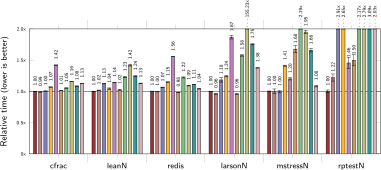
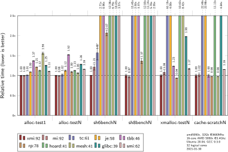

Any benchmarks ending in `N` run on all 32 logical cores in parallel.
Results are averaged over 10 runs and reported relative
to mimalloc (where 1.2 means it took 1.2&times; longer to run).
The legend also contains the _overall relative score_ between the
allocators where 100 points is the maximum if an allocator is fastest on
all benchmarks.

The single threaded _cfrac_ benchmark by Dave Barrett is an implementation of
continued fraction factorization which uses many small short-lived allocations.
All allocators do well on such common usage, where _mimalloc_ is just a tad
faster than _tcmalloc_ and
_jemalloc_.

The _leanN_ program is interesting as a large realistic and
concurrent workload of the [Lean](https://github.com/leanprover/lean)
theorem prover compiling its own standard library, and there is a 13%
speedup over _tcmalloc_. This is
quite significant: if Lean spends 20% of its time in the
allocator that means that _mimalloc_ is 1.6&times; faster than _tcmalloc_
here. (This is surprising as that is not measured in a pure
allocation benchmark like _alloc-test_. We conjecture that we see this
outsized improvement here because _mimalloc_ has better locality in
the allocation which improves performance for the *other* computations
in a program as well).

The single threaded _redis_ benchmark again show that most allocators do well on such workloads.

The _larsonN_ server benchmark by Larson and Krishnan \[2] allocates and frees between threads. They observed this
behavior (which they call _bleeding_) in actual server applications, and the benchmark simulates this.
Here, _mimalloc_ is quite a bit faster than _tcmalloc_ and _jemalloc_ probably due to the object migration between different threads.

The _mstressN_ workload performs many allocations and re-allocations,
and migrates objects between threads (as in _larsonN_). However, it also
creates  and destroys the _N_ worker threads a few times keeping some objects
alive beyond the life time of the allocating thread. We observed this
behavior in many larger server applications.

The [_rptestN_](https://github.com/mjansson/rpmalloc-benchmark) benchmark
by Mattias Jansson is a allocator test originally designed
for _rpmalloc_, and tries to simulate realistic allocation patterns over
multiple threads. Here the differences between allocators become more apparent.

The second benchmark set tests specific aspects of the allocators and
shows even more extreme differences between them.

The _alloc-test_, by
[OLogN Technologies AG](http://ithare.com/testing-memory-allocators-ptmalloc2-tcmalloc-hoard-jemalloc-while-trying-to-simulate-real-world-loads/), is a very allocation intensive benchmark doing millions of
allocations in various size classes. The test is scaled such that when an
allocator performs almost identically on _alloc-test1_ as _alloc-testN_ it
means that it scales linearly.

The _sh6bench_ and _sh8bench_ benchmarks are
developed by [MicroQuill](http://www.microquill.com/) as part of SmartHeap.
In _sh6bench_ _mimalloc_ does much
better than the others (more than 2.5&times; faster than _jemalloc_).
We cannot explain this well but believe it is
caused in part by the "reverse" free-ing pattern in _sh6bench_.
The _sh8bench_ is a variation with object migration
between threads; whereas _tcmalloc_ did well on _sh6bench_, the addition of object migration causes it to be 10&times; slower than before.

The _xmalloc-testN_ benchmark by Lever and Boreham \[5] and Christian Eder, simulates an asymmetric workload where
some threads only allocate, and others only free -- they observed this pattern in
larger server applications. Here we see that
the _mimalloc_ technique of having non-contended sharded thread free
lists pays off as it outperforms others by a very large margin. Only _rpmalloc_, _tbb_, and _glibc_ also scale well on this benchmark.

The _cache-scratch_ benchmark by Emery Berger \[1], and introduced with
the Hoard allocator to test for _passive-false_ sharing of cache lines.
With a single thread they all
perform the same, but when running with multiple threads the potential allocator
induced false sharing of the cache lines can cause large run-time differences.
Crundal \[6] describes in detail why the false cache line sharing occurs in the _tcmalloc_ design, and also discusses how this
can be avoided with some small implementation changes.
Only the _tbb_, _rpmalloc_ and _mesh_ allocators also avoid the
cache line sharing completely, while _Hoard_ and _glibc_ seem to mitigate
the effects. Kukanov and Voss \[7] describe in detail
how the design of _tbb_ avoids the false cache line sharing.


## On a 36-core Intel Xeon

For completeness, here are the results on a big Amazon
[c5.18xlarge](https://aws.amazon.com/ec2/instance-types/#Compute_Optimized) instance
consisting of a 2&times;18-core Intel Xeon (Cascade Lake) at 3.4GHz (boost 3.5GHz)
with 144GiB ECC memory, running	Ubuntu 20.04 with glibc 2.31, GCC 9.3.0, and
Clang 10.0.0. This time, the mimalloc allocators (mi, xmi, and smi) were
compiled with the Clang compiler instead of GCC.
The results are similar to the AMD results but it is interesting to
see the differences in the _larsonN_, _mstressN_, and _xmalloc-testN_ benchmarks.

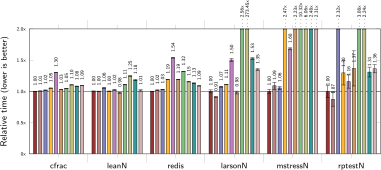
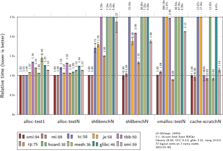


## Peak Working Set

The following figure shows the peak working set (rss) of the allocators
on the benchmarks (on the c5.18xlarge instance).

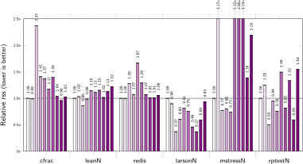
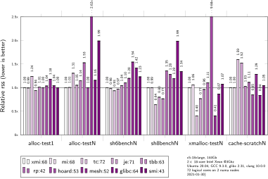

Note that the _xmalloc-testN_ memory usage should be disregarded as it
allocates more the faster the program runs. Similarly, memory usage of
_larsonN_, _mstressN_, _rptestN_ and _sh8bench_ can vary depending on scheduling and
speed. Nevertheless, we hope to improve the memory usage on _mstressN_
and _rptestN_ (just as _cfrac_, _larsonN_ and _sh8bench_ have a small working set which skews the results).

<!--
# Previous Benchmarks

Todo: should we create a separate page for this?

## Benchmark Results on 36-core Intel: 2020-01-20

Testing on a big Amazon EC2 compute instance
([c5.18xlarge](https://aws.amazon.com/ec2/instance-types/#Compute_Optimized))
consisting of a 72 processor Intel Xeon at 3GHz
with 144GiB ECC memory, running	Ubuntu 18.04.1 with glibc 2.27 and GCC 7.4.0.
The measured allocators are _mimalloc_ (xmi, tag:v1.4.0, page reset enabled)
and its secure build as _smi_,
Google's [_tcmalloc_](https://github.com/gperftools/gperftools) (tc, tag:gperftools-2.7) used in Chrome,
Facebook's [_jemalloc_](https://github.com/jemalloc/jemalloc) (je, tag:5.2.1) by Jason Evans used in Firefox and FreeBSD,
the Intel thread building blocks [allocator](https://github.com/intel/tbb) (tbb, tag:2020),
[rpmalloc](https://github.com/mjansson/rpmalloc) (rp,tag:1.4.0) by Mattias Jansson,
the original scalable [_Hoard_](https://github.com/emeryberger/Hoard) (tag:3.13) allocator by Emery Berger \[1],
the memory compacting [_Mesh_](https://github.com/plasma-umass/Mesh) (git:51222e7) allocator by
Bobby Powers _et al_ \[8],
and finally the default system allocator (glibc, 2.27) (based on _PtMalloc2_).

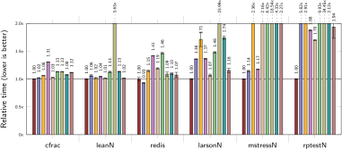
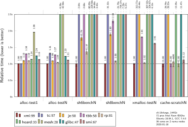

The following figure shows the peak working set (rss) of the allocators
on the benchmarks (on the c5.18xlarge instance).

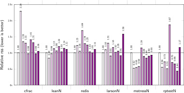
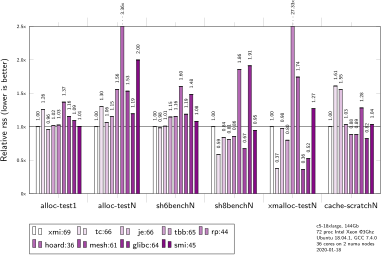


## On 24-core AMD Epyc, 2020-01-16

For completeness, here are the results on a
[r5a.12xlarge](https://aws.amazon.com/ec2/instance-types/#Memory_Optimized) instance
having a 48 processor AMD Epyc 7000 at 2.5GHz with 384GiB of memory.
The results are similar to the Intel results but it is interesting to
see the differences in the _larsonN_, _mstressN_, and _xmalloc-testN_ benchmarks.

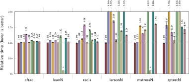
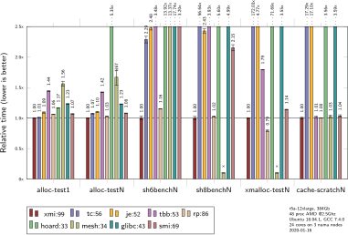

-->


# References

- \[1] Emery D. Berger, Kathryn S. McKinley, Robert D. Blumofe, and Paul R. Wilson.
   _Hoard: A Scalable Memory Allocator for Multithreaded Applications_
   the Ninth International Conference on Architectural Support for Programming Languages and Operating Systems (ASPLOS-IX). Cambridge, MA, November 2000.
   [pdf](http://www.cs.utexas.edu/users/mckinley/papers/asplos-2000.pdf)

- \[2] P. Larson and M. Krishnan. _Memory allocation for long-running server applications_.
  In ISMM, Vancouver, B.C., Canada, 1998. [pdf](http://citeseer.ist.psu.edu/viewdoc/download?doi=10.1.1.45.1947&rep=rep1&type=pdf)

- \[3] D. Grunwald, B. Zorn, and R. Henderson.
  _Improving the cache locality of memory allocation_. In R. Cartwright, editor,
  Proceedings of the Conference on Programming Language Design and Implementation, pages 177–186, New York, NY, USA, June 1993. [pdf](http://citeseer.ist.psu.edu/viewdoc/download?doi=10.1.1.43.6621&rep=rep1&type=pdf)

- \[4] J. Barnes and P. Hut. _A hierarchical O(n*log(n)) force-calculation algorithm_. Nature, 324:446-449, 1986.

- \[5] C. Lever, and D. Boreham. _Malloc() Performance in a Multithreaded Linux Environment._
  In USENIX Annual Technical Conference, Freenix Session. San Diego, CA. Jun. 2000.
  Available at <https://github.com/kuszmaul/SuperMalloc/tree/master/tests>

- \[6] Timothy Crundal. _Reducing Active-False Sharing in TCMalloc_. 2016. CS16S1 project at the Australian National University. [pdf](http://courses.cecs.anu.edu.au/courses/CSPROJECTS/16S1/Reports/Timothy_Crundal_Report.pdf)

- \[7] Alexey Kukanov, and Michael J Voss.
   _The Foundations for Scalable Multi-Core Software in Intel Threading Building Blocks._
   Intel Technology Journal 11 (4). 2007

- \[8] Bobby Powers, David Tench, Emery D. Berger, and Andrew McGregor.
 _Mesh: Compacting Memory Management for C/C++_
 In Proceedings of the 40th ACM SIGPLAN Conference on Programming Language Design and Implementation (PLDI'19), June 2019, pages 333-–346.

<!--
- \[9] Paul Liétar, Theodore Butler, Sylvan Clebsch, Sophia Drossopoulou, Juliana Franco, Matthew J Parkinson,
  Alex Shamis, Christoph M Wintersteiger, and David Chisnall.
  _Snmalloc: A Message Passing Allocator._
  In Proceedings of the 2019 ACM SIGPLAN International Symposium on Memory Management, 122–135. ACM. 2019.
-->

# Contributing

This project welcomes contributions and suggestions.  Most contributions require you to agree to a
Contributor License Agreement (CLA) declaring that you have the right to, and actually do, grant us
the rights to use your contribution. For details, visit https://cla.microsoft.com.

When you submit a pull request, a CLA-bot will automatically determine whether you need to provide
a CLA and decorate the PR appropriately (e.g., label, comment). Simply follow the instructions
provided by the bot. You will only need to do this once across all repos using our CLA.


# Older Release Notes

* 2021-11-14, `v1.7.3`, `v2.0.3` (beta): improved WASM support, improved macOS support and performance (including
  M1), improved performance for v2 for large objects, Python integration improvements, more standard
  installation directories, various small fixes.
* 2021-06-17, `v1.7.2`, `v2.0.2` (beta): support M1, better installation layout on Linux, fix
  thread_id on Android, prefer 2-6TiB area for aligned allocation to work better on pre-windows 8, various small fixes.
* 2021-04-06, `v1.7.1`, `v2.0.1` (beta): fix bug in arena allocation for huge pages, improved aslr on large allocations, initial M1 support (still experimental).
* 2021-01-31, `v2.0.0`: beta release 2.0: new slice algorithm for managing internal mimalloc pages.
* 2021-01-31, `v1.7.0`: stable release 1.7: support explicit user provided memory regions, more precise statistics,
  improve macOS overriding, initial support for Apple M1, improved DragonFly support, faster memcpy on Windows, various small fixes.

* 2020-09-24, `v1.6.7`: stable release 1.6: using standard C atomics, passing tsan testing, improved
  handling of failing to commit on Windows, add [`mi_process_info`](https://github.com/microsoft/mimalloc/blob/master/include/mimalloc.h#L156) api call.
* 2020-08-06, `v1.6.4`: stable release 1.6: improved error recovery in low-memory situations,
  support for IllumOS and Haiku, NUMA support for Vista/XP, improved NUMA detection for AMD Ryzen, ubsan support.
* 2020-05-05, `v1.6.3`: stable release 1.6: improved behavior in out-of-memory situations, improved malloc zones on macOS,
  build PIC static libraries by default, add option to abort on out-of-memory, line buffered statistics.
* 2020-04-20, `v1.6.2`: stable release 1.6: fix compilation on Android, MingW, Raspberry, and Conda,
  stability fix for Windows 7, fix multiple mimalloc instances in one executable, fix `strnlen` overload,
  fix aligned debug padding.
* 2020-02-17, `v1.6.1`: stable release 1.6: minor updates (build with clang-cl, fix alignment issue for small objects).
* 2020-02-09, `v1.6.0`: stable release 1.6: fixed potential memory leak, improved overriding
  and thread local support on FreeBSD, NetBSD, DragonFly, and macOSX. New byte-precise
  heap block overflow detection in debug mode (besides the double-free detection and free-list
  corruption detection). Add `nodiscard` attribute to most allocation functions.
  Enable `MIMALLOC_PAGE_RESET` by default. New reclamation strategy for abandoned heap pages
  for better memory footprint.
* 2020-02-09, `v1.5.0`: stable release 1.5: improved free performance, small bug fixes.
* 2020-01-22, `v1.4.0`: stable release 1.4: improved performance for delayed OS page reset,
more eager concurrent free, addition of STL allocator, fixed potential memory leak.
* 2020-01-15, `v1.3.0`: stable release 1.3: bug fixes, improved randomness and [stronger
free list encoding](https://github.com/microsoft/mimalloc/blob/783e3377f79ee82af43a0793910a9f2d01ac7863/include/mimalloc-internal.h#L396) in secure mode.

* 2019-12-22, `v1.2.2`: stable release 1.2: minor updates.
* 2019-11-22, `v1.2.0`: stable release 1.2: bug fixes, improved secure mode (free list corruption checks, double free mitigation). Improved dynamic overriding on Windows.
* 2019-10-07, `v1.1.0`: stable release 1.1.
* 2019-09-01, `v1.0.8`: pre-release 8: more robust windows dynamic overriding, initial huge page support.
* 2019-08-10, `v1.0.6`: pre-release 6: various performance improvements.
