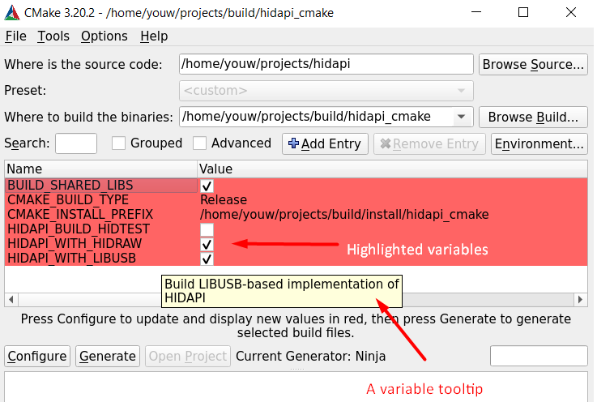
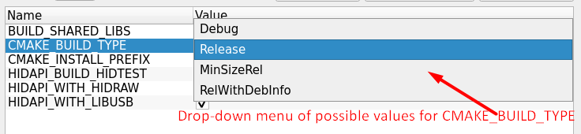

# Building HIDAPI using CMake

To build HIDAPI with CMake, it has to be [installed](#installing-cmake)/available in the system.

Make sure you've checked [prerequisites](BUILD.md#prerequisites) and installed all required dependencies.

HIDAPI CMake build system allows you to build HIDAPI in two generally different ways:
1) As a [standalone package/library](#standalone-package-build);
2) As [part of a larger CMake project](#hidapi-as-a-subdirectory).

**TL;DR**: if you're experienced developer and have been working with CMake projects or have been written some of your own -
most of this document may not be of interest for you; just check variables names, its default values and the target names.

## Installing CMake

CMake can be installed either using your system's package manager,
or by downloading an installer/prebuilt version from the [official website](https://cmake.org/download/).

On most \*nix systems, the preferred way to install CMake is via package manager,
e.g. `sudo apt install cmake`.

On Windows CMake could be provided by your development environment (e.g. by Visual Studio Installer or MinGW installer),
or you may install it system-wise using the installer from the official website.

On macOS CMake may be installed by Homebrew/MacPorts or using the installer from the official website.

## Standalone package build

To build HIDAPI as a standalone package, you follow [general steps](https://cmake.org/runningcmake/) of building any CMake project.

An example of building HIDAPI with CMake:
```sh
# precondition: create a <build dir> somewhere on the filesystem (preferably outside of the HIDAPI source)
# this is the place where all intermediate/build files are going to be located
cd <build dir>
# configure the build
cmake <HIDAPI source dir>
# build it!
cmake --build .
# install library; by default installs into /usr/local/
cmake --build . --target install
# NOTE: you need to run install command as root, to be able to install into /usr/local/
```
Such invocation will use the default (as per CMake magic) compiler/build environment available in your system.

You may pass some additional CMake variables to control the build configuration as `-D<CMake Variable>=value`.
E.g.:
```sh
# install command now would install things into /usr
cmake <HIDAPI source dir> -DCMAKE_INSTALL_PREFIX=/usr
```

<details>
  <summary>Using a specific CMake generator</summary>

An example of using `Ninja` as a CMake generator:

```sh
cd <build dir>
# configure the build
cmake -GNinja <HIDAPI source dir>
# we know, that CMake has generated build files for Ninja,
# so we can use `ninja` directly, instead of `cmake --build .`
ninja
# install library
ninja install
```

`-G` here specifies a native build system CMake would generate build files for.
Check [CMake Documentation](https://cmake.org/cmake/help/latest/manual/cmake-generators.7.html) for a list of available generators (system-specific).

</details><br>

Some of the [standard](https://cmake.org/cmake/help/latest/manual/cmake-variables.7.html) CMake variables you may want to use to configure a build:

- [`CMAKE_INSTALL_PREFIX`](https://cmake.org/cmake/help/latest/variable/CMAKE_INSTALL_PREFIX.html) - prefix where `install` target would install the library(ies);
- [`CMAKE_BUILD_TYPE`](https://cmake.org/cmake/help/latest/variable/CMAKE_BUILD_TYPE.html) - standard possible values: `Debug`, `Release`, `RelWithDebInfo`, `MinSizeRel`; Defaults to `Release` for HIDAPI, if not specified;
- [`BUILD_SHARED_LIBS`](https://cmake.org/cmake/help/latest/variable/BUILD_SHARED_LIBS.html) - when set to TRUE, HIDAPI is built as a shared library, otherwise build statically; Defaults to `TRUE` for HIDAPI, if not specified;

<details>
  <summary>macOS-specific variables</summary>

  - [`CMAKE_FRAMEWORK`](https://cmake.org/cmake/help/latest/variable/CMAKE_FRAMEWORK.html) - (since CMake 3.15) when set to TRUE, HIDAPI is built as a framework library, otherwise build as a regular static/shared library; Defaults to `FALSE` for HIDAPI, if not specified;
  - [`CMAKE_OSX_DEPLOYMENT_TARGET`](https://cmake.org/cmake/help/latest/variable/CMAKE_OSX_DEPLOYMENT_TARGET.html) - minimum version of the target platform (e.g. macOS or iOS) on which the target binaries are to be deployed; defaults to a maximum supported target platform by currently used XCode/Toolchain;

</details><br>

HIDAPI-specific CMake variables:

- `HIDAPI_BUILD_HIDTEST` - when set to TRUE, build a small test application `hidtest`;
- `HIDAPI_WITH_TESTS` - when set to TRUE, build all (unit-)tests;
currently this option is only available on Windows, since only Windows backend has tests;

<details>
  <summary>Linux-specific variables</summary>

  - `HIDAPI_WITH_HIDRAW` - when set to TRUE, build HIDRAW-based implementation of HIDAPI (`hidapi-hidraw`), otherwise don't build it; defaults to TRUE;
  - `HIDAPI_WITH_LIBUSB` - when set to TRUE, build LIBUSB-based implementation of HIDAPI (`hidapi-libusb`), otherwise don't build it; defaults to TRUE;

  **NOTE**: at least one of `HIDAPI_WITH_HIDRAW` or `HIDAPI_WITH_LIBUSB` has to be set to TRUE.

</details><br>

To see all most-useful CMake variables available for HIDAPI, one of the most convenient ways is too use [`cmake-gui`](https://cmake.org/cmake/help/latest/manual/cmake-gui.1.html) tool ([example](https://cmake.org/runningcmake/)).

_NOTE_: HIDAPI packages built by CMake can be used with `pkg-config`, as if built with [Autotools](BUILD.autotools.md).

### MSVC and Ninja
It is possible to build a CMake project (including HIDAPI) using MSVC compiler and Ninja (for medium and larger projects it is so much faster than msbuild).

For that:
1) Open cmd.exe;
2) Setup MSVC build environment variables, e.g.: `vcvarsall.bat x64`, where:
	- `vcvarsall.bat` is an environment setup script of your MSVC toolchain installation;<br>For MSVC 2019 Community edition it is located at: `C:\Program Files (x86)\Microsoft Visual Studio\2019\Community\VC\Auxiliary\Build\`;
	- `x64` -a target architecture to build;
3) Follow general build steps, and use `Ninja` as a generator.

### Using HIDAPI in a CMake project

When HIDAPI is used as a standalone package (either installed into the system or built manually and installed elsewhere), the simplest way to use it is as showed in the example:

```cmake
project(my_application)

add_executable(my_application main.c)

find_package(hidapi REQUIRED)
target_link_libraries(my_application PRIVATE hidapi::hidapi)
```

If HIDAPI isn't installed in your system, or `find_package` cannot find HIDAPI by default for any other reasons,
the recommended way manually specify which HIDAPI package to use is via `hidapi_ROOT` CMake variable, e.g.:
`-Dhidapi_ROOT=<path to HIDAPI installation prefix>`.

_NOTE_: usage of `hidapi_ROOT` is only possible (and recommended) with CMake 3.12 and higher. For older versions of CMake you'd need to specify [`CMAKE_PREFIX_PATH`](https://cmake.org/cmake/help/latest/variable/CMAKE_PREFIX_PATH.html#variable:CMAKE_PREFIX_PATH) instead.

Check with [`find_package`](https://cmake.org/cmake/help/latest/command/find_package.html) documentation if you need more details.

Available CMake targets after successful `find_package(hidapi)`:
- `hidapi::hidapi` - indented to be used in most cases;
- `hidapi::include` - if you need only to include `<hidapi.h>` but not link against the library;
- `hidapi::winapi` - same as `hidapi::hidapi` on Windows; available only on Windows;
- `hidapi::darwin` - same as `hidapi::hidapi` on macOS; available only on macOS;
- `hidapi::libusb` - available when libusb backend is used/available;
- `hidapi::hidraw` - available when hidraw backend is used/available on Linux;

**NOTE**: on Linux often both `hidapi::libusb` and `hidapi::hidraw` backends are available; in that case `hidapi::hidapi` is an alias for **`hidapi::hidraw`**. The motivation is that `hidraw` backend is a native Linux kernel implementation of HID protocol, and supports various HID devices (USB, Bluetooth, I2C, etc.). If `hidraw` backend isn't built at all (`hidapi::libusb` is the only target) - `hidapi::hidapi` is an alias for `hidapi::libusb`.
If you're developing a cross-platform application and you are sure you need to use `libusb` backend on Linux, the simple way to achieve this is:
```cmake
if(TARGET hidapi::libusb)
    target_link_libraries(my_project PRIVATE hidapi::libusb)
else()
    target_link_libraries(my_project PRIVATE hidapi::hidapi)
endif()
```

## HIDAPI as a subdirectory

HIDAPI can be easily used as a subdirectory of a larger CMake project:
```cmake
# root CMakeLists.txt
cmake_minimum_required(VERSION 3.4.3...3.25 FATAL_ERROR)

add_subdirectory(hidapi)
add_subdirectory(my_application)

# my_application/CMakeLists.txt
project(my_application)

add_executable(my_application main.c)

# NOTE: no `find_package` is required, since HIDAPI targets are already a part of the project tree
target_link_libraries(my_application PRIVATE hidapi::hidapi)
```
Lets call this "larger project" a "host project".

All of the variables described in [standalone build](#standalone-package-build) section can be used to control HIDAPI build in case of a subdirectory, e.g.:
```cmake
set(HIDAPI_WITH_LIBUSB FALSE) # surely will be used only on Linux
set(BUILD_SHARED_LIBS FALSE) # HIDAPI as static library on all platforms
add_subdirectory(hidapi)
```

<details>
  <summary>NOTE</summary>

  If you project happen to use `BUILD_SHARED_LIBS` as a `CACHE` variable globally for you project, setting it as simple variable, as showed above _will have not affect_ up until _CMake 3.13_. See [CMP0077](https://cmake.org/cmake/help/latest/policy/CMP0077.html) for details.
</details><br>

There are several important differences in the behavior of HIDAPI CMake build system when CMake is built as standalone package vs subdirectory build:

1) In _standalone build_ a number of standard and HIDAPI-specific variables are marked as _cache variables_ or _options_.
This is done for convenience: when you're building HIDAPI as a standalone package and using tools like `cmake-gui` - those are highlighted as variables that can be changed and has some short description/documentation. E.g.:
<br>
E.g.2:<br>
<br>
When HIDAPI is built as a _subdirectory_ - **_none of the variables are marked for cache or as options_** by HIDAPI.
This is done to let the host project's developer decide what is important (what needs to be highlighted) and what's not.

2) The default behavior/default value for some of the variables is a bit different:
	- by default, none of HIDAPI targets are [installed](https://cmake.org/cmake/help/latest/command/install.html); if required, HIDAPI targets can be installed by host project _after_ including HIDAPI subdirectory (requires CMake 3.13 or later); **or**, the default installation can be enabled by setting `HIDAPI_INSTALL_TARGETS` variable _before_ including HIDAPI subdirectory.
		HIDAPI uses [GNUInstallDirs](https://cmake.org/cmake/help/latest/module/GNUInstallDirs.html) to specify install locations. Variables like `CMAKE_INSTALL_LIBDIR` can be used to control HIDAPI's installation locations. E.g.:
		```cmake
		# enable the installation if you need it
		set(HIDAPI_INSTALL_TARGETS ON)
		# (optionally) change default installation locations if it makes sense for your target platform, etc.
		set(CMAKE_INSTALL_LIBDIR "lib64")
		add_subdirectory(hidapi)
		```
	- HIDAPI prints its version during the configuration when built as a standalone package; to enable this for subdirectory builds - set `HIDAPI_PRINT_VERSION` to TRUE before including HIDAPI;

3) In a subdirectory build, HIDAPI _doesn't modify or set any of the CMake variables_ that may change the build behavior.
    For instance, in a _standalone build_, if CMAKE_BUILD_TYPE or BUILD_SHARED_LIBS variables are not set, those are defaulted to "Release" and "TRUE" explicitly.
    In a _subdirectory build_, even if not set, those variables remain unchanged, so a host project's developer has a full control over the HIDAPI build configuration.

Available CMake targets after `add_subdirectory(hidapi)` _are the same as in case of [standalone build](#standalone-package-build)_, and a few additional ones:
- `hidapi_include` - the interface library; `hidapi::include` is an alias of it;
- `hidapi_winapi` - library target on Windows; `hidapi::winapi` is an alias of it;
- `hidapi_darwin` - library target on macOS; `hidapi::darwin` is an alias of it;
- `hidapi_libusb` - library target for libusb backend; `hidapi::libusb` is an alias of it;
- `hidapi_hidraw` - library target for hidraw backend; `hidapi::hidraw` is an alias of it;
- `hidapi-libusb` - an alias of `hidapi_libusb` for compatibility with raw library name;
- `hidapi-hidraw` - an alias of `hidapi_hidraw` for compatibility with raw library name;
- `hidapi` - an alias of `hidapi_winapi` or `hidapi_darwin` on Windows or macOS respectfully.

Advanced:
- Why would I need additional targets described in this section above, if I already have alias targets compatible with `find_package`?
  - an example:
    ```cmake
    add_subdirectory(hidapi)
    if(TARGET hidapi_libusb)
      # see libusb/hid.c for usage of `NO_ICONV`
      target_compile_definitions(hidapi_libusb PRIVATE NO_ICONV)
    endif()
    ```

## Both Shared and Static build

If you're a former (or present) user of Autotools build scripts for HIDAPI, or you're a package manager maintainer and you're often working with those - you're likely asking how to build HIDAPI with CMake and get both Shared and Static libraries (as would be done by Autotools: `./configure --enable-static --enable-shared ...`).

CMake doesn't have such option of-the-box and it is decided not to introduce any manual CMake-level workarounds for HIDAPI on this matter.

If you want to mimic the Autotools behavior, it is possible by building/installing first the static version of the library and then shared version of the library. The installation folder (`CMAKE_INSTALL_PREFIX`) should point to the same directory for both variants, that way:
- both static and shared library binaries will be available and usable;
- a single header file(s) for both of them;
- Autotools/pkg-config (`.pc`) files will be generated and usable _as if_ generated by Autotools natively and build configured with both `-enable-static --enable-shared` options;
- CMake package scripts will be generated and fully usable, but _only the last build installed_, i.e. if the last was installed Shared version of the binary - CMake targets found by `find_package(hidapi)` would point to a Shared binaries.

There is a historical discussion, why such solution is simplest/preferable: https://github.com/libusb/hidapi/issues/424

#### TL;DR/Sample

```sh
# First - configure/build

# Static libraries
cmake -S <HIDAPI source dir> -B "<build dir>/static" -DCMAKE_INSTALL_PREFIX=<your installation prefix> -DBUILD_SHARED_LIBS=FALSE
cmake --build "<build dir>/static"
# Shared libraries
cmake -S <HIDAPI source dir> -B "<build dir>/shared" -DCMAKE_INSTALL_PREFIX=<your installation prefix> -DBUILD_SHARED_LIBS=TRUE
cmake --build "<build dir>/shared"

# (Optionally) change the installation destination.
# NOTE1: this is supported by CMake only on UNIX platforms
#  See https://cmake.org/cmake/help/latest/envvar/DESTDIR.html
# NOTE2: this is not the same as `CMAKE_INSTALL_PREFIX` set above
# NOTE3: this is only required if you have a staging dir other than the final runtime dir,
#  e.g. during cross-compilation
export DESTDIR="$STAGING_DIR"

#
# Install the libraries
# NOTE: order of installation matters - install Shared variant *the last*

# Static libraries
cmake --install "<build dir>/static"
# Shared libraries
cmake --install "<build dir>/shared"

```
